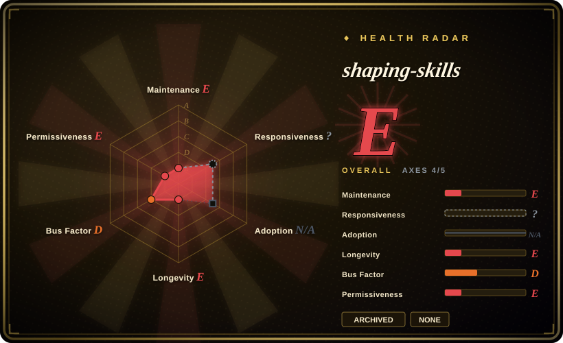
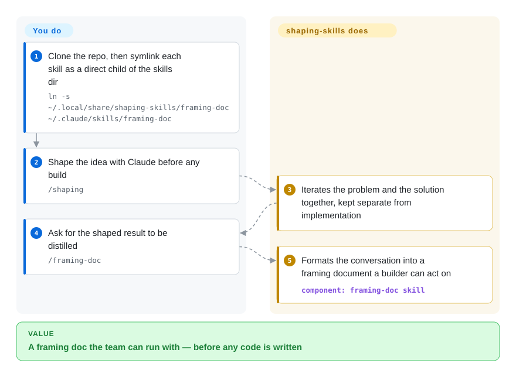

# shaping-skills

Your Claude Code session about a fuzzy product idea is full of good thinking that never becomes a doc a builder can act on — Ryan Singer's pack forces the Shape Up step in between (`/shaping`, `/breadboarding`, `/framing-doc`). **Status: archived and marked obsolete by the author (2026-09)** — read it as a pattern source, not something to install.

## When to use

You're a product person or solo founder working through a fuzzy idea with Claude Code, and you keep hitting the same wall: the conversation is full of good thinking, but it never crystallizes into something a builder can act on. You jump from a vague problem straight to "let's build it," skip the part where you separate the *problem* from the *solution*, and end up with implementation that solves the wrong thing. You want the AI to act like a shaping partner — to push you to frame the problem first, map a rough solution as connected affordances rather than pixel-perfect screens, and only then produce a tight doc the team can run with.

This pack gives you that as a handful of on-demand skills. `/framing-doc` and `/kickoff-doc` distill a working conversation into a problem-framing or builder-reference document; `/shaping` iterates problem and solution together before implementation; `/breadboarding` maps a system into places, affordances, and the wiring between them in the Shape Up sense. An optional `hooks/shaping-ripple.sh` script does a ripple/side-effect check. You install it by cloning the repo and symlinking the skill directories into `~/.claude/skills/` — the methodology then activates through Claude Code's native skill loader when a task matches.

## How it works

The pack is plain skill markdown plus one hook — no runtime, no CLI. Each skill lives in its own directory (`framing-doc`, `kickoff-doc`, `shaping`, `breadboarding`, plus a `breadboard-reflection` folder), and you wire it in by cloning the repo and symlinking each directory as a **direct child** of `~/.claude/skills/` — Claude Code only discovers skills one level deep, and symlinks keep updates a `git pull`. From there the division of labor is blunt: you bring the conversation, the skills format and distill it. `/shaping` and `/breadboarding` (mapping a system into places, affordances and the wiring between them) are the more experimental solo skills; `/framing-doc` and `/kickoff-doc` are the collaborative ones that turn a transcript into a document. The README is explicit that they don't evaluate your thinking — garbage in, nicely formatted garbage out. An optional `PostToolUse` hook, registered in `~/.claude/settings.json`, fires `shaping-ripple.sh` whenever the agent edits a markdown file with `shaping: true` frontmatter, prompting a checklist of dependent tables and fit-checks. What the pack does for you: structure, vocabulary and the ripple nag; what stays yours: the actual product judgment — and, since the repo is archived, all maintenance.

<!-- flow-steps:begin (generated from flows/shaping-skills.json by tools/flow_card.py — do not edit) -->

Text version of the flow

1. **You**: Clone the repo, then symlink each skill as a direct child of the skills dir — `ln -s ~/.local/share/shaping-skills/framing-doc ~/.claude/skills/framing-doc`
2. **You**: Shape the idea with Claude before any build — `/shaping`
3. **shaping-skills**: Iterates the problem and the solution together, kept separate from implementation
4. **You**: Ask for the shaped result to be distilled — `/framing-doc`
5. **shaping-skills**: Formats the conversation into a framing document a builder can act on — component: `framing-doc skill`

**Value**: A framing doc the team can run with — before any code is written

<!-- flow-steps:end -->

## When NOT to use

- **The author archived it and calls it obsolete.** The README's first line (committed 2026-09-21) reads "NOTE: THESE ARE OBSOLETE! … I haven't used this skills since then", and the repo is `archived: true` on GitHub (2026-09-28). Read the SKILL.md files as design references for shaping-with-an-agent; for a maintained "define before you build" flow use [Superpowers](../../../agent-dev-methodology/coding-agent-harnesses/superpowers.md) instead.
- **You already run a planning/spec methodology you trust.** Shaping overlaps directly with brainstorm-then-plan skill packs (e.g. Superpowers' `brainstorming` + `writing-plans`). Stacking two opinionated "define before you build" flows invites conflicting routing — pick one shaping/planning source of truth.
- **You want code, not problem definition.** This pack deliberately stops *before* implementation; it produces framing and kickoff docs, not working code or tests. If your need is the build loop (TDD, debugging, refactor), it doesn't cover that.
- **Garbage-in-garbage-out is a dealbreaker.** The doc skills format and distill what you bring; the README is explicit that they don't judge whether the thinking is any good — a bad conversation yields a nicely formatted bad document.
- **You're not on Claude Code.** Activation depends on Claude Code's `~/.claude/skills/` symlink + native skill loader; on another harness there's no loader to invoke these and the markdown alone won't auto-fire. [推断]
- **You need stability or maintenance guarantees.** Personal repo, no tagged releases, now archived with no license file; the author flagged the solo skills (`/shaping`, `/breadboarding`) as more experimental even before archiving. It is a snapshot of one person's working setup, and any fix you need is yours to fork.
- **Enforcement is advisory.** Behavior lives in prompt/markdown skills the agent loads on demand; the shaping discipline is a suggestion the agent can still skip, not a hard gate.

## Comparison

| Alternative | In index | Our verdict | Tradeoff |
|---|---|---|---|
| [antfu/skills](antfu-skills.md) | ✅ | Choose antfu/skills when you need Vue/Vite build-stack skills downstream of shaping. | Personal curated Claude Code skill collection, but for the Vue/Vite frontend *build* stack (test idioms, ESLint, UnoCSS). Orthogonal: shaping-skills is upstream of code (problem/solution definition), antfu/skills is downstream (how to write the code). |
| [Dimillian/Skills](dimillian-skills.md) | ✅ | Choose Dimillian/Skills when implementation/platform conventions are the main need. | Another individual developer's Claude Code skill set; compare on domain — Dimillian's lean toward implementation/platform conventions, shaping-skills toward product shaping and docs. |
| [gstack](gstack.md) | ✅ | Choose gstack when you need a personal harness/skill collection rather than Shape Up shaping. | Personal harness/skill collection in this leaf; different focus. Cross-check which lifecycle stage each actually shapes vs. builds. |
| [Superpowers](../../../agent-dev-methodology/coding-agent-harnesses/superpowers.md) (`brainstorming` / `writing-plans`) | ✅ | Choose Superpowers when you need a full SDLC skill library with overlapping brainstorm/plan steps. | A full SDLC skill library whose front end (interrogate the idea, write the plan) overlaps shaping's intent, but framed as generic software brainstorming rather than Shape Up's problem/solution/breadboard vocabulary. |
| Shape Up book / BaseCamp's own materials | 未收录 | Choose the source materials when you need methodology prose rather than installable agent skills. | The source methodology as prose, not an installable agent skill — this pack is one person's operationalization of it inside Claude Code. |

## Health & viability

- **Responsiveness**: Cannot be scored — type_na.
- **Maintenance** — **dead, by the author's own hand**: repo `archived: true`, last commit 2026-09-21 was the README note marking the skills obsolete ("I haven't used this skills since then"). No fix, CVE, or Claude Code compatibility response will ever come from upstream again (GitHub API + commit history, 2026-09-28).
- **Governance & bus factor** — single-maintainer personal repo (`User`-owned, Ryan Singer of Basecamp/Shape Up co-authorship), ~1.4k stars. One author's operationalization; his name lends the *methodology* credibility, but the *packaging* had no team even before archiving.
- **Age & Lindy** — created 2026-01, archived 2026-09 at ~0.7 years: short-lived and now perishable, so no Lindy claim survives — the repo's own lifetime is the evidence of that. The Shape Up *methodology* it encodes is long-lived and still the reason anyone opens the page.
- **Risk flags** — still no LICENSE file (GitHub API `license: null`, tree checked 2026-09-28): reuse/redistribution rights of the archived text are legally unclear, which matters more now that forking is the only path. Archived repos stay readable but not forkable-safe without a license — confirm with the author before copying the skills.

## Caveats (unverified)

- [未验证] No license file or `licenseInfo` as of 2026-09-28 (recorded here as SPDX `NOASSERTION`); absent an explicit license, reuse/redistribution rights are unclear — verify with the author before depending on or forking the text.
- [推断] The archive happened between the last commit (2026-09-21, the obsolete notice) and our check (2026-09-28); GitHub exposes no archive timestamp, so the exact date is unknown.
- [未验证] Star count (~1.4k per GitHub on 2026-09-28) is date-sensitive and was never a quality signal; the historical ~1.4k reflects the author's prominence more than adoption.
- [未验证] Skill inventory (`framing-doc`, `kickoff-doc`, `shaping`, `breadboarding`, plus a `breadboard-reflection` dir and `hooks/shaping-ripple.sh`) re-checked against the archived repo tree on 2026-09-28; SKILL.md filename casing is mixed and internal content was not re-read file-by-file here.
- [未验证] The "obsolete since Opus 4.6 era" framing is the author's README statement; how the skills behave on current models was not tested.
- [推断] Because the skills are prompt/markdown loaded by Claude Code, the shaping discipline is advisory — the agent can deviate; "skills" here shape behavior, they don't enforce it.
