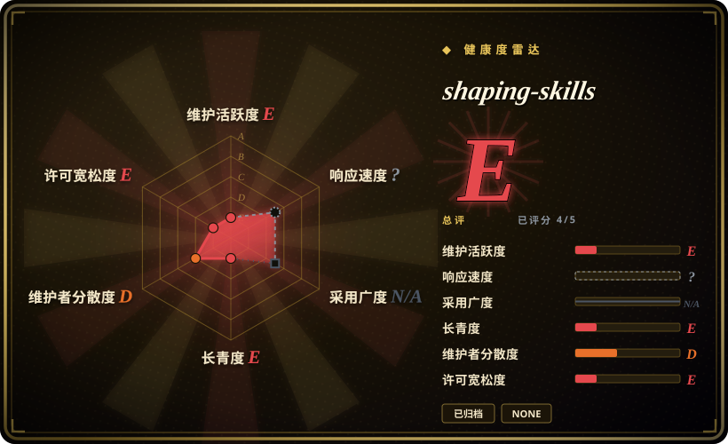
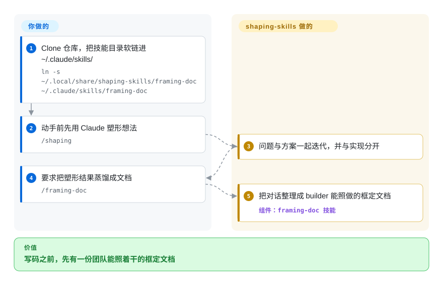

# shaping-skills

你和 Claude Code 打磨一个模糊的产品想法，对话里全是好思考，却始终落不成一份 builder 能直接动手的文档——Ryan Singer 的这套技能包把 Shape Up 的「塑形」这一步（`/shaping`、`/breadboarding`、`/framing-doc`）塞进中间。**状态：仓库已归档、作者本人标注 obsolete（2026-09）**——把它当设计参考来读，不要当可安装的产品。

## 何时使用

你是一个产品同学或独立开发者，正用 Claude Code 推敲一个还很模糊的想法，却总撞同一堵墙：对话里有不少好思考，但始终落不成一份 builder 能直接动手的东西。你从一个含糊的问题直接跳到「那就开干吧」，跳过了把「问题」和「方案」分开的那一步，最后做出来的东西解决的是错的问题。你希望 AI 像一个 shaping 搭子——逼你先把问题框清楚，把粗略方案画成相互连接的 affordance（而不是像素级的精美界面），然后才产出一份团队能直接执行的紧凑文档。

这个包以一组按需技能给你这种能力：`/framing-doc` 和 `/kickoff-doc` 把一段有效对话蒸馏成「问题框定」或「builder 参考」文档；`/shaping` 在进入实现前把问题和方案一起迭代；`/breadboarding` 按 Shape Up 的方式把系统拆成 places、affordances 以及它们之间的连线。可选的 `hooks/shaping-ripple.sh` 脚本做一次涟漪/副作用检查。安装方式是 clone 仓库后把各技能目录软链到 `~/.claude/skills/`——之后任务匹配时，方法论通过 Claude Code 原生技能加载器激活。

## 怎么用起来

这套包就是 markdown 技能加一个钩子——没有运行时，没有 CLI。每个技能各占一个目录（`framing-doc`、`kickoff-doc`、`shaping`、`breadboarding`，外加 `breadboard-reflection`），接入方式是把仓库 clone 下来、将每个目录软链为 `~/.claude/skills/` 的**直接子目录**——Claude Code 只向下发现一层技能，而软链让更新就是一次 `git pull`。之后的分工很直白：你带对话来，技能负责格式化和蒸馏。`/shaping` 与 `/breadboarding`（把系统映射成 places、affordances 和连线）是更实验的 solo 技能；`/framing-doc` 与 `/kickoff-doc` 是把转录变成文档的协作技能。README 明说它们不评价你的思考——进的是糟粕，出的是一份排版精美的糟粕。可选的 `PostToolUse` 钩子注册在 `~/.claude/settings.json` 里，每当 agent 编辑带 `shaping: true` frontmatter 的 markdown，就唤起 `shaping-ripple.sh` 提示一遍依赖表与 fit-check 清单。它替你做的：结构、词汇表和涟漪提醒；仍归你的：真正的产品判断——以及仓库归档之后，所有的维护。

<!-- flow-steps:begin (generated from flows/shaping-skills.json by tools/flow_card.py — do not edit) -->

流程文字版

1. **你**：Clone 仓库，把技能目录软链进 ~/.claude/skills/ — `ln -s ~/.local/share/shaping-skills/framing-doc ~/.claude/skills/framing-doc`
2. **你**：动手前先用 Claude 塑形想法 — `/shaping`
3. **shaping-skills**：问题与方案一起迭代，并与实现分开
4. **你**：要求把塑形结果蒸馏成文档 — `/framing-doc`
5. **shaping-skills**：把对话整理成 builder 能照做的框定文档 — 组件：`framing-doc 技能`

**价值**：写码之前，先有一份团队能照着干的框定文档

<!-- flow-steps:end -->

## 何时不用

- **作者已归档，并亲口宣布过时。** README 第一行（2026-09-21 提交）写着 "NOTE: THESE ARE OBSOLETE! … I haven't used this skills since then"，仓库在 GitHub 上 `archived: true`（2026-09-28 核实）。要读就读它的 SKILL.md 当「和 agent 一起塑形」的设计参考；要一套仍在维护的「先定义再开干」流程，去选 [Superpowers](../../../agent-dev-methodology/coding-agent-harnesses/superpowers.zh.md)。
- **你已经有一套信任的规划/spec 方法论。** Shaping 与「先头脑风暴再写计划」类技能包（如 Superpowers 的 `brainstorming` + `writing-plans`）直接重叠。叠两套有主张的「先定义再开干」流程会导致路由冲突——shaping/planning 只能有一个事实源。
- **你要的是代码，不是问题定义。** 这个包刻意停在实现*之前*；它产出 framing/kickoff 文档，不产出可运行代码或测试。如果你要的是 build loop（TDD、调试、重构），它不覆盖。
- **「garbage in, garbage out」对你是硬伤。** 文档类技能只对你给的素材做格式化和蒸馏；README 明确说它们不判断你的思考好不好——糟糕的对话只会得到一份排版精美的糟糕文档。
- **你不在 Claude Code 上。** 激活依赖 Claude Code 的 `~/.claude/skills/` 软链 + 原生技能加载器；换个 harness 没有加载器来调起这些技能，光有 markdown 不会自动触发。[推断]
- **你需要稳定性或维护保证。** 个人仓库，无 tagged release，现已归档且无 license 文件；归档之前作者就已明确标注 solo 技能（`/shaping`、`/breadboarding`）更实验、更未经实战。它是一个人工作配置的快照，你需要任何修复都只能 fork 自担。
- **强制力只是建议级。** 行为活在 agent 按需加载的 prompt/markdown 技能里；shaping 纪律是 agent 仍可跳过的建议，不是硬闸门。

## 横向对比

| 替代品 | 是否收录 | 我们的评价 | 取舍 |
|---|---|---|---|
| [antfu/skills](antfu-skills.zh.md) | ✅ | 需要 Vue/Vite 前端实现栈规则，而不是上游问题塑形时，选 antfu/skills。 | 同为个人精选 Claude Code 技能集，但面向 Vue/Vite 前端*实现*栈（测试写法、ESLint、UnoCSS）。两者正交：shaping-skills 在代码上游（问题/方案定义），antfu/skills 在下游（代码怎么写）。 |
| [Dimillian/Skills](dimillian-skills.zh.md) | ✅ | 任务偏实现或平台约定，而非产品塑形时，选 Dimillian/Skills。 | 另一位个人开发者的 Claude Code 技能集；按领域对比——Dimillian 偏实现/平台约定，shaping-skills 偏产品塑形与文档产出。 |
| [gstack](gstack.zh.md) | ✅ | 需要个人 harness/persona 配置，而不是 Shape Up 塑形词汇时，选 gstack。 | 本叶子下的个人 harness/技能集，侧重点不同。交叉确认各自塑形 vs 构建的生命周期阶段。 |
| [Superpowers](../../../agent-dev-methodology/coding-agent-harnesses/superpowers.zh.md) | ✅ | 需要完整 SDLC 技能库的 brainstorm 和计划环节时，选 Superpowers。 | 一个完整 SDLC 技能库，其前端（拷问想法、写计划）与 shaping 意图重叠，但框成通用软件头脑风暴，而非 Shape Up 的「问题/方案/breadboard」词汇体系。 |
| Shape Up 原书 / BaseCamp 官方材料 | 未收录 | 需要源方法论文本、不是可安装 agent skill 时，选原书或官方材料。 | 作为文字的源方法论，不是可安装的 agent 技能——这个包是某个人把它在 Claude Code 里落地的实现。 |

## 健康度与可持续性

- **响应速度**：无法计算——type_na。
- **维护** —— **已死，死于作者之手**：仓库 `archived: true`，最后一个提交（2026-09-21）就是 README 上宣布技能过时的那句 "I haven't used this skills since then"。上游不会再有任何修复、CVE 响应或 Claude Code 兼容性更新（GitHub API + 提交历史，2026-09-28）。
- **治理与 bus factor** —— 单维护者的个人仓库（`User` 所有，Basecamp 的 Ryan Singer、Shape Up 合著者），约 1.4k stars。一个人的落地实现；他的名头给*方法论*加了信用，但这套*封装*在归档之前也没有团队。
- **年龄与 Lindy** —— 创建于 2026-01，2026-09 归档，存活约 0.7 年：短命且已经变质，Lindy 主张不成立——仓库自身的生命周期就是证据。它所编码的 Shape Up *方法论*长命，仍是人们打开本页的理由。
- **风险旗标** —— 至今没有 LICENSE 文件（GitHub API `license: null`，2026-09-28 核对仓库树）：归档文本的复用/再分发权利法律上不清，而 fork 已是唯一路径，这一点更致命——复制技能内容前先向作者确认。

## 存疑（未验证）

- [未验证] 截至 2026-09-28 无 LICENSE 文件或 `licenseInfo`（此处记为 SPDX `NOASSERTION`）；缺显式 license 时，复用/再分发权利不明——依赖或 fork 文本前先向作者确认。
- [推断] 归档发生在最后提交（2026-09-21，过时声明）与本次核查（2026-09-28）之间；GitHub 不暴露归档时间戳，确切日期未知。
- [未验证] Star 数（2026-09-28 GitHub 约 1.4k）对日期敏感，且从来不是质量信号；这约 1.4k 更多反映作者的知名度而非实际采用。
- [未验证] 技能清单（`framing-doc`、`kickoff-doc`、`shaping`、`breadboarding`，外加 `breadboard-reflection` 目录与 `hooks/shaping-ripple.sh`）已于 2026-09-28 对照归档仓库树复查；SKILL.md 文件名大小写不一，内容未逐文件重读。
- [未验证] 「Opus 4.6 时代起就没用过」是作者 README 的自述；这些技能在当前模型上的实际表现未做测试。
- [推断] 因技能是 Claude Code 加载的 prompt/markdown，shaping 纪律是建议级——agent 可偏离；这里的「技能」塑造行为，并不强制行为。
