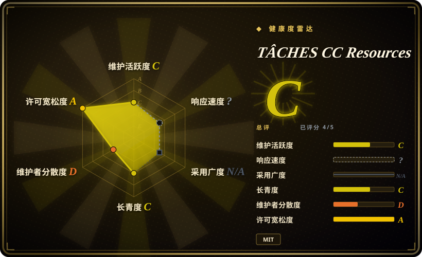
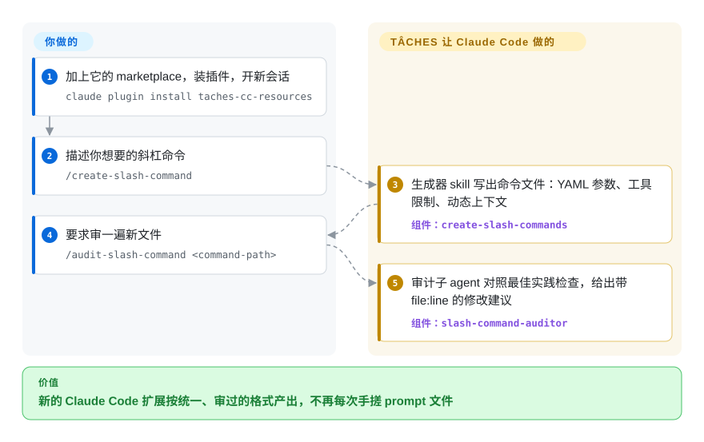

# TÂCHES CC Resources

TÂCHES（glittercowboy）的个人化、带主观偏好的 Claude Code 扩展合集：约 27 个 slash 命令、9 个「skill」（大多是用来生成新命令/skill/subagent/hook/MCP server 的元生成器）、3 个审计 subagent，以及示例 hook —— 作为单个 marketplace 插件安装。

## 何时使用

你是常驻 Claude Code 的独立开发者或小团队作者，每次想加一个新扩展都在重复同样的脚手架活：要写 slash 命令、subagent、hook 或 MCP server 时都从零手搓 prompt 结构，产出还参差不齐。你同时也想要几个可复用的思考框架（`/consider:pareto`、`/consider:first-principles`）、一套规整的 `/debug` 流程和 todo 辅助，而不想自己一个文件一个文件地拼。

你选择 TÂCHES CC Resources，是因为它是一份精选、开箱即用的起步套件：安装 marketplace 插件（`glittercowboy/taches-cc-resources`）后即可得到 *Create Agent Skills*、*Create Slash Commands*、*Create Subagents*、*Create Hooks*、*Create MCP Servers* 这类元 skill，引导 Claude 产出格式规整的扩展；外加三个审计 subagent（skill-auditor、slash-command-auditor、subagent-auditor）来给你生成的东西做体检。它更像一个「为你自己的 Claude Code 定制件而设的工厂」，而非某个领域 skill 集——你采纳的是一个人的扩展编写「房间风格」，再从中迭代。

## 怎么用起来

这里的东西全是 Claude Code 加载的 Markdown：斜杠命令（输入 `/名字` 触发的一段存好的 prompt）、skill（任务对上时 Claude 拉进来的较长指令）、子 agent（有自己指令和上下文的独立 Claude 实例），以及示例 hook。**你**装一次插件——或者手工把 `commands/` 和 `skills/` 拷进 `~/.claude/`——之后按需调用。这套包的核心是一组生成器：运行 `/create-slash-command`（或 `/create-subagent`、`/create-hook`、`/create-agent-skill`），描述你要什么，**生成器 skill** 会追问细节，然后按作者的固定格式写出文件，用 YAML 头部声明参数和工具限制。配套的 `/audit-*` 命令再把结果交给一个审计子 agent，按文件和行号报告问题。核心之外还有思考框架（`/consider:pareto`、`/consider:5-whys` 等）、一套 `/debug` 流程、待办与交接小工具，以及项目规划器（`/create-plan`、`/run-plan`）。可以把它想成木工房里的夹具：它不替你做家具，但让你切出来的每一块都是同一个形状。

<!-- flow-steps:begin (generated from flows/taches-cc-resources.json by tools/flow_card.py — do not edit) -->

流程文字版

1. **你**：加上它的 marketplace，装插件，开新会话 — `claude plugin install taches-cc-resources`
2. **你**：描述你想要的斜杠命令 — `/create-slash-command`
3. **TÂCHES CC Resources**：生成器 skill 写出命令文件：YAML 参数、工具限制、动态上下文 — 组件：`create-slash-commands`
4. **你**：要求审一遍新文件 — `/audit-slash-command <command-path>`
5. **TÂCHES CC Resources**：审计子 agent 对照最佳实践检查，给出带 file:line 的修改建议 — 组件：`slash-command-auditor`

**价值**：新的 Claude Code 扩展按统一、审过的格式产出，不再每次手搓 prompt 文件

<!-- flow-steps:end -->

## 何时不用

- **你已经有一套精选命令/skill 体系。** 这里很多条目是元生成器（「Create Slash Commands」「Create Subagents」「Create Hooks」）和思考框架，会和你已有的脚手架纪律重叠；两套叠加会带来重复路由和风格冲突——只保留一个事实源。
- **你不在 Claude Code 上。** 这套面向 Claude Code 原生加载器（`~/.claude/commands`、`~/.claude/skills`、`.claude-plugin` marketplace），唯一提到的其他 harness 是一个社区做的 OpenCode 移植（`stephenschoettler/taches-oc-prompts`，未收录）；没有给 Codex/Cursor/Droid 的清单，在这些 harness 上这些 markdown 不会自动触发。[推断]
- **你要的是强制执行而非建议。** 这些都是 agent 按需加载的 prompt/markdown 扩展；「审计器」和「debug 协议」是建议性 prompt，不是硬闸门——agent 仍可跳过或偏离。[推断]
- **你需要一个有维护、有版本的依赖。** 这是单维护者的个人合集，没有打 tag 的 release，自 2026-04-01 起再没 push（截至 2026-10 约六个月）；当成可 fork 自管的快照看待，而非可追踪的稳定上游。
- **你要的是运行时领域 skill（数据库、前端、安全）。** 它主要是「工具之上的工具」（搭扩展、元 prompt），不像某些同类合集那样自带深度的分领域专业能力。

## 横向对比

| 替代品 | 是否收录 | 我们的评价 | 取舍 |
|---|---|---|---|
| [antfu/skills](antfu-skills.zh.md) | ✅ | 需要具体编写/开发 skill，而不是扩展生成器时，选 antfu/skills。 | 另一份个人 Claude Code skill 合集；偏具体的编写/开发 skill，而非用来造新扩展的元生成器。 |
| [Dimillian/Skills](dimillian-skills.zh.md) | ✅ | 特定技术栈/工作流的个人 skill 集更贴合时，选 Dimillian/Skills。 | 偏向特定技术栈/工作流的个人 skill 集；TÂCHES 更「广而浅」，聚焦给 Claude Code 扩展本身搭脚手架。 |
| [wshobson/agents](../../subagent-collections/wshobson-agents.zh.md) | ✅ | 需要现成领域 subagent 的广度时，选 wshobson/agents。 | 大量现成领域 subagent 库；TÂCHES 只带 3 个审计 subagent 外加生成器来「造」你自己的。要人设广度选 wshobson，要编写扩展选 TÂCHES。 |
| [awesome-claude-code-subagents](../../subagent-collections/awesome-claude-code-subagents.zh.md) | ✅ | 需要偏消费的大型 subagent 精选目录时，选 awesome-claude-code-subagents。 | 体量大的 subagent 精选目录（偏消费）；TÂCHES 是小而杂的个人组合（命令+skill+审计器），偏生成。 |
| [shaping-skills](shaping-skills.zh.md) | ✅ | 需要单一方法论形态的 skill 包时，选 shaping-skills。 | 偏方法论形态的 skill 包；TÂCHES 不是单一方法论，更像一袋编写工具加思考框架。 |
| Anthropic 官方 Claude Code skills / 内置命令 | 未收录 | 平台原生行为更重要时，选官方 Claude Code skills 或内置命令。 | 平台原生生态；TÂCHES 是叠在其上的第三方个人合集，可能与原生命令重复或冲突。 |

## 健康度与可持续性

- **响应速度**：无法计算——type_na。
- **维护（2026-10）** —— 最后推送 2026-04-01，未归档：已安静约六个月，没有打 tag 的 release，16 个 open issue（维护 C）。算是在滑行而非废弃，但没有 semver 可 pin，也看不到下一次更新的迹象。
- **治理与 bus factor** —— 单维护者的个人仓库（`User` 所有，glittercowboy/TÂCHES），约 2.0k stars；评分器在 12 个月里只看到一位活跃提交者（治理 D）。是一个作者编写扩展的「房间风格」；没有团队兜底——当作可 fork 自管的快照看待。
- **年龄与 Lindy** —— 创建于 2025-11，截至 2026-10 约 11 个月：年轻，且一半时间都在安静，寿命一档已滑到 C（总评 C）。太新，还没经历多少次 Claude Code 加载器/marketplace 变更——为搭脚手架而采用，不为稳定。
- **风险旗标** —— MIT 许可（截至 2026-10），复用清晰，但「Setup Ralph」会接一个自主编码循环，其安全边界无文档——无人值守运行前请先审阅。强制仅为建议级。

## 存疑（未验证）

- [未验证] GitHub 元数据（license MIT，主语言 TypeScript ~57% / Shell ~36% / Python ~6%，未归档，无打 tag 的 release，最近 push 2026-04-01）——语言占比于 2026-06-26 读取，其余于 2026-10-08 复核；依赖具体值前请复核。
- [未验证] star 数（2026-10-08 约 1,980）不可靠且随日期变化；仅作参考，不作质量信号。
- [未验证] 清单数量（27 命令、9 skill、3 subagent、含 hook）来自 README/仓库列表，作者编辑后可能漂移；依赖具体条目前请重新清点 `commands/`、`skills/`、`agents/` 目录。
- [推断] 激活方式是 Claude Code 专属（原生 skill/命令/marketplace 加载器）；跨 harness 使用未见文档，需手动移植。
- [推断] 因为行为都活在 prompt/markdown 里，审计 subagent 和 debug 协议是建议性的——能塑形但不能强制 agent 行为。
- [未验证] 「Setup Ralph」看起来用于搭一个自主编码循环；其安全边界与副作用此处无文档——无人值守运行前请先审阅。
