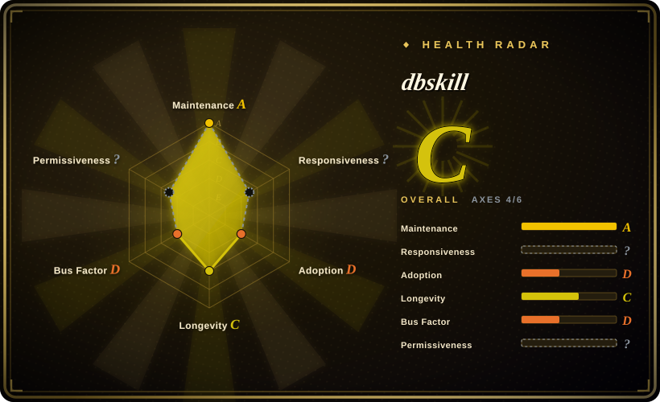
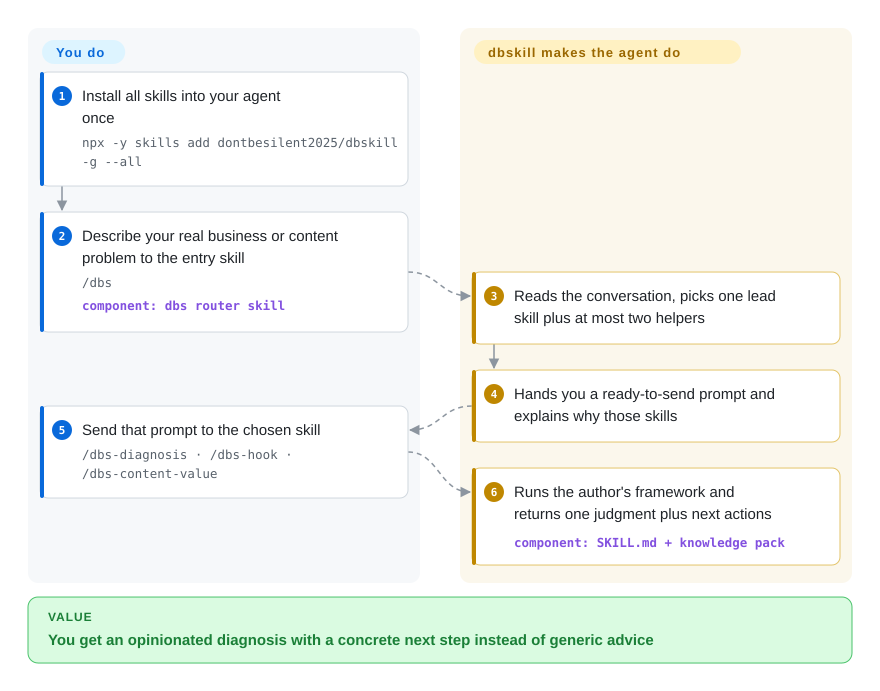

# dbskill

You ask your agent whether your small business or your content is working and get back polite, generic advice with no stance. dbskill loads one Chinese creator's business-and-content methodology into the agent as ~33 `/dbs-*` skills, with a `/dbs` router that picks which of them fits your problem.

## When to use

You're a solo founder, indie creator, or operator running a one-person business in Chinese-speaking markets, and you use Claude Code, Codex, Doubao or WorkBuddy as a thinking partner. You keep asking the agent "customers say it's too expensive — do I change the price, the product, or the audience?", "why doesn't anyone watch past the first 20 seconds?", "what should I actually do next?" — and the answers come back balanced and toothless, because the agent has no framework to commit to. dbskill gives it one: `/dbs-diagnosis` (business-model teardown), `/dbs-benchmark` (which accounts to study), `/dbs-content-value` and `/dbs-content` (who a piece is for and how to shape it), `/dbs-hook` and `/dbs-xhs-title` (short-video openings, Xiaohongshu titles), `/dbs-content-risk-check` (pre-publish sensitive-word and ad-rule check), `/dbs-action` and `/dbs-decision` (stalled execution, recurring decisions), `/dbs-knowledge` (turn a local folder into a navigable knowledge base), and `/dbs-save` / `/dbs-restore` / `/dbs-report` so a diagnosis persists across sessions in `~/.dbs/`.

Think of it when you want *this specific author's* opinions — frameworks distilled from 16k of their public posts into 4,176 knowledge atoms — rather than building your own coaching prompt stack, and when you don't know which of 30-odd tools to reach for: `/dbs` does that routing for you.

## How it works

Each skill is a folder with a `SKILL.md` — plain instructions the agent reads when the command fires — plus a per-skill "knowledge pack" of the author's methods, so the reasoning style is shipped and you only supply your situation. The entry skill `/dbs` is a router: it reads your conversation, decides whether one skill is enough or whether to combine one lead skill with up to two helpers, and hands you a ready-made prompt to send next, rather than doing the diagnosis itself. A few skills reach outside the prompt: `/dbs` checks a public `UPDATE.json` on GitHub at most once a day and fetches three-digit "numbered" prompts from the repo's `main` branch when you type a code, and `/dbs-video-extract` calls two paid third-party APIs (TikHub for video/account data, Qingdou for transcripts) with keys you buy and store locally. Everything else is text the agent follows; nothing runs as a service.

<!-- flow-steps:begin (generated from flows/dbskill.json by tools/flow_card.py — do not edit) -->

Text version of the flow

1. **You**: Install all skills into your agent once — `npx -y skills add dontbesilent2025/dbskill -g --all`
2. **You**: Describe your real business or content problem to the entry skill — `/dbs` — component: `dbs router skill`
3. **dbskill**: Reads the conversation, picks one lead skill plus at most two helpers
4. **dbskill**: Hands you a ready-to-send prompt and explains why those skills
5. **You**: Send that prompt to the chosen skill — `/dbs-diagnosis · /dbs-hook · /dbs-content-value`
6. **dbskill**: Runs the author's framework and returns one judgment plus next actions — component: `SKILL.md + knowledge pack`

**Value**: You get an opinionated diagnosis with a concrete next step instead of generic advice

<!-- flow-steps:end -->

## When NOT to use

- **You don't operate in Chinese-language business contexts.** The skills, knowledge atoms and case material are Chinese, and the frameworks lean on China-specific channels (Xiaohongshu, Douyin, WeChat Channels). Outside that context most of the value evaporates.
- **You want coding / SDLC discipline, not business coaching.** This is a domain pack about commerce, content and decisions — not TDD, refactoring or agent engineering. Pair it with a coding methodology pack; don't expect overlap.
- **You already trust your own diagnosis frameworks.** dbskill is strongly opinionated (Adlerian execution model, fixed title formulas, the author's "friction asset" thesis). Layering it over an existing coaching stack produces conflicting advice — pick one source of truth.
- **Commercial / productized use.** The `LICENSE` file is CC BY-NC 4.0 — non-commercial only; the README says commercial use needs the author's separate permission. You can't freely bake it into a paid product or client service.
- **You need prompts that only change when you upgrade.** `/dbs` numbered prompts are fetched live from the repo's `main` branch at use time, so their content can change (or disappear) without any version bump on your side; the router also phones home to GitHub once a day for update notices. In an offline, locked-down or audit-sensitive setup, skip `/dbs` numbered codes or install individual skills instead of the router.
- **You expect everything to be free and local.** `/dbs-video-extract` does nothing without paid TikHub and/or Qingdou credentials, and its setup flow walks you through buying them; a paid Q&A group is also advertised. The rest of the pack works without paying.
- **You need stability.** One author, 63 releases in about six months (v2.14.2 in June → v2.18.45 in September), and skills are added, merged and removed release-to-release (`/dbs-skill-cleaner` was dropped in v2.18.33). Pin a version or a commit if you rely on specific commands.

## Comparison

| Alternative | In index | Our verdict | Tradeoff |
|---|---|---|---|
| [antfu/skills](../engineering-workflows/antfu-skills.md) | ✅ | Choose antfu/skills when you need personal coding/devtools skills rather than business diagnosis. | A maintainer's personal coding/devtools skills; engineering-flavored, English-first. dbskill is a domain pack for business diagnosis, not code workflow. |
| [Dimillian/Skills](../engineering-workflows/dimillian-skills.md) | ✅ | Choose Dimillian/Skills when you need iOS/Swift developer workflow skills. | Personal skills from an iOS/Swift developer; software-focused. Disjoint domain — pick by whether you want coding help or business coaching. |
| [awesome-claude-code-subagents](../../subagent-collections/awesome-claude-code-subagents.md) | ✅ | Choose awesome-claude-code-subagents when you need broad technical-role subagent coverage. | A large broad subagent collection across many technical roles; breadth over a single opinionated voice. dbskill is one author's deep, narrow business methodology. |
| Generic LLM business-coaching prompts | 未收录 | Choose ad-hoc prompts only when you do not need a curated framework, routing between tools, or persistent state. | Ad-hoc prompts have no curated framework, case library, or persistence; dbskill ships 4,176 knowledge atoms, a router, and save/restore commands behind one author's voice — at the cost of that author's biases. |

## Health & viability

- **Responsiveness**: Cannot be scored — type_na.
- **Maintenance (2026-09):** very active — commits on 12 of the last 13 weeks, last push 2026-09-28, v2.18.45. Issues are enabled and 0 are open; recent bug reports (e.g. #45, skill descriptions bloating the system prompt; #47, Windows install copying directories) were closed with a fix release.
- **Governance & bus factor:** single-author `User`-owned repo (dontbesilent2025); the author holds ~95% of commits, the remainder is a bot and one outside contributor. The whole value — frameworks, case library, knowledge atoms — is one creator's methodology with no org behind it. ~10.3k stars on a one-person pack makes continuity entirely tied to that author.
- **Age & Lindy verdict:** created 2026-03-20, so ~6 months old as of 2026-09 — young, fast-moving and popular, with no longevity record. Its frameworks are the author's opinions, not time-tested standards. Fails the Lindy test on age.
- **Risk flags:** **CC BY-NC 4.0** (read from `LICENSE`; GitHub reports `NOASSERTION`) — non-commercial only. Runtime fetches from GitHub `main` (numbered prompts, daily update check) mean behavior is not fully pinned by the installed version. One skill depends on paid third-party APIs. Advisory only — prompt-level coaching, no enforcement.

## Caveats (unverified)

- [未验证] Star count (~10,322 per GitHub API on 2026-09-28) and release-download totals are indicative only, not a quality signal.
- [未验证] "16,152 public posts → 4,176 knowledge atoms" is the README's claim; the atom count matches `知识库/原子库/atoms.jsonl` line count (4,176) but the filtering process was not examined.
- [未验证] Supported harnesses are stated in the README as Doubao, WorkBuddy, Claude Code, Codex "and other Agents that support Skills"; only the install commands were read, not tested on each harness. Cursor / Trae Solo are no longer named in the README (Cursor still appears in `/dbs-install-skill`).
- [推断] Skill behavior lives in markdown the agent follows, so the frameworks are advisory — the agent can deviate, and outputs are coaching, not guaranteed business outcomes.
- [推断] Because numbered prompts load from the live `main` branch, a compromised or changed upstream would reach users without a reinstall; the fetch script only checks host, size and a digest listed in the same remote catalog.
- [未验证] TikHub / Qingdou pricing, data coverage and terms were not reviewed; the skill itself states it has no affiliation with either provider.
