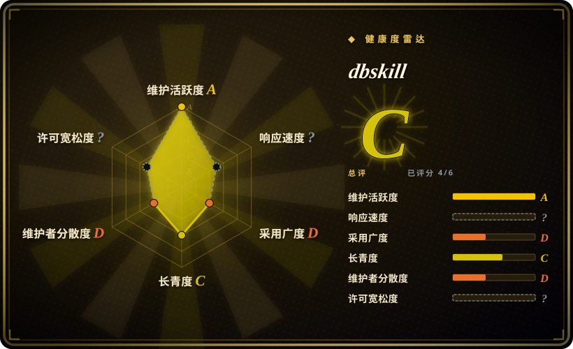
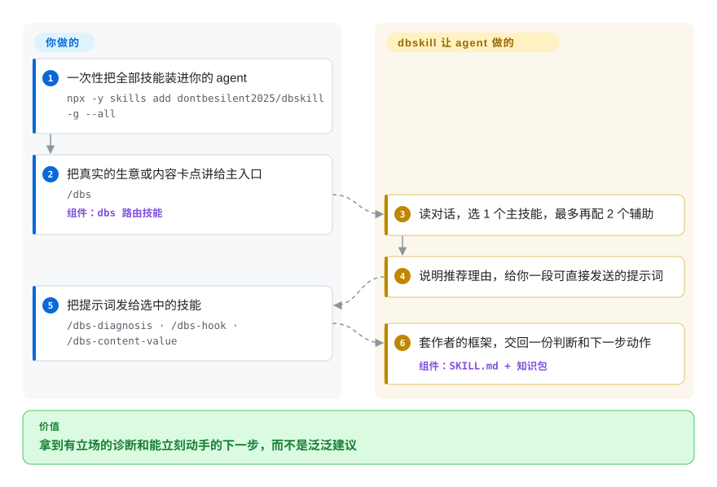

# dbskill

你问 agent“我这门小生意、这条内容到底行不行”，拿回来的总是四平八稳、不表态的建议。dbskill 把一位中文创作者的商业与内容方法论装进 agent，做成约 33 个 `/dbs-*` 技能，再用一个 `/dbs` 路由入口替你挑该用哪一个。

## 何时使用

你是独立创业者、个人创作者或一人公司操盘手，主要做中文市场，平时把 Claude Code、Codex、豆包或 WorkBuddy 当思考搭子。你反复问 agent：“客户总说贵，我该改价格、改产品，还是换客群？”“为什么没人看过前 20 秒？”“我下一步到底该干什么？”——回答总是面面俱到却没有牙齿，因为 agent 手上没有一个敢下判断的框架。dbskill 给它装上一套：`/dbs-diagnosis`（商业模式拆解）、`/dbs-benchmark`（该研究哪些对标账号）、`/dbs-content-value` 与 `/dbs-content`（这条内容给谁看、怎么做）、`/dbs-hook` 与 `/dbs-xhs-title`（短视频开头、小红书标题）、`/dbs-content-risk-check`（发布前查敏感词与广告导流）、`/dbs-action` 与 `/dbs-decision`（行动卡住、反复出现的决策）、`/dbs-knowledge`（把本地文件夹变成可导航的知识库），以及 `/dbs-save`、`/dbs-restore`、`/dbs-report`，让一次诊断跨会话保存在 `~/.dbs/`。

当你想要的是**这位作者本人**的判断——从其 1.6 万条公开推文提炼出的 4,176 条知识原子——而不是自己从零搭一套教练 prompt，或者面对 30 多个工具不知道该先用哪个时，就想到它：`/dbs` 会替你做这一步选择。

## 怎么用起来

每个技能是一个文件夹，里面的 `SKILL.md` 是命令触发时 agent 读的纯文字指令，外加一份该技能的“知识包”（作者的方法论文档），所以推理方式是现成的，你只需要交代自己的处境。主入口 `/dbs` 是个路由器：它读你的对话，判断一个技能够不够，不够就配 1 个主技能加最多 2 个辅助技能，然后给你一段可以直接发出去的提示词——它自己不做诊断。少数技能会伸到提示词之外：`/dbs` 每天最多一次去 GitHub 读公开的 `UPDATE.json` 看有没有新版，你输入三位编号时还会从仓库 `main` 分支实时拉取对应的“编号提示词”；`/dbs-video-extract` 要调用两家付费第三方接口（TikHub 查作品和账号数据，轻抖出语音文字稿），凭证需要你自己购买并存在本机。除此之外都是 agent 照着执行的文字，没有任何常驻服务。

<!-- flow-steps:begin (generated from flows/dbskill.json by tools/flow_card.py — do not edit) -->

流程文字版

1. **你**：一次性把全部技能装进你的 agent — `npx -y skills add dontbesilent2025/dbskill -g --all`
2. **你**：把真实的生意或内容卡点讲给主入口 — `/dbs` — 组件：`dbs 路由技能`
3. **dbskill**：读对话，选 1 个主技能，最多再配 2 个辅助
4. **dbskill**：说明推荐理由，给你一段可直接发送的提示词
5. **你**：把提示词发给选中的技能 — `/dbs-diagnosis · /dbs-hook · /dbs-content-value`
6. **dbskill**：套作者的框架，交回一份判断和下一步动作 — 组件：`SKILL.md + 知识包`

**价值**：拿到有立场的诊断和能立刻动手的下一步，而不是泛泛建议

<!-- flow-steps:end -->

## 何时不用

- **你不在中文商业语境里。** 技能、知识原子和案例都是中文，框架依赖中国特有渠道（小红书、抖音、视频号）。离开这个语境，大部分价值就没了。
- **你要的是编码或研发流程纪律，不是商业教练。** 这是关于生意、内容和决策的领域包，不是 TDD、重构或 agent 工程。搭配编码方法论包用，别指望两者重叠。
- **你已经有一套自己信任的诊断框架。** dbskill 立场很强（阿德勒式执行模型、固定标题公式、作者的“摩擦资产”论）。叠在已有教练 prompt 上会得到互相打架的建议——只选一个事实源。
- **商用或产品化。** `LICENSE` 文件是 CC BY-NC 4.0，仅限非商业用途；README 写明商业用途需作者单独授权。不能随意打包进付费产品或客户服务。
- **你需要“不升级就不变”的提示词。** `/dbs` 的编号提示词在使用时从仓库 `main` 分支实时读取，内容可能在你没升级的情况下变化甚至消失；路由入口还会每天联网一次查更新。在离线、强管控或需要审计的环境里，别用编号功能，或者单装具体技能、不装路由入口。
- **你以为全部免费、全部本地。** `/dbs-video-extract` 没有付费的 TikHub 和／或轻抖凭证就用不了，它的引导流程会带你去购买；README 里还挂着付费答疑群。其余技能不付费也能用。
- **你需要稳定。** 单一作者，约半年发了 63 个版本（6 月 v2.14.2 → 9 月 v2.18.45），技能会随版本增删合并（v2.18.33 移除了 `/dbs-skill-cleaner`）。依赖具体命令就锁定版本或 commit。

## 横向对比

| 替代品 | 是否收录 | 我们的评价 | 取舍 |
|---|---|---|---|
| [antfu/skills](../engineering-workflows/antfu-skills.zh.md) | ✅ | 需要编码或 devtools 个人技能，而非商业诊断时，选 antfu/skills。 | 一位维护者的个人编码／devtools 技能；工程味、英文优先。dbskill 是商业诊断的领域包，不是代码工作流。 |
| [Dimillian/Skills](../engineering-workflows/dimillian-skills.zh.md) | ✅ | 需要 iOS/Swift 软件开发帮助，而非商业教练时，选 Dimillian/Skills。 | 一位 iOS/Swift 开发者的个人技能；软件向。领域不重叠——按你要编码帮助还是商业教练来选。 |
| [awesome-claude-code-subagents](../../subagent-collections/awesome-claude-code-subagents.zh.md) | ✅ | 需要覆盖众多技术角色的大型 subagent 合集时，选 awesome-claude-code-subagents。 | 一个覆盖众多技术角色的大型 subagent 合集；重广度而非单一鲜明声音。dbskill 是单作者、窄而深的商业方法论。 |
| 通用 LLM 商业教练 prompt | 未收录 | 只在不需要精选框架、工具间路由或持久化状态时，选临时 prompt。 | 临时 prompt 没有精选框架、案例库和持久化；dbskill 在一位作者的声音背后带了 4,176 条知识原子、路由入口和存档命令——代价是连同这位作者的偏见一起接收。 |

## 健康度与可持续性

- **响应速度**：无法计算——type_na。
- **维护（2026-09）：** 非常活跃——近 13 周里有 12 周有提交，最后 push 于 2026-09-28，版本 v2.18.45。Issue 开放、当前 0 个 open；近期问题（如 #45 技能描述撑大系统提示词、#47 Windows 安装复制出实体目录）都以修复版本关闭。
- **治理与 bus factor：** 单作者的 `User` 仓库（dontbesilent2025），作者约占 95% 的提交，其余来自一个 bot 和一位外部贡献者。框架、案例库、知识原子全部是一位创作者的方法论，背后没有组织。一人仓库约 1.03 万 star，延续性完全系于这位作者。
- **年龄与 Lindy 判断：** 创建于 2026-03-20，截至 2026-09 约 6 个月——年轻、迭代快、热度高，没有存续记录。其框架是作者观点，不是经过时间检验的标准。仅凭年龄即未通过 Lindy 检验。
- **风险标记：** **CC BY-NC 4.0**（读自 `LICENSE`；GitHub 报告为 `NOASSERTION`）——仅限非商用。运行时从 GitHub `main` 拉内容（编号提示词、每日更新检查），行为并不完全由已装版本锁定。有一个技能依赖付费第三方接口。仅为建议性——prompt 级教练，没有强制。

## 存疑（未验证）

- [未验证] Star 数（2026-09-28 GitHub API 约 10,322）与发布下载量仅作参考，不作质量信号。
- [未验证] “16,152 条公开推文 → 4,176 条知识原子”是 README 的说法；原子数与 `知识库/原子库/atoms.jsonl` 行数（4,176）一致，但筛选过程未核查。
- [未验证] README 写明支持豆包、WorkBuddy、Claude Code、Codex“以及其他支持 Skills 的 Agent”；此处只读了安装命令，未在各 harness 上实测。README 已不再点名 Cursor／Trae Solo（`/dbs-install-skill` 里仍列有 Cursor）。
- [推断] 技能行为存在于 agent 执行的 markdown 里，框架只是建议——agent 仍可能偏离，产出是教练意见，不保证商业结果。
- [推断] 编号提示词从实时的 `main` 分支加载，上游一旦被篡改或改动，无需重装就会传到用户侧；拉取脚本只校验域名、大小和同一远端目录里登记的摘要。
- [未验证] TikHub／轻抖的价格、数据覆盖面和服务条款未审查；该技能自述与两家服务商无隶属或利益关系。
