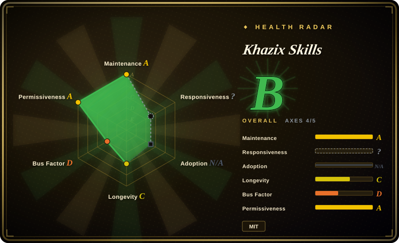
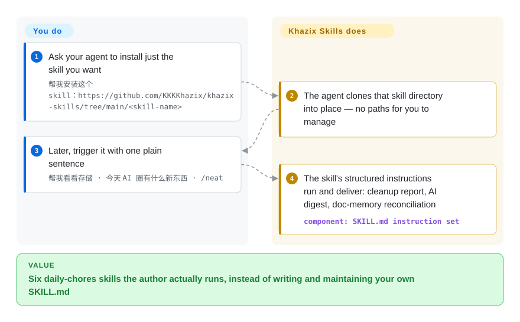

# Khazix Skills

Your daily agent writes code fine but fumbles the recurring chores: a full disk, today's real AI news, docs and memory quietly rotting after every session. Khazix open-sourced the six SKILL.md skills he actually runs every day — one sentence to install one, one sentence to trigger it, and the agent follows the structured instructions.

## When to use

You're a Chinese-speaking developer or content creator running Claude Code (or Codex, Qoder, Kimi Code, iFlow, CodeBuddy, Cursor — the README counts 40+ agents that load the Agent Skills standard) as your daily driver, and you keep hitting small, repetitive chores that the base agent does clumsily: your disk is full and you want a triaged, traffic-light-coded cleanup report instead of `du -sh` archaeology (`storage-analyzer`); you want "what happened in AI today" pulled from a live feed instead of the model hallucinating from stale training data (`aihot`); after a long session you want CLAUDE.md / AGENTS.md / project docs and agent memory reconciled with what the code actually became (`neat-freak`, now self-described v3.0); you want a 10k–30k-word horizontal-vertical research PDF (`hv-analysis`); or a long WeChat article in one specific author's voice (`khazix-writer`). The newest addition goes a step further: `leader` turns a fuzzy idea into a goal brief you can paste into a goal-mode agent and let run autonomously for hours. Each of these is a single SKILL.md (plus `references/`, `scripts/`, `assets/`) that the agent loads on demand and follows.

You reach for this pack when you'd rather install one author's battle-tested, ready-made skill than write the SKILL.md yourself. Installation is a natural-language ask — "帮我安装这个 skill：https://github.com/KKKKhazix/khazix-skills/tree/main/<skill-name>" — and the agent clones the directory into place; on a harness with no skill loading, you paste that skill's SKILL.md in as a project rules file and get the same behavior. It's a grab-bag of independent tools, not a methodology framework — take only the one or two skills you need.

## How it works

This is six standalone SKILL.md directories following the Agent Skills open standard — a markdown file of structured instructions, loaded by the agent only when the task matches. The interesting part is where the work lands. `storage-analyzer` starts a local read-only service and opens an interactive HTML report classifying disk usage green/yellow/red — 🟢 pure caches may be deleted in one click, 🟡 items holding user data only get "open in Finder / move to trash", 🔴 running apps' core data get an explanation and no delete button at all; every destructive action needs your click plus a browser confirmation dialog. `neat-freak` (`/neat`) reconciles three layers after a session — project docs, CLAUDE.md/AGENTS.md, and the agent's own memory — and audits whether the rules were actually followed, never deleting without a confirmed candidate list. `aihot` is the one skill with teeth outside the repo: it queries the author-operated `aihot.news` anonymous read-only API (the older `aihot.virxact.com` endpoint stays as a compatibility path). What stays yours: every delete decision, and the judgment on research/writing output — the instructions steer the agent, they don't enforce anything.

<!-- flow-steps:begin (generated from flows/khazix-skills.json by tools/flow_card.py — do not edit) -->

Text version of the flow

1. **You**: Ask your agent to install just the skill you want — `帮我安装这个 skill：https://github.com/KKKKhazix/khazix-skills/tree/main/<skill-name>`
2. **Khazix Skills**: The agent clones that skill directory into place — no paths for you to manage
3. **You**: Later, trigger it with one plain sentence — `帮我看看存储 · 今天 AI 圈有什么新东西 · /neat`
4. **Khazix Skills**: The skill's structured instructions run and deliver: cleanup report, AI digest, doc-memory reconciliation — component: `SKILL.md instruction set`

**Value**: Six daily-chores skills the author actually runs, instead of writing and maintaining your own SKILL.md

<!-- flow-steps:end -->

## When NOT to use

- **You don't read Chinese.** Trigger descriptions, report output, and the writing skills (`khazix-writer`, `hv-analysis`) are Chinese-first; `khazix-writer` specifically emulates one author's WeChat voice and is useless for English content or any other voice.
- **You want a coherent methodology, not a grab-bag.** The six skills are unrelated tools by one person; there's no shared workflow spine (`leader` is the closest thing to method, but it is a one-off goal-brief generator). If you need brainstorm→plan→TDD→verify discipline, a curated SDLC pack (see Comparison) fits better.
- **Overlap with skills you already run.** `neat-freak` (doc/memory reconciliation) and a disk/storage analyzer overlap with many personal harness setups — layering them on top of an existing memory-sync or cleanup routine invites double-routing and conflicting instructions; pick one.
- **You need an enforced guarantee.** Behavior lives in prompts/markdown the agent reads; "read-only scan", the traffic-light delete tiers, and self-review layers are advisory instructions, not enforced gates. The agent can still deviate.
- **The `aihot` skill depends on a third-party hosted service.** Its data source is the anonymous read-only API of `aihot.news` (with `aihot.virxact.com` kept as a compatibility endpoint, per its SKILL.md); no API key needed, but if that service changes, rate-limits, or goes away, the skill stops working. Avoid if you need a self-contained, no-external-dependency tool.
- **You need version stability.** There is no repo-wide release; the only git tags are `neat-freak-v1.0.0–v1.0.2`, pointing at an April-2026 commit while the README describes neat-freak as "v3.0" — the tags do not track the skills' own versions. You install from a moving `main`; pin a commit for reproducibility. [推断]

## Comparison

| Alternative | In index | Our verdict | Tradeoff |
|---|---|---|---|
| [antfu/skills](../engineering-workflows/antfu-skills.md) | ✅ | Choose antfu/skills when you need a web/JS-tooling personal collection. | Another single-author personal skill collection; antfu's leans web/JS-tooling and is English-first. Khazix's is Chinese-first and tilts toward content/ops chores (writing, AI-news, cleanup). |
| [Dimillian/Skills](../engineering-workflows/dimillian-skills.md) | ✅ | Choose Dimillian/Skills when Apple/Swift development skills are the target. | Personal collection skewed to Apple/Swift dev. Khazix's overlaps little — different domain and language. |
| [ljg-skills](ljg-skills.md) | ✅ | Choose ljg-skills when a sibling Chinese personal collection matches your chores better. | Sibling personal collection in this leaf; compare by which specific chores each author automates and whether the trigger language matches yours. |
| [qiushi-skill](../engineering-workflows/qiushi-skill.md) | ✅ | Choose qiushi-skill when your recurring job is thinking method and reasoning discipline in Chinese, not chores like disk cleanup or news lookup. | Another Chinese-language personal skill set; pick by overlap with your actual tasks — qiushi automates how to think, Khazix automates what to tidy. |
| [Superpowers](../../../agent-dev-methodology/coding-agent-harnesses/superpowers.md) | ✅ | Choose Superpowers when you need an opinionated SDLC methodology pack. | An opinionated SDLC *methodology* pack (TDD/subagent discipline) — different unit of consumption. Khazix's is independent utility skills, not a workflow framework. |
| Anthropic's official / built-in Agent Skills | 未收录 | Choose first-party Agent Skills when platform-native behavior matters more than a personal bundle. | The platform's first-party skill ecosystem; Khazix's is a third-party personal bundle layered on top and can duplicate or conflict with native skills. |

## Health & viability

- **Responsiveness**: Cannot be scored — type_na.
- **Maintenance (2026-09):** active — last push 2026-09-25; ~50 open issues/PRs; the skill surface is growing (`leader` was added since the June check, and README badges now claim six skills). There are no repo-wide releases, so you still install from `main`.
- **Governance & bus factor:** single-author `User`-owned pack (KKKKhazix / 数字生命卡兹克, self-described 虚实传媒 founder and content creator). No team or foundation; ~21k stars on a one-person grab-bag is a bus-factor flag, and the writing skills emulate this one author's voice specifically.
- **Age & Lindy verdict:** created 2026-04-06, ~6 months old as of 2026-09 — young and hyped, with essentially no track record. Fails the Lindy test on age alone; treat every skill as a fresh snapshot that can change on any push.
- **Risk flags:** MIT-licensed per GitHub and the LICENSE file — code reuse itself is unencumbered. The `aihot` skill depends on a **third-party hosted service** (`aihot.news`, with `aihot.virxact.com` as a compatibility endpoint) — if it changes, rate-limits, or disappears, that skill breaks. Chinese-first content; advisory-only ("read-only scan"/traffic-light tiers are prompt instructions, not gates).

## Caveats (unverified)

- [未验证] License MIT and primary language Python per GitHub metadata (2026-09-28); repo description "数字生命卡兹克开源的 AI Skills 合集", last pushed 2026-09-25, not archived. Python is GitHub's detected primary language (likely from the bundled `scripts/`); the skills themselves are SKILL.md markdown.
- [未验证] Star count (20,961 per GitHub on 2026-09-28) is unreliable and date-sensitive; treat as indicative only, not a quality signal.
- [未验证] No repo-wide release (`latest release` is 404); the only git tags are `neat-freak-v1.0.0–v1.0.2`, whose referenced commit is dated 2026-04-28 while the README describes neat-freak as "v3.0" — the tag-to-skill-version relationship is unverified.
- [未验证] Current skill inventory is six directories (`leader`, `storage-analyzer`, `aihot`, `neat-freak`, `hv-analysis`, `khazix-writer`), verified against the repo contents on 2026-09-28; the previous snapshot of this page listed five (`leader` is new). The inventory can grow again.
- [未验证] The "40+ agents" compatibility claim (Claude Code, Codex, Qoder, Kimi Code, iFlow, CodeBuddy, Cursor, …) is from the README/repo description; actual activation fidelity per harness is not independently confirmed here.
- [未验证] `aihot` v1.7.2's SKILL.md defaults to `aihot.news/api/v1/*` with `aihot.virxact.com` as a compatibility endpoint; service ownership ("author's own site") and longevity are not confirmed here. The previous snapshot of this page cited a `curl … install.sh` one-liner and a browser-User-Agent workaround — neither appears in the current README or SKILL.md, so both claims were dropped.
- [推断] Because behavior is prompt/markdown the agent loads, "read-only scan", routing priorities, and multi-layer self-review are advisory, not enforced — the agent can deviate.
