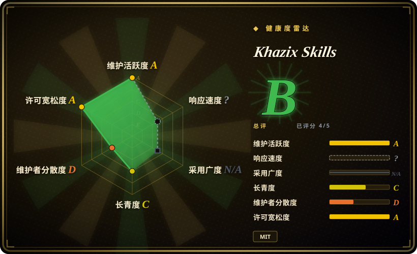
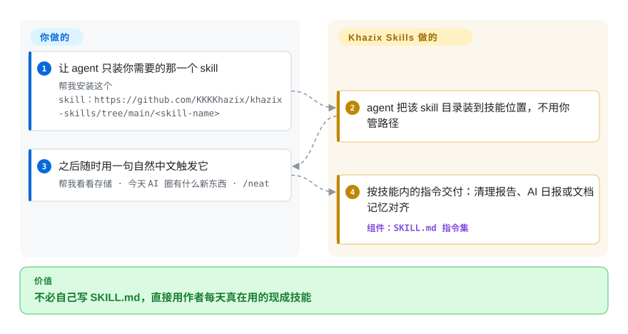

# Khazix Skills

你每天用的 agent 写代码没问题，却干不好那些重复杂务：磁盘满了不知怎么安全清理、AI 资讯全靠过时记忆编、每轮会话过后文档和记忆悄悄烂掉。卡兹克把自己每天真在用的 6 个 SKILL.md 技能开源了：一句话装一个，一句话触发，agent 照结构化指令把活干完。

## 何时使用

你是一名以中文为主的开发者或内容创作者，日常用 Claude Code（或 Codex、Qoder、Kimi Code、iFlow、CodeBuddy、Cursor——README 称有 40+ 支持 Agent Skills 标准的 agent）干活，老是被一些零碎的重复活卡住：磁盘满了，你想要一份三色分级、可安全处置的清理报告，而不是手动 `du -sh` 考古（`storage-analyzer`）；你想知道“今天 AI 圈发生了什么”并且要从实时源拉取，而不是让模型拿过时训练数据瞎编（`aihot`）；一段长会话结束后，你想把 CLAUDE.md / AGENTS.md / 项目文档和 Agent 记忆跟代码实际变成的样子对齐（`neat-freak`，现自称 v3.0）；你要一份一两万到三万字的横纵分析法研究 PDF（`hv-analysis`）；或一篇特定作者声音的公众号长文（`khazix-writer`）。最新加入的 `leader` 更进一层：把一句还没想清楚的想法变成一份目标任务书，粘进目标模式的 agent 让它自己跑几个小时。每一项都是一个 SKILL.md（外加 `references/`、`scripts/`、`assets/`），agent 按需加载并照着执行。

当你宁愿装一个作者已经跑过、现成的 skill，也不想自己写 SKILL.md 时，就用这个合集。安装方式是一句自然语言（“帮我安装这个 skill：https://github.com/KKKKhazix/khazix-skills/tree/main/<skill-name>”），agent 自己把目录装到正确位置；你的 harness 不支持技能加载时，把对应目录的 SKILL.md 全文当项目规则文件贴进去照样执行。它是一袋互相独立的工具，不是方法论框架——只取你需要的那一两个 skill 即可。

## 怎么用起来

这是六个互相独立的 SKILL.md 目录，遵循 Agent Skills 开放标准——一份写成结构化指令的 markdown，任务匹配时 agent 才加载。活落在哪里是关键差异：`storage-analyzer` 起一个本地只读服务，打开红黄绿三色分级的交互式 HTML 报告——🟢 纯缓存可一键清、🟡 含用户数据的只给“在访达打开 / 移废纸篓”、🔴 运行中应用的核心数据只解释不给删除按钮；任何删除都要你在浏览器上点了按钮再过二次确认弹窗。`neat-freak`（`/neat`）在会话收尾时对齐三层——项目文档、CLAUDE.md / AGENTS.md、Agent 自己的记忆——并审计规则有没有被真实执行，删除永远只出候选清单等你确认。`aihot` 是唯一把能力伸到仓库外的 skill：查询作者运营的 `aihot.news` 匿名只读 API（旧域名 `aihot.virxact.com` 按 SKILL.md 保留为兼容入口）。仍然归你的：每一个删除决定，以及对研究与写作产出的判断——指令是给 agent 的方向盘，不是闸门。

<!-- flow-steps:begin (generated from flows/khazix-skills.json by tools/flow_card.py — do not edit) -->

流程文字版

1. **你**：让 agent 只装你需要的那一个 skill — `帮我安装这个 skill：https://github.com/KKKKhazix/khazix-skills/tree/main/<skill-name>`
2. **Khazix Skills**：agent 把该 skill 目录装到技能位置，不用你管路径
3. **你**：之后随时用一句自然中文触发它 — `帮我看看存储 · 今天 AI 圈有什么新东西 · /neat`
4. **Khazix Skills**：按技能内的指令交付：清理报告、AI 日报或文档记忆对齐 — 组件：`SKILL.md 指令集`

**价值**：不必自己写 SKILL.md，直接用作者每天真在用的现成技能

<!-- flow-steps:end -->

## 何时不用

- **你不读中文。** 触发描述、报告输出以及写作类 skill（`khazix-writer`、`hv-analysis`）都以中文为先；`khazix-writer` 专门模仿某一位作者的公众号声音，对英文内容或任何其他声音都没用。
- **你要的是一套连贯方法论，而不是大杂烩。** 这六个 skill 是一个人写的互不相关的工具，没有共享工作流主干（`leader` 最接近“方法”，但它只是一次性的目标任务书生成器）。如果你要的是 brainstorm→plan→TDD→verify 这种纪律，选一个精选的 SDLC 包更合适（见横向对比）。
- **和你已有的 skill 重叠。** `neat-freak`（文档/记忆同步）和磁盘/存储分析这类，跟很多人个人 harness 里已有的设置重叠——叠在已有的记忆同步或清理流程之上会引发双路由和指令冲突；二选一。
- **你需要强制保证。** 行为都活在 agent 读取的 prompt/markdown 里；“只读扫描”、三色分级、多层自审都是建议性指令，不是强制闸门。agent 仍可能偏离。
- **`aihot` skill 依赖第三方托管服务。** 数据源是 `aihot.news` 的匿名只读 API（按 SKILL.md，`aihot.virxact.com` 保留为兼容入口）；无需 API Key，但一旦该服务变更、限流或下线，skill 就失效。如果你需要自包含、无外部依赖的工具，请避开。
- **你需要版本稳定。** 没有仓库级 release；仅有的 git tag 是 `neat-freak-v1.0.0–v1.0.2`，指向 2026-04-28 的 commit，而 README 已把 neat-freak 写成「v3.0」——tag 不跟随技能自身版本。你从移动的 `main` 安装，需要可复现就 pin 一个 commit。[推断]

## 横向对比

| 替代品 | 是否收录 | 我们的评价 | 取舍 |
|---|---|---|---|
| [antfu/skills](../engineering-workflows/antfu-skills.zh.md) | ✅ | 任务偏 web/JS 工具链且英语优先时，选 antfu/skills。 | 另一份单作者个人 skill 合集；antfu 的偏 web/JS 工具链且英文为先。卡兹克的中文为先，偏向内容/运维杂务（写作、AI 资讯、清理）。 |
| [Dimillian/Skills](../engineering-workflows/dimillian-skills.zh.md) | ✅ | 任务偏 Apple/Swift 开发时，选 Dimillian/Skills。 | 个人合集偏 Apple/Swift 开发。和卡兹克的重叠很小——领域和语言都不同。 |
| [ljg-skills](ljg-skills.zh.md) | ✅ | 更匹配 ljg-skills 自动化的具体杂务和触发语言时，选它。 | 本叶子下的同类个人合集；按各作者自动化了哪些具体杂务、触发语言是否匹配你来选。 |
| [qiushi-skill](../engineering-workflows/qiushi-skill.zh.md) | ✅ | 你的高频任务是中文思维方法与推理纪律，而非磁盘清理、资讯拉取这类杂务时，选 qiushi-skill。 | 另一份中文个人 skill 集；qiushi 自动化的是「怎么想」，卡兹克自动化的是「收拾什么」。 |
| [Superpowers](../../../agent-dev-methodology/coding-agent-harnesses/superpowers.zh.md) | ✅ | 需要 TDD/subagent 纪律完整工作流框架时，选 Superpowers。 | 一个有主张的 SDLC*方法论*包（TDD/subagent 纪律）——消费单元不同。卡兹克的是各自独立的实用 skill，不是工作流框架。 |
| Anthropic 官方 / 内置 Agent Skills | 未收录 | 优先使用平台维护的一方 skill 生态时，选内置 Agent Skills。 | 平台自带的一方 skill 生态；卡兹克的是叠在其上的第三方个人合集，可能与原生 skill 重复或冲突。 |

## 健康度与可持续性

- **响应速度**：无法计算——type_na。
- **维护（2026-09）：** 活跃——最后 push 于 2026-09-25；约 50 个 open issue/PR；技能面在增长（`leader` 是 6 月核查后新增，README 徽章现在标 6 个 skill）。没有仓库级 release，仍从 `main` 安装。
- **治理与 bus factor：** 单作者的 `User` 合集（KKKKhazix / 数字生命卡兹克，README 自述虚实传媒创始人、内容创作者）。无团队或基金会；一人大杂烩却有约 21k star，是 bus-factor 风险信号，且写作类 skill 专门模仿这一位作者的声音。
- **年龄与 Lindy 判断：** 创建于 2026-04-06，截至 2026-09 约 6 个月——年轻且热度高，几乎没有履历。仅凭年龄即未通过 Lindy 检验；应把每个 skill 都当作可能在任意一次 push 改变的全新快照。
- **风险标记：** 按 GitHub 与 LICENSE 文件为 MIT——代码复用本身无约束。`aihot` skill 依赖**第三方托管服务**（`aihot.news`，`aihot.virxact.com` 保留为兼容入口）——一旦它变更、限流或下线，该 skill 即失效。内容以中文为先；仅为建议性（「只读扫描」/三色分级是 prompt 指令，而非闸门）。

## 存疑（未验证）

- [未验证] License 为 MIT、主语言 Python 来自 GitHub 元数据（2026-09-28）；仓库描述“数字生命卡兹克开源的 AI Skills 合集”，最后 push 于 2026-09-25，未归档。Python 是 GitHub 检测出的主语言（多半来自附带的 `scripts/`），skill 本身是 SKILL.md markdown。
- [未验证] 星标数（GitHub 上 20,961，2026-09-28）不可靠且随时间变动；仅作参考，不当质量信号。
- [未验证] 没有仓库级 release（`latest release` 返回 404）；仅有的 git tag 是 `neat-freak-v1.0.0–v1.0.2`，其指向 commit 的日期为 2026-04-28，而 README 已把 neat-freak 写成「v3.0」——tag 与技能自身版本的关系未核验。
- [未验证] 当前技能清单为六个目录（`leader`、`storage-analyzer`、`aihot`、`neat-freak`、`hv-analysis`、`khazix-writer`），2026-09-28 已对照仓库目录列表确认；本页上一快照记的是五个（`leader` 为新增）。清单还可能再变。
- [未验证] “40+ agent”兼容说法（Claude Code、Codex、Qoder、Kimi Code、iFlow、CodeBuddy、Cursor……）来自 README 与仓库描述；各 harness 上的实际激活保真度本页未独立确认。
- [未验证] `aihot` v1.7.2 的 SKILL.md 默认请求 `aihot.news/api/v1/*`，`aihot.virxact.com` 为兼容入口；服务归属（“作者自己运营”）与存续未确认。本页上一快照提到的 `curl … install.sh` 一行安装与浏览器 User-Agent 规避，在现行 README 和 SKILL.md 中均已不见——两条说法已删除。
- [推断] 因为行为是 agent 加载的 prompt/markdown，“只读扫描”“路由优先级”“多层自审”都是建议性的、非强制——agent 可能偏离。
