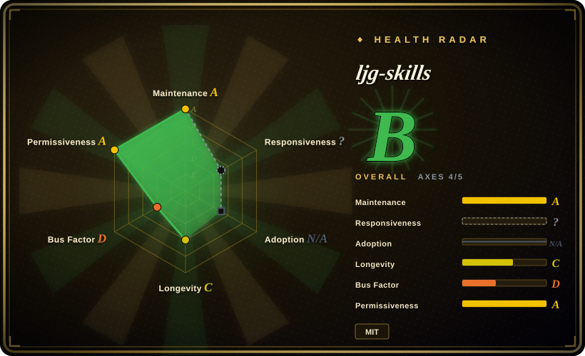
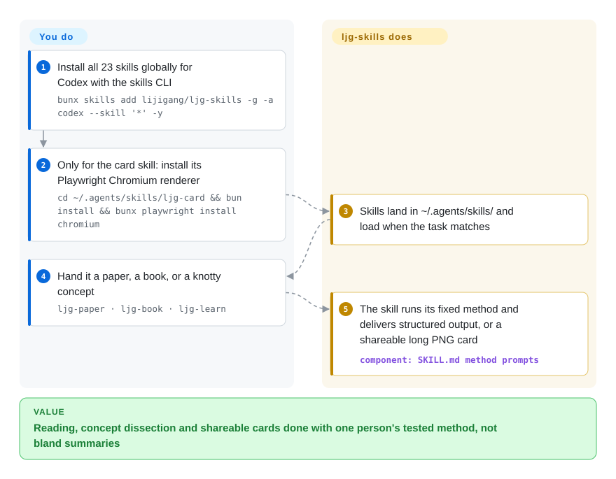

# ljg-skills

You ask your agent to actually read a paper or dissect a concept and it re-flattens a bland summary — nothing structured, nothing you'd share. Li Jigang's 23-skill pack loads his personal knowledge method when the task matches and delivers in fixed shapes: an eight-lens concept anatomy, a four-part Q&A chain, a plain-language rewrite, or a shareable PNG card.

## When to use

You're a Chinese-speaking knowledge worker, researcher, or content creator who reads academic papers, books, and long-form articles, and you keep wanting your coding agent to do *intellectual* work rather than write code: distill a dense paper for a non-specialist, deconstruct a book around its central problem, rewrite a tangled concept so a 12-year-old gets it, or turn your notes into a shareable infographic card. Out of the box your agent has no opinionated method for any of this — it summarizes blandly and the output isn't reusable. You want a battle-tested set of structured knowledge prompts that one person has refined for exactly these tasks.

You run `bunx skills add lijigang/ljg-skills -g -a codex --skill '*' -y` — the README is now "我的 Codex 自定义技能集" and targets Codex, dropping everything into `~/.agents/skills/`; append `#md` for the Markdown branch if you live in Obsidian/VSCode/Notion rather than Emacs/Denote org-mode, or name single skills with repeated `--skill ljg-card --skill ljg-learn` — and your agent gains 23 on-demand skills it fires when the task matches: `ljg-paper` (extract paper insights for a general audience), `ljg-book` (problem-centered book deconstruction), `ljg-learn` (cut a concept along eight dimensions into one compressed insight), `ljg-plain` (rewrite for a smart 12-year-old), `ljg-read` (companion reading with three-layer translation and cross-disciplinary asides), `ljg-card` (cast text into four PNG formats: long image, source-faithful card, comic, whiteboard), `ljg-qa` (turn an article into a Q-A chain with four-part answers), `ljg-map` / `ljg-structure` / `ljg-think` (knowledge maps, motif stress-testing, drilling a view down to its indivisible root), plus writing, word analysis, relationship diagnostics, a structured roundtable debate, teach-by-experience, classic-text close reading, blind-spot scanning, presentation design, and `ljg-push` (sync your local skill edits back to GitHub). The inventory churns: since the 2026-06 check, `ljg-reads`, `ljg-library`, and `ljg-travel` are gone and `ljg-blind`, `ljg-teach`, `ljg-roundtable`, `ljg-constraint` and others are in — list the repo with `bunx skills add lijigang/ljg-skills -l` before assuming.

## How it works

The pack is 23 prompt-level skills encoding one person's knowledge-work method, kept as org-mode files on `master` with a parallel `md` branch for Markdown ecosystems. Installation goes through the third-party `skills` CLI (vercel-labs/skills) — the README's commands pin it to Codex, landing everything in `~/.agents/skills/`; the agent then loads a skill only when the task matches. The methods are opinionated shapes, not generic prompts: `ljg-learn` cuts a concept along eight axes (history, dialectics, phenomenon, language, form, existence, aesthetics, meta-reflection) and compresses the result to one insight sentence; `ljg-qa` turns an article into a Q-A chain whose answers always run conclusion / formalization / steps / boundaries. The distinctive payoff is `ljg-card`, which casts text into PNGs (long image, source-faithful card, comic, whiteboard) by driving Playwright's Chromium — that's why the repo's bulk language is now TypeScript, and why the card skill costs one extra local install. What stays yours: every claim the skills distill — nothing verifies the output's accuracy.

<!-- flow-steps:begin (generated from flows/ljg-skills.json by tools/flow_card.py — do not edit) -->

Text version of the flow

1. **You**: Install all 23 skills globally for Codex with the skills CLI — `bunx skills add lijigang/ljg-skills -g -a codex --skill '*' -y`
2. **You**: Only for the card skill: install its Playwright Chromium renderer — `cd ~/.agents/skills/ljg-card && bun install && bunx playwright install chromium`
3. **ljg-skills**: Skills land in ~/.agents/skills/ and load when the task matches
4. **You**: Hand it a paper, a book, or a knotty concept — `ljg-paper · ljg-book · ljg-learn`
5. **ljg-skills**: The skill runs its fixed method and delivers structured output, or a shareable long PNG card — component: `SKILL.md method prompts`

**Value**: Reading, concept dissection and shareable cards done with one person's tested method, not bland summaries

<!-- flow-steps:end -->

## When NOT to use

- **You want code/engineering skills.** This pack is knowledge-work and content-creation, not SDLC. For TDD, review, refactoring or framework conventions, a code-oriented pack (see Comparison) fits better; these skills won't help you ship software.
- **You don't work primarily in Chinese.** Skills are authored in Chinese (with English technical terms) and tuned for Chinese knowledge-work idioms; on English-first tasks the framing and output style may not fit.
- **You already run a curated knowledge/writing skill stack you trust.** Layering another opinionated set of reading/analysis prompts on top invites conflicting methods and double-routing — pick one source of truth per concern.
- **Your harness has no skills loader.** It activates through the third-party `skills` CLI writing skill files into the agent's skills directory (`~/.agents/skills/` for global Codex installs); the same CLI can install for Claude Code and other agents, but on a bespoke loader there's nothing to fire them and the markdown won't auto-apply.
- **You want the visual cards without tooling debt.** `ljg-card` renders PNGs through Playwright's Chromium (`cd ~/.agents/skills/ljg-card && bun install && bunx playwright install chromium`) — a heavy local dependency for what is otherwise a prompt pack, and bun is the assumed runtime.
- **You need enforcement or determinism.** Output is a prompt-shaped analysis the agent *produces*; nothing validates the distillation's accuracy. It's a method, not a gate — verify the substance yourself. [推断]
- **You need version stability.** No tagged releases (the repo's tag list is empty) — you track the moving `master` (org-mode) / `md` (markdown) branches, and the skill inventory has already churned materially between checks (three June skills removed, several added).

## Comparison

| Alternative | In index | Our verdict | Tradeoff |
|---|---|---|---|
| [khazix-skills](khazix-skills.md) | ✅ | Choose khazix-skills when your recurring jobs are operational chores — safe disk cleanup, live AI-news lookup, doc/memory reconciliation — not reading and thinking methods. | Both are Chinese personal packs in the same leaf: khazix's six are task tools (incl. one third-party news API), ljg's 23 are cognitive-method prompts plus a PNG-card renderer. Pick by which layer of your work you want automated. |
| [pua](../engineering-workflows/pua.md) ✅ | indexed | Choose pua when you want another single-maintainer Chinese skill collection with a persistence persona. | Another single-maintainer Chinese skill collection; different focus and conventions. Same genre (one person's curated Chinese skills); compare on which author's method and domain match your work. |
| [qiushi-skill](../engineering-workflows/qiushi-skill.md) ✅ | indexed | Choose qiushi-skill when your recurring need is Chinese thinking method and reasoning discipline, not reading workflows and shareable outputs. | Single-maintainer Chinese skill set; qiushi automates how you reason, ljg automates what you produce from papers, books and concepts. |
| [antfu/skills](../engineering-workflows/antfu-skills.md) ✅ | indexed | Choose antfu/skills when Vue/Vite frontend engineering conventions matter more than knowledge work. | Maintainer's personal pack too, but for the Vue/Vite frontend *engineering* stack — opposite domain. Pick by whether you need code conventions or knowledge-work methods. |
| [Dimillian/Skills](../engineering-workflows/dimillian-skills.md) ✅ | indexed | Choose Dimillian/Skills when Swift/Apple development conventions are the real need. | Personal collection skewed toward Swift/Apple development. Same "one person's skills" genre, different (code) domain. |
| Anthropic's official skills / built-in slash commands | 未收录 | Choose official skills or built-in slash commands when you want the platform's own ecosystem. | The platform's own skill ecosystem; ljg-skills is a third-party curated bundle layered on top, so it can duplicate or conflict with native skills. |

## Health & viability

- **Responsiveness**: Cannot be scored — type_na.
- **Maintenance (2026-09)** — very active: last push 2026-09-25, commits near-daily; still zero tagged releases, so you track moving `master`/`md` branches. The inventory itself churns (skills added and removed between the June and September checks) — the pack is a moving target, not a frozen API.
- **Governance & bus factor** — single-maintainer personal repo (`User`-owned). One author's curated method; if Li Jigang stops, the pack stops. ~7.4k stars (2026-09-28) don't change that — it's a one-person bus factor, normal for a personal collection but plan for fork-and-own.
- **Age & Lindy** — created 2026-03-08, ~6.5 months old as of 2026-09: young, unproven by Lindy. It's active, but too new to have a track record across model/CLI churn — adopt for the method, not for longevity.
- **Risk flags** — license is now **MIT** (LICENSE file present; GitHub reports MIT — the June check found no detectable license, so this changed and earlier "rights unclear" notes no longer apply). The README's own positioning shifted from Claude Code to "我的 Codex 自定义技能集", which signals fast rework; content (skill inventory, dual branches) can shift pull-to-pull.

## Caveats (unverified)

- [未验证] Star count (7,406 per GitHub on 2026-09-28) is unreliable and date-sensitive; treat as indicative only, not a quality signal.
- [未验证] No tagged releases — the repo's git tag list came back empty on 2026-09-28; "maturity" is inferred from push activity, not a semver. Repo is not archived.
- [未验证] GitHub reports the primary language as TypeScript (454k bytes vs HTML 55k, Shell 34k, JS 6k on 2026-09-28), reflecting the card/presentation rendering tooling rather than a runnable app; the skills themselves are org-mode/markdown prompt files per the README's 输出格式 table.
- [未验证] The 23-skill inventory (cross-checked between the README table and the `skills/` directory listing on 2026-09-28) and the dual `master` (org-mode) / `md` (markdown) branch structure can shift between pulls; re-list with `bunx skills add lijigang/ljg-skills -l` rather than trusting this snapshot.
- [未验证] Install behavior — `bunx skills add … -a codex`, `-g` landing path `~/.agents/skills/`, `#md` branch selection — are properties of the third-party vercel-labs/skills CLI, not of this repo; the README documents Codex targets only, and activation fidelity on Claude Code or other harnesses is not independently confirmed here.
- [推断] Because behavior lives in prompt/markdown skills the agent loads, output is advisory — the agent can deviate and the analysis can be wrong; these are method prompts, not hard guarantees of accuracy.
- [推断] Skills encode one maintainer's personal knowledge-work method (e.g. the "eight dimensions" or problem-centered framings); useful if you share that approach, friction if you don't, and not an independently verified standard.
