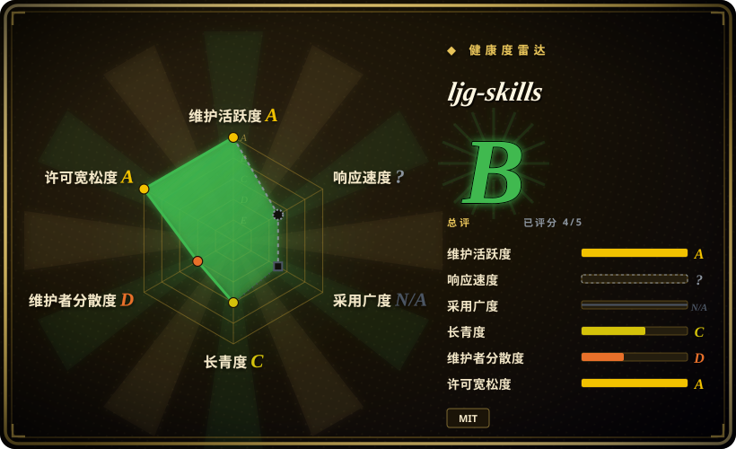
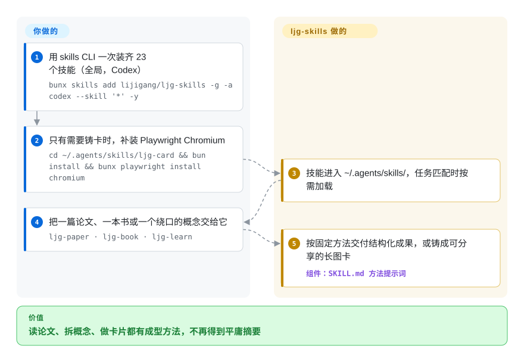

# ljg-skills

你让 agent 认真读一篇论文、把一个概念拆透，它只会平铺直叙再来一份平庸摘要——产物既不结构化，也没有可分享的东西。ljg-skills 把李继刚个人的 23 个知识工作技能按任务加载，用固定形态交付：概念的八维解剖、Q-A 链的四段答案、大白话改写，甚至铸成可分享的 PNG 长图卡片。

## 何时使用

你是中文母语的知识工作者、研究者或内容创作者，平时读论文、读书、读长文，越来越想让 coding agent 干「脑力活」而不是写代码：把一篇密集的论文讲给外行听、围绕核心问题拆解一本书、把一个绕口的概念改写到 12 岁也能懂、或者把笔记做成一张可分享的信息卡片。开箱即用的 agent 对这些都没有成型方法——总结得很平庸，产物也不可复用。你想要一套别人已经为这些任务打磨过的、结构化的知识类提示词。

你执行 `bunx skills add lijigang/ljg-skills -g -a codex --skill '*' -y`——README 现在自称「我的 Codex 自定义技能集」，面向 Codex，全部落进 `~/.agents/skills/`；如果你用 Obsidian/VSCode/Notion 而非 Emacs/Denote 的 org-mode，在仓库名后加 `#md` 切到 Markdown 分支；也可以用重复的 `--skill ljg-card --skill ljg-learn` 只装指定的几个。装完 agent 就获得 23 个任务匹配时按需触发的技能：`ljg-paper`（把论文要点讲给无行业背景的读者）、`ljg-book`（以问题为中心拆书）、`ljg-learn`（从八个方向切一个概念，压成一句顿悟）、`ljg-plain`（改写到聪明的 12 岁小孩能懂）、`ljg-read`（伴读，三层信达雅翻译加跨学科旁逸）、`ljg-card`（把文本铸成四种 PNG：长图、原文保真卡、漫画、白板）、`ljg-qa`（把文章抽成 Q-A 链，答案固定四段：结论/形式化/步骤/边界）、`ljg-map` / `ljg-structure` / `ljg-think`（知识地图、母题风洞、把观点纵向钻到不可再分的根），外加写作、字词分析、关系诊断、圆桌辩论、体验式教学、古文精读、盲区扫描、演示设计，以及把本地改动同步回 GitHub 的 `ljg-push`。注意清单在流动：与 2026-06 核查相比，`ljg-reads`、`ljg-library`、`ljg-travel` 已不在，`ljg-blind`、`ljg-teach`、`ljg-roundtable`、`ljg-constraint` 等新进——用 `bunx skills add lijigang/ljg-skills -l` 现查，别信快照。

## 怎么用起来

这个包是 23 个 prompt 层技能，承载李继刚个人的知识工作方法：`skills/` 目录以 org-mode 文件保存在 `master` 分支，`md` 分支提供等价的 Markdown 版本。安装走第三方 `skills` CLI（vercel-labs/skills）——README 的命令钉在 Codex，全局落进 `~/.agents/skills/`——之后 agent 只在任务匹配时加载对应技能。这些方法是主张明确的形态，不是通用 prompt：`ljg-learn` 从八个方向（历史、辩证、现象、语言、形式、存在、美感、元反思）切一个概念，最后压成一句顿悟；`ljg-qa` 把文章抽成 Q-A 链，每个答案固定四段（结论/形式化/步骤/边界）。最有辨识度的产出是 `ljg-card`：驱动 Playwright 的 Chromium 把文本铸成 PNG（长图、保真卡、漫画、白板）——这就是仓库主体语言如今是 TypeScript 的原因，也是铸卡要多跑一步本地安装的原因。仍然归你的：技能产出的每一条论断——没有任何机制校验提炼是否准确，内容请自己核验。

<!-- flow-steps:begin (generated from flows/ljg-skills.json by tools/flow_card.py — do not edit) -->

流程文字版

1. **你**：用 skills CLI 一次装齐 23 个技能（全局，Codex） — `bunx skills add lijigang/ljg-skills -g -a codex --skill '*' -y`
2. **你**：只有需要铸卡时，补装 Playwright Chromium — `cd ~/.agents/skills/ljg-card && bun install && bunx playwright install chromium`
3. **ljg-skills**：技能进入 ~/.agents/skills/，任务匹配时按需加载
4. **你**：把一篇论文、一本书或一个绕口的概念交给它 — `ljg-paper · ljg-book · ljg-learn`
5. **ljg-skills**：按固定方法交付结构化成果，或铸成可分享的长图卡 — 组件：`SKILL.md 方法提示词`

**价值**：读论文、拆概念、做卡片都有成型方法，不再得到平庸摘要

<!-- flow-steps:end -->

## 何时不用

- **你要的是代码/工程技能。** 这个包是知识工作和内容创作，不是研发流程。TDD、review、重构、框架约定请用面向代码的技能包（见横向对比），这些技能帮不了你交付软件。
- **你不主要用中文工作。** 技能用中文撰写（夹英文术语），按中文知识工作的语感调过；在英文优先的任务上，框架和输出风格可能不贴合。
- **你已经有一套信任的知识/写作技能栈。** 在上面再叠一套有主张的阅读/分析提示词，会带来方法冲突和双重路由——每类关切只留一个事实源。
- **你的 harness 没有技能加载器。** 它靠第三方 `skills` CLI 把技能文件写进 agent 的技能目录来激活（Codex 全局装到 `~/.agents/skills/`）；同一个 CLI 也能装给 Claude Code 等其他 agent，但在自研或不支持的加载器上没有东西触发，markdown 不会自动生效。
- **你想要视觉卡片但不想背工具债。** `ljg-card` 靠 Playwright 的 Chromium 渲染 PNG（`cd ~/.agents/skills/ljg-card && bun install && bunx playwright install chromium`）——对一个 prompt 包来说这是很重的本地依赖，且默认用 bun 作运行时。
- **你需要强制或确定性。** 产物是 agent *生成*的提示词式分析，没有任何东西校验提炼是否准确。这是方法，不是闸门——内容请自己核验。[推断]
- **你需要版本稳定。** 截至本次核查仓库 tag 列表为空——你跟的是移动的 `master`（org-mode）/`md`（markdown）双分支，而且技能清单在两次核查之间已实质换血（6 月的三个技能没了、多个新增）。

## 横向对比

| 替代品 | 是否收录 | 我们的评价 | 取舍 |
|---|---|---|---|
| [khazix-skills](khazix-skills.zh.md) | ✅ | 你的高频任务是运维杂务——安全清盘、拉实时 AI 资讯、对齐文档与记忆——而非读书和思考方法时，选 khazix-skills。 | 同目录下的两份中文个人包：卡兹克的六个是任务工具（含一个第三方资讯 API），ljg 的 23 个是认知方法 prompt 加 PNG 铸卡器。按你想自动化的是工作的哪一层来选。 |
| [pua](../engineering-workflows/pua.zh.md) ✅ | 已收录 | 需要另一个带“坚持”人设的单人中文技能合集时，选 pua。 | 另一个单人维护的中文技能合集；侧重点和约定不同。同一类型（一个人精选的中文技能），按作者方法和领域是否对你胃口来选。 |
| [qiushi-skill](../engineering-workflows/qiushi-skill.zh.md) ✅ | 已收录 | 你的高频需求是中文思维方法与推理纪律，而非论文、书籍的处理产出时，选 qiushi-skill。 | 单人维护的中文技能集；qiushi 自动化「怎么想」，ljg 自动化从论文、书籍、概念里产出什么。 |
| [antfu/skills](../engineering-workflows/antfu-skills.zh.md) ✅ | 已收录 | Vue/Vite 前端工程约定比知识工作方法更重要时，选 antfu/skills。 | 同样是维护者个人包，但面向 Vue/Vite 前端*工程*栈——领域相反。按你需要代码约定还是知识工作方法来选。 |
| [Dimillian/Skills](../engineering-workflows/dimillian-skills.zh.md) ✅ | 已收录 | 真实需求是 Swift/Apple 开发约定时，选 Dimillian/Skills。 | 偏 Swift/Apple 开发的个人合集。同为「一个人的技能」类型，领域（代码）不同。 |
| Anthropic 官方技能 / 内置 slash 命令 | 未收录 | 需要平台自己的技能生态时，选官方技能或内置 slash 命令。 | 平台自带的技能生态；ljg-skills 是叠在上面的第三方精选包，可能与原生技能重复或冲突。 |

## 健康度与可持续性

- **响应速度**：无法计算——type_na。
- **维护（2026-09）** —— 非常活跃：最后 push 2026-09-25；仍无打 tag 的 release，你跟的是移动的 `master`/`md` 双分支。清单本身在流动（6 月到 9 月之间技能有增有删）——这是个移动靶，不是冻结的 API。
- **治理与 bus factor** —— 单维护者的个人仓库（`User` 所有）。是一个人精选的方法；李继刚一旦停更，包就停。约 7.4k star（2026-09-28）也改变不了这点——这是一人 bus factor，对个人合集来说正常，但要按「fork 自管」来规划。
- **年龄与 Lindy** —— 创建于 2026-03-08，截至 2026-09 约 6 个半月：年轻，Lindy 上未经验证。它确实活跃，但太新，跨越模型/CLI 更迭还没有 track record——为方法而采用，不为长寿。
- **风险旗标** —— 许可证现在是 **MIT**（LICENSE 文件在，GitHub 报 MIT；6 月核查时尚无可识别许可证，此前「权利不清」的提示已作废）。README 的自我定位从 Claude Code 改成了「我的 Codex 自定义技能集」，说明返工很快；内容（技能清单、双分支结构）可能在每次拉取间变化。

## 存疑（未验证）

- [未验证] Star 数（2026-09-28 GitHub 显示 7,406）不可靠且随时间变化；仅作参考，不当质量信号。
- [未验证] 没有打 tag 的 release——2026-09-28 核查时仓库 tag 列表为空；「maturity」由 push 活跃度推断，并非语义化版本。仓库未归档。
- [未验证] GitHub 在 2026-09-28 把主语言报为 TypeScript（454k 字节，对比 HTML 55k、Shell 34k、JS 6k），反映的是卡片/演示渲染工具链而非可运行应用；技能本体按 README 输出格式表是 org-mode/markdown 提示词文件。
- [未验证] 23 个技能的清单（2026-09-28 由 README 表格与 `skills/` 目录列表交叉核对得出）以及 `master`（org-mode）/`md`（markdown）双分支结构可能在每次拉取间变化；请用 `bunx skills add lijigang/ljg-skills -l` 现查，不要依赖此快照。
- [未验证] 安装行为——`bunx skills add … -a codex`、`-g` 落点 `~/.agents/skills/`、`#md` 分支选择——是第三方 vercel-labs/skills CLI 的属性而非本仓库的属性；README 只给了面向 Codex 的用法，Claude Code 等其他 harness 上的激活保真度此处未独立确认。
- [推断] 因为行为存在于 agent 加载的提示词/markdown 技能中，产物是建议性的——agent 可能偏离、分析也可能出错；这些是方法提示词，不对准确性做硬保证。
- [推断] 技能编码了维护者个人的知识工作方法（如「八个维度」或以问题为中心的框架）；认同该方法则有用，不认同则成摩擦，且并非独立验证的标准。
