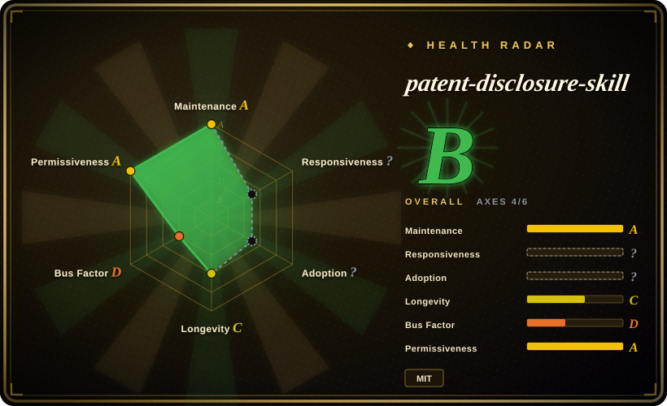

# patent-disclosure-skill

A Chinese-first Agent Skill pack (eight sub-skills) that turns a coding agent into a China-practitioner assistant: mine patent points and draft invention/utility-model/design disclosures (交底书), rewrite a disclosure into application documents (claims/spec/abstract/figures), search CNIPA published records, explain patents into an Obsidian vault, render a local patent map, brief CNIPA policy changes, and assist office-action replies.

## When to use

You're a Chinese R&D engineer, inventor, or in-house IP coordinator. You built something real, but "专利点怎么挖、查新怎么写、交底书怎么一次交出去" is the part you keep stalling on; separately, you keep downloading published patents as PDFs and bouncing off the claim language. You already work with a coding agent (Claude Code or Cursor), so instead of pasting ad-hoc prompts you install this pack and let it route intent: it scans your project materials for patentable points, drafts a disclosure with mermaid block diagrams exported to an editable `.docx`, generates utility-model/design line art from product images or STEP models, runs a lightweight CNIPA prior-art lookup through a real browser, then — only when you explicitly ask — turns the disclosure into claims/spec/abstract/figures or runs a docket-style "disclosure → application in one pass". The same vault backs the reader/map sub-skills, so explained patents accumulate into a personal, linkable patent knowledge base. You pick it over a generic LLM chat because a bare model will not produce OMML Word math, part-numbered line drawings, or a CNIPA-shaped search report; you pick it over commercial patent SaaS (PatSnap/incoPat) when you want artifacts you own as editable Markdown/Word inside your own repo rather than a subscription workspace.

## When NOT to use

- **You need a filing that a licensed 专利代理师 signs off on, or actual legal advice.** Use this as a drafting accelerator and route the output to a qualified agent/attorney, because every automated gate here checks *structure and support* (claims audit, support check), not patentability, novelty, or claim validity.
- **Your patents are not Chinese (USPTO/EPO/JPO/KIPO).** Reach for jurisdiction-specific patent-data clients or that country's professional counsel instead, because this pack's search path is wired to the CNIPA 公布公告站 and its drafting templates assume CNIPA conventions.
- **You need prior-art clearance or freedom-to-operate certainty.** Commission a professional prior-art/FTO search or use a commercial patent database, because this pack's lookup is a one-term-per-page browser helper, not a recall-complete search; its own docs warn that results must not be represented as a full clearance.
- **You need bulk patent analytics or programmatic patent data.** Use a patent-data API/client or an analytics platform instead of this pack, because its search stores Markdown reports for a human to read — it is not a data warehouse, and it deliberately does not crawl every result page by default.
- **Your environment cannot run Python, a browser, or Obsidian.** If you can't `pip install` and don't have Chrome/Edge for Playwright, or won't run an Obsidian vault, use a plain prompt/Markdown workflow instead, because the Word export, line art, CNIPA lookup, and the reader/map vault all depend on that local toolchain and degrade or fail without it.
- **You want a general Chinese writing or knowledge-work skill, not patent work.** Use [writing-agent](../../ai-writing/content-production/writing-agent.md) for article production, or [ljg-skills](ljg-skills.md) for paper/book reading and plain-language rewriting, because this pack's prompts are patent-domain-specific and its default language and legal structure will get in the way of general content work.
- **You want a point-and-click dedicated app, not in-harness skills.** Use a standalone patent-drafting application instead, because this is a file tree of `SKILL.md` prompts plus local scripts that only function inside a skill-capable coding agent.

## Comparison

| Alternative | In index | Our verdict | Tradeoff |
|---|---|---|---|
| [Scientific Agent Skills](../../engineering/scientific-agent-skills.md) | ✅ | Pick Scientific Agent Skills when the domain is biology/chemistry/medicine and each skill wraps a real scientific library; pick patent-disclosure-skill when the domain is Chinese patent prosecution and the value is CNIPA lookup plus CNIPA-shaped document templates. | Scientific Agent Skills is a large, curated library of ~147 narrow skills; patent-disclosure-skill is eight larger workflow skills with a heavier local toolchain (Word/OMML, browser, Obsidian). |
| [writing-agent](../../ai-writing/content-production/writing-agent.md) | ✅ | Pick writing-agent when the deliverable is a publishable Chinese article with a de-AI pass and fact-check gate; pick patent-disclosure-skill when the deliverable is a 交底书 or 申请文件 that must satisfy patent-document structure and prior-art search. | writing-agent optimizes prose and reader testing; patent-disclosure-skill optimizes document structure, figures, and search, and writes in a deliberately formulaic legal register. |
| [ljg-skills](ljg-skills.md) | ✅ | Pick ljg-skills to read and explain papers/books in plain Chinese; pick patent-disclosure-skill when you specifically need patent claims and CNIPA records read into an Obsidian patent vault with a map. | ljg-skills is a lightweight, general reading/rewriting pack; patent-disclosure-skill adds patent parsing, citation/term graphing, and a local service — at the cost of a much larger install and an Obsidian dependency. |
| Commercial patent SaaS (智慧芽 PatSnap, incoPat, 专利之星) | 未收录 | Pick commercial SaaS for recall-complete search, legal-status data, and a maintained database; pick patent-disclosure-skill when the drafting/reading work must stay local, be scriptable, and output files you version in Git. | SaaS wins on data coverage, freshness, and legal status; this pack wins on locality, cost, and editable artifacts, but its search is shallow and its data is whatever the public site shows. |
| Generic LLM chat / hand-written prompt | 未收录 | Pick a chat model or your own prompt for a one-off draft; pick patent-disclosure-skill once the work becomes a repeatable pipeline needing figures, Word math, CNIPA lookup, and iteration snapshots. | A chat prompt is zero-install and flexible; this pack is a heavier, opinionated pipeline that trades flexibility for repeatability and artifact fidelity. |

## Health & viability

- **Maintenance:** Active. Last push 2026-09-19, the day this page was written; 51 commits since the repo was created 2026-04-07 (about 5.4 months). Commit history through September is steady feature/fix work (disclosure flow, CNIPA crawl throttling, fast-fail search). There are **no git tags and no GitHub releases**, so the version string `4.11.0` exists only inside `SKILL.md`. [未验证] Whether any upgrade/rollback contract backs that version number.
- **Governance / bus factor:** Single-maintainer. `handsomestWei` authored 47 of 51 commits (~92%); four other accounts have one commit each. The owner is an individual user account (`owner.type: User`), not a foundation or vendor, and no governance/CODEOWNERS file was found. Bus factor is effectively 1.
- **Backing & longevity:** No institutional backing. At ~5.4 months old this is a young project with **no Lindy track record** — it is actively maintained now, but age does not yet buffer it. [推断] Its durability tracks one person's continued interest plus the stability of the CNIPA site it scrapes.
- **Adoption & ecosystem:** 9.8k stars, 1.0k forks, 29 watchers, 10 open issues, 3 open PRs (as of 2026-09-19). Distribution is clone-into-`skills/` or an `agentskills.io` listing, not a package registry, so there is no download or dependent-repo signal; the radar leaves that axis unscored. The README's star-history chart suggests recent, steep growth. [推断] Stars of this shape on a five-month-old, single-author repo read as narrative-driven ("专利 + AI") rather than production-validated.
- **Risk flags:** License is clean — MIT, copyright 2026 handsomestWei, no relicense history found. The operational risks are the real ones: browser automation against a government site can break on WAF/HTML changes; the optional office-action case library sends embeddings to a third-party API (Zhipu/DashScope/MiniMax/OpenAI presets) and requires an API key; the reader/map sub-skills only pay off inside Obsidian; and because the whole point is tracking CNIPA examination practice, the pack can go stale for *procedural* reasons that no test suite catches. The utility-model/design line-art step is on by default (skippable only via an env flag), and the CadQuery/STEP multi-view path is an optional extra with its own isolated-venv install weight.

## Caveats (unverified)

- [未验证] Every capability statement on this page comes from reading `README.md`, `SKILL.md`, `INSTALL.md`, `requirements.txt`, the per-skill `skills/*/` trees, and `gh api` metadata. I did not execute any skill end to end.
- [未验证] Star/fork/issue counts are a point-in-time snapshot (2026-09-19); the steep star curve is treated as a growth narrative, not as evidence of production adoption.
- [未验证] Robustness of the CNIPA (`epub.cnipa.gov.cn`) crawl against site changes, rate limits, or WAF behavior is untested; the same applies to the "adaptive throttling" and "fast-fail" claims from the commit log.
- [未验证] The office-action case library's embedding presets (智谱 `embedding-3`, DashScope, MiniMax, local, OpenAI), their cost, and retrieval quality were not tested, and the project marks this sub-skill as default-off.
- [未验证] Output legal quality is not evaluated by any automated gate in the repo — the ship gates (`audit_claims.py`, `check_support.py`) check claim structure and support, not patentability. Treat generated 交底书/申请文件 as drafts requiring a licensed professional.
- [未验证] Cross-platform parity (Windows/macOS/Linux), the Windows UTF-8/machine-prefix handling described in `INSTALL.md`, and the optional CadQuery/STEP path (isolated venv, Python 3.10–3.12) were not exercised.
- [推断] With no releases or tags, "version 4.11.0" is a self-declared marker in `SKILL.md`; a consumer cannot pin or roll back a known-good state without recording the commit SHA manually.
- [推断] For a project whose subject matter is regulatory procedure, the main long-term risk is content drift (CNIPA rules and examination practice change) rather than code rot, and a single maintainer may not track it indefinitely.
