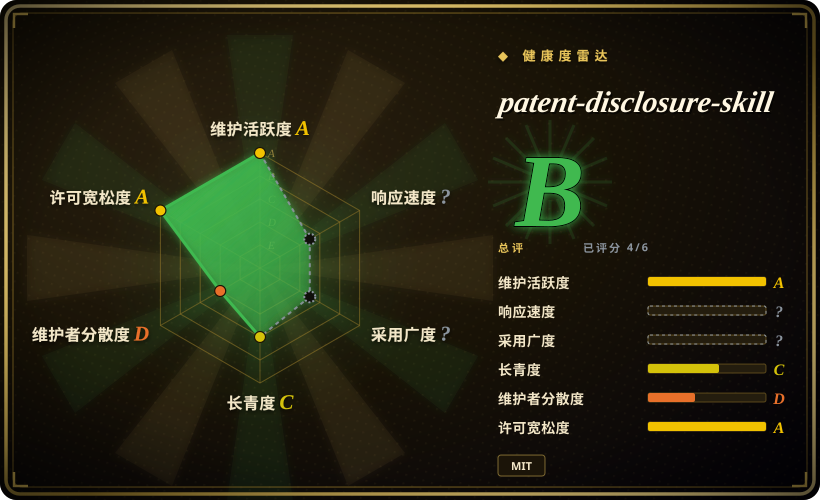

# patent-disclosure-skill

一套中文优先的 Agent Skill 包（八个子技能），把 coding agent 变成中国专利实务助手：挖掘专利点并撰写发明／实用新型／外观交底书，把交底改写成申请文件（权要／说明书／摘要／附图），检索国知局公布公告，把专利通俗解读进 Obsidian 库，渲染本机专利地图，出政策简报，并辅助审查答复。

## 何时使用

你是中国的研发工程师、发明人，或公司里的知识产权接口人。东西是真做出来了，可「专利点怎么挖、查新怎么写、交底书怎么一次交出去」一直卡着；另一边，你不断下载公开专利 PDF，却被权利要求绕得读不下去。你本来就在用 coding agent（Claude Code 或 Cursor），所以与其每次临时拼 prompt，不如装上这套技能让它按意图路由：扫你的项目材料梳出可申请的点，出一份带 mermaid 框图、可导出成可编辑 `.docx` 的交底书，从产品图或 STEP 模型生成实用新型／外观线稿，再用真实浏览器跑一次轻量国知局查新；之后只有你明确点名时，才把交底改写成权要／说明书／摘要／附图，或走「交底到申请一趟做完」的案卷流程。同一个库还支撑解读与专利地图子技能，于是陆续解读的专利会沉淀成一份可双链、可生长的私人专利知识库。你选它而不是通用 LLM 对话，因为裸模型做不出 OMML 进 Word 的公式、带件号引出的线稿，也拼不出国知局口径的检索报告；你选它而不是商业专利 SaaS（智慧芽／incoPat），是因为产出物是留在你自己仓库里、可编辑、可进版本管理的 Markdown／Word，而不是别人的订阅工作台。

## 何时不用

- **你需要一份由持证专利代理师把关的申请，或真正的法律意见。** 把它当起草加速器，产出交给有资质的代理师／律师，因为这里所有自动门禁（权利要求审计、支持检查）只查**结构与支持**，不查可专利性、新颖性和权要有效性。
- **你的专利不在中国（USPTO／EPO／JPO／KIPO）。** 改用相应法域的专利数据客户端或当地专业代理，因为本包的检索链路接的是国知局公布公告站，起草模板按国知局惯例设计。
- **你需要查新结论或自由实施（FTO）的确定性。** 委托专业查新／FTO 检索，或用商业专利数据库，因为本包只是一词一页的浏览器辅助查新，不是召回完备的检索；它自己的文档也警告结果不得冒充完整查新。
- **你需要批量专利分析或可编程的专利数据。** 改用专利数据 API／客户端或分析平台，因为本包的检索把结果落成给人读的 Markdown 报告，不是数据仓库，且默认刻意不翻完所有结果分页。
- **你的环境跑不了 Python、浏览器或 Obsidian。** 如果不能 `pip install`、没有 Chrome／Edge 给 Playwright 用，或不愿维护 Obsidian 库，就改用纯 prompt／Markdown 流程，因为 Word 导出、线稿、国知局查新以及解读／地图库都依赖这套本地工具链，缺了就退化甚至跑不通。
- **你只需要通用的中文写作或知识工作技能，而不是专利工作。** 写文章用 [writing-agent](../../writing/content-production/writing-agent.zh.md)，读论文／拆书和大白话改写用 [ljg-skills](ljg-skills.zh.md)，因为本包的 prompt 是专利领域专用的，它的默认语言和文件结构会妨碍通用内容工作。
- **你想要一个点开就用的专用 App，而不是装进 harness 的技能。** 改用独立的专利起草应用，因为这里是一棵 `SKILL.md` prompt 加本地脚本的文件树，只能在支持 skill 的 coding agent 里运转。

## 横向对比

| 替代品 | 是否收录 | 我们的评价 | 取舍 |
|---|---|---|---|
| [Scientific Agent Skills](../../engineering/scientific-agent-skills.zh.md) | ✅ | 领域是生物／化学／医药、且每个 skill 包着一个真实科研库时，选 Scientific Agent Skills；领域是中国专利实务、价值在国知局检索加国知局式文档模板时，选 patent-disclosure-skill。 | Scientific Agent Skills 是约 147 个窄技能的大型精选库；patent-disclosure-skill 是八个更粗的工作流技能，本地工具链更重（Word／OMML、浏览器、Obsidian）。 |
| [writing-agent](../../writing/content-production/writing-agent.zh.md) | ✅ | 交付物是可发布的中文文章、还要去 AI 味与事实核查时，选 writing-agent；交付物是必须满足专利文件结构并配查新的交底书或申请文件时，选 patent-disclosure-skill。 | writing-agent 优化文笔和读者测试；patent-disclosure-skill 优化文档结构、附图和检索，行文是刻意法条化的专利文体。 |
| [ljg-skills](ljg-skills.zh.md) | ✅ | 要把论文／书读成大白话中文时，选 ljg-skills；要专门把专利权利要求和国知局记录读进带地图的 Obsidian 专利库时，选 patent-disclosure-skill。 | ljg-skills 是轻量、通用的阅读／改写包；patent-disclosure-skill 多了专利解析、引证／术语图谱和一个本机服务，代价是安装体量大得多、且依赖 Obsidian。 |
| 商业专利 SaaS（智慧芽 PatSnap、incoPat、专利之星） | 未收录 | 需要召回完备的检索、法律状态数据和持续维护的数据库时，选商业 SaaS；需要起草／解读留在本地、可脚本化、产出可进 Git 版本管理的文件时，选 patent-disclosure-skill。 | SaaS 胜在数据覆盖、时效和法律状态；本包胜在本地化、成本与可编辑产出物，但检索浅，数据就是公开站点当下展示的那些。 |
| 通用 LLM 对话／手写 prompt | 未收录 | 一次性草稿用对话模型或你自己的 prompt；一旦这件事变成需要图纸、Word 公式、国知局检索和多版本迭代的可重复流水线，就换 patent-disclosure-skill。 | 对话 prompt 零安装、灵活；本包是更重、更有主张的流水线，用灵活性换可重复性和产出物保真度。 |

## 健康度与可持续性

- **维护活跃度**：活跃。最后推送 2026-09-19，即本页撰写当天；仓库创建于 2026-04-07（约 5.4 个月），累计 51 次提交。九月的提交是稳定的功能／修复（交底流程、国知局抓取节流、快速失败检索）。**没有 git tag，也没有 GitHub release**，所以版本号 `4.11.0` 只写在 `SKILL.md` 里。 [未验证] 这个版本号背后是否有任何升级／回滚契约。
- **治理集中度**：单人维护。`handsomestWei` 贡献 51 次提交中的 47 次（约 92%），另外四个账号各 1 次。所有者为个人账号（`owner.type: User`），非基金会或厂商，也未发现治理文件或 CODEOWNERS。Bus factor 实际为 1。
- **背书的可持续性**：无机构背书。约 5.4 个月的年龄意味着**没有 Lindy 记录**——当下维护活跃，但年龄还不足以提供缓冲。 [推断] 它的存续取决于作者是否持续投入，外加它所爬取的国知局站点是否稳定。
- **采用广度与生态**：9.8k stars、1.0k forks、29 watchers、10 个 open issue、3 个 open PR（截至 2026-09-19）。分发方式是 clone 进 `skills/` 或挂在 `agentskills.io`，没有包注册表，因此没有下载量或依赖仓库信号，雷达该轴留空。README 的 star 历史图显示近期增长陡峭。 [推断] 这种增长形态出现在一个五个月、单作者仓库上，更像「专利 + AI」叙事驱动，而非生产验证。
- **风险信号**：许可干净——MIT，版权 2026 handsomestWei，未发现改许可历史。真正的风险在运行层面：对政府站点的浏览器自动化可能因 WAF／HTML 变化而失效；可选的审查答复案例库会把 embedding 发给第三方 API（智谱／DashScope／MiniMax／OpenAI 预设）并需要 API key；解读／地图子技能只有在 Obsidian 里才发挥价值；而且因为它本质上是在跟踪国知局审查实践，可能因**程序性**变化而过时，这是任何测试套件都抓不到的。实用新型／外观线稿步骤默认开启（只有靠环境变量才能跳过），CadQuery／STEP 多视角路径则是可选加装，带自己的隔离 venv 安装负担。

## 存疑（未验证）

- [未验证] 本页所有能力陈述均来自阅读 `README.md`、`SKILL.md`、`INSTALL.md`、`requirements.txt`、各子技能 `skills/*/` 目录树以及 `gh api` 元数据；我没有端到端跑过任何技能。
- [未验证] star／fork／issue 数是 2026-09-19 的时点快照；陡峭的 star 曲线被当成增长叙事，而非生产采用证据。
- [未验证] 国知局（`epub.cnipa.gov.cn`）抓取面对站点变更、限流或 WAF 行为时的健壮性未测；提交日志里「自适应节流」「快速失败」的说法同样未验证。
- [未验证] 审查答复案例库的 embedding 预设（智谱 `embedding-3`、DashScope、MiniMax、本地、OpenAI）及其成本与检索质量未测，且项目把它标为默认关闭。
- [未验证] 产出的法律质量没有任何仓库内自动门禁评估——出厂门禁（`audit_claims.py`、`check_support.py`）查的是权要结构与支持，不是可专利性。生成的交底书／申请文件应视为需要持证代理师复核的草稿。
- [未验证] 跨平台一致性（Windows／macOS／Linux）、`INSTALL.md` 描述的 Windows UTF-8 与机读前缀处理、以及可选的 CadQuery／STEP 路径（隔离 venv、Python 3.10–3.12）均未实操。
- [推断] 没有 release 或 tag 的情况下，「版本 4.11.0」只是 `SKILL.md` 里的自我标记；消费者若不手工记录 commit SHA，就无法固定或回滚到一个已知良好状态。
- [推断] 对一个主题是监管流程的项目，长期主要风险是内容漂移（国知局规则与审查实践会变）而不是代码腐化，而单个维护者未必能长期跟上。
