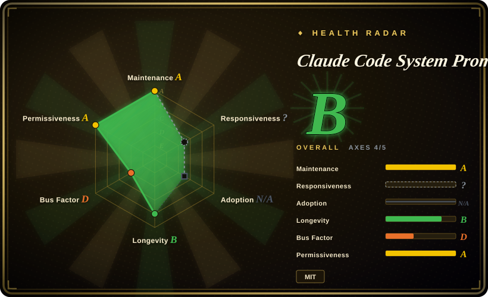
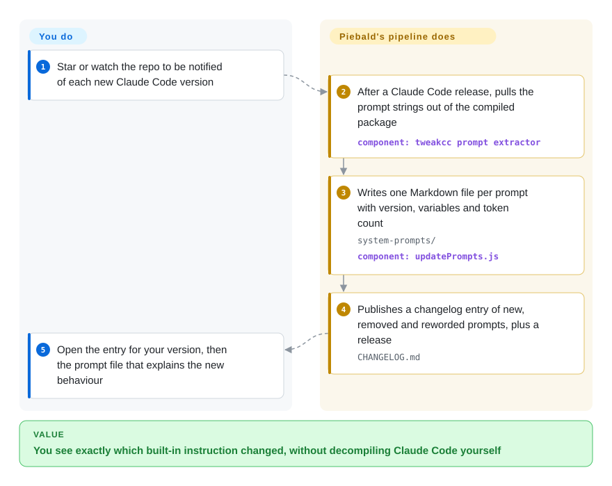

# Claude Code System Prompts

Claude Code starts behaving differently after an update — it refuses a push it used to make, or a subagent stops reading files the way it did — and you cannot see why, because its instructions are 800+ text strings buried inside a closed, compiled package. This repo pulls those strings out after every Claude Code release and publishes them as one readable Markdown file each, with a per-version changelog of what was added, removed, or reworded.

## When to use

You maintain a team's Claude Code setup — a `CLAUDE.md`, a few skills, some hooks, maybe a tweakcc patch — and after an auto-update your review subagent suddenly writes findings in a different format, or the agent starts asking "leave it, one change, or take over?" before pushing a PR. Anthropic's release notes say nothing about it, and the package on npm is a native binary you cannot read. You open this repo's `CHANGELOG.md`, jump to the version you just got, and find the line: `**NEW:** System Prompt: PR Steward handoff guidance — Requires checking a PR's PR Steward labels before pushing…`. Now you know which built-in instruction you are fighting, and you can word your own instructions around it instead of guessing.

Reach for it over the multi-vendor "leaked prompts" collections when your question is specifically **Claude Code, this version, and what changed since the last one**: those collections keep one hand-pasted snapshot per product, while this repo re-extracts the complete set on every release (249 GitHub releases between 2025-12-16 and 2026-09-28) and splits it into 820 named pieces — each built-in tool description, each subagent, each slash-command skill, each system reminder — with a token count per piece. The tradeoff is scope: it covers one product and nothing else.

## How it works

Nobody at Piebald writes these prompts; a script pulls them out of the product. Their sibling project tweakcc carries an extractor (`tools/promptExtractor.js`) that parses Claude Code's compiled JavaScript — the program text after a build tool has squashed it into one unreadable file — and collects the long string literals that look like prompts, using hand-kept include/exclude rules. This repo's own `tools/updatePrompts.js` then takes that list, writes one Markdown file per prompt with a small header (the Claude Code version it was last seen in and the template variables such as `${BASH_TOOL_NAME}` that get filled in at runtime), counts each file's tokens through Anthropic's token-counting API, rewrites the README index, and a changelog entry plus a GitHub release are published for the version. What you do is only the reading end: watch the repo, and open the changelog entry or prompt file you care about. Think of it as a building inspector's photo log of a sealed building — accurate about what is built in, but it cannot tell you which rooms a given visitor actually walked through.

<!-- flow-steps:begin (generated from flows/claude-code-system-prompts.json by tools/flow_card.py — do not edit) -->

Text version of the flow

1. **You**: Star or watch the repo to be notified of each new Claude Code version
2. **Claude Code System Prompts**: After a Claude Code release, pulls the prompt strings out of the compiled package — component: `tweakcc prompt extractor`
3. **Claude Code System Prompts**: Writes one Markdown file per prompt with version, variables and token count — `system-prompts/` — component: `updatePrompts.js`
4. **Claude Code System Prompts**: Publishes a changelog entry of new, removed and reworded prompts, plus a release — `CHANGELOG.md`
5. **You**: Open the entry for your version, then the prompt file that explains the new behaviour

**Value**: You see exactly which built-in instruction changed, without decompiling Claude Code yourself

<!-- flow-steps:end -->

## When NOT to use

- **You want to change what Claude Code says, not just read it.** Editing files here changes nothing — the repo's own `CLAUDE.md` says so. Use tweakcc (same maintainers), which patches the prompt pieces inside your local npm or native install and handles conflicts when Anthropic rewrites the same piece; or put your instructions in `CLAUDE.md` / skills, which Claude Code loads by design.
- **You need the exact prompt a particular run sent.** These files are every string Claude Code *can* send, not what one session assembled: conditional sections, interpolated tool lists and the entrypoint change the result. An open PR (#39, 2026-09-20) documents that the same version sent 26,131 characters with 35 tools interactively but 20,806 characters with 29 tools under `claude -p`, with a different identity line. For per-run truth, record the outgoing request yourself (a logging proxy) or look at OrcaPromptVault, which archives recorded requests.
- **You need prompts for other products (Cursor, Codex, Gemini CLI, ChatGPT…).** This repo is Claude Code only. Use a multi-vendor collection such as asgeirtj/system_prompts_leaks or x1xhlol/system-prompts-and-models-of-ai-tools, accepting that they are hand-maintained snapshots without per-release diffs.
- **You plan to copy these prompts into your own product or redistribute them.** The repo is MIT-licensed by Piebald LLC, but the prompt text is extracted from Claude Code, whose own `LICENSE.md` reads "© Anthropic PBC. All rights reserved. Use is subject to Anthropic's Commercial Terms of Service." Piebald's MIT grant cannot cover text it does not own [推断]. Use them as reference for understanding, and write your own harness prompts (or start from an openly licensed skill pack) for anything you ship.
- **You need a guaranteed-complete or bug-free extraction.** The extractor is heuristic: issue #35 (2026-08) found the ToolSearch description was published with its first half missing and a token count of 0, and issue #13 reports users not seeing all prompts. Treat a missing or oddly short file as an extraction gap, and confirm load-bearing wording against a live session.
- **You need the text on the same day, every time.** Updates depend on a small team running the pipeline; issues #10 and #20 record releases that lagged by hours to a day. If you gate automation on a new version, don't block on this repo's release event.

## Comparison

| Alternative | In index | Our verdict | Tradeoff |
|---|---|---|---|
| Piebald-AI/tweakcc | not indexed | If you want Claude Code to behave differently, pick tweakcc — it rewrites the same prompt pieces in your install; pick this repo when you only need to read and diff them without touching your binary. Not added in this tab-intake batch. | tweakcc gives you control but you own the patch, re-applying it after each update and resolving conflicts when Anthropic edits the same piece; this repo is zero-risk to your install but read-only. |
| asgeirtj/system_prompts_leaks | not indexed | For cross-product research (Claude apps, ChatGPT, Gemini, Codex side by side) pick system_prompts_leaks; pick this repo when the question is Claude Code at a specific version and what changed between two versions. Not added in this tab-intake batch. | Much broader (CC0, 68.6k stars as of 2026-09-29) but each product is a hand-collected snapshot of mixed provenance with no per-release changelog; this repo is narrow but extracted from the product itself on every release. |
| x1xhlol/system-prompts-and-models-of-ai-tools | not indexed | Pick it to survey how 30+ coding tools (Cursor, Devin, Windsurf, Kiro…) prompt their agents; for Claude Code specifics its `Anthropic/` folder is a thin, older snapshot, so use this repo. Not added in this tab-intake batch. | Widest tool coverage and 143.9k stars, but GPL-3.0 on the repo and last touched 2026-08-11; one text file per product versus 820 versioned pieces here. |
| Continuum-AI-Corp/OrcaPromptVault | not indexed | Pick it when you need what a real Claude Code run actually sent (assembled prompt plus tool schemas, per model and entrypoint); pick this repo for the complete catalogue and version-to-version diffs. Not added in this tab-intake batch. | Answers the per-run question this repo cannot, but it is two weeks old (created 2026-09-15, 29 stars) and AGPL-3.0, so treat it as experimental. |
| Anthropic system prompt release notes (docs.claude.com) | not a repo | Use the official page when you need Anthropic-published, citable prompts for the Claude apps; it does not cover Claude Code, so for Claude Code this repo is the only per-release source we found. | Official and safe to quote, but a docs page for claude.ai and the mobile apps (Claude Code appears only in site navigation, checked 2026-09-29), not a repository. |

## Health & viability

- **Maintenance (2026-09-29):** very active — 638 commits and 249 GitHub releases; the latest release (v2.1.284) landed on 2026-09-28, the same day that Claude Code version shipped. Cadence is dictated by Anthropic's release rhythm, often several per week.
- **Governance / bus factor:** owned by the Piebald-AI organization (Piebald LLC, which makes the Piebald agentic developer app the README advertises), but effectively one maintainer: mike1858 authored 560 of the 638 commits and bl-ue 74. The pipeline is also coupled to tweakcc, which consumes the same extracted prompt files, so both would stall together.
- **Backing & longevity:** created 2025-11-18, so about ten months old — too young for the Lindy prior to say much. Its lifetime is bounded by Claude Code's: if Anthropic stops shipping the prompts inside the distributed package (for example by fetching them server-side), extraction stops working [推断].
- **Adoption:** 12.8k stars, 2.0k forks and 131 watchers (2026-09-29); listed in Awesome Claude Code. The README asks users to star it for release notifications, which inflates stars relative to active readers.
- **Risk flags:** (1) Provenance — the content is Anthropic's proprietary prompt text redistributed by a third party without an Anthropic licence; Anthropic has not taken action as of 2026-09-29 (no DMCA or takedown trace in the repo's issues), but that can change. The maintainer declined to add Anthropic-internal leaked prompts because doing so "puts the project in jeopardy" (issue #15). (2) Staleness — every file is only accurate for the version in its header; a snapshot older than your installed Claude Code is already wrong. (3) Extraction fidelity — see issue #35. (4) Vendor motive — the README opens with an advert for Piebald's product; the repo doubles as marketing.

## Caveats (unverified)

- [推断] Piebald's MIT licence does not grant rights to the extracted prompt text itself, which remains Anthropic's; no court or Anthropic statement on this repo was found.
- [推断] Since the npm package now ships a native binary (`bin/claude.exe`, platform packages as optional dependencies, checked on 2.1.284), extraction presumably runs on the JavaScript embedded in that binary; the repo's `CLAUDE.md` still says "compiled JavaScript source", and we did not reproduce the extraction.
- [推断] Extraction would stop working if Anthropic moved prompt text out of the distributed package; no announcement of such a change was found.
- [未验证] The one-line descriptions in the README and the prose in `CHANGELOG.md` — whether they are hand-written or model-generated is not documented; we did not verify them against the prompt diffs.
- [未验证] Coverage: the README shows 820 listed prompt files, but whether that is every prompt in Claude Code cannot be checked without the product's source; issues #13 and #35 show gaps have existed.
- [未验证] Anthropic has not acted against the repo — based only on the absence of such reports in the repo's issues (searched 2026-09-29), not on any statement from Anthropic.
