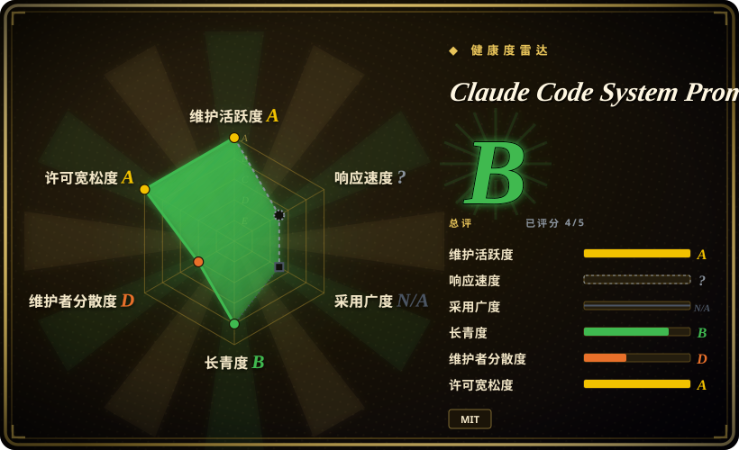
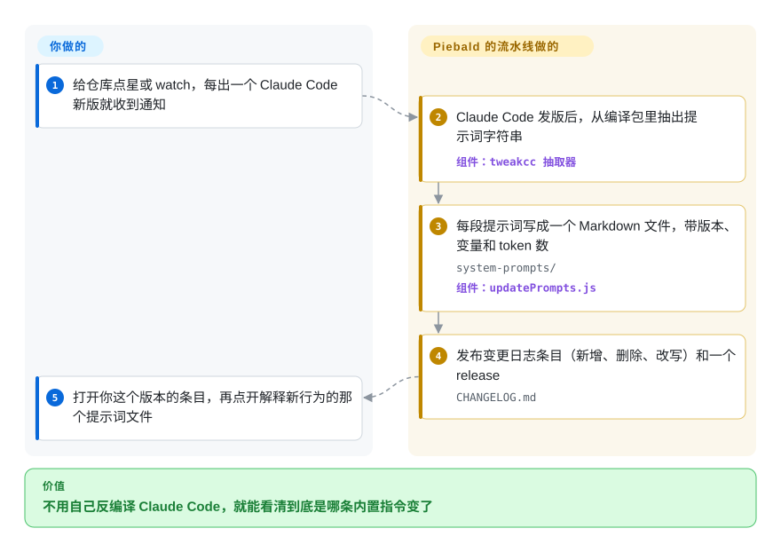

# Claude Code System Prompts

Claude Code 一升级，行为就变了——以前会直接推的 PR 现在先问你，子 agent 读文件的方式也不一样了——可你看不到原因，因为它的指令是封在闭源编译包里的 800 多段文字。这个仓库在 Claude Code 每次发版后把这些文字抽出来，一段一个可读的 Markdown 文件，并附上逐版本的变更日志：哪段新增、哪段删了、哪段改了措辞。

## 何时使用

你负责团队的 Claude Code 配置——一份 `CLAUDE.md`、几个 skill、一些 hook，可能还有一个 tweakcc 补丁。某次自动更新后，review 子 agent 突然换了输出格式，或者 agent 推 PR 前开始问你“不管它、改一处、还是接手？”。Anthropic 的发版说明对此只字未提，npm 上的包又是读不了的原生二进制。你打开这个仓库的 `CHANGELOG.md`，跳到刚装上的版本，找到这一行：`**NEW:** System Prompt: PR Steward handoff guidance — Requires checking a PR's PR Steward labels before pushing…`。现在你知道自己在和哪条内置指令较劲，可以绕着它写自己的指令，而不是瞎猜。

当你的问题明确是“Claude Code、这个版本、和上个版本比改了什么”时，选它而不是那些多厂商的“泄露提示词”合集：那些合集每个产品只存一份手工粘贴的快照，而这个仓库每次发版都完整重抽一遍（2025-12-16 到 2026-09-28 共 249 个 GitHub release），并拆成 820 个有名字的片段——每个内置工具的说明、每个子 agent、每个斜杠命令 skill、每条 system reminder——每段都标了 token 数。代价是范围：它只覆盖这一个产品。

## 怎么用起来

这些提示词不是 Piebald 的人写的，是脚本从产品里抽出来的。他们的姊妹项目 tweakcc 里有一个抽取器（`tools/promptExtractor.js`），它解析 Claude Code 编译后的 JavaScript——也就是被打包工具压成一整个难以阅读的文件的程序文本——按人工维护的收录/排除规则，把看起来像提示词的长字符串收集出来。本仓库自己的 `tools/updatePrompts.js` 再接过这份清单：每段提示词写成一个 Markdown 文件，文件头记录它最后出现的 Claude Code 版本，以及运行时才填入的模板变量（如 `${BASH_TOOL_NAME}`）；再调 Anthropic 的 token 计数接口给每个文件计数，重写 README 索引，然后发布该版本的变更日志条目和 GitHub release。你要做的只有读这一端：关注仓库，打开你关心的那条变更日志或那个提示词文件。可以把它想成一栋封闭大楼的验房照片册——楼里装了什么拍得很准，但说不出某位访客那天实际走过了哪几间屋。

<!-- flow-steps:begin (generated from flows/claude-code-system-prompts.json by tools/flow_card.py — do not edit) -->

流程文字版

1. **你**：给仓库点星或 watch，每出一个 Claude Code 新版就收到通知
2. **Claude Code System Prompts**：Claude Code 发版后，从编译包里抽出提示词字符串 — 组件：`tweakcc 抽取器`
3. **Claude Code System Prompts**：每段提示词写成一个 Markdown 文件，带版本、变量和 token 数 — `system-prompts/` — 组件：`updatePrompts.js`
4. **Claude Code System Prompts**：发布变更日志条目（新增、删除、改写）和一个 release — `CHANGELOG.md`
5. **你**：打开你这个版本的条目，再点开解释新行为的那个提示词文件

**价值**：不用自己反编译 Claude Code，就能看清到底是哪条内置指令变了

<!-- flow-steps:end -->

## 何时不用

- **你想改 Claude Code 说什么，而不只是看。** 改这里的文件什么都不会变——仓库自己的 `CLAUDE.md` 就这么写。用同一团队的 tweakcc，它会在你本地的 npm 或原生安装里替换提示词片段，并在 Anthropic 改了同一段时帮你处理冲突；或者把指令写进 `CLAUDE.md` / skill，那是 Claude Code 设计上就会加载的地方。
- **你要某一次运行实际发出去的那份提示词。** 这里是 Claude Code *可能*发出的全部字符串，不是某个会话拼出来的结果：条件段落、插值进去的工具列表、入口方式都会改变最终内容。一个未合并的 PR（#39，2026-09-20）记录了同一版本在交互模式下发出 26,131 个字符、35 个工具，而在 `claude -p` 下是 20,806 个字符、29 个工具，连身份那一行都不同。要单次运行的真实内容，自己用日志代理录下出站请求，或看存档实录请求的 OrcaPromptVault。
- **你要的是别的产品的提示词（Cursor、Codex、Gemini CLI、ChatGPT……）。** 本仓库只管 Claude Code。去用多厂商合集，比如 asgeirtj/system_prompts_leaks 或 x1xhlol/system-prompts-and-models-of-ai-tools，接受它们是手工维护的快照、没有逐版本 diff。
- **你打算把这些提示词抄进自己的产品或再分发。** 仓库本身是 Piebald LLC 的 MIT 许可，但提示词正文抽自 Claude Code，而 Claude Code 自己的 `LICENSE.md` 写的是“© Anthropic PBC. All rights reserved. Use is subject to Anthropic's Commercial Terms of Service.”。Piebald 的 MIT 授权覆盖不了它并不拥有的文字 [推断]。把它们当作理解用的参考；凡是要发布的东西，自己写 harness 提示词，或从许可清楚的开源 skill 包起步。
- **你需要保证完整、没有抽取错误。** 抽取器靠启发式规则：issue #35（2026-08）发现 ToolSearch 的工具说明发布时丢了前半段，token 数显示为 0；issue #13 也有用户反映看不到全部提示词。遇到缺文件或短得反常的文件，当作抽取缺口处理，关键措辞到真实会话里核对。
- **你需要每次都在发版当天拿到。** 更新靠一个小团队跑流水线；issue #10 和 #20 记录过晚了几小时到一天的情况。如果你的自动化以新版本为触发，别卡在这个仓库的 release 事件上。

## 横向对比

| 替代品 | 是否收录 | 我们的评价 | 取舍 |
|---|---|---|---|
| Piebald-AI/tweakcc | 未收录 | 想让 Claude Code 的行为变掉，选 tweakcc——它直接改你安装里同样的提示词片段；只想读和比较、不碰自己的二进制，选本仓库。本批标签页收录未加入。 | tweakcc 给你控制权，但补丁归你维护：每次更新都要重打，Anthropic 改了同一段还得解冲突；本仓库对你的安装零风险，但只能读。 |
| asgeirtj/system_prompts_leaks | 未收录 | 做跨产品研究（Claude 各应用、ChatGPT、Gemini、Codex 并排看）选 system_prompts_leaks；问题是“某个版本的 Claude Code、两个版本之间改了什么”时选本仓库。本批标签页收录未加入。 | 覆盖面宽得多（CC0，截至 2026-09-29 有 68.6k 星），但每个产品是来源混杂的手工快照，没有逐版本变更日志；本仓库范围窄，但每次发版都直接从产品里抽取。 |
| x1xhlol/system-prompts-and-models-of-ai-tools | 未收录 | 想横看 30 多个编码工具（Cursor、Devin、Windsurf、Kiro……）怎么给 agent 写提示词时选它；要 Claude Code 的细节，它的 `Anthropic/` 目录只是一份单薄且较旧的快照，还是用本仓库。本批标签页收录未加入。 | 工具覆盖最广、143.9k 星，但仓库是 GPL-3.0，最后更新于 2026-08-11；每个产品一个文本文件，对比这里 820 个带版本的片段。 |
| Continuum-AI-Corp/OrcaPromptVault | 未收录 | 需要一次真实 Claude Code 运行实际发出的内容（拼好的提示词加工具 schema，按模型和入口区分）时选它；要完整目录和版本间 diff，选本仓库。本批标签页收录未加入。 | 回答了本仓库答不了的“单次运行”问题，但它才两周大（2026-09-15 创建，29 星），且是 AGPL-3.0，当实验性项目看待。 |
| Anthropic 系统提示词发布说明（docs.claude.com） | 非仓库 | 需要 Anthropic 官方发布、可引用的 Claude 应用提示词时用官方页面；它不覆盖 Claude Code，所以就 Claude Code 而言，本仓库是我们找到的唯一逐版本来源。 | 官方、可放心引用，但它是 claude.ai 和移动端应用的文档页（Claude Code 只出现在站点导航里，2026-09-29 核对），不是仓库。 |

## 健康度与可持续性

- **维护（2026-09-29）：** 非常活跃——638 次提交、249 个 GitHub release；最新 release（v2.1.284）在 2026-09-28 发布，与该版 Claude Code 同日。节奏由 Anthropic 的发版节奏决定，常常一周好几次。
- **治理 / 巴士因子：** 归属 Piebald-AI 组织（Piebald LLC，也就是 README 里推广的 Piebald agent 开发应用的出品方），但实际上是单人维护：638 次提交里 mike1858 占 560 次，bl-ue 占 74 次。流水线还和 tweakcc 绑在一起，tweakcc 消费的是同一批抽取文件，两者会一起停摆。
- **背书与寿命：** 2025-11-18 创建，约十个月，太年轻，林迪先验说明不了什么。它的寿命上限是 Claude Code 的：如果 Anthropic 不再把提示词放进分发包（比如改为服务端下发），抽取就失效 [推断]。
- **采用度：** 12.8k 星、2.0k fork、131 人 watch（2026-09-29）；被 Awesome Claude Code 收录。README 让用户点星来接收新版通知，所以星数相对真实读者是偏高的。
- **风险信号：** （1）来源——内容是 Anthropic 的专有提示词文本，由第三方在没有 Anthropic 授权的情况下再分发；截至 2026-09-29 未见 Anthropic 采取行动（仓库 issue 里没有 DMCA 或下架痕迹），但这随时可能变。维护者拒绝收录 Anthropic 内部泄露的提示词，理由是那会“让项目陷入危险”（issue #15）。（2）过期——每个文件只对文件头里的那个版本准确；比你装的 Claude Code 旧的快照已经是错的。（3）抽取保真度——见 issue #35。（4）厂商动机——README 开头就是 Piebald 产品的广告，这个仓库同时也是营销渠道。

## 存疑（未验证）

- [推断] Piebald 的 MIT 许可不授予抽取出来的提示词正文本身的权利，那部分仍属于 Anthropic；没有找到针对本仓库的判决或 Anthropic 声明。
- [推断] npm 包现在分发的是原生二进制（`bin/claude.exe`，各平台包作为可选依赖，按 2.1.284 核对），抽取大概是在二进制内嵌的 JavaScript 上进行；仓库的 `CLAUDE.md` 仍写着“compiled JavaScript source”，我们没有复现抽取过程。
- [推断] 如果 Anthropic 把提示词文本移出分发包，抽取就会失效；没有找到这类变更的公告。
- [未验证] README 里每段的一句话描述和 `CHANGELOG.md` 的正文是人写的还是模型生成的，仓库没有说明；我们没有拿它们和提示词 diff 逐条核对。
- [未验证] 覆盖度：README 列出了 820 个提示词文件，但这是不是 Claude Code 里的全部，没有产品源码无法核对；issue #13 和 #35 说明曾经有缺口。
- [未验证] Anthropic 没有对本仓库采取行动——依据只是仓库 issue 里没有相关报告（2026-09-29 搜索），不是 Anthropic 的任何表态。
