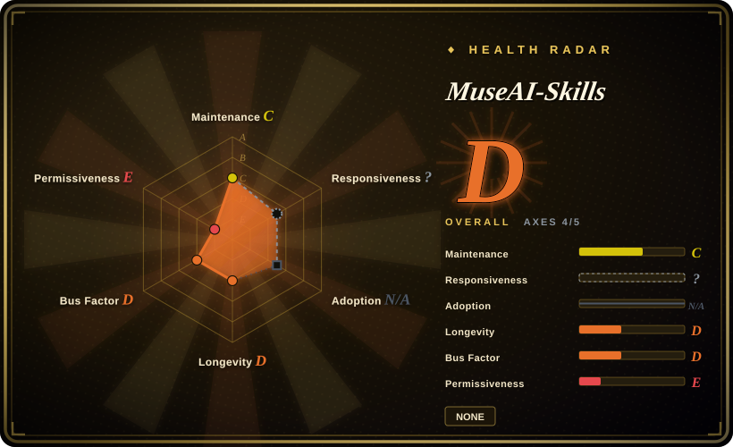
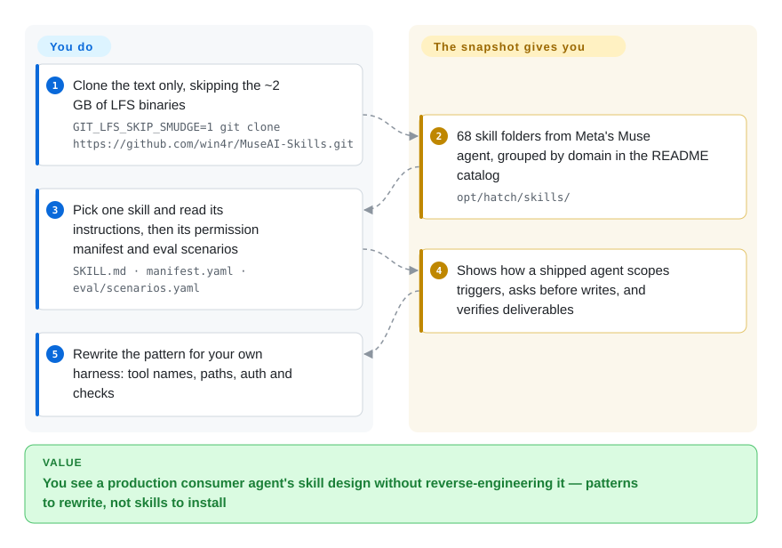

# MuseAI-Skills

Most agent-skill examples you can find are demo-grade: they never say when to stop and ask before sending an email, or how to check that a generated PDF actually renders. This repo is a third party's dump of the skill files, permission manifests and runtime scripts from Meta's consumer agent Muse — readable as a study of how a shipped agent does it, but not installable and not licensed for reuse.

## When to use

You maintain skills for your own agent harness, and the one that sends email on the user's behalf keeps getting it wrong in two directions — it asks "shall I send this?" before merely marking a message read, then fires off a reply without asking at all. You want to see how a product that ships to millions of consumers draws those lines. You clone this repo without the binaries, open `opt/hatch/skills/gmail/`, and read three files side by side: the `SKILL.md` instructions, the `manifest.yaml` that sets a default permission per method group (read = allow, write = ask) with per-method overrides, and the `eval/scenarios.yaml` behaviour tests. Then you do the same for `artifacts/testing` (separating "the file was generated" from "the deliverable is usable") and `wide-research` (one coordinator subagent, a fixed output contract, reported coverage).

You pick this over installable collections such as [Anthropic Skills](../vendor-collections/agent-vendors/anthropic-skills.md) because those are written as teaching examples for a coding agent, while this is the working instruction set of a consumer agent wired to 40 real connectors — Gmail, Plaid, OpenTable, Philips Hue — with quotas, OAuth scopes and consent rules spelled out. And you pick it over broad prompt-leak collections because it keeps each skill's manifest and eval files next to its prompt, so you can read the policy and the test together. The price is that you are reading material you have no right to copy, frozen at one moment.

## How it works

Nothing here runs. The repository is a static archive: the owner copied parts of one Muse agent's Linux environment — the `home/hatch/` directory (product docs written *for* the agent, config) and `opt/hatch/` (68 skill folders, 77 compiled programs, container start-up scripts) — into Git, put the large executables in Git LFS (Large File Storage — the files are fetched separately, so a plain clone gets only small pointer files), and wrote a bilingual README plus a Chinese analysis report around them. Each skill folder follows the familiar `SKILL.md` shape — a short header saying when to trigger, then instructions — but the instructions call Muse's own command-line tools (`hatch_gws_cli`, paths under `/opt/hatch/…`) that exist only inside Meta's hosted container. So the snapshot's job ends at showing you the design; lifting a pattern into your own harness, renaming the tools, and re-checking it against your model is entirely yours.

<!-- flow-steps:begin (generated from flows/museai-skills.json by tools/flow_card.py — do not edit) -->

Text version of the flow

1. **You**: Clone the text only, skipping the ~2 GB of LFS binaries — `GIT_LFS_SKIP_SMUDGE=1 git clone https://github.com/win4r/MuseAI-Skills.git`
2. **MuseAI-Skills**: 68 skill folders from Meta's Muse agent, grouped by domain in the README catalog — `opt/hatch/skills/`
3. **You**: Pick one skill and read its instructions, then its permission manifest and eval scenarios — `SKILL.md · manifest.yaml · eval/scenarios.yaml`
4. **MuseAI-Skills**: Shows how a shipped agent scopes triggers, asks before writes, and verifies deliverables
5. **You**: Rewrite the pattern for your own harness: tool names, paths, auth and checks

**Value**: You see a production consumer agent's skill design without reverse-engineering it — patterns to rewrite, not skills to install

<!-- flow-steps:end -->

## When NOT to use

- **You want skills you can install and run.** Use [Anthropic Skills](../vendor-collections/agent-vendors/anthropic-skills.md) (or OpenAI's `openai/skills` catalog). Every connector skill here shells out to Muse-only binaries and paths (`hatch_gws_cli gmail …`, `/opt/hatch/skills/gmail/manifest.yaml`) and to platform tools such as `credentials.request_api_access`; the README itself lists helpers that are missing from the snapshot (the artifacts validation scripts, skill-creator's connector scaffold, Magic Moment's `mm` program). The frontmatter also uses underscore names (`wide_research`, `skill_creator`) and a Muse-specific `metadata.includeInPrompt` key, so dropping a folder into another harness gives you a skill that loads, if at all, and then calls commands that do not exist.
- **You need to copy text into your own product or repo.** There is no LICENSE file, and the README says in so many words that it grants no additional rights and that original copyrights and trademarks stay with their owners. The files describe themselves as Meta's product ("Muse is Meta's personal AI agent product") and nothing in the repo shows Meta authorised the publication — treat it as unauthorised redistribution of proprietary material [推断: legal status not adjudicated; no takedown seen as of 2026-09-29]. Read for ideas, then write your own; for text you may legally vendor, use Apache-2.0 skills from [Anthropic Skills](../vendor-collections/agent-vendors/anthropic-skills.md) (checking its per-skill licences).
- **You need Muse's current behaviour.** This is one environment captured once (all six commits land 2026-09-25 to 2026-09-28, with no source to sync from), three weeks after Muse's 2026-09-08 launch. Extracted instructions drift with every product release, and some docs are account-specific by their own admission (the voice doc opens "Live voice conversations in the app are not available on this account"). For what Muse does today, go to Meta's product and help pages — not a repo.
- **You want to self-host a Muse-like personal agent.** The snapshot cannot start: the core programs are Linux x86-64 executables with no source or build definition, and the rootfs, host services, database migrations and control plane are absent (README "可运行性与已知缺项"). Executing unsigned binaries of unknown provenance is also a security risk in its own right. Use [OpenClaw](../../agent-frameworks/agent-runtimes/personal-assistants/openclaw.md), an open personal-assistant runtime you can actually deploy.
- **You want a broad, maintained corpus of production system prompts across vendors.** Use `x1xhlol/system-prompts-and-models-of-ai-tools` or `asgeirtj/system_prompts_leaks`, which cover dozens of products and are updated as they change; this repo covers one product at one moment, though far more deeply (manifests, evals, runtime scripts).
- **You only want the text but run a default `git clone` with LFS installed.** That pulls roughly 2 GB of proprietary binaries onto your disk. Set `GIT_LFS_SKIP_SMUDGE=1` as the README shows, or browse the Markdown on GitHub.

## Comparison

| Alternative | In index | Our verdict | Tradeoff |
|---|---|---|---|
| [Anthropic Skills](../vendor-collections/agent-vendors/anthropic-skills.md) | ✅ | When you want a skill to actually load and run in Claude Code or the API, pick Anthropic Skills; open MuseAI-Skills only to study how a consumer agent scopes connector permissions and consent, which Anthropic's teaching examples do not show. | Anthropic's collection is official, installable and partly Apache-2.0, but shaped as demonstrations; MuseAI-Skills shows production connector policy (quotas, per-method allow/ask, eval scenarios) but is unlicensed and non-runnable. |
| x1xhlol/system-prompts-and-models-of-ai-tools | not indexed | For a survey of how many AI products phrase their system prompts, pick this broad collection; for one product's full skill-plus-manifest-plus-eval stack, MuseAI-Skills goes deeper. | Breadth across ~30 products and ongoing updates, versus depth on a single agent frozen at one date; both redistribute vendor text without the vendors' licence. Not added in this tab-intake batch. |
| asgeirtj/system_prompts_leaks | not indexed | When you need current base-model system prompts (Claude, ChatGPT, Gemini, Grok) tracked over time, pick this; it has nothing on connector manifests or eval files, which is MuseAI-Skills' reason to exist. | Frequently updated and declared CC0 by its maintainer, but CC0 cannot license text the maintainer does not own; MuseAI-Skills is unlicensed and static. Not added in this tab-intake batch. |
| [OpenClaw](../../agent-frameworks/agent-runtimes/personal-assistants/openclaw.md) | ✅ | If your goal is to run a personal agent with email, calendar and device connectors yourself, pick OpenClaw; MuseAI-Skills can inform how you write its skills but cannot run anything. | OpenClaw is open source and deployable but you own the connector policy design; the Muse snapshot shows a polished policy design you cannot execute or reuse verbatim. |
| Meta Muse (muse.ai) | not a repo | When you simply want the agent's behaviour, use the hosted product; the archive is only useful for reading its internals. | Closed, hosted consumer product (free tier plus paid plans per launch coverage); always current, but its instructions are invisible from the outside. |

## Health & viability

- **Maintenance (2026-09-29):** not a maintained project in the software sense — six commits between 2026-09-25 and 2026-09-28, all README/documentation edits after the initial archive commit; no releases, no issues filed, no source to rebase on. Expect it to stay frozen or disappear, not to track Muse releases.
- **Governance / bus factor:** a single personal account (`win4r`, Chao Qin — also the maintainer of `memory-lancedb-pro`, ~1.9k followers). No organisation, no contributors besides the owner.
- **Provenance:** the owner does not say how the files were obtained; the README calls them "a partial filesystem snapshot of that Muse / Hatch personal AI agent environment", says it "does not represent an official release or endorsement", and admits "its provenance and product claims have not been independently verified". The files' self-description (Meta product, launched 2026-09-08 in the US and Canada, model "Muse Spark") matches Meta's own launch announcement, which makes a genuine capture plausible but proves nothing about which build or account it came from.
- **Age / Lindy:** four days old at verification; the Lindy prior gives it no credit, and the content has a built-in expiry — every Muse release makes the instructions staler.
- **Adoption signal:** ~295 stars and 94 forks within four days (2026-09-29) — interest in a leak, not evidence of reuse. The Chinese README opens with the owner's Muse referral invite code, so the archive also works as referral promotion; weigh its "worth reading first" picks accordingly.
- **Risk flags:** no licence plus redistributed proprietary text and binaries — a takedown could remove the repo and its forks at any time; do not build anything that depends on the URL staying up [推断: no DMCA notice found as of 2026-09-29].

## Caveats (unverified)

- [未验证] How the files were obtained, from which Muse build, and whether they are complete or edited — the owner does not say and there is no signature; SHA256SUMS only proves the files match what the owner published. Not verifiable without Meta's cooperation.
- [推断] Legal status: with no licence and material self-identified as Meta's, reuse is very likely infringing and the repo is exposed to takedown; no court or takedown notice has been checked beyond the absence of one on GitHub as of 2026-09-29.
- [推断] Whether a folder copied into Claude Code or another Agent-Skills harness loads at all given the underscore `name` values and Muse-specific metadata was not tested; either way its commands point at Muse-only binaries.
- [未验证] The patterns' quality inside Muse (do these instructions produce good behaviour?) — the eval scenario files exist, but the README notes their presence does not mean they passed, and no results are included.
- [未验证] Skill, manifest and binary counts come from the README and a gh api tree listing on 2026-09-29; the contents of the LFS binaries were not downloaded or inspected.
