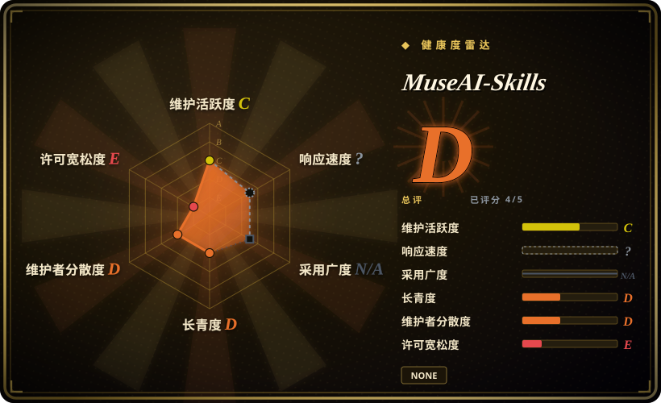
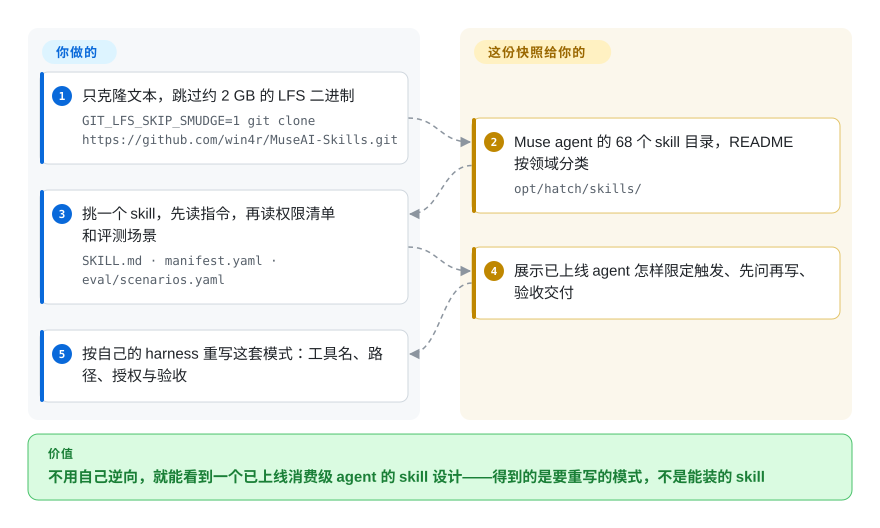

# MuseAI-Skills

网上能找到的 agent skill 大多是演示级的：从不交代“发邮件前什么时候该停下来问一句”，也不教你怎么确认生成的 PDF 真能打开。这个仓库是第三方从 Meta 消费级 agent Muse 的运行环境里整包导出的 skill 文件、权限清单和启动脚本——可以拿来研究一个已上线的 agent 怎么做，但装不上、也没有授权让你复用。

## 何时使用

你在给自己的 agent harness 维护 skill，其中代用户发邮件的那个总在两头出错：只是把邮件标为已读，它也要问“确定吗？”；真要替用户回信，它却一声不吭就发出去了。你想看看一个面向几百万普通用户上线的产品是怎么划这条线的。于是你跳过二进制克隆本仓库，打开 `opt/hatch/skills/gmail/`，把三个文件并排读：`SKILL.md` 里的操作指令；`manifest.yaml` 里按方法分组设的默认权限（读取组默认放行、写入组默认先问），再逐个方法覆盖；以及 `eval/scenarios.yaml` 里的行为评测场景。接着再读 `artifacts/testing`（把“文件生成了”和“交付物能用”分开验收）和 `wide-research`（只派一个协调子 agent、统一输出字段、汇报覆盖率）。

你选它而不是 [Anthropic Skills](../vendor-collections/agent-vendors/anthropic-skills.zh.md) 这类能直接安装的合集，是因为后者是写给编码 agent 的教学示例，而这里是一个接了 40 个真实连接器（Gmail、Plaid、OpenTable、Philips Hue……）的消费级 agent 正在用的指令，配额、OAuth 授权范围和征询规则都写得清清楚楚。你选它而不是那些大而全的提示词泄露合集，是因为它把每个 skill 的权限清单和评测文件放在提示词旁边，策略和测试能对照着读。代价是：你读的是无权复制的材料，而且停在某一天。

## 怎么用起来

这里没有任何东西能跑。仓库是一份静态存档：维护者把某个 Muse agent 的 Linux 环境的一部分——`home/hatch/`（写给 agent 看的产品文档和配置）和 `opt/hatch/`（68 个 skill 目录、77 个编译好的程序、容器启动脚本）——拷进 Git，把大体积可执行文件放进 Git LFS（大文件存储：文件另行下载，普通克隆只拿到很小的指针文件），再围绕它们写了中英双语 README 和一份中文分析报告。每个 skill 目录都是熟悉的 `SKILL.md` 形状——开头一小段说明何时触发，后面是操作指令——但指令调用的是 Muse 自己的命令行工具（`hatch_gws_cli`、`/opt/hatch/…` 下的路径），只存在于 Meta 托管的容器里。所以这份快照的作用止于把设计摊给你看；把某个模式搬进自己的 harness、改工具名、再拿自己的模型重新验证，全是你的活。

<!-- flow-steps:begin (generated from flows/museai-skills.json by tools/flow_card.py — do not edit) -->

流程文字版

1. **你**：只克隆文本，跳过约 2 GB 的 LFS 二进制 — `GIT_LFS_SKIP_SMUDGE=1 git clone https://github.com/win4r/MuseAI-Skills.git`
2. **MuseAI-Skills**：Muse agent 的 68 个 skill 目录，README 按领域分类 — `opt/hatch/skills/`
3. **你**：挑一个 skill，先读指令，再读权限清单和评测场景 — `SKILL.md · manifest.yaml · eval/scenarios.yaml`
4. **MuseAI-Skills**：展示已上线 agent 怎样限定触发、先问再写、验收交付
5. **你**：按自己的 harness 重写这套模式：工具名、路径、授权与验收

**价值**：不用自己逆向，就能看到一个已上线消费级 agent 的 skill 设计——得到的是要重写的模式，不是能装的 skill

<!-- flow-steps:end -->

## 何时不用

- **你要能装上就跑的 skill。** 用 [Anthropic Skills](../vendor-collections/agent-vendors/anthropic-skills.zh.md)（或 OpenAI 的 `openai/skills` 目录）。这里每个连接器 skill 都要调用 Muse 独有的程序和路径（`hatch_gws_cli gmail …`、`/opt/hatch/skills/gmail/manifest.yaml`），以及 `credentials.request_api_access` 这类平台工具；README 自己也列出了快照里缺失的辅助程序（artifacts 验证脚本、skill-creator 的连接器脚手架、Magic Moment 的 `mm` 程序）。frontmatter 还用下划线命名（`wide_research`、`skill_creator`）并带 Muse 专有的 `metadata.includeInPrompt` 键，拷进别的 harness，就算能加载，调用的命令也根本不存在。
- **你要把文字抄进自己的产品或仓库。** 仓库没有 LICENSE 文件，README 明说不代原权利人授予任何额外权利，原有版权和商标保持不变。文件自称是 Meta 的产品（“Muse is Meta's personal AI agent product”），仓库里没有任何迹象表明 Meta 授权了发布——应当视为未经授权转载的专有材料 [推断：法律定性未经裁决；截至 2026-09-29 未见下架通知]。读来找思路，然后自己写；需要能合法引入的文字，用 [Anthropic Skills](../vendor-collections/agent-vendors/anthropic-skills.zh.md) 里 Apache-2.0 的 skill（并逐个核对许可）。
- **你需要 Muse 当前的行为。** 这是一次性抓取的单个环境（六次提交全在 2026-09-25 至 2026-09-28，没有可同步的源头），距 Muse 2026-09-08 上线才三周。导出的指令会随产品每次发布而漂移，而且部分文档自己承认只对该账号成立（语音文档第一句就是 “Live voice conversations in the app are not available on this account”）。想知道 Muse 今天怎么做，去看 Meta 的产品和帮助页面——那不是仓库。
- **你想自托管一个类似 Muse 的个人 agent。** 这份快照启动不了：核心程序是 Linux x86-64 可执行文件，没有源码和构建定义，rootfs、宿主服务、数据库迁移和控制面都缺（见 README “可运行性与已知缺项”）。运行来源不明、未签名的二进制本身就是安全风险。用 [OpenClaw](../../agent-frameworks/agent-runtimes/personal-assistants/openclaw.zh.md)，一个真能部署的开源个人助手运行时。
- **你要一个跨厂商、持续更新的生产系统提示词语料。** 用 `x1xhlol/system-prompts-and-models-of-ai-tools` 或 `asgeirtj/system_prompts_leaks`，它们覆盖几十个产品并随产品更新；本仓库只覆盖一个产品的一个时刻，好处是深得多（权限清单、评测、运行脚本都在）。
- **你只要文本，却在装了 LFS 的机器上直接 `git clone`。** 那会把约 2 GB 的专有二进制拉到本地。按 README 设置 `GIT_LFS_SKIP_SMUDGE=1`，或者直接在 GitHub 上浏览 Markdown。

## 横向对比

| 替代品 | 是否收录 | 我们的评价 | 取舍 |
|---|---|---|---|
| [Anthropic Skills](../vendor-collections/agent-vendors/anthropic-skills.zh.md) | ✅ | 要让 skill 在 Claude Code 或 API 里真正加载运行，选 Anthropic Skills；只有想研究消费级 agent 怎么划连接器权限和征询规则时才打开 MuseAI-Skills，那是 Anthropic 的教学示例没有展示的。 | Anthropic 的合集官方、可安装、部分为 Apache-2.0，但定位是演示；MuseAI-Skills 展示生产级连接器策略（配额、逐方法放行/先问、评测场景），却无授权、跑不起来。 |
| x1xhlol/system-prompts-and-models-of-ai-tools | 未收录 | 想横向看许多 AI 产品怎么写系统提示词，选这个大合集；想看单个产品从 skill 到权限清单到评测的完整一套，MuseAI-Skills 更深。 | 一边是覆盖约 30 个产品、持续更新的广度，一边是冻结在某天的单个 agent 的深度；两者都在未获厂商授权的情况下转载厂商文字。本次标签页收录批次未添加。 |
| asgeirtj/system_prompts_leaks | 未收录 | 需要持续追踪 Claude、ChatGPT、Gemini、Grok 等基础模型的最新系统提示词时选它；它完全没有连接器权限清单和评测文件，而这正是 MuseAI-Skills 存在的理由。 | 更新频繁、维护者声明为 CC0，但 CC0 无法授权维护者并不拥有的文字；MuseAI-Skills 无授权且静态。本次标签页收录批次未添加。 |
| [OpenClaw](../../agent-frameworks/agent-runtimes/personal-assistants/openclaw.zh.md) | ✅ | 目标是自己跑一个接邮件、日历、设备的个人 agent，选 OpenClaw；MuseAI-Skills 能给你写它的 skill 提供参考，但自己什么都跑不了。 | OpenClaw 开源可部署，但连接器策略要你自己设计；Muse 快照展示了一套打磨过的策略设计，却不能执行、也不能原样复用。 |
| Meta Muse（muse.ai） | 非仓库 | 只想要这个 agent 的能力，直接用托管产品；这份存档只对阅读其内部设计有用。 | 闭源托管的消费级产品（据上线报道有免费档和付费档）；永远是最新的，但从外面看不到它的指令。 |

## 健康度与可持续性

- **维护（2026-09-29）：** 不是软件意义上的维护项目——2026-09-25 至 2026-09-28 共六次提交，首个存档提交之后全是 README 和文档修改；没有发布版本、没有 issue、没有可 rebase 的源头。预期它要么保持冻结，要么消失，不会跟随 Muse 更新。
- **治理 / 巴士因子：** 单一个人账号（`win4r`，秦超，也是 `memory-lancedb-pro` 的维护者，约 1.9k 关注者）。没有组织，除维护者外没有其他贡献者。
- **来源：** 维护者没有说明文件是如何获得的；README 称其为“该 Muse / Hatch 个人 AI Agent 环境的部分文件”存档，声明“本存档不代表官方发布或认可”，并承认“未独立验证这些材料的来源与产品声明”。文件的自我描述（Meta 的产品、2026-09-08 在美国和加拿大上线、模型名 “Muse Spark”）与 Meta 官方上线公告一致，说明它可能确是真实抓取，但证明不了来自哪个版本、哪个账号。
- **年龄 / Lindy：** 核查时才四天大；Lindy 先验不给任何加分，而且内容自带保质期——Muse 每发布一次，指令就更旧一分。
- **采用信号：** 四天内约 295 星、94 个 fork（2026-09-29）——这是对泄露内容的好奇，不是被复用的证据。中文 README 开头放着维护者的 Muse 邀请码，这份存档同时也在做邀请推广；它推荐“优先阅读”的 skill 名单要打个折看。
- **风险标记：** 无授权，外加转载专有文字和二进制——仓库及其 fork 随时可能被下架；不要构建任何依赖这个链接长期存在的东西 [推断：截至 2026-09-29 未找到 DMCA 通知]。

## 存疑（未验证）

- [未验证] 文件如何获得、来自 Muse 哪个版本、是否完整或经过修改——维护者未说明，也没有签名；SHA256SUMS 只能证明文件与维护者发布的一致。没有 Meta 配合无法核实。
- [推断] 法律定性：没有许可、材料自称属于 Meta，复用极可能构成侵权，仓库面临下架风险；除确认 2026-09-29 时 GitHub 上没有下架通知外，未查证任何诉讼或通知。
- [推断] 由于 `name` 用下划线且带 Muse 专有元数据，把目录拷进 Claude Code 或其他 Agent Skills harness 能否加载未经测试；无论能否加载，其中的命令都指向 Muse 独有的程序。
- [未验证] 这些模式在 Muse 内部的实际效果（这些指令能否产出好的行为）——评测场景文件存在，但 README 注明存在不代表已通过，仓库也没有附结果。
- [未验证] skill、权限清单和二进制的数量来自 README 与 2026-09-29 的 gh api 目录树列表；LFS 二进制的内容未下载、未检查。
