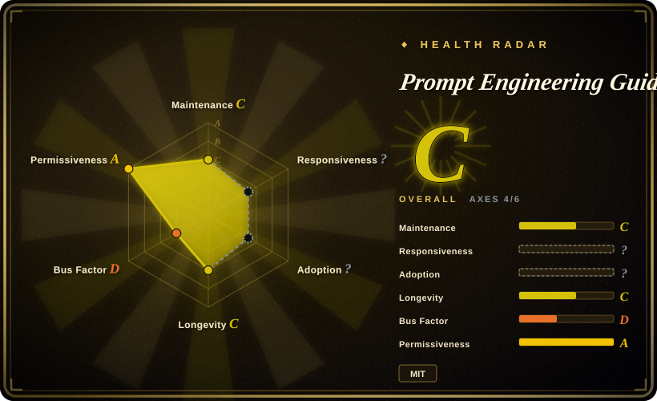

# Prompt Engineering Guide

DAIR.AI's reference knowledge base for prompt engineering — guides, papers, lessons, and notebooks covering prompting techniques, context engineering, RAG, and AI agents, published as the promptingguide.ai website.

## When to use

You're an engineer or team lead who needs to **understand why** a prompting technique works before standardizing it — few-shot vs zero-shot tradeoffs, chain-of-thought and its failure modes, self-consistency, ReAct, RAG patterns, agent design — and you want one curated, citable source instead of scattered blog posts. You read the relevant chapter of the Guide (or its linked papers/notebooks), form a mental model, and then encode the technique into your own system prompt, skill, or spec template. It is also the right pick for onboarding: a shared reading list beats reverse-engineering folklore from coworkers' prompts.

The decisive tradeoff versus [prompt-master](prompt-master.md) and [prompts.chat](prompts-chat.md): the Guide produces **knowledge, not artifacts** — you will not paste anything out of it directly. Choose it when the prompting decisions are yours to make repeatedly (you're building harnesses, system prompts, or team conventions); choose a generator or library when you need one working prompt now.

## When NOT to use

- **You need a paste-ready prompt for a specific task or tool.** Use [prompts.chat](prompts-chat.md) for proven community prompts, or [prompt-master](prompt-master.md) to generate one adapted to the target tool; the Guide teaches principles and never outputs production prompts.
- **You need current, model-specific behavior defaults.** The Guide's technique chapters age slower than per-model advice, but anything about specific model capabilities lags; verify against provider docs. For tool-dialect syntax (Midjourney params, SD weights) it has nothing — that lives in prompt-master's profiles.
- **You want an actively maintained changelog of the field.** Commit cadence has slowed: last commit 2026-03-11, previous 2026-02-20 (verified 2026-09-18) — roughly a 6-month gap at verification time. For bleeding-edge techniques, read papers directly; treat the Guide as a stable canon, not a feed.
- **You need vendor-neutral depth on one framework (e.g. LangChain/LlamaIndex).** The Guide surveys broadly; for framework-specific engineering use that framework's own docs — the Guide's code examples are teaching artifacts, not maintained integrations [推断].
- **Your team needs interactive training with assessment.** The Guide is reading material; DAIR.AI pushes cohort courses (recent commits add "DAIR Academy" CTAs) which are paid services, not part of this repo (未收录 — non-repo services).

## Comparison

| Alternative | In index | Our verdict | Tradeoff |
|---|---|---|---|
| [prompt-master](prompt-master.md) | ✅ | For producing one optimized prompt per request choose prompt-master; for building the durable in-house judgment that makes such generators unnecessary, read the Guide. | prompt-master gives artifacts without understanding (and its model-specific advice decays); the Guide gives understanding without artifacts, but the knowledge compounds across model generations. |
| [prompts.chat](prompts-chat.md) | ✅ | For "give me a working prompt now" copy from prompts.chat; for "teach my team to write and review prompts" use the Guide. | The library is breadth of ready text with no theory; the Guide is depth of theory with no ready text. |
| [Agent Skills for Context Engineering](../context-engineering/context-engineering-skills.md) | ✅ | For context-engineering discipline *inside a coding agent* (compression, degradation, multi-agent memory) choose the skills pack — it runs in the harness; choose the Guide for the underlying research and cross-tool principles. | The skills pack is executable harness content, narrow to Claude Code workflows; the Guide is reading material, broad but not directly executable. |
| OpenAI / Anthropic official prompting docs | 未收录 | For a single vendor's current best practices and API-specific controls, read that vendor's docs (non-repo, always fresher); choose the Guide for vendor-neutral technique taxonomy and paper citations. | Vendor docs are current but siloed and marketing-adjacent; the Guide is neutral and citable but lags on model-specific details. |

## Health & viability

- **Maintenance (2026-09-18):** not archived, but slowing — last commit 2026-03-11 (~6 months before verification), previous 2026-02-20. Coasting on a large existing corpus rather than actively expanded.
- **Governance / bus factor:** effectively single-maintainer — `omarsar` (Elvis Saravia, DAIR.AI) holds 827 commits vs 61 for the second contributor (verified 2026-09-18). DAIR.AI is a small private org, not a foundation; roadmap follows the org's commercial direction (recent commits wire in "DAIR Academy" course CTAs).
- **Backing & longevity:** ~3.7 years old (created 2022-12-16) and still the canonical prompt-engineering reference by stars — a favorable Lindy position for the *existing content*, which is largely technique-level and ages slowly.
- **Adoption:** ~78.4k stars / ~8.6k forks (2026-09-18); published as promptingguide.ai with multilingual community translations.
- **Risk flags:** content drift toward the maintainer's paid courses (CTA commits); no formal review process for technique claims — chapters reflect one author's synthesis of the literature [推断]. MIT license, no relicense history.

## Caveats (unverified)

- [未验证] promptingguide.ai deployment freshness vs the repo — the site was not diffed against `main` at verification time.
- [未验证] Accuracy of individual technique claims (e.g. CoT effectiveness on current reasoning models) — the Guide predates several model generations and was not re-tested.
- [推断] The ~6-month commit gap suggests maintenance is opportunistic; whether it resumes is unknown.
- [未验证] Status/completeness of the community translation branches was not audited.
