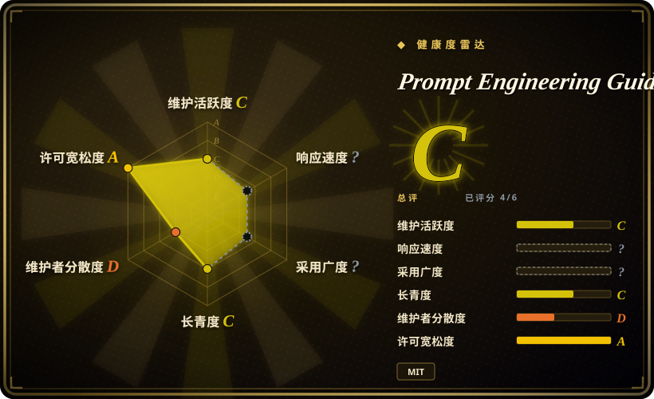

# Prompt Engineering Guide

DAIR.AI 的提示词工程参考知识库——指南、论文、课程与 notebook，覆盖提示词技术、上下文工程、RAG 与 AI agent，以 promptingguide.ai 网站形式发布。

## 何时使用

你是工程师或团队负责人，在把一项提示词技术标准化之前需要**理解它为什么有效**——few-shot 与 zero-shot 的取舍、思维链及其失效模式、self-consistency、ReAct、RAG 模式、agent 设计——你想要一个可引用的策展来源，而不是一堆散乱的博客。你读 Guide 的对应章节（及其链接的论文/notebook），建立心智模型，然后把技术编进你自己的 system prompt、skill 或 spec 模板。它也适合做新人培训：一份共享阅读清单，好过从同事的提示词里逆向考古。

相对 [prompt-master](prompt-master.zh.md) 和 [prompts.chat](prompts-chat.zh.md) 的决定性取舍：Guide 产出的是**知识，不是工件**——你不会从里面直接粘贴任何东西。提示词决策需要你反复亲自做（你在建 harness、system prompt 或团队规范）时选它；只要一条现在能用的提示词时，选生成器或提示词库。

## 何时不用

- **你需要一条针对具体任务或工具、可直接粘贴的提示词。** 用 [prompts.chat](prompts-chat.zh.md) 拿社区验证过的提示词，或用 [prompt-master](prompt-master.zh.md) 生成适配目标工具的；Guide 教原理，从不产出生产提示词。
- **你需要最新的、按模型写的行为默认值。** Guide 的技术章节比按模型写的建议老化得慢，但涉及具体模型能力的内容都会滞后；以厂商文档为准。工具方言语法（Midjourney 参数、SD 权重）它完全没有——那在 prompt-master 的画像里。
- **你想要一份活跃维护的领域动态。** 提交节奏已放缓：最后提交 2026-03-11，上一次 2026-02-20（2026-09-18 核实）——核验时点约有 6 个月空窗。前沿技术直接读论文；把 Guide 当稳定的经典 canon，不是信息流。
- **你需要某个框架（如 LangChain/LlamaIndex）的中立深度内容。** Guide 是广域概览；框架级工程用该框架自己的文档——Guide 的代码示例是教学工件，不是持续维护的集成 [推断]。
- **你的团队需要带考核的交互式培训。** Guide 是阅读材料；DAIR.AI 主推的是付费 cohort 课程（近期提交在加「DAIR Academy」CTA），那不属于本仓库（未收录——非仓库服务）。

## 横向对比

| 替代品 | 是否收录 | 我们的评价 | 取舍 |
|---|---|---|---|
| [prompt-master](prompt-master.zh.md) | ✅ | 要按请求产出单条优化提示词选 prompt-master；要沉淀让这类生成器变得不必要的内部判断力，读 Guide。 | prompt-master 给工件不给理解（且按模型写的建议会腐烂）；Guide 给理解不给工件，但知识能跨模型代际复利。 |
| [prompts.chat](prompts-chat.zh.md) | ✅ | 「现在就给我一条能用的提示词」从 prompts.chat 复制；「教团队写和审提示词」用 Guide。 | 库是现成文本的广度、无理论；Guide 是理论的深度、无现成文本。 |
| [Agent Skills for Context Engineering](../context-engineering/context-engineering-skills.zh.md) | ✅ | 要在*编码 agent 内部*执行上下文工程纪律（压缩、退化、多 agent 记忆）选那个 skills 包——它跑在 harness 里；要底层研究与跨工具原理选 Guide。 | skills 包是可执行的 harness 内容、窄于 Claude Code 工作流；Guide 是阅读材料、广但不可直接执行。 |
| OpenAI / Anthropic 官方提示词文档 | 未收录 | 要单一厂商的当前最佳实践和 API 专属控制项，读该厂商文档（非仓库、永远更新）；要厂商中立的技术分类学和论文引用，选 Guide。 | 厂商文档新但各自为营、带营销色彩；Guide 中立可引用，但模型级细节滞后。 |

## 健康度与可持续性

- **维护（2026-09-18）：** 未归档，但在放缓——最后提交 2026-03-11（核验前约 6 个月），上一次 2026-02-20。靠既有大部头语料滑行，而非持续扩充。
- **治理 / bus factor：** 实质单人维护——`omarsar`（Elvis Saravia，DAIR.AI）827 次提交，第二名仅 61 次（2026-09-18 核实）。DAIR.AI 是小型私营组织而非基金会；路线跟随其商业方向（近期提交在接入「DAIR Academy」课程 CTA）。
- **背书与寿命：** 约 3.7 年历史（创建于 2022-12-16），按 star 计仍是提示词工程的正典参考——就*既有内容*而言 Lindy 位置有利，其内容大多是技术层、老化慢。
- **采用度：** 约 78.4k stars / 约 8.6k forks（2026-09-18）；以 promptingguide.ai 发布，有多语言社区翻译。
- **风险旗标：** 内容向维护者的付费课程引流（CTA 提交）；技术声明无正式 review 流程——章节反映的是一位作者对文献的综合 [推断]。MIT 协议，无改协议历史。

## 存疑（未验证）

- [未验证] promptingguide.ai 部署内容相对仓库的新鲜度——核验时未将站点与 `main` 比对。
- [未验证] 各技术声明的准确性（如 CoT 在当前推理模型上的有效性）——Guide 早于好几代模型，未重测。
- [推断] 约 6 个月的提交空窗说明维护是机会主义的；是否恢复未知。
- [未验证] 社区翻译分支的状态/完整度未审计。
