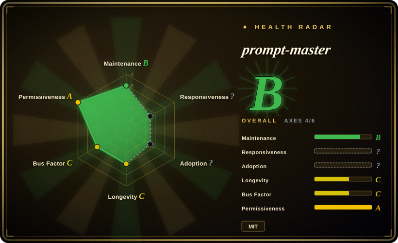

# prompt-master

A Claude skill that generates one paste-ready, tool-specific prompts for 30+ AI tools — LLMs, coding agents, image/video/voice AI — via intent extraction, silent template routing, and a 37-pattern anti-pattern checklist.

## When to use

You're a designer, marketer, or occasional AI user working **without** an agent harness: you drive raw tools — the ChatGPT/Claude web app, Cursor, Midjourney, Stable Diffusion, ElevenLabs — one prompt at a time, and every vague prompt costs a re-prompt round-trip. You install prompt-master as a Claude skill, say "write me a prompt for Midjourney: samurai in the rain", and it runs a fixed pipeline: detect the target tool, extract 9 intent dimensions (task/input/output/constraints/context/audience/memory/success-criteria/examples), ask at most 3 clarifying questions, silently route to one of 13 templates (RTF, CO-STAR, RISEN, File-Scope, ReAct+stop-conditions, Visual Descriptor, ComfyUI, Prompt Decompiler…), apply safe techniques only, then strip non-load-bearing words. Output is one copyable block plus a one-line strategy note.

The decisive tradeoff versus [prompts.chat](prompts-chat.md) is **generate vs. copy**: a library gives you a community-voted prompt only if someone already wrote one for your exact task; prompt-master composes one for a novel task and adapts it to the target tool's dialect — Midjourney's comma-separated descriptors and `--ar/--v` flags, SD's `(word:1.3)` weights and mandatory negative prompt, o3-style reasoning models that must *not* be given chain-of-thought instructions. That syntax-level dialect knowledge is the durable half of its value; the per-model behavior advice is the perishable half (see Health).

## When NOT to use

- **You already run a spec-driven harness (AGENTS.md + plan/spec skills, dispatch contracts, lint gates).** Your spec pipeline already enforces scope, success criteria, memory carry-forward, and verification — everything prompt-master adds, but as machine gates instead of prompt-text discipline. prompt-master's output is a one-shot prompt with no approval or verification loop; bolting it onto a governed workflow adds nothing. Keep your harness; borrow at most its `references/patterns.md` as a checklist for writing dispatch briefs to external tools.
- **You want to learn *why* prompts work.** Use [Prompt Engineering Guide](prompt-engineering-guide.md) — it teaches techniques with papers and notebooks; prompt-master explicitly refuses to discuss prompting theory ("Do not discuss prompting theory unless explicitly asked") and routes frameworks silently.
- **You need a curated library of ready-made persona prompts.** Use [prompts.chat](prompts-chat.md) (f.k.a. Awesome ChatGPT Prompts): 170k+ stars of community-voted copy-paste prompts, CC0 content, self-hostable; prompt-master generates instead of collecting, and its output is not versioned or votable by a community.
- **You need reproducible, version-controlled prompt assets in a product pipeline.** prompt-master emits ephemeral chat output with no releases, no tags, and no diffable prompt store (0 GitHub releases as of 2026-09-18). Use a prompt-management approach (e.g. prompts in your repo under review, or a registry) instead; for hosted prompt improvement, Anthropic Console's prompt improver exists but is closed SaaS (未收录).
- **You target one fast-moving model family and need current defaults.** Its model-routing advice is hand-maintained and chased the model treadmill three releases in a row (1.6→1.8 updated Opus 4.7/4.8/5, GPT-5.6, Grok 4.6 profiles). Between upstream updates, profiles for brand-new models are missing or stale; verify against provider docs — the skill's own "Model Recency Gate" section admits this.

## Comparison

| Alternative | In index | Our verdict | Tradeoff |
|---|---|---|---|
| [prompts.chat](prompts-chat.md) | ✅ | For common, already-solved asks (personas, standard formats) copy from prompts.chat — community voting is a quality signal prompt-master lacks; choose prompt-master when the task is novel or the target tool has a non-prose dialect (Midjourney/SD/ComfyUI). | prompts.chat gives proven text but zero adaptation to your specifics; prompt-master adapts per request but nothing reviews whether the generated prompt actually worked. |
| [Prompt Engineering Guide](prompt-engineering-guide.md) | ✅ | For building durable in-house prompting skill, read the Guide; choose prompt-master only when you want the finished prompt now and don't care how it was built. | The Guide costs reading time and produces knowledge, not artifacts; prompt-master costs one skill invocation and produces an artifact, not knowledge. |
| [De-AI-Prompt-Enhancer-Writer-Booster-SKILL](../de-ai-writing/de-ai-prompt-enhancer-writer-booster-skill.md) | ✅ | For Chinese writing/anti-AI-flavor prompt work choose the De-AI suite; choose prompt-master for cross-tool, cross-modal generation (code, image, video, voice, workflow tools) in either language. | De-AI is deep in one niche (Chinese prose voice); prompt-master is broad across 30+ tools but shallow per tool — a few paragraphs of routing advice each. |
| Anthropic Console prompt improver | 未收录 | For one-off improvement of an existing prompt inside a vendor UI, the Console improver is zero-install; choose prompt-master when you need multi-tool routing or run inside Claude Code/skills workflows. | Closed SaaS, single-vendor, not scriptable; prompt-master is MIT, local, and tool-agnostic but needs a Claude skill runtime. |

## Health & viability

- **Maintenance (2026-09-18):** last push 2026-08-24 (~3.5 weeks prior); 58 commits since creation on 2026-03-11. Active but young — ~6 months old, no releases or tags; versioning lives only in the SKILL.md frontmatter (`1.8.0`) and a README changelog.
- **Governance / bus factor:** 7 contributors; the author (nidhinjs) holds 41/58 commits (~71%) [推断: bus factor ≈ 1]. No org backing, no foundation, no CLA.
- **Adoption:** ~13.3k stars / ~1.5k forks (2026-09-18) — high for its age. Per this index's Lindy prior, a 6-month-old repo with 13k stars is a **risk flag, not proof**: adoption is untested across model generations.
- **Content perishability (the main risk):** the value splits into a durable half (tool input dialects: Midjourney params, SD weights, ComfyUI node split) and a perishable half (per-model behavior profiles). The changelog shows three consecutive releases chasing new model names — the perishable half requires permanent upkeep by a single maintainer. [推断] If upkeep lapses, the skill degrades into generic prompt advice.
- **Risk flags:** README carries marketing-grade claims ("Zero tokens or credits wasted") that are not measurable; the star-history badge points at a non-standard domain (star-history.dera.page). MIT license, no relicense history.

## Caveats (unverified)

- [未验证] Whether generated prompts actually outperform naive ones on any tool — no benchmark or eval exists in the repo; the before/after examples are author-selected.
- [未验证] Accuracy of each of the ~30 tool profiles (e.g. "o3 must not get CoT instructions") — these are the author's claims about third-party model behavior, not checkable without per-tool reproduction; the repo provides no test harness.
- [未验证] The "37 patterns" and "13 templates" counts were verified by counting entries in `references/patterns.md` and `references/templates.md` (2026-09-18), but their *effectiveness* is unmeasured.
- [推断] The 13.3k stars in ~6 months likely reflect social virality (it trended); organic sustained usage is unknown.
- [未验证] Claims in the README tool table about specific model versions (Claude 5 / GPT-5.6 Sol/Terra/Luna / Grok 4.6 routing) were not cross-checked against provider docs at verification time.
