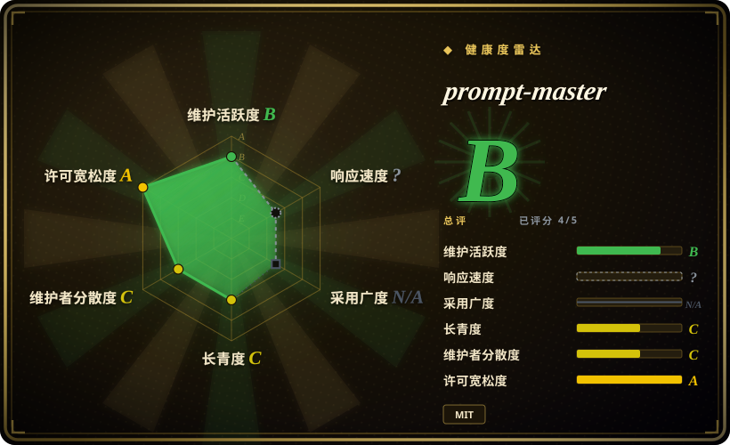

# prompt-master

一个 Claude skill：通过意图提取、静默模板路由和 37 条反模式清单，为 30+ AI 工具（LLM、编码 agent、图像/视频/语音 AI）生成单条可直接粘贴的定制化提示词。

## 何时使用

你是一名设计师、市场人员或轻度 AI 用户，**没有** agent harness：你直接裸用工具——ChatGPT/Claude 网页版、Cursor、Midjourney、Stable Diffusion、ElevenLabs——一次一条提示词，而每条含糊的提示词都要多付一轮重问的成本。你把 prompt-master 装成 Claude skill，说「给我写一条 Midjourney 提示词：雨夜武士」，它跑一条固定流水线：识别目标工具 → 提取 9 个意图维度（任务/输入/输出/约束/上下文/受众/记忆/成功标准/示例）→ 最多问 3 个澄清问题 → 静默路由到 13 个模板之一（RTF、CO-STAR、RISEN、File-Scope、ReAct+停止条件、Visual Descriptor、ComfyUI、Prompt Decompiler……）→ 只使用安全技术 → 删掉所有不承载信息的词。产出是一个可复制的提示词块加一行策略说明。

相对 [prompts.chat](prompts-chat.zh.md) 的决定性取舍是**生成 vs 复制**：提示词库只有在别人恰好写过同款任务时才有货；prompt-master 为新任务现场组装，并适配目标工具的方言——Midjourney 的逗号分隔描述词和 `--ar/--v` 参数、SD 的 `(word:1.3)` 权重和必备 negative prompt、o3 系推理模型**不能**加思维链指令。语法层方言知识是它价值中耐久的部分；按模型版本写的行为建议是易腐的部分（见健康度）。

## 何时不用

- **你已经有一套 spec 驱动的 harness（AGENTS.md + 规划/spec skill、派发合同、lint 门禁）。** 你的 spec 流水线已经用机器门禁强制了范围、成功标准、记忆延续和验证——prompt-master 能补的它全有，而且强度更高。prompt-master 的产物是一次性提示词，没有审批和验证闭环；把它接到有治理的流程上是空操作。保留你的 harness，最多把它的 `references/patterns.md` 当作给外部工具写派发 brief 的清单来借。
- **你想学提示词为什么有效。** 用 [Prompt Engineering Guide](prompt-engineering-guide.zh.md)——它用论文和 notebook 教技术；prompt-master 明确拒绝讨论提示词理论（「Do not discuss prompting theory unless explicitly asked」），框架路由对用户不可见。
- **你需要现成人格提示词的策展库。** 用 [prompts.chat](prompts-chat.zh.md)（前身 Awesome ChatGPT Prompts）：17 万+ star 的社区投票提示词、内容 CC0、可自托管；prompt-master 是生成而非收集，产物没有版本化也没有社区投票。
- **你需要产品流水线里可复现、可版本控制的提示词资产。** prompt-master 输出的是聊天里的临时产物：无 release、无 tag、无可 diff 的提示词存储（截至 2026-09-18 GitHub release 数为 0）。改用提示词管理方案（提示词进仓库过 review，或用 registry）；托管式的提示词改进有 Anthropic Console 的 prompt improver，但它是闭源 SaaS（未收录）。
- **你只针对一个快速迭代的模型家族、需要最新默认值。** 它的模型路由建议靠手工维护，且连续三个版本都在追新模型（1.6→1.8 更新了 Opus 4.7/4.8/5、GPT-5.6、Grok 4.6 画像）。上游更新的间隙里，新模型的画像要么缺失要么过时；以官方文档为准——skill 自己的「Model Recency Gate」一节也承认这一点。

## 横向对比

| 替代品 | 是否收录 | 我们的评价 | 取舍 |
|---|---|---|---|
| [prompts.chat](prompts-chat.zh.md) | ✅ | 常见、已被解决的需求（人格、标准格式）直接从 prompts.chat 复制——社区投票是 prompt-master 没有的质量信号；任务新颖或目标工具是非散文方言（Midjourney/SD/ComfyUI）时选 prompt-master。 | prompts.chat 给的是验证过的文本但完全不针对你的具体情况；prompt-master 按请求定制，但生成的提示词是否真的有效没有任何环节复核。 |
| [Prompt Engineering Guide](prompt-engineering-guide.zh.md) | ✅ | 要沉淀团队自己的提示词能力，读 Guide；只想要现成提示词、不关心怎么造出来的，才选 prompt-master。 | Guide 花的是阅读时间、产出是知识不是工件；prompt-master 花一次 skill 调用、产出工件但不留知识。 |
| [De-AI-Prompt-Enhancer-Writer-Booster-SKILL](../ai-writing/de-ai-writing/de-ai-prompt-enhancer-writer-booster-skill.zh.md) | ✅ | 中文写作/去 AI 味的提示词工作选 De-AI 套件；跨工具、跨模态（代码、图像、视频、语音、工作流工具）的生成选 prompt-master，中英文皆可。 | De-AI 深耕单一利基（中文文风）；prompt-master 横跨 30+ 工具但每个都浅——各只有几段路由建议。 |
| Anthropic Console prompt improver | 未收录 | 想在厂商 UI 里零安装地改进一条现有提示词，用 Console improver；需要多工具路由、或在 Claude Code/skills 工作流里跑，选 prompt-master。 | 闭源 SaaS、单一厂商、不可脚本化；prompt-master 是 MIT、本地、工具无关，但需要 Claude skill 运行时。 |

## 健康度与可持续性

- **维护（2026-09-18）：** 最后 push 2026-08-24（约 3.5 周前）；自 2026-03-11 创建以来 58 次提交。活跃但年轻——仅约 6 个月，无 release 无 tag；版本号只存在于 SKILL.md frontmatter（`1.8.0`）和 README 变更日志里。
- **治理 / bus factor：** 7 位贡献者；作者（nidhinjs）占 41/58 次提交（约 71%）[推断：bus factor ≈ 1]。无组织背书、无基金会、无 CLA。
- **采用度：** 约 13.3k stars / 约 1.5k forks（2026-09-18）——就年龄而言很高。按本索引的 Lindy 先验，6 个月 13k star 是**风险旗标而非证明**：采用度未经多代模型更迭的检验。
- **内容易腐性（主要风险）：** 价值分成耐久的部分（工具输入方言：Midjourney 参数、SD 权重、ComfyUI 节点拆分）和易腐的部分（按模型写的行为画像）。变更日志显示连续三个版本都在追新模型名——易腐部分需要单一维护者永久 upkeep。[推断] 一旦维护停摆，这个 skill 会退化成泛泛的提示词建议。
- **风险旗标：** README 带营销级声明（「Zero tokens or credits wasted」），不可测量；star-history 徽章指向非官方常用域名（star-history.dera.page）。MIT 协议，无改协议历史。

## 存疑（未验证）

- [未验证] 生成的提示词在任何工具上是否真的优于随手写的——仓库无 benchmark 无 eval；before/after 示例均为作者自选。
- [未验证] 约 30 个工具画像各自的准确性（如「o3 不能加 CoT 指令」）——这些是作者对第三方模型行为的声明，没有逐工具复现环境无法核验；仓库不提供测试框架。
- [未验证] 「37 条反模式」「13 个模板」的数量已通过逐条清点 `references/patterns.md` 与 `references/templates.md` 核实（2026-09-18），但其*有效性*未经测量。
- [推断] 约 6 个月 13.3k star 大概率来自社交传播（它上过 trending）；真实的持续使用量未知。
- [未验证] README 工具表中关于具体模型版本的声明（Claude 5 / GPT-5.6 Sol/Terra/Luna / Grok 4.6 路由）在核验时未与厂商文档交叉比对。
