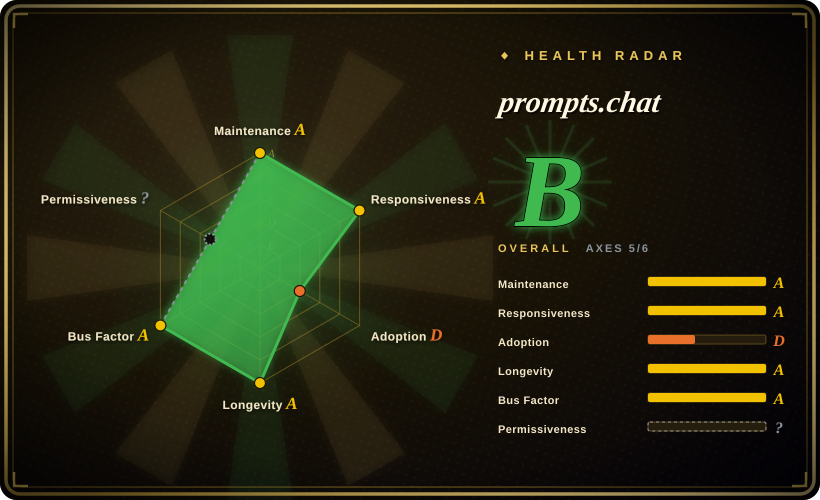

# prompts.chat

The world's largest open-source prompt library (f.k.a. Awesome ChatGPT Prompts): a community-voted collection of ready-made prompts, browsable at prompts.chat, exported as CSV/Markdown/HuggingFace dataset, and self-hostable as a private org prompt library.

## When to use

You're picking up an AI chat tool for a **common, already-solved ask** — "act as a Linux terminal", "act as a SQL translator", a job-interview persona — and you want a proven, copy-paste prompt instead of writing one from scratch. You browse prompts.chat (or `PROMPTS.md` / `prompts.csv` in the repo), sort by community votes, and copy. Or: you're a platform lead whose team keeps re-inventing prompts in private docs; you self-host prompts.chat (`npx prompts.chat new my-prompt-library`, or Docker) to get a shared, searchable, authenticated prompt library with custom branding, and contributors' prompts sync back to the public collection.

The decisive tradeoff versus [prompt-master](prompt-master.md) is **copy vs. generate**: prompts.chat wins when the task matches an existing entry — community voting is a real quality signal and the content is CC0 — but it gives you zero adaptation to your specifics and nothing for novel or tool-dialect tasks (Midjourney params, SD weights), where a generator skill composes per request.

## When NOT to use

- **Your task is novel or needs tool-specific syntax.** Use [prompt-master](prompt-master.md) to generate a prompt adapted to the target tool; a library only has what someone already wrote, and most entries here are prose personas for chat LLMs, not image/video/workflow-tool dialects.
- **You want to learn prompt engineering, not copy artifacts.** Use [Prompt Engineering Guide](prompt-engineering-guide.md) — structured chapters, papers, and techniques; prompts.chat's bundled interactive book is lighter and its main product is the prompt corpus itself.
- **You need quality guarantees per prompt.** Entries are user-submitted and vote-ranked, not reviewed; vote counts measure popularity, not effectiveness on current models — many top prompts were written for GPT-3.5-era behavior (2022–2023) [推断: effectiveness on 2026 models varies]. Treat prompts as drafts.
- **You need prompts under a restrictive-content policy.** Prompt text is CC0 (public domain) — fine for reuse — but the *site code* is MIT and the repo is a living web app; if you only want the data, consume `prompts.csv` or the HuggingFace dataset instead of deploying the app.
- **You don't want to run a web service.** The self-hosted path needs PostgreSQL and a Node deployment (see Ops difficulty). For a zero-infra library, read `PROMPTS.md` directly from the repo or use the hosted site.

## Comparison

| Alternative | In index | Our verdict | Tradeoff |
|---|---|---|---|
| [prompt-master](prompt-master.md) | ✅ | For novel tasks or non-chat tools choose prompt-master's generation pipeline; for common asks where a voted, proven prompt exists, copying from prompts.chat is faster and community-validated. | Generation adapts to your exact context but is unreviewed single-shot output; the library is proven text but unadapted and chat-LLM-centric. |
| [Prompt Engineering Guide](prompt-engineering-guide.md) | ✅ | For durable skill-building choose the Guide; for "give me a working prompt now" choose prompts.chat. | The Guide produces knowledge you must apply yourself; prompts.chat produces artifacts with no explanation of why they work. |
| [De-AI-Prompt-Enhancer-Writer-Booster-SKILL](../ai-writing/de-ai-writing/de-ai-prompt-enhancer-writer-booster-skill.md) | ✅ | For Chinese prose-voice and de-AI-flavor work choose the De-AI suite; prompts.chat's corpus is overwhelmingly English and persona-shaped. | De-AI is a niche skill for one writing problem; prompts.chat is a broad corpus with no per-domain depth. |
| Vendor prompt galleries (OpenAI/Anthropic example galleries) | 未收录 | For vendor-tuned examples on one platform, use that vendor's gallery; choose prompts.chat for cross-model, community-curated breadth and self-hosting. | Vendor galleries are closed and single-platform; prompts.chat is open (CC0 content) but not vendor-validated. |

## Tech stack

Next.js web app (TypeScript/React) with Radix UI components, MDX content (includes a 25+ chapter interactive prompting book under `src/content/book/`), Prisma ORM, Auth.js (`@auth/prisma-adapter`), Monaco editor, an MCP SDK integration, and AWS S3 SDK for media (all verified in `package.json`, 2026-09-18). Prompt data lives both in-repo (`prompts.csv`, `PROMPTS.md`) and in the app database; site contributions sync back to the repo automatically per README.

## Dependencies

Self-hosting requires PostgreSQL (verified in `prisma/schema.prisma`: `provider = "postgresql"`) and a Node.js runtime; Docker guide provided (`DOCKER.md`). Optional: S3-compatible storage for uploads, an auth provider via Auth.js. The public site (prompts.chat) needs nothing.

## Ops difficulty

**Low–medium.** Reading the corpus is zero-ops (raw files, hosted site, HF dataset). Self-hosting is a standard Next.js + PostgreSQL deployment with `npx prompts.chat new` scaffolding and a Docker path; the ongoing burden is auth-provider config, upgrades of a fast-moving app, and curating your org's prompt submissions. [未验证] No production deployment was exercised for this page; assessment is from README/SELF-HOSTING.md/DOCKER.md existence and stack shape.

## Health & viability

- **Maintenance (2026-09-18):** last push 2026-09-09 (~1 week prior); 78 open issues. Actively developed — the repo was rebuilt from a static Markdown list into a full web app.
- **Governance / bus factor:** creator `f` holds 1,707 commits, but there is a real contributor tail (devisasari 405, giorgiop 215, sinansonmez 207, ersinkoc 168) — healthier than a pure single-maintainer repo, though `f` still dominates [推断].
- **Backing & longevity:** ~3.8 years old (created 2022-12-05) and still active — a favorable age × still-active Lindy signal for the *corpus*; the *app* rewrite is much younger. No foundation backing; sustainability rests on the maintainer and the hosted site.
- **Adoption:** ~170.6k stars / ~21.9k forks (2026-09-18), GitHub Staff Pick, referenced by Harvard/Columbia, 40+ academic citations, "most liked dataset" on HuggingFace (all per README — star/fork/citation counts not independently re-verified beyond the GitHub API numbers).
- **Risk flags:** dual licensing (MIT code / CC0 content) is clear but unusual — check which part you're consuming; the README's self-reported "143k+ stars" lags the API number (harmless staleness). No relicense history observed.

## Caveats (unverified)

- [未验证] Self-hosting flow (`npx prompts.chat new`, Docker) was not exercised; ops assessment is from docs and stack shape only.
- [未验证] Whether public-site submissions truly "sync back automatically" to the repo as claimed — the mechanism was not traced in code.
- [推断] Many high-vote prompts date from the GPT-3.5 era; their effectiveness on current models is untested and likely uneven.
- [未验证] The MCP SDK integration's actual capability surface (what the MCP server exposes) was not inspected.
- [未验证] HuggingFace dataset "most liked" claim and academic citation count come from the README, not re-counted.
