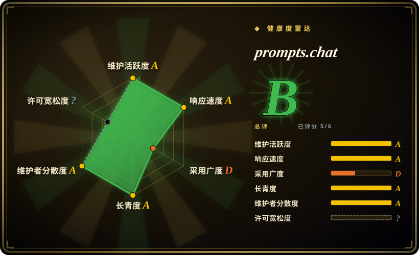

# prompts.chat

全球最大的开源提示词库（前身 Awesome ChatGPT Prompts）：社区投票选出的现成提示词合集，可在 prompts.chat 浏览，以 CSV/Markdown/HuggingFace 数据集导出，也可自托管为组织私有提示词库。

## 何时使用

你要用 AI 聊天工具做一件**常见的、已被解决过的**事——「扮演 Linux 终端」「扮演 SQL 翻译器」「面试官人格」——你想要一条经过验证、可直接复制的提示词，而不是从零写。你打开 prompts.chat（或仓库里的 `PROMPTS.md` / `prompts.csv`），按社区投票排序，复制走。或者：你是平台负责人，团队总在私有文档里重复造提示词；你自托管 prompts.chat（`npx prompts.chat new my-prompt-library`，或 Docker），得到一个可共享、可搜索、带鉴权和自定义品牌的提示词库，贡献者的提示词还会自动同步回公共合集。

相对 [prompt-master](prompt-master.zh.md) 的决定性取舍是**复制 vs 生成**：任务能对上库里现有条目时 prompts.chat 赢——社区投票是真实的质量信号，内容是 CC0——但它完全不针对你的具体情况做适配，对新任务或工具方言任务（Midjourney 参数、SD 权重）无货可出，那类场景要由生成器 skill 按请求现场组装。

## 何时不用

- **任务新颖，或需要工具专用语法。** 用 [prompt-master](prompt-master.zh.md) 生成适配目标工具的提示词；库只有别人写过的东西，且这里的条目绝大多数是聊天 LLM 的散文人格，不是图像/视频/工作流工具的方言。
- **你想学提示词工程，而不是复制工件。** 用 [Prompt Engineering Guide](prompt-engineering-guide.zh.md)——有结构化章节、论文和技术讲解；prompts.chat 附带的交互式书较浅，它的主产品是提示词语料本身。
- **你需要逐条的质量保证。** 条目是用户提交、按投票排序，没有 review；投票数衡量的是流行度不是在当前模型上的有效性——很多高票提示词写于 GPT-3.5 时代（2022–2023）[推断：在 2026 年的模型上效果参差]。把它们当草稿用。
- **你的内容政策受限。** 提示词文本是 CC0（公有领域），复用没问题——但*站点代码*是 MIT，且仓库是一个持续演进的 web app；只想要数据的话，直接消费 `prompts.csv` 或 HuggingFace 数据集，不必部署这个应用。
- **你不想运维一个 web 服务。** 自托管路径需要 PostgreSQL 和 Node 部署（见运维难度）。想要零基础设施的库，直接读仓库里的 `PROMPTS.md` 或用托管站点。

## 横向对比

| 替代品 | 是否收录 | 我们的评价 | 取舍 |
|---|---|---|---|
| [prompt-master](prompt-master.zh.md) | ✅ | 新任务或非聊天类工具选 prompt-master 的生成流水线；常见需求且库里已有投票验证过的提示词时，从 prompts.chat 复制更快。 | 生成能贴合你的具体上下文，但产物是无人复核的一次性输出；库给的是验证过的文本，但不做适配、以聊天 LLM 为中心。 |
| [Prompt Engineering Guide](prompt-engineering-guide.zh.md) | ✅ | 要沉淀能力选 Guide；「现在就给我一条能用的提示词」选 prompts.chat。 | Guide 产出的是需要你自己应用的知识；prompts.chat 产出工件但不解释为什么有效。 |
| [De-AI-Prompt-Enhancer-Writer-Booster-SKILL](../ai-writing/de-ai-writing/de-ai-prompt-enhancer-writer-booster-skill.zh.md) | ✅ | 中文文风与去 AI 味的工作选 De-AI 套件；prompts.chat 的语料几乎全是英文、以人格扮演为主。 | De-AI 是单一写作问题的利基 skill；prompts.chat 是广而浅的语料库。 |
| 厂商提示词画廊（OpenAI/Anthropic 官方示例库） | 未收录 | 要单一平台上厂商调优的示例，用该厂商画廊；要跨模型、社区策展的广度和自托管能力，选 prompts.chat。 | 厂商画廊闭源、绑定单一平台；prompts.chat 开放（内容 CC0）但无厂商背书验证。 |

## 技术栈

Next.js web 应用（TypeScript/React），Radix UI 组件、MDX 内容（含一本 25+ 章节的交互式提示词书，位于 `src/content/book/`）、Prisma ORM、Auth.js（`@auth/prisma-adapter`）、Monaco 编辑器、MCP SDK 集成、AWS S3 SDK 处理媒体（均于 2026-09-18 在 `package.json` 核实）。提示词数据同时存在于仓库文件（`prompts.csv`、`PROMPTS.md`）和应用数据库；按 README 说法，站点上的贡献会自动同步回仓库。

## 依赖

自托管需要 PostgreSQL（已在 `prisma/schema.prisma` 核实：`provider = "postgresql"`）和 Node.js 运行时；提供 Docker 指南（`DOCKER.md`）。可选：S3 兼容存储处理上传、经 Auth.js 接入鉴权提供方。使用公共站点（prompts.chat）则什么都不需要。

## 运维难度

**低到中。** 只读语料是零运维（raw 文件、托管站点、HF 数据集）。自托管是标准的 Next.js + PostgreSQL 部署，有 `npx prompts.chat new` 脚手架和 Docker 路径；持续负担在鉴权提供方配置、跟随这个快速演进的 app 升级、以及策展组织内的提示词提交。[未验证] 本页未实际跑过生产部署；评估基于 README/SELF-HOSTING.md/DOCKER.md 的存在与技术栈形态。

## 健康度与可持续性

- **维护（2026-09-18）：** 最后 push 2026-09-09（约 1 周前）；78 个 open issue。活跃开发中——仓库已从静态 Markdown 清单重建成完整 web app。
- **治理 / bus factor：** 创建者 `f` 有 1,707 次提交，但存在真实的贡献者长尾（devisasari 405、giorgiop 215、sinansonmez 207、ersinkoc 168）——比纯单人仓库健康，不过 `f` 仍占主导 [推断]。
- **背书与寿命：** 约 3.8 年历史（创建于 2022-12-05）且仍活跃——就*语料*而言是有利的「年龄 × 仍活跃」Lindy 信号；*应用*重写则年轻得多。无基金会背书；可持续性系于维护者和托管站点。
- **采用度：** 约 170.6k stars / 约 21.9k forks（2026-09-18），GitHub Staff Pick，被 Harvard/Columbia 引用，40+ 学术引用，HuggingFace「最受欢迎数据集」（均转述自 README——除 GitHub API 数字外未独立复核）。
- **风险旗标：** 双许可（代码 MIT / 内容 CC0）清晰但不常见——消费前确认用的是哪部分；README 自报的「143k+ stars」落后于 API 数字（无害的陈旧）。未见改协议历史。

## 存疑（未验证）

- [未验证] 自托管流程（`npx prompts.chat new`、Docker）未实际执行；运维评估仅基于文档与技术栈形态。
- [未验证] 公共站点的提交是否真如声明「自动同步回」仓库——未在代码中追踪该机制。
- [推断] 大量高票提示词出自 GPT-3.5 时代；在当前模型上的有效性未经测试，大概率不均。
- [未验证] MCP SDK 集成的实际能力面（MCP server 暴露了什么）未检查。
- [未验证] HuggingFace「最受欢迎数据集」与学术引用数来自 README，未重新统计。
