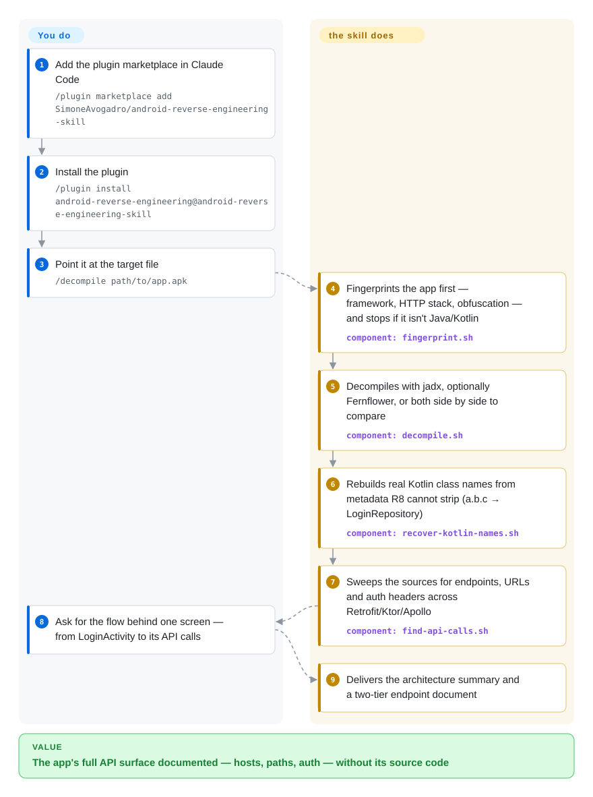

# android-reverse-engineering

You have an app's APK but not its source code, and you need to know which backend HTTP endpoints it calls and how it authenticates; a coding agent handed that raw will improvise decompiler flags and drown in obfuscated class names. This Claude Code plugin makes the agent follow a fixed pipeline instead — fingerprint the app first, decompile, rebuild the real Kotlin class names R8 hid, sweep the network layer — and return a structured API inventory.

## When to use

You're a defender, security researcher, or interop engineer holding an Android binary — your company's own app whose vendor vanished, a partner app you must integrate with and have no docs for, a suspicious APK in a lab — and you need its backend contract: hosts, paths, headers, auth flows. In Claude Code you say "decompile this APK and extract the APIs" (or run `/decompile path/to/app.apk`), and the skill drives the whole chain: a seconds-long triage that checks whether the app is even a native Java/Kotlin app, decompilation via jadx with Fernflower/Vineflower as the higher-quality second engine, extraction of HTTP endpoints across Retrofit, OkHttp, Ktor, Apollo and Volley, and a two-tier endpoint document (a flat inventory of every path plus deep dives on auth and payment flows).

The deciding tradeoff versus running jadx yourself is the *reading* work after decompilation: on real-world releases, classes come out as `a.b.c`, and this skill rebuilds the original `*Repository` / `*ViewModel` / `*UseCase` names from Kotlin metadata R8 cannot strip, mines `BuildConfig.java` (almost never obfuscated, leaks base URLs and API keys), and pulls quoted path literals that survive R8 inlining. Versus broad security packs (e.g. [reverse-skill](reverse-skill.md)), the tradeoff is scope discipline: this is one pipeline, in one language domain, with a Phase 0 whose whole job is to tell you to *stop* when the app is Flutter/React Native — and its content is Markdown workflow plus grep/wrapper scripts, no exploit payload corpora. The README frames lawful use as authorized testing, interoperability analysis (citing EU Directive 2009/24/EC and US DMCA §1201(f)), malware analysis and CTF — read that framing as the intended user, not a legal opinion.

## How it works

The skill is a workflow document the agent reads, plus deterministic scripts (bash; PowerShell variants experimental) the agent runs. You type `/decompile <file.apk|jar|aar>` — or just phrase the task naturally; the skill's trigger list includes Chinese keywords — and Claude Code follows Phases 0–5. `fingerprint.sh` unzips the package and scans file markers and the DEX string pool to report framework (Flutter / React Native / Cordova / Xamarin / native Kotlin), HTTP stack, obfuscation level and notable SDKs, and tells the agent to switch tools if the code isn't Java/Kotlin. `decompile.sh` wraps jadx, can run dex2jar + Fernflower as well and emit both outputs side by side for per-class comparison, and auto-handles XAPK bundles and split-APK wrappers. `recover-kotlin-names.sh` mines the `@DebugMetadata` / `@Metadata.d2` annotations — R8 renames JVM symbols but cannot delete the names the Kotlin runtime needs — producing an obfuscated→real map that `lookup-name.sh` queries or greps through. Finally `find-api-calls.sh` sweeps the sources for Retrofit/Ktor/Apollo patterns, hardcoded URLs and auth headers, and the agent assembles the endpoint table. The intelligence is the workflow and the engine-choice guidance; every observable artifact comes from the scripts, so you can run them standalone without Claude Code.

<!-- flow-steps:begin (generated from flows/android-reverse-engineering.json by tools/flow_card.py — do not edit) -->

Text version of the flow

1. **You**: Add the plugin marketplace in Claude Code — `/plugin marketplace add SimoneAvogadro/android-reverse-engineering-skill`
2. **You**: Install the plugin — `/plugin install android-reverse-engineering@android-reverse-engineering-skill`
3. **You**: Point it at the target file — `/decompile path/to/app.apk`
4. **android-reverse-engineering**: Fingerprints the app first — framework, HTTP stack, obfuscation — and stops if it isn't Java/Kotlin — component: `fingerprint.sh`
5. **android-reverse-engineering**: Decompiles with jadx, optionally Fernflower, or both side by side to compare — component: `decompile.sh`
6. **android-reverse-engineering**: Rebuilds real Kotlin class names from metadata R8 cannot strip (a.b.c → LoginRepository) — component: `recover-kotlin-names.sh`
7. **android-reverse-engineering**: Sweeps the sources for endpoints, URLs and auth headers across Retrofit/Ktor/Apollo — component: `find-api-calls.sh`
8. **You**: Ask for the flow behind one screen — from LoginActivity to its API calls
9. **android-reverse-engineering**: Delivers the architecture summary and a two-tier endpoint document

**Value**: The app's full API surface documented — hosts, paths, auth — without its source code

<!-- flow-steps:end -->

## When NOT to use

- **The target isn't a native Java/Kotlin app.** For Flutter, React Native, Cordova or Xamarin apps, the Java layer is a shell and decompiling it is near-useless — the skill's own Phase 0 says so and redirects (for Flutter it suggests `blutter` / strings over `libapp.so`). Use framework-specific extraction or runtime instrumentation instead of forcing this pipeline (issue #5).
- **You need what the app *actually* sends, not what it *can* send.** This is static extraction: endpoints assembled at runtime, obfuscation beyond class names, or server-side gating are invisible to it. For live traffic, use a proxy like mitmproxy or a hooking framework like Frida (both not indexed) — and remember cert pinning makes the proxy path fail exactly where this skill's static view succeeds.
- **Native `.so` code or binary-level RE.** No NDK/disassembly support (feature request #13 open as of 2026-09-30). Use Ghidra/IDA for that; use [reverse-skill](reverse-skill.md) for multi-domain RE that includes binaries, firmware and CTF categories.
- **Managed or EDR-monitored machines, or you care about shell-config hygiene.** `install-dep.sh` calls `sudo apt-get/dnf/pacman` when available and `add_to_profile()` appends PATH lines to `~/.zshrc`/`~/.bashrc` — both patterns verified in the script source on 2026-09-30, and both flagged by an external NLPM audit in issue #17 (2026-05-05, still open with no maintainer reply). The package names are hardcoded (no injection), but installing agent-executable scripts that write your rc files from a third party is a supply-chain decision. Run it in a throwaway VM and pin the tag.
- **macOS on the system `/bin/bash` 3.2.** `fingerprint.sh` and `find-api-calls.sh` use bash-4 constructs and pipe DEX bytes through Apple's `strings` (which mishandles stdin); both crash or silently mis-scan — open issues #30/#31 as of 2026-09-30. Install bash 5 or apply #30's fixes first.
- **Windows as a daily driver.** The PowerShell scripts are marked "experimental, still being stabilised" by the README itself, and parity work (#14, #21) is open; expect gaps versus the bash path.
- **You want an auditable engagement harness, not a pipeline.** No authorization gates, case files or evidence-chain reporting — that governance is [reverse-skill](reverse-skill.md)'s reason to exist; this skill assumes the operator owns the authorization decision.
- **No rights to the target.** Nothing in the tool checks or enforces authorization (unlike reverse-skill's hard `case-guard`). Unauthorized RE of apps you don't own or aren't contracted to test may violate IP and computer-fraud law; the disclaimer places that judgment entirely on you.

## Comparison

| Alternative | In index | Our verdict | Tradeoff |
|---|---|---|---|
| [reverse-skill](reverse-skill.md) | ✅ | Pick this one when the task is exactly "document the HTTP surface of an Android binary" and you want the pipeline without router machinery; pick reverse-skill when the engagement spans many RE/pentest/CTF domains and needs authorization gates, case files and evidence-chain reporting. | This skill is narrow, payload-free and lands in a clean laptop; reverse-skill is 45 playbooks with a WAF-bypass corpus that trips AV/EDR and an auto-bootstrap the author's own issue tracker disputes. |
| [Anthropic Cybersecurity Skills](anthropic-cybersecurity-skills.md) | ✅ | Neither substitutes for the other: pick the Anthropic pack for vendor-authored defensive runbooks mapped to MITRE/NIST frameworks; pick this skill for Android app extraction, which no indexed pack covers. | Vendor governance and breadth versus single-task depth with executable scripts. |
| jadx used directly (not indexed) | ❌ | Pick raw jadx when you already know the post-decompile workflow — engine flags, output layout, where endpoints hide — and only need the decompiler; pick this skill when the reading/extracting loop around jadx is your bottleneck, especially on R8-obfuscated Kotlin. | The skill wraps the same engine (plus Fernflower comparison) and adds recovery scripts; raw jadx has no agent workflow, no third-party script surface, and not added in this tab batch. |
| MobSF (not indexed) | ❌ | Pick MobSF when you want a self-hosted automated mobile-pentest platform that scans APKs/IPAs against OWASP MASVS and serves reports to a team; pick this skill when the work is interactive, inside your coding agent, and aimed at API documentation rather than a compliance scan. | MobSF is a heavier always-on platform with static+dynamic modules; this skill is zero-infrastructure but Claude Code-bound and narrower. Not added in this tab batch. |
| Frida (not indexed) | ❌ | Pick Frida when the answer only exists at runtime — dynamic payloads, anti-tamper bypass, actual request bodies — and you have a device to instrument; pick this skill when a binary file and a laptop are all you can bring. | Frida is dynamic, needs a running device and code-signing evasion; this is purely static. Not added in this tab batch. |

## Health & viability

- **Maintenance (2026-09):** active in pulses — last push 2026-09-08 (macOS grep portability fix), bursts in Feb, Apr 27–28, Jun 10 and Sep 8; 31 commits total. The GitHub release flow lags the content: one release (v1.1.0, 2026-04-27) while `plugin.json` says 1.5.0, so pinning by tag ≠ pinning what you install. Open issues #17 (security disclosure, 2026-05-05) and #30/#31 (macOS) sat unanswered as of 2026-09-30, while PR-level fixes (#23, #28) got merged — responsiveness is real but uneven.
- **Governance / bus factor:** single `User` owner (SimoneAvogadro, 16 of 31 commits); 8 contributors, of which @tajchert (8 commits: Phase 0 fingerprinting, Kotlin name recovery, Ktor/Apollo extraction — PR #16) and @philjn (PowerShell port — #8) carry the load-bearing modules. The roadmap is one person's availability. [推断]
- **Age & Lindy (2026-09):** created 2026-02-02 — ~8 months, ~7.9k stars / ~905 forks (GitHub API, 2026-09-30). That is fast for the niche but an order of magnitude below the 36k-in-4-months anomaly of its sibling reverse-skill; still, no multi-year survival and no security-community peer review of the workflow content — treat stars as attention, not validation. [推断]
- **Adoption (2026-09):** author's launch posts in r/ClaudeAI and r/androiddev (Feb 2026) drew real threads; third-party skill directories list it (TypingMind), and community contributions (Chinese trigger keywords #4, Windows #8, dex2jar fork migration #12) indicate people are using, not just starring. No HN front-page appearance found. [未验证]
- **Risk flags:** (1) open unaddressed security disclosure #17 — `install-dep.sh` sudo elevation + persistent rc-file/PATH writes (patterns verified in source, the HIGH severity is the auditor's call); (2) macOS out-of-box breakage (#30/#31) from an author who develops on Linux; (3) version-pin trap (manifest 1.5.0 vs last tag v1.1.0); (4) dual-use by nature — API extraction is exactly what account-abusers enumerate — mitigated only by the README's lawful-use disclaimer, with no in-tool authorization gate (contrast reverse-skill's `case-guard`). Apache-2.0, license file read, no relicense history.

## Caveats (unverified)

- [未验证] Stars (~7.9k), forks (~905), 8 contributors, 9 open issues, 31 commits are snapshots from the GitHub API on 2026-09-30; velocity numbers are date-sensitive.
- [未验证] The "~100% of `*Repository`/`*ViewModel`/`*UseCase`/`*Impl` classes, ~80% of DTOs recovered" figure is author-stated in README/SKILL.md; no external benchmark or reproduction was found or run.
- [未验证] No actual decompilation was executed for this page — the assessment comes from reading SKILL.md, the command file, the scripts' source and the issue tracker; script behavior descriptions (sudo paths, rc writes, bash-4 constructs) were verified by reading code, not running it.
- [未验证] The NLPM scanner's HIGH severity ratings in issue #17 are a third party's judgment; the code patterns themselves (hardcoded package names, `add_to_profile` at install-dep.sh:144) are confirmed.
- [推断] Other harnesses could load `SKILL.md` since it follows the generic Agent Skills format, but the only documented and tested install path is Claude Code's plugin marketplace; Cursor support (#21) is still open.
- [未验证] jadx, MobSF and Frida characterizations in Comparison come from general knowledge, not re-verified for this page; none was added in this tab batch.
- [未验证] Community-reach claims (Reddit threads, TypingMind listing) come from a 2026-09-30 web search; no exhaustive discussion census (e.g. HN Algolia) was run.
