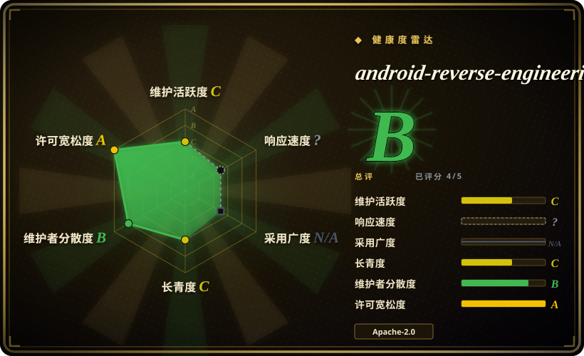
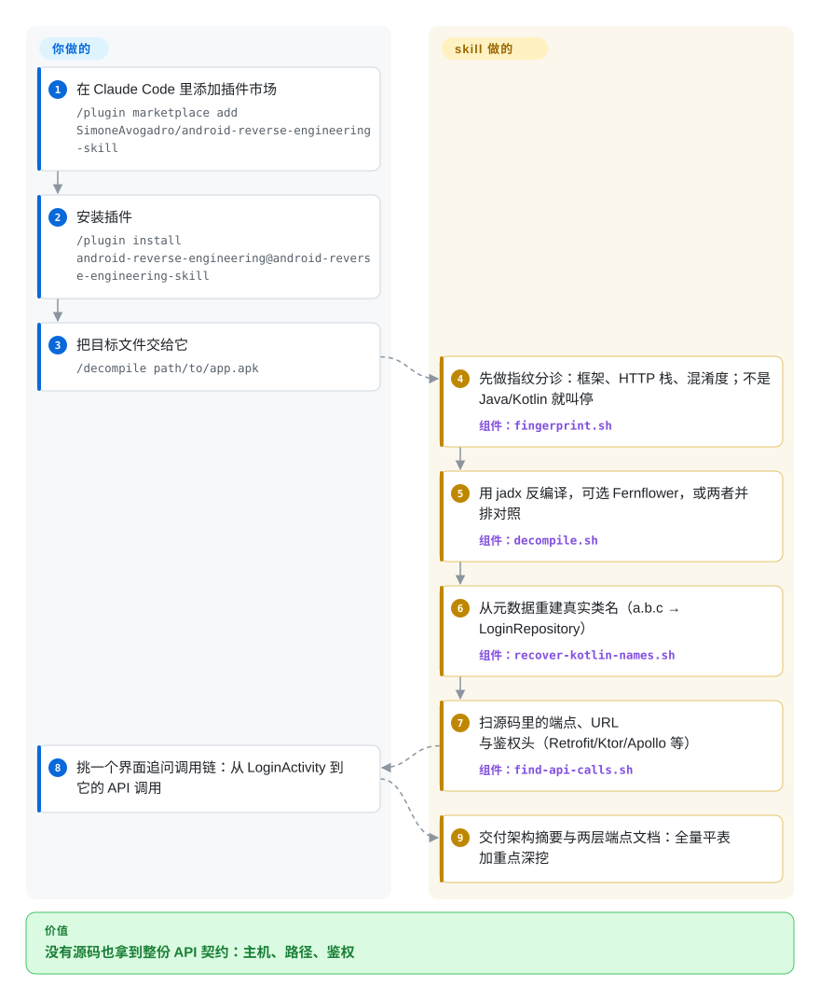

# android-reverse-engineering

你手里只有一个应用的 APK，没有源码，却要知道它调用哪些后端 HTTP 接口、怎么鉴权；把这件事直接丢给 coding agent，它会即兴敲反编译参数，然后淹死在混淆成一两个字母的类名里。这个 Claude Code 插件让 agent 改走固定流水线：先给应用做指纹分诊、再反编译、从 R8 剥不掉的元数据里重建真实 Kotlin 类名、最后扫网络层，产出一份结构化的 API 清单。

## 何时使用

你是防守方、安全研究员或做互操作工程的：手里有一个安卓二进制——供应商跑路后自家应用、没有对接文档必须摸清的合作方应用、实验室里的可疑 APK——你需要它的后端契约：主机、路径、请求头、鉴权流程。在 Claude Code 里说一句「反编译这个 APK 并提取 API」（或运行 `/decompile path/to/app.apk`），skill 接管整条链路：几秒钟的分诊先确认这应用到底是不是原生 Java/Kotlin；jadx 反编译，Fernflower/Vineflower 作为高质量第二引擎；跨 Retrofit、OkHttp、Ktor、Apollo、Volley 提取 HTTP 端点；最后产出两层文档——全量端点平表，外加对鉴权与支付流程的深挖。

和你自己敲 jadx 相比，决定性的取舍在反编译**之后**的阅读工作：真实发行版的类名都是 `a.b.c`，而这个 skill 会从 R8 无法删除的 Kotlin 元数据里重建 `*Repository`/`*ViewModel`/`*UseCase` 的真实名字、翻几乎从不混淆的 `BuildConfig.java`（常漏出 base URL 和第三方 key）、并且捞出能在 R8 内联后存活的带引号路径字面量。和大型安全包（如 [reverse-skill](reverse-skill.zh.md)）相比，取舍是范围克制：它就一条流水线，只管一个语言域，Phase 0 的全部意义就是在你面对 Flutter/React Native 应用时叫你**停手**；内容只有 Markdown 工作流加 grep/包装脚本，没有漏洞利用 payload 语料。README 把合法用途界定为授权测试、互操作分析（援引 `EU Directive 2009/24/EC` 与 `US DMCA §1201(f)`）、恶意软件分析与 CTF——请把这读作目标用户声明，而非法律意见。

## 怎么用起来

这个 skill 是一份给 agent 读的工作流文档，外加它要跑的确定性脚本（bash；PowerShell 版是实验性）。你敲 `/decompile <file.apk|jar|aar>`，或者自然语言说出任务（触发词表里含中文关键词），Claude Code 随后按 Phase 0–5 执行。`fingerprint.sh` 解包并扫文件标记与 DEX 字符串池，报出框架（Flutter/React Native/Cordova/Xamarin/原生 Kotlin）、HTTP 栈、混淆程度和值得注意的 SDK，并在代码不是 Java/Kotlin 时让 agent 换工具。`decompile.sh` 包装 jadx，可再走 dex2jar + Fernflower 把两套输出并排产出供逐类比较，还自动处理 XAPK 包与「套壳」分体 APK。`recover-kotlin-names.sh` 挖 `@DebugMetadata`/`@Metadata.d2` 注解——R8 会重命名 JVM 符号但删不掉 Kotlin 运行时必需的名字——生成「混淆名→真名」映射，由 `lookup-name.sh` 查询或带注解地 grep。最后 `find-api-calls.sh` 扫 Retrofit/Ktor/Apollo 模式、硬编码 URL 与鉴权头，agent 汇总成端点表。智能在工作流和引擎选择策略里；所有看得见的产物都来自脚本，所以脱离 Claude Code 你也能单独跑它们。

<!-- flow-steps:begin (generated from flows/android-reverse-engineering.json by tools/flow_card.py — do not edit) -->

流程文字版

1. **你**：在 Claude Code 里添加插件市场 — `/plugin marketplace add SimoneAvogadro/android-reverse-engineering-skill`
2. **你**：安装插件 — `/plugin install android-reverse-engineering@android-reverse-engineering-skill`
3. **你**：把目标文件交给它 — `/decompile path/to/app.apk`
4. **android-reverse-engineering**：先做指纹分诊：框架、HTTP 栈、混淆度；不是 Java/Kotlin 就叫停 — 组件：`fingerprint.sh`
5. **android-reverse-engineering**：用 jadx 反编译，可选 Fernflower，或两者并排对照 — 组件：`decompile.sh`
6. **android-reverse-engineering**：从元数据重建真实类名（a.b.c → LoginRepository） — 组件：`recover-kotlin-names.sh`
7. **android-reverse-engineering**：扫源码里的端点、URL 与鉴权头（Retrofit/Ktor/Apollo 等） — 组件：`find-api-calls.sh`
8. **你**：挑一个界面追问调用链：从 LoginActivity 到它的 API 调用
9. **android-reverse-engineering**：交付架构摘要与两层端点文档：全量平表加重点深挖

**价值**：没有源码也拿到整份 API 契约：主机、路径、鉴权

<!-- flow-steps:end -->

## 何时不用

- **目标不是原生 Java/Kotlin 应用。** Flutter、React Native、Cordova、Xamarin 应用的 Java 层只是空壳，反编译它几乎无用——skill 自己的 Phase 0 就这么说，并让你转投对口工具（Flutter 建议 `blutter` 或直接读 `libapp.so` 的 strings）。这类目标请用框架专用提取或运行时插桩，别硬推这条流水线（issue #5）。
- **你要的是应用「实际发了什么」，而不是「能发什么」。** 这是纯静态提取：运行时拼装的端点、类名之外的混淆、服务端开关都看不见。要看活流量就用 mitmproxy 或 Frida 这类运行时工具（均未收录）——且证书固定会让代理路线恰恰失败在静态视图成功的地方。
- **需要分析原生 `.so` 或做二进制级逆向。** 不支持 NDK/反汇编（功能请求 #13 截至 2026-09-30 仍未关闭）。二进制用 Ghidra/IDA；要覆盖二进制、固件、CTF 多域的逆向，用 [reverse-skill](reverse-skill.zh.md)。
- **受管或带 EDR 的机器，或你在意 shell 配置卫生。** `install-dep.sh` 在有 sudo 时会调 `sudo apt-get/dnf/pacman`，`add_to_profile()` 会往 `~/.zshrc`/`~/.bashrc` 追加 PATH——两个模式均已在 2026-09-30 读源码核实；外部 NLPM 审计在 issue #17（2026-05-05 提出，截至 2026-09-30 无人回复）点名了它们。包名是硬编码的（无注入风险），但让第三方脚本写你的 rc 文件是个供应链决策：在一次性虚拟机里跑，并 pin 好 tag。
- **macOS 用系统自带 `/bin/bash` 3.2。** `fingerprint.sh` 与 `find-api-calls.sh` 用了 bash-4 语法，还把 DEX 字节流管给 Apple 的 `strings`（它对 stdin 处理有 bug）：要么直接崩要么悄悄扫坏——#30/#31 截至 2026-09-30 仍未关闭。先装 bash 5 或合入 #30 的修复。
- **Windows 当主力。** PowerShell 脚本被 README 自己标注「实验性、仍在稳定化」，对齐工作（#14、#21）还开着；预期和 bash 路线有差距。
- **你要的是可审计的作战 harness，不是一条流水线。** 本包没有授权闸门、建档和证据链报告——那套治理是 [reverse-skill](reverse-skill.zh.md) 的存在理由；本 skill 默认授权判断由操作者自己负责。
- **对目标没有权利。** 工具内不做任何授权检查或强制（对比 reverse-skill 的硬 `case-guard`）。对你不拥有、未签约测试的应用做未授权逆向，可能触犯知识产权与计算机欺诈法律；免责声明把这个判断完全留给你。

## 横向对比

| 替代品 | 是否收录 | 我们的评价 | 取舍 |
|---|---|---|---|
| [reverse-skill](reverse-skill.zh.md) | ✅ | 任务恰好是「给一个安卓二进制的 HTTP 面出文档」、不想要路由器机制时选本页；作战横跨多个逆向/渗透/CTF 域、需要授权闸门、建档与证据链报告时选 reverse-skill。 | 本页窄、无 payload 语料、能干干净净装进普通笔记本；reverse-skill 是 45 个 playbook 外加会触发 AV/EDR 的绕过语料和自家 issue 都在争议的自动 bootstrap。 |
| [Anthropic Cybersecurity Skills](anthropic-cybersecurity-skills.zh.md) | ✅ | 两者互不替代：要厂商撰写、映射 MITRE/NIST 框架的防守 runbook 时选 Anthropic 包；要安卓应用提取时选本页——收录里没有第二个包覆盖这件事。 | 厂商治理与广度，对单任务纵深加可执行脚本。 |
| 直接手用 jadx（未收录） | ❌ | 你已经熟悉反编译后的全套工作流——引擎参数、输出结构、端点藏在哪——只缺反编译器本身时直接 jadx；agent 在 jadx 外围的读取/提取循环才是你的瓶颈时（尤其 R8 混淆的 Kotlin）选本页。 | 本页包的就是同一个引擎（外加 Fernflower 对照）再配上名字恢复脚本；裸 jadx 没有 agent 工作流、没有第三方脚本面。本批未收录。 |
| MobSF（未收录） | ❌ | 要一个自托管的自动移动渗透平台、对 APK/IPA 按 OWASP MASVS 出报告给团队看时选 MobSF；工作是交互式、在编码 agent 内、目标是 API 文档而非合规扫描时选本页。 | MobSF 是常驻重平台、静态+动态都有模块；本页零基建但绑死 Claude Code 且更窄。本批未收录。 |
| Frida（未收录） | ❌ | 答案只存在于运行时——动态拼装的载荷、反调试绕过、真实请求体——且有设备可插桩时选 Frida；只带得动一个二进制文件和一台笔记本时选本页。 | Frida 是动态路线，要运行中的设备和过签手段；本页纯静态。本批未收录。 |

## 健康度与可持续性

- **维护（2026-09）：** 脉冲式活跃——最近 push 2026-09-08（macOS grep 移植修复），提交集中在 2 月、4 月 27–28、6 月 10 与 9 月 8 日，共 31 个 commit。GitHub release 落后于内容：只发过 v1.1.0（2026-04-27）而 `plugin.json` 已到 1.5.0，**按 tag pin ≠ pin 到你装的东西**。#17（安全披露，2026-05-05）与 #30/#31（macOS）截至 2026-09-30 无人回复，而 PR 级修复（#23、#28）都被合并——响应是真实的，但不均匀。
- **治理/巴士因子：** 单一 `User` owner（SimoneAvogadro，31 个 commit 里占 16 个）；8 个 contributor，其中 @tajchert（8 个 commit：Phase 0 指纹、Kotlin 名字恢复、Ktor/Apollo 提取，PR #16）与 @philjn（PowerShell 移植，#8）扛着承重模块。路线图系于一人的可用时间。[推断]
- **年龄与 Lindy（2026-09）：** 创建于 2026-02-02——约 8 个月，约 7.9k star / 约 905 fork（GitHub API，2026-09-30）。对这个 niche 算快，但比同目录 reverse-skill「4 个月 36k」的异常量级低一个数量级；仍然没有多年存续记录，也没有安全社区对工作流内容的同行评审——star 当注意力读，不当验证读。[推断]
- **采用（2026-09）：** 作者在 r/ClaudeAI 和 r/androiddev 的发布帖（2026-02）引出了真实讨论；第三方技能目录（TypingMind）收录了它；社区贡献（中文触发词 #4、Windows 移植 #8、dex2jar 迁移 #12）说明是真在用，不只是 star。未检索到 HN 首页讨论。[未验证]
- **风险标记：**（1）开着的、无人处理的安全披露 #17——`install-dep.sh` 的 sudo 提权与 rc 文件/PATH 持久写入（代码模式已核实，HIGH 定级是审计方观点）；（2）macOS 开箱即坏（#30/#31），作者是 Linux 开发环境；（3）版本 pin 陷阱（manifest 1.5.0 对最后一个 tag v1.1.0）；（4）性质上是双用途——提取 API 正是账号滥用者想要的东西——唯一缓解是 README 的合法用途声明，工具内没有授权闸门（对比 reverse-skill 的 `case-guard`）。Apache-2.0，已读 LICENSE 文件，无再许可史。

## 存疑（未验证）

- [未验证] star（约 7.9k）、fork（约 905）、8 contributor、9 个 open issue、31 个 commit 均为 2026-09-30 GitHub API 快照；速度类数字对日期敏感。
- [未验证] 「恢复约 100% 的 `*Repository`/`*ViewModel`/`*UseCase`/`*Impl`、约 80% 的 DTO」是 README/SKILL.md 里的作者自述；未找到也未运行任何外部基准。
- [未验证] 本页没有实际执行过一次反编译——评估来自阅读 SKILL.md、命令文件、脚本源码与 issue tracker；脚本行为描述（sudo 路径、rc 写入、bash-4 语法）是读代码核实的，不是跑出来的。
- [未验证] issue #17 里 NLPM 扫描器的 HIGH 定级是第三方判断；代码模式本身（硬编码包名、install-dep.sh 第 144 行起的 `add_to_profile`）已确认存在。
- [推断] 其它 harness 理论上能加载 `SKILL.md`（它遵循通用 Agent Skills 格式），但有文档、被测试过的安装路径只有 Claude Code 插件市场；Cursor 支持（#21）仍未关闭。
- [未验证] 对比表中 jadx、MobSF、Frida 的刻画来自一般认知，未为本页重新核实；三者本批均未收录。
- [未验证] 社区触达（Reddit 帖、TypingMind 列表）来自 2026-09-30 的网络检索；未做穷尽的讨论普查。
