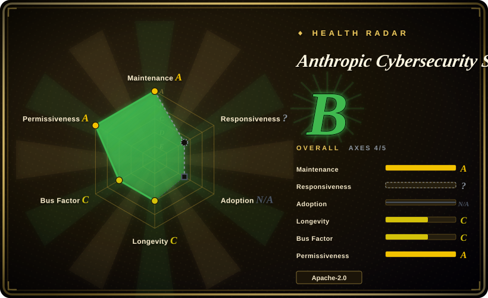
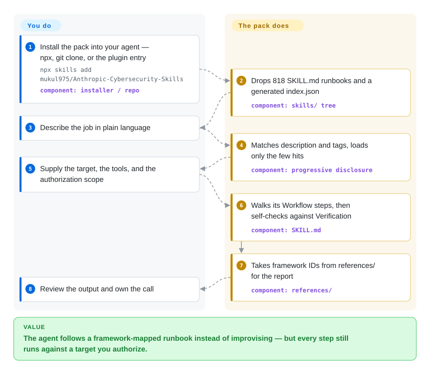

# Anthropic Cybersecurity Skills

Your agent will happily run a memory dump through Volatility or draft a Sigma rule and skip the step a senior analyst would not skip — this pack is 818 `SKILL.md` runbooks that hand it the procedure, plus the ATT&CK / D3FEND / NIST mapping, loaded on demand.

## When to use

You're a security engineer, SOC analyst, or DFIR responder driving Claude Code (or GitHub Copilot, Codex CLI, Cursor, Gemini CLI…) through real defensive work — triaging an alert, hunting lateral movement, carving a memory dump, or mapping findings back to ATT&CK for the incident report. The agent can technically run Volatility, write Sigma rules, or query a SIEM, but it doesn't know the idiomatic procedure, the right flags, or which framework technique a given observation maps to — so it improvises, skips verification, or labels the wrong TTP. You want it to follow the steps a seasoned analyst would, with a vetted runbook and standards mappings in front of it.

You reach for this pack to drop in a security playbook: install once (`npx skills add mukul975/Anthropic-Cybersecurity-Skills`, `git clone`, or the Claude Code plugin entry), and the agent gains on-demand skills across dozens of domains — cloud security, threat hunting, threat intelligence, network security, web-app security, digital forensics, malware analysis, and more. Each skill ships a `SKILL.md` plus `references/` (framework mappings, procedure detail), `scripts/` (helper Python), and sometimes `assets/` (checklists, report templates); the agent pulls in only the ones a task needs and gets the workflow already mapped to ATT&CK / D3FEND / NIST so the write-up speaks the language your reviewers expect.

## Q&A

**We want to harden our own project — is this the right pick?**

No, for that job it is close to dead weight. The pack is operator knowledge for security work performed *against targets* (memory forensics, red-team tradecraft, and configuring enterprise platforms such as Proofpoint, Mimecast, Zscaler, CyberArk, SailPoint, Splunk SOAR, Suricata). If your project is a service or a content repo with no SIEM, no EDR, no PAM and no Kubernetes, almost none of its 818 skills have anything to act on. The slice that does transfer is DevSecOps and supply-chain security — and that slice reduces to a few things your agent already knows without a skill pack: pin CI actions to commit SHAs, run a dependency scanner, generate an SBOM. Harden the project with harness-native gates (`/guard-secure`, `/guard-threat-model`) and keep this pack for actual security operations.

## How it works

You install the pack once, and 818 `SKILL.md` files land in your agent's skills directory — one folder per runbook, each with a `references/` directory of framework IDs and often a helper script. Nothing is loaded at install time: your agent reads each file's frontmatter (a one-line `description` plus `tags`) as a routing index, and pulls in only the handful that match your task, so the other ~815 files never enter the conversation. You describe the job in plain language, supply the target environment and the authorization, and the agent walks the matched file's `Workflow` section step by step and then checks itself against that same file's verification list. What the pack does *not* bring is anything to run against — no Volatility binary, no samples, no SIEM, no credentials. Think of it as the checklist a senior analyst carries, not the lab they work in: it tells the agent which step comes next and what evidence closes it out, while you own the environment, the legal scope, and the final call.

<!-- flow-steps:begin (generated from flows/anthropic-cybersecurity-skills.json by tools/flow_card.py — do not edit) -->

Text version of the flow

1. **You**: Install the pack into your agent — npx, git clone, or the plugin entry — `npx skills add mukul975/Anthropic-Cybersecurity-Skills` — component: `installer / repo`
2. **Anthropic Cybersecurity Skills**: Drops 818 SKILL.md runbooks and a generated index.json — component: `skills/ tree`
3. **You**: Describe the job in plain language
4. **Anthropic Cybersecurity Skills**: Matches description and tags, loads only the few hits — component: `progressive disclosure`
5. **You**: Supply the target, the tools, and the authorization scope
6. **Anthropic Cybersecurity Skills**: Walks its Workflow steps, then self-checks against Verification — component: `SKILL.md`
7. **Anthropic Cybersecurity Skills**: Takes framework IDs from references/ for the report — component: `references/`
8. **You**: Review the output and own the call

**Value**: The agent follows a framework-mapped runbook instead of improvising — but every step still runs against a target you authorize.

<!-- flow-steps:end -->

## When NOT to use

- **You want to harden your own application, not run security operations.** The bulk of the pack is operator knowledge for platforms you would have to already own — Volatility on memory images, Cobalt Strike beacon analysis, Suricata inline IPS, CyberArk / SailPoint / Proofpoint configuration, Splunk SOAR playbooks. On a project with no service, no SIEM, no EDR and no Kubernetes cluster, almost nothing here lands; the applicable DevSecOps and supply-chain slice is small enough that bespoke prompts or a one-line CI policy cover it.
- **You already curate a security skill/runbook stack you trust.** This pack is broad and opinionated; layering ~818 skills on top of your own runbooks invites conflicting guidance and double-routing. Pick one source of truth per domain.
- **You're on a harness with no skill loader.** It activates through the agentskills.io / open Agent Skills standard (Claude Code, Copilot, Codex, Cursor, Gemini CLI, MCP-compatible agents). On a bespoke agent with no loader, the `SKILL.md` files are inert markdown and won't auto-activate.
- **You need the security tooling preinstalled.** The skills document *how* to use Volatility, nmap, YARA, etc. — they don't bring the binaries, a SIEM, lab data, or cloud credentials. You still provision and operate those, and you own the authorization scope for anything offensive.
- **You want enforced guardrails, not advice.** Skill docs are advisory prompt context, not a sandbox or policy engine; the agent can still run a destructive or out-of-scope command. Offensive/red-team skills carry real legal and operational risk and need explicit authorization regardless of what a skill says.
- **You need a stable, audited security baseline.** Fast-moving single-author repo (734 → 818 skills across recent releases) where published depth is uneven: a checking pass over the `skills/` tree found 133 of 818 skills opening their `When to Use` with the same machine-generated sentence. Pin a version and read the specific skills you depend on.

## Comparison

| Alternative | In index | Our verdict | Tradeoff |
|---|---|---|---|
| `/guard-secure`, `/guard-threat-model` style security skills in a personal/team skill stack | 未收录 | When you're hardening your own codebase or data path and need gates you can enforce, pick these harness-native skills. | Hand-curated, harness-native security gates you already trust; far narrower coverage. This pack trades enforceability and curation for 800+ ready-made domain runbooks aimed at security *operations*, not at your own app. |
| MITRE ATT&CK Navigator / framework docs (read the source mappings yourself) | 未收录 | Choose primary framework docs when authoritative current technique data matters more than agent workflows. | Authoritative, always-current technique data, but no agent-executable workflow — you wire ATT&CK to procedure manually. This pack pre-binds workflows to (a snapshot of) those frameworks. |
| Security MCP servers (e.g. tool-wrapping SIEM/scanner MCPs) | 未收录 | Choose security MCP servers when live tool access with structured I/O is the missing piece. | Give the agent live *tool access* with structured I/O; this pack gives *procedural knowledge*, not connectivity. Complementary, not substitutes — one knows the steps, the other can execute against a system. |
| Bespoke per-task prompting (write your own `SKILL.md`) | 未收录 | Choose bespoke prompts when maximum control and zero unused surface outweigh a large bundle. | Maximum control and zero unused surface, but you rebuild and maintain curated, framework-mapped runbooks for every domain yourself instead of installing a vetted bundle. |

## Health & viability

- **Responsiveness**: Cannot be scored — type_na.
- **Maintenance** — very active and fast-moving: last release v1.3.0 (2026-06), last push 2026-08-31, not archived (as of 2026-09). The `skills/` tree has grown past the tag (818 skill directories on `main`), and an `index.json` was machine-regenerated 2026-08-24, so content and framework versions shift release-to-release — pin a version and read the specific skills you depend on.
- **Governance & bus factor** — single-author community repo (`User`-owned, `mukul975`), 33.3k stars, 4.0k forks, 264 watchers. The bus factor is the problem: of 245 commits, 189 (78%) are the maintainer's, across 15 contributors, and the README itself says PRs have sat open for months. One person owns 818 safety-relevant runbooks of uneven depth. The "Anthropic" in the name is **not** an endorsement — it's a community project, not an official release.
- **Age & Lindy** — created 2026-02-25, ~7 months old as of 2026-09: young and hyped (33k stars in seven months, alongside a linked survey and a commercial playground in the README), Lindy-unproven. For *security* runbooks, newness compounds the review burden — these workflows have no long track record.
- **Risk flags** — Apache-2.0 (clear reuse), but published depth is genuinely uneven, and the README's "every skill encodes real practitioner workflows, not generated summaries" does not survive a check of the tree — the README cannot even agree on its own size (818, 817 and 734 skills appear in different places): 133 of 818 skills open `When to Use` with the same generated sentence ("…capabilities in your environment / when establishing security controls aligned to compliance requirements…"), concentrated in the `implementing-*` enterprise-product skills, and one flagship skill ends by assembling its report with a chain of `echo` statements. The strongest skills are real (the Cobalt Strike one gives the beacon TLV field IDs and the per-version XOR keys); the weakest are product-config prose with a fixed template. Skills are advisory prompt context, **not** a sandbox, validated detections, or a policy engine; offensive/red-team skills carry real legal and operational risk and need explicit authorization regardless of what a skill says.

## Caveats (unverified)

- [未验证] Metadata re-checked 2026-09-24 (GitHub API): latest release v1.3.0 (published 2026-06-22), `main` last pushed 2026-08-31 (SHA `54a7988`), license Apache-2.0, primary language Python, not archived, 33,269 stars / 4,040 forks / 15 contributors. Re-verify before relying on a specific version's behavior or skill list.
- [未验证] Star count is unreliable and date-sensitive (21.5k in 2026-06, 33.3k in 2026-09); treat as indicative only, not as a quality or trust signal.
- [未验证] Framework versions claimed (MITRE ATT&CK v19.1, NIST CSF 2.0, ATLAS 2026.07, D3FEND v1.4.0, NIST AI RMF 1.0, MITRE F3 v1.1) and the "26+ platforms" compatibility claim come from the README; mapping accuracy and per-harness activation fidelity were not independently confirmed here. The repo's CI does validate frontmatter shape and agentskills.io conformance (including a guard against hand-rolled YAML parsers, added after a bug that shipped 604 broken skill descriptions) — that is shape, not mapping correctness.
- [未验证] The repo provides helper Python scripts and templates but no standalone CLI or MCP server; the `agentskills.io` standard and `npx skills add` installer are external dependencies whose availability/behavior are not verified here.
- [未验证] The repo name references "Anthropic" but this is a community project by `mukul975`, not an official Anthropic release — do not treat the name as an endorsement.
- [推断] Because skills are markdown docs loaded into the agent, their guidance is advisory — the agent can still run incorrect, destructive, or out-of-scope security actions; these are not enforced controls, validated detections, or a substitute for authorization and human review.
