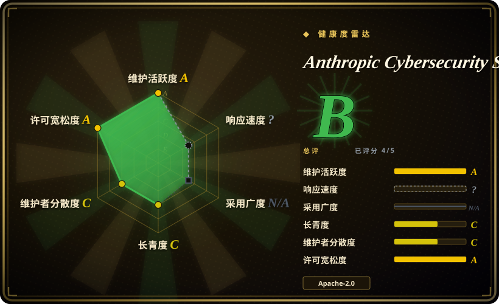
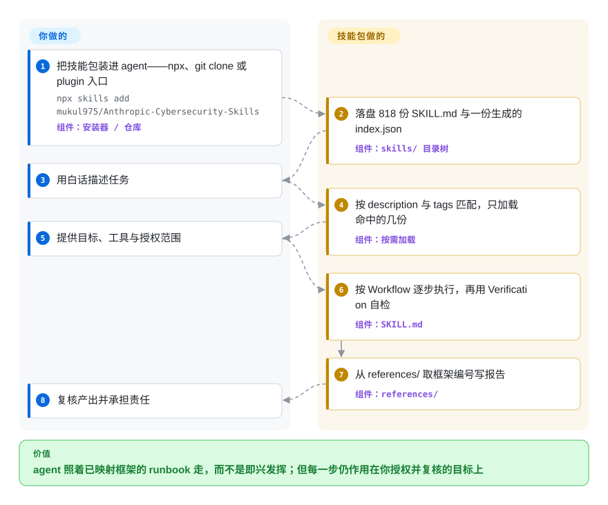

# Anthropic Cybersecurity Skills

你的 agent 会拿 Volatility 跑内存转储、起草 Sigma 规则，却跳过资深分析师不会跳过的那一步——这个包是 818 份 `SKILL.md` runbook，把流程连同 ATT&CK / D3FEND / NIST 映射一起交给它，按需加载。

## 何时使用

你是安全工程师、SOC 分析师或 DFIR 应急响应人员，驱动 Claude Code（或 GitHub Copilot、Codex CLI、Cursor、Gemini CLI……）做真实的防御工作——研判告警、狩猎横向移动、解析内存转储，或把发现回映射到 ATT&CK 写进事件报告。Agent 技术上能跑 Volatility、写 Sigma 规则、查 SIEM，但它不懂地道的操作流程、正确的参数，也不知道某个观测对应哪个框架技术——于是它即兴发挥、跳过验证，或贴错 TTP。你希望它照着资深分析师的步骤走，面前摆着经过审核的 runbook 和标准映射。

你为此引入这个技能包，等于把一套安全 playbook 一次性装上（`npx skills add mukul975/Anthropic-Cybersecurity-Skills`、`git clone`，或走 Claude Code plugin 入口），agent 即获得覆盖数十个领域的按需技能——云安全、威胁狩猎、威胁情报、网络安全、Web 应用安全、数字取证、恶意软件分析等等。每个技能附带 `SKILL.md` 加 `references/`（框架映射、流程细节）、`scripts/`（辅助 Python），有时还有 `assets/`（检查清单、报告模板）；agent 只拉取任务需要的那几个，且工作流已映射到 ATT&CK / D3FEND / NIST，使报告说出评审者期望的术语。

## 快问快答

**我们想给自己的项目做安全加固，选它对吗？**

不对，对这个用途它几乎是纯粹的负担。这个包是「针对目标做安全作业」的操作知识（内存取证、红队手法，以及配置 Proofpoint、Mimecast、Zscaler、CyberArk、SailPoint、Splunk SOAR、Suricata 这类企业安全平台）。如果你的项目是一个服务或内容仓库，既没有 SIEM、没有 EDR、没有 PAM，也没有 Kubernetes，那它 818 个技能里几乎没有能落地的。真正能迁移的只有 DevSecOps 与供应链安全那一小撮，而那一小撮归结为几件 agent 本来就会的事：把 CI 的 action 固定到 commit SHA、跑依赖扫描、生成 SBOM。加固自己的项目请用 harness 原生的闸门（`/guard-secure`、`/guard-threat-model`），这个包留给真正的安全作业。

## 怎么用起来

你装一次，818 份 `SKILL.md` 就落到 agent 的技能目录——每个 runbook 一个文件夹，各带一个放框架编号的 `references/`，通常还有辅助脚本。安装时什么都不加载：agent 把这些文件的 frontmatter（一行 `description` 加 `tags`）当作路由索引读，只拉取与当前任务匹配的那几份，其余约 815 份不会进入对话。你用白话描述任务、提供目标环境和授权，agent 就按命中文件里的 `Workflow` 段逐步执行，再用同一份文件的验证清单自检。这个包**不**提供任何可作用的对象——没有 Volatility 二进制、没有样本、没有 SIEM、没有凭据。把它想成资深分析师随身带的检查清单，而不是他干活的实验室：它告诉 agent 下一步是什么、用什么证据收尾，而环境、法律授权边界和最终判断都在你手里。

<!-- flow-steps:begin (generated from flows/anthropic-cybersecurity-skills.json by tools/flow_card.py — do not edit) -->

流程文字版

1. **你**：把技能包装进 agent——npx、git clone 或 plugin 入口 — `npx skills add mukul975/Anthropic-Cybersecurity-Skills` — 组件：`安装器 / 仓库`
2. **Anthropic Cybersecurity Skills**：落盘 818 份 SKILL.md 与一份生成的 index.json — 组件：`skills/ 目录树`
3. **你**：用白话描述任务
4. **Anthropic Cybersecurity Skills**：按 description 与 tags 匹配，只加载命中的几份 — 组件：`按需加载`
5. **你**：提供目标、工具与授权范围
6. **Anthropic Cybersecurity Skills**：按 Workflow 逐步执行，再用 Verification 自检 — 组件：`SKILL.md`
7. **Anthropic Cybersecurity Skills**：从 references/ 取框架编号写报告 — 组件：`references/`
8. **你**：复核产出并承担责任

**价值**：agent 照着已映射框架的 runbook 走，而不是即兴发挥；但每一步仍作用在你授权并复核的目标上

<!-- flow-steps:end -->

## 何时不用

- **你要加固自己的应用，而不是做安全运营。** 这个包的主体是你必须先拥有那些平台才能用上的操作知识——对内存镜像跑 Volatility、Cobalt Strike beacon 分析、Suricata 串联 IPS、CyberArk / SailPoint / Proofpoint 配置、Splunk SOAR playbook。在一个没有服务、没有 SIEM、没有 EDR、也没有 Kubernetes 集群的项目上，这里几乎没有能落地的东西；能用的 DevSecOps 与供应链那一小撮，小到用几次专门写的 prompt 或一条 CI 策略就能覆盖。
- **你已经维护着一套自己信任的安全技能 / runbook 栈。** 这个包广而强势；在你自己的 runbook 之上再叠约 818 个技能会带来指令冲突和双重路由。每个领域只保留一个事实源。
- **你的 harness 没有技能加载器。** 它通过 agentskills.io / 开放 Agent Skills 标准激活（Claude Code、Copilot、Codex、Cursor、Gemini CLI、MCP 兼容 agent）。在没有加载器的自研 agent 上，`SKILL.md` 只是惰性 markdown，不会自动激活。
- **你需要安全工具预装就位。** 技能只讲*怎么用* Volatility、nmap、YARA 等——不会带来这些二进制、SIEM、实验数据或云凭据。这些仍由你自己准备和运维，任何攻击性动作的授权范围也由你负责。
- **你要的是强制护栏，而非建议。** 技能文档是建议性的 prompt 上下文，不是沙箱或策略引擎；agent 仍可能跑出破坏性或越界的命令。攻击性 / 红队类技能带有真实的法律与操作风险，无论技能怎么写都需要显式授权。
- **你需要稳定、经过审计的安全基线。** 这是快速迭代的单作者仓库（近几个版本从 734 → 818 个技能），而且公开的质量并不均匀：对 `skills/` 目录做一次检查发现，818 个技能里有 133 个用同一句机器生成的套话开头写 `When to Use`。请锁定版本，并逐一读你依赖的具体技能。

## 横向对比

| 替代品 | 是否收录 | 我们的评价 | 取舍 |
|---|---|---|---|
| 个人 / 团队技能栈中 `/guard-secure`、`/guard-threat-model` 风格的安全技能 | 未收录 | 当你是在加固自己的代码库或数据链路、需要能强制执行的闸门时，选这些 harness 原生技能。 | 你已信任、且可强制执行的 harness 原生安全闸门；覆盖面窄得多。本包用可强制性和精选度，换 800+ 面向安全*运营*（而非你自己的应用）的现成领域 runbook。 |
| MITRE ATT&CK Navigator / 框架官方文档（自己读原始映射） | 未收录 | 权威、当前的技术数据比 agent 工作流更重要时，选框架官方文档。 | 权威、始终最新的技术数据，但没有 agent 可执行的工作流——你得手动把 ATT&CK 接到操作流程。本包把工作流预绑定到（某一快照版的）这些框架。 |
| 安全类 MCP server（如包装 SIEM/扫描器的工具型 MCP） | 未收录 | 缺的是带结构化 I/O 的实时工具访问时，选安全类 MCP server。 | 给 agent 提供带结构化 I/O 的实时*工具访问*；本包提供*流程知识*而非连通性。两者互补而非替代——一个懂步骤，一个能对系统执行。 |
| 逐任务自写 prompt（自己写 `SKILL.md`） | 未收录 | 最大控制力和零冗余表面比成套包更重要时，选自写 prompt。 | 控制力最强、零冗余表面，但你得为每个领域自建并维护精选、对齐框架的 runbook，而不是装一个已审核的成套包。 |

## 健康度与可持续性

- **响应速度**：无法计算——type_na。
- **维护** —— 非常活跃且迭代快：最新发布 v1.3.0（2026-06），最后推送 2026-08-31，未归档（截至 2026-09）。`skills/` 目录已经超过 tag 的规模（`main` 上有 818 个技能目录），`index.json` 在 2026-08-24 被机器重新生成，所以内容和框架版本随版本漂移——锁版本，并逐一读你依赖的具体技能。
- **治理与 bus factor** —— 单作者社区仓库（`User` 所有，`mukul975`），33.3k stars、4.0k forks、264 watchers。问题就在 bus factor：245 次提交里 189 次（78%）出自维护者一人，全部贡献者 15 位，而 README 自己承认有些 PR 挂了几个月。818 个安全相关 runbook 的深度参差，却由一个人把关。名字里的「Anthropic」**不是**背书——这是社区项目，不是官方发布。
- **年龄与 Lindy** —— 创建于 2026-02-25，截至 2026-09 约 7 个月：年轻且被热捧（七个月 33k stars，README 里还挂着问卷链接和商业 playground），Lindy 上未经验证。对*安全* runbook 而言，「新」会叠加审查负担——这些工作流都没有长期 track record。
- **风险旗标** —— Apache-2.0（复用清晰），但公开质量确实不均匀，而且 README 那句「每个技能都编码真实从业者工作流，而非生成的摘要」经不起翻目录验证——README 连自己的规模都对不上（不同位置分别写 818、817、734 个技能）：818 个技能里有 133 个用同一句生成式句子开头写 `When to Use`（「…capabilities in your environment / when establishing security controls aligned to compliance requirements…」），集中在 `implementing-*` 企业产品类技能；另有一个旗舰技能的报告生成段是一串 `echo` 拼出来的。最好的那批是真材料（Cobalt Strike 那个给了 beacon 的 TLV 字段编号和按版本区分的 XOR key），最弱的只是套模板的产品配置说明。技能是建议性的 prompt 上下文，**不是**沙箱、已验证的检测规则或策略引擎；攻击性/红队类技能带有真实法律与操作风险，无论技能怎么写都需显式授权。

## 存疑（未验证）

- [未验证] 元数据于 2026-09-24 重核（GitHub API）：最新发布 v1.3.0（2026-06-22 发布），`main` 最后推送于 2026-08-31（SHA `54a7988`），许可证 Apache-2.0，主语言 Python，未归档，33,269 stars / 4,040 forks / 15 位贡献者。依赖某具体版本行为或技能清单前请重新核验。
- [未验证] Star 数不可靠且随时间变化（2026-06 约 21.5k，2026-09 为 33.3k）；仅作参考，不能当作质量或信任信号。
- [未验证] 声称的框架版本（MITRE ATT&CK v19.1、NIST CSF 2.0、ATLAS 2026.07、D3FEND v1.4.0、NIST AI RMF 1.0、MITRE F3 v1.1）以及「26+ 平台」兼容声明均来自 README；映射准确度与各 harness 的激活保真度此处未独立确认。仓库 CI 确实校验 frontmatter 形状与 agentskills.io 合规性（包括禁止手写 YAML 解析器的护栏——那是在一个曾发出 604 份坏技能描述的 bug 之后加的），但这管的是形状，不是映射正确性。
- [未验证] 仓库提供辅助 Python 脚本和模板，但没有独立 CLI 或 MCP server；`agentskills.io` 标准与 `npx skills add` 安装器是外部依赖，其可用性 / 行为此处未验证。
- [未验证] 仓库名带 "Anthropic" 字样，但这是 `mukul975` 的社区项目，并非 Anthropic 官方发布——不要把名字当作背书。
- [推断] 由于技能是加载进 agent 的 markdown 文档，其指导是建议性的——agent 仍可能执行错误、破坏性或越界的安全操作；它们不是强制控制、已验证的检测规则，也不能替代授权和人工复核。
