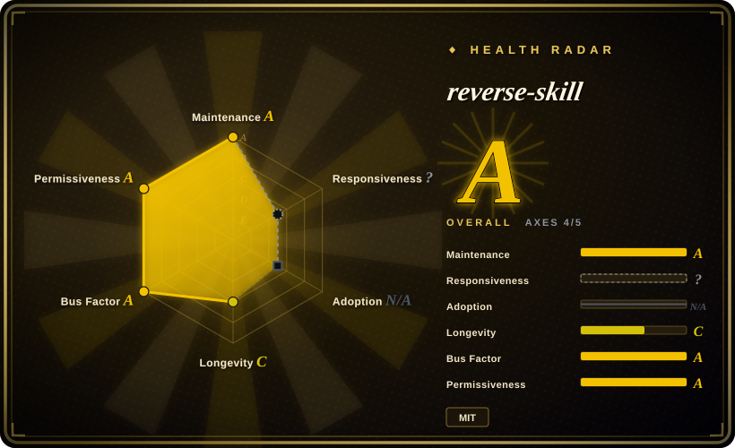

# reverse-skill

A cybersecurity skill-router pack for AI coding clients (Claude Code, Codex, Cursor, OpenCode, Kiro, Cline): when an agent hits an APK, a binary, JS encryption, a CTF challenge, or an authorized pentest target, it routes the task to one of 45 playbook modules, bootstraps the right toolchain, and enforces an authorization gate plus an evidence chain — instead of letting the agent guess commands.

## When to use

You're a security practitioner — reverse engineer, CTF player, pentester, or blue-teamer — who already drives an AI coding client and keeps hitting the same wall: the agent doesn't know whether a task calls for jadx or Frida, Ghidra or radare2, and it improvises commands instead of following a repeatable workflow. You install this pack, hand the agent a task ("analyze this APK", "work this pwn challenge", "authorized test against this scope"), and a routing layer (44 rules, R0–R45, backed by a 175-case regression benchmark on Windows+Ubuntu CI) dispatches to the matching playbook: APK/iOS reverse, firmware (binwalk/EMBA), .NET deobfuscation, JS anti-debugging, pwn chains, N-day patch diffing, AD/Kerberos, cloud/K8s, forensics, threat hunting, phishing analysis, even OT/ICS, Wi-Fi, and SDR.

The reason to pick this over a bag of prompts is the **ops contract around the skills**: `case-init` opens a case file, `case-guard` hard-blocks any action on a target until authorization and network profile are recorded (exit 2), work is logged to a timeline, and conclusions must follow an Evidence→Finding→Path chain into a report. For authorized, deliverable-producing security work, that governance is the point — it turns "agent with Burp" into an auditable engagement.

## When NOT to use

This section matters more than usual: the pack is **dual-use security tooling with real operational hazards**, and several of them are documented in its own issue tracker.

- **Corporate or EDR-monitored machines.** The repo ships a WAF/EDR-bypass payload corpus that Windows Defender flags as `Backdoor:PHP/ImagePHPBackdoor.A` (Severe) — reported by a user in issue #125 — and the release zip itself has triggered virus warnings (#82). On a managed endpoint, simply cloning it can create an incident ticket. If your environment has AV/EDR, don't install this on it; use vendor-curated packs like [Anthropic Cybersecurity Skills](anthropic-cybersecurity-skills.md) or keep offensive content in an isolated lab VM.
- **You're uncomfortable with agent self-bootstrap.** Its `README_AI.md` instructs agents to read it and follow its instructions on first contact; issue #134 (open) flags that this induces agents to auto-execute scripts and self-inject rules. Installing this pack means handing agent-executable instructions from a third party to your coding agent — audit `README_AI.md` and `RULES.md` before letting any client read them.
- **No authorization for the target.** The pack itself refuses: `case-guard` blocks ACT until auth is granted. That is by design — if what you want is an agent that "just attacks" a target you don't own or aren't contracted to test, this tool is explicitly not for that, and neither is anything else you should be using.
- **You expect your AI client to cooperate unconditionally.** There are closed issues from users whose clients refused to install it (#127) or refused to perform reverse-engineering tasks (#86) under their own safety policies. Platform policy is real friction; don't adopt this into a workflow you can't override.
- **Non-security work.** It is a router to security playbooks — nothing else. For general agent methodology pick from `agent-dev-methodology`; for non-security skills, other `agent-skills` leaves.
- **macOS as your primary platform today.** The pack is Windows-first (primary language PowerShell); bash parity exists, but the test suite currently fails on macOS (issue #135, open — BSD/GNU `sed` incompatibility), so expect to fix or skip parts of the harness.
- **You read 36k stars as peer review.** ~36k stars in ~4 months with sponsor badges is a hype curve, not validation of the playbooks' correctness [推断]. If you need content vetted by a security org, [Anthropic Cybersecurity Skills](anthropic-cybersecurity-skills.md) (vendor-authored, framework-mapped) is the more conservative pick.
- **You need a hardened, audited supply chain.** A bootstrap script previously corrupted users' Codex config (#98, fixed); the install path writes into agent config dirs. Pin a version, review diffs on upgrade.

## Comparison

| Alternative | In index | Our verdict | Tradeoff |
|---|---|---|---|
| [Anthropic Cybersecurity Skills](anthropic-cybersecurity-skills.md) | ✅ | Pick Anthropic's pack when you want vendor-authored, framework-mapped (MITRE/NIST) security runbooks from an accountable org; pick reverse-skill when you want a task router with an authorization gate, case files, and evidence-chain reporting for hands-on RE/pentest engagements. | Anthropic's is breadth (~817 runbooks) with vendor governance but no routing/case machinery; reverse-skill is a working engagement harness from a single author with a payload corpus that trips AV. |
| PentestGPT (未收录) | ❌ | Pick PentestGPT when you want an academic auto-pentest agent design to study; pick reverse-skill when you want maintained, CI-checked routing across 45 domains rather than one research prototype. | PentestGPT is a research artifact with a known paper lineage but stale code; reverse-skill is actively maintained but far less academically documented. [未验证] |
| HexStrike AI (未收录) | ❌ | Pick HexStrike AI when your need is wiring many security tools to an agent through MCP execution; pick reverse-skill when methodology selection, scope gating, and evidence reporting matter more than raw tool count. | HexStrike optimizes tool-execution coverage; reverse-skill optimizes workflow governance — overlapping means, different centers of gravity. [未验证] |
| Kali + manual playbooks (未收录) | ❌ | Pick the manual path when you already know which tool each task needs and distrust agent-executed third-party instructions; pick reverse-skill when the routing/knowledge-reuse problem is actually your bottleneck. | Manual costs expert time per task but carries no agent-supply-chain risk; the pack saves that time at the price of trusting its scripts and prompt layer. |

## Health & viability

- **Maintenance (2026-09):** active — last push 2026-09-03, single release v1.0.1, CHANGELOG kept. The 175-case routing regression benchmark runs in CI on Windows + Ubuntu; however the macOS test path is currently broken (#135, open).
- **Governance / bus factor:** `User`-owned (zhaoxuya520), 12 contributors, with commercial sponsors (UCloud AstraFlow, Atlas Cloud, Kite AI) covering "routing verification and documentation." Sponsorship is backing, but also a signal the project monetizes attention — roadmap accountability rests with one owner. [推断]
- **Age & Lindy (2026-09):** created 2026-05-13 — ~4 months old with ~36k stars and ~5k forks. That velocity is a **risk flag, not proof**: no multi-year survival, no evidence the playbook content has been peer-reviewed by the security community. [推断]
- **Risk flags (the load-bearing part of this page):** (1) dual-use payload corpus — WAF/EDR-bypass material that Defender detects as malware (#125) and a zip that triggers virus warnings (#82); (2) open agent-safety concern — `README_AI.md` induces auto-execution/self-injection on first read (#134); (3) client-policy friction — documented refusals from AI clients (#86, #127); (4) install-path incident — bootstrap corrupted a Codex config with non-ASCII paths (#98, fixed). MIT license, no relicense risk. None of these are disqualifying for a lab tool; all of them are disqualifying for unmanaged corporate rollout.
- **Adoption:** star/fork counts are extreme for the age (hype-driven [推断]); issues show real international usage (Russian, Chinese, English reports). No HN front-page discussion found as of 2026-09-16. [未验证]

## Caveats (unverified)

- [未验证] Stars (~36k) / forks (~5k) / contributors (12) per GitHub API on 2026-09-16; velocity numbers are date-sensitive.
- [未验证] The 44-rule / 175-case benchmark figures are from the project's own README; benchmark contents not independently audited.
- [未验证] Client compatibility list (Claude Code, Codex, Cursor, OpenCode, Kiro, Cline) is author-stated; two closed issues document clients refusing to engage (#86, #127).
- [未验证] Sponsor relationships (UCloud AstraFlow, Atlas Cloud, Kite AI) are as displayed in the README; their actual role in governance is unpublished.
- [未验证] Issue #125's Defender detection (`Backdoor:PHP/ImagePHPBackdoor.A`) is one user's report of a payload-corpus file; no independent AV scan performed here, but the presence of WAF-bypass payload material in-repo is confirmed by the file path itself.
- [未验证] PentestGPT and HexStrike AI characterizations in Comparison are from general knowledge, not re-verified for this page.
- [推断] The "self-evolving knowledge base" (field-journal) is a convention for the agent to append lessons; its quality depends entirely on the operator's review discipline.
- [推断] Bash-parity scripts exist for Linux/macOS, but with #135 open, effective non-Windows support is weaker than the README implies.
