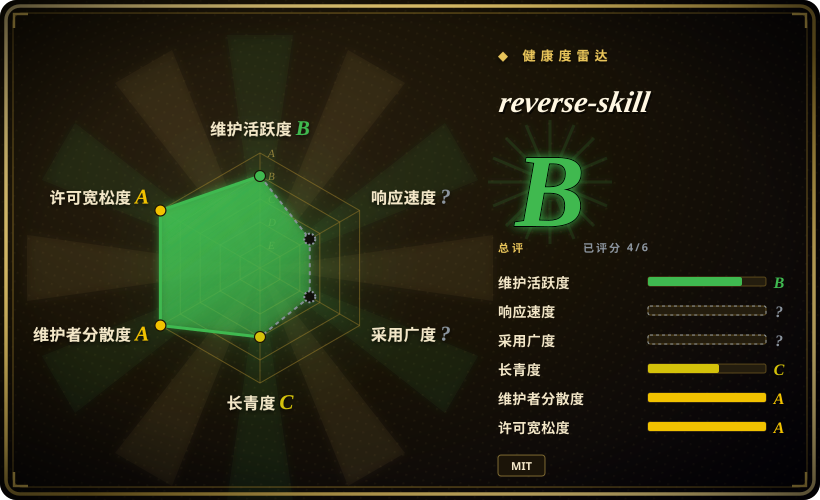

# reverse-skill

面向 AI 编码客户端（Claude Code、Codex、Cursor、OpenCode、Kiro、Cline）的网络安全技能路由包：当 agent 遇到 APK、二进制、JS 加密、CTF 题目或授权渗透目标时，它把任务路由到 45 个 playbook 模块之一、按需自举工具链，并强制授权闸门与证据链——而不是让 agent 瞎猜命令。

## 何时使用

你是安全从业者——逆向工程师、CTF 玩家、渗透测试或蓝队——已经在用 AI 编码客户端，且反复撞同一堵墙：agent 不知道这个任务该用 jadx 还是 Frida、Ghidra 还是 radare2，只会即兴敲命令而不是走可重复的工作流。装上这个包，把任务丢给 agent（「分析这个 APK」「做这道 pwn 题」「对这个授权范围做测试」），路由层（44 条规则 R0–R45，由 Windows+Ubuntu CI 上的 175 例回归基准背书）把它分发到对应 playbook：APK/iOS 逆向、固件（binwalk/EMBA）、.NET 反混淆、JS 反调试、pwn 链、N-day 补丁差分、AD/Kerberos、云/K8s、取证、威胁狩猎、钓鱼邮件分析，乃至工控、Wi-Fi、SDR。

选它而不是一袋子 prompt 的理由是**技能外面的那层作战契约**：`case-init` 建档，`case-guard` 在授权与网络画像登记前硬拒绝对目标动手（exit 2），过程追加 timeline，结论必须走 Evidence→Finding→Path 证据链出报告。对需要交付物的授权安全工作，这层治理就是核心价值——它把「会用 Burp 的 agent」变成可审计的测试过程。

## 何时不用

这一节比平时更重要：本包是**双用途安全工具，带真实的操作风险**，其中多条在它自己的 issue  tracker 里有案可查。

- **企业或有 EDR 监控的机器。** 仓库自带 WAF/EDR 绕过 payload 语料，Windows Defender 将其判为 `Backdoor:PHP/ImagePHPBackdoor.A`（Severe）——用户在 issue #125 中报告；release zip 本身也触发过病毒警告（#82）。在受管终端上，仅仅 clone 就可能产生一张安全工单。如果你的环境有 AV/EDR，不要装在上面；改用 [Anthropic Cybersecurity Skills](anthropic-cybersecurity-skills.zh.md) 这类厂商策划的包，或把攻击性内容隔离在实验虚拟机里。
- **你不接受 agent 自举。** 它的 `README_AI.md` 指示 agent 首次接触即读取并严格照做；issue #134（未关闭）指出这会诱导 agent 自动执行脚本、自我注入规则。安装本包等于把第三方写的、可被 agent 直接执行的指令交给你的编码 agent——让任何客户端读它之前，先自己审一遍 `README_AI.md` 和 `RULES.md`。
- **没有目标授权。** 本包自己就会拒绝：`case-guard` 在授权授予前挡死 ACT。这是设计如此——如果你想要的是对不拥有、未签约的目标「直接开打」的 agent，这个工具明确不是干这个的，任何正经工具也不该是。
- **指望 AI 客户端无条件配合。** 有已关闭的 issue 记录着客户端拒绝安装（#127）和拒绝执行逆向任务（#86）的案例，那是平台自己的安全策略。平台策略是真实摩擦；不要把它纳入你无法掌控的工作流。
- **非安全工作。** 它只是通往安全 playbook 的路由器——别的什么都不做。通用 agent 方法论去看 `agent-dev-methodology`；非安全技能看 `agent-skills` 其它叶子。
- **macOS 是你今天的的主力平台。** 本包 Windows 优先（主语言 PowerShell）；bash 对齐脚本存在，但测试套件目前在 macOS 上是挂的（issue #135 未关闭——BSD/GNU `sed` 不兼容），要预期自己修或跳过部分 harness。
- **把 36k star 当同行评审。** 约 4 个月 36k star 加赞助商徽章是 hype 曲线，不是 playbook 正确性的验证 [推断]。需要内容经过安全组织审查的话，[Anthropic Cybersecurity Skills](anthropic-cybersecurity-skills.zh.md)（厂商撰写、框架映射）是更保守的选择。
- **需要硬化、可审计的供应链。** bootstrap 脚本曾把用户的 Codex 配置写坏（#98，已修）；安装路径会写入 agent 配置目录。用就 pin 版本，升级时审 diff。

## 横向对比

| 替代品 | 是否收录 | 我们的评价 | 取舍 |
|---|---|---|---|
| [Anthropic Cybersecurity Skills](anthropic-cybersecurity-skills.zh.md) | ✅ | 要厂商撰写、框架映射（MITRE/NIST）、来自可问责组织的安全 runbook 时选 Anthropic 的包；要面向实战 RE/渗透的任务路由器、授权闸门、建档与证据链报告时选 reverse-skill。 | Anthropic 的是广度（约 817 个 runbook）加厂商治理，但没有路由/建档机器；reverse-skill 是能跑实战流程的 harness，来自单作者且 payload 语料会触发 AV。 |
| PentestGPT（未收录） | ❌ | 想研究学术式自动渗透 agent 设计时选 PentestGPT；要持续维护、CI 校验、覆盖 45 个域的路由时选 reverse-skill。 | PentestGPT 是有论文血统的研究原型但代码陈旧；reverse-skill 维护活跃但缺学术文档。[未验证] |
| HexStrike AI（未收录） | ❌ | 需求是把大量安全工具经 MCP 接给 agent 执行时选 HexStrike AI；方法论选择、范围闸门和证据报告比工具数量更重要时选 reverse-skill。 | HexStrike 优化工具执行覆盖面；reverse-skill 优化工作流治理——手段重叠，重心不同。[未验证] |
| Kali + 手工 playbook（未收录） | ❌ | 你已经知道每个任务该用哪个工具、且不信任 agent 执行第三方指令时走手工路线；路由与经验复用确实是你的瓶颈时选 reverse-skill。 | 手工路线每件任务花专家时间但没有 agent 供应链风险；本包省下这些时间，代价是信任它的脚本与提示层。 |

## 健康度与可持续性

- **维护（2026-09）：** 活跃——最近 push 2026-09-03，单个 release v1.0.1，CHANGELOG 在维护。175 例路由回归基准跑在 Windows+Ubuntu CI 上；但 macOS 测试路径当前是坏的（#135 未关闭）。
- **治理 / 巴士因子：** `User` 所有（zhaoxuya520），12 个 contributor，有商业赞助（UCloud AstraFlow、Atlas Cloud、Kite AI）覆盖「路由验证与文档」。赞助是背书，但也说明项目在将关注度变现——路线图问责仍系于 owner 一人。[推断]
- **年龄与 Lindy（2026-09）：** 创建于 2026-05-13——约 4 个月龄却有约 36k star 与约 5k fork。这种速度是**风险标记而非证明**：没有多年存续记录，也没有证据表明 playbook 内容经过安全社区同行评审。[推断]
- **风险标记（本页最关键的一段）：** （1）双用途 payload 语料——WAF/EDR 绕过材料被 Defender 判为恶意软件（#125），zip 触发病毒警告（#82）；（2）未关闭的 agent 安全争议——`README_AI.md` 诱导首读即自动执行/自我注入（#134）；（3）客户端策略摩擦——有案可查的 AI 客户端拒绝（#86、#127）；（4）安装路径事故——bootstrap 曾把非 ASCII 路径的 Codex 配置写坏（#98，已修）。MIT 许可证，无再许可风险。这些对实验室工具都不算致命；对不受管的企业推广，每一条都是否决项。
- **采用：** star/fork 数相对年龄极端（hype 驱动 [推断]）；issue 显示真实的国际化使用（俄语、中文、英语报告）。截至 2026-09-16 未找到 HN 首页讨论。[未验证]

## 存疑（未验证）

- [未验证] star（约 36k）/ fork（约 5k）/ contributor（12）来自 2026-09-16 的 GitHub API；速度类数字对日期敏感。
- [未验证] 44 条规则 / 175 例基准的数字来自项目 README；基准内容未独立审计。
- [未验证] 客户端兼容列表（Claude Code、Codex、Cursor、OpenCode、Kiro、Cline）为作者自述；两个已关闭 issue 记录了客户端拒绝配合的案例（#86、#127）。
- [未验证] 赞助关系（UCloud AstraFlow、Atlas Cloud、Kite AI）以 README 展示为准；它们在治理中的实际角色未公开。
- [未验证] issue #125 的 Defender 检出（`Backdoor:PHP/ImagePHPBackdoor.A`）是单个用户对 payload 语料文件的报告；此处未做独立 AV 扫描，但仓内存在 WAF 绕过 payload 材料这一事实可由文件路径本身确认。
- [未验证] 对比表中 PentestGPT 与 HexStrike AI 的刻画来自一般认知，未为本页重新核实。
- [推断] 「自进化经验库」（field-journal）是让 agent 追加经验总结的约定；其质量完全取决于操作者的评审纪律。
- [推断] Linux/macOS 有 bash 对齐脚本，但 #135 未关闭，实际非 Windows 支持弱于 README 的暗示。
