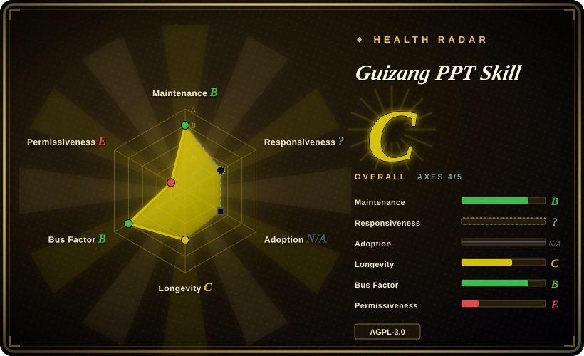
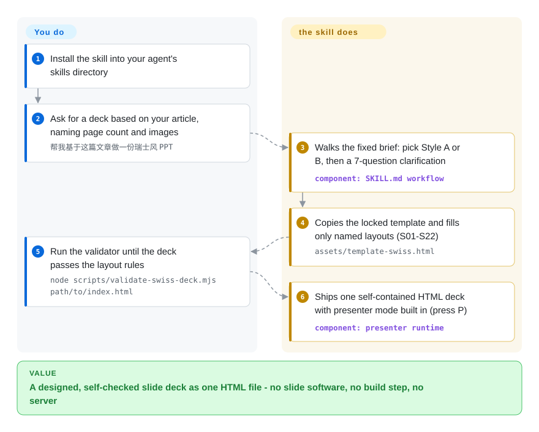

# Guizang PPT Skill

You have an article and a talk to give, and every minute nudging boxes in slide software is a minute not spent on the content. This agent skill replaces the blank canvas with two locked visual systems: you ask in plain language, and it produces a single-file HTML horizontal-swipe deck, plus matching images and multi-platform covers.

## When to use

You're a founder, indie maker, or domain expert prepping a talk for an offline meetup, a private salon, or a product demo day, and you want a deck that looks designed rather than templated. You have an article or a pile of Markdown notes, you live in Claude Code or Codex, and you don't want to fight slide software or hand-place every box. You install the skill with one command, say "make me a 7-page Swiss-style deck with 2–3 images," and the agent walks a fixed workflow — pick a style, answer a 7-question brief, copy the template, fill named layouts, optionally generate images, draft per-page speaker notes, self-check against a graded P0–P3 checklist, and open the result in a browser. The file also ships a presenter mode (press `P`): a second audience window, current/next 16:9 previews, notes, a rehearsal timer, laser pointer, and a `B` key that drops all WebGL animation for weak machines. Because the output is one self-contained `.html` file, you can present it, send it, or screenshot it with no build step and no server.

It fits best when you want a strong personal aesthetic baked in: Style A (electronic-magazine × e-ink) leans narrative and opinionated; Style B (Swiss international) enforces a 16-column grid, a single high-saturation anchor color, hairline rules, and 22 named layouts (`S01`–`S22`) with a validator script that rejects centered titles, improvised page structures, and text baked into SVG. You get a constrained, agent-legible design system instead of a blank canvas.

## How it works

The skill is a workflow document plus static assets, not a runtime service: `SKILL.md` drives your agent through style choice → 7-question brief → template copy → layout filling → self-check, `assets/template.html` (Style A) and `assets/template-swiss.html` (Style B) carry all the CSS and the presenter mode, and `references/` carries paste-ready page skeletons plus a P0–P3 checklist (P0 = must-fix before presenting). "Locked layouts" means a Style-B page may only use the 22 predefined layouts `S01`–`S22` — a Node script (`scripts/validate-swiss-deck.mjs`) fails the deck if it catches a centered title, an invented page structure, or text baked into an SVG, and can measure real rendered overflow when Playwright is available. What it does for you: the grid, the typography scale, the theme presets (you pick one of 5 ink or 4 Swiss colors — custom hex values are rejected by design), the image aspect-ratio rules, and the presenter runtime (dual-window audience view, notes, timer, blackout/freeze recovery). What stays yours: the content and its page rhythm, the style/theme choice, deciding whether to run the optional Codex image step (GPT-Image 2.0 / GPT-M 2.0 prompts), and reading the validator's verdict.

<!-- flow-steps:begin (generated from flows/guizang-ppt.json by tools/flow_card.py — do not edit) -->

Text version of the flow

1. **You**: Install the skill into your agent's skills directory
2. **You**: Ask for a deck based on your article, naming page count and images — `帮我基于这篇文章做一份瑞士风 PPT`
3. **Guizang PPT Skill**: Walks the fixed brief: pick Style A or B, then a 7-question clarification — component: `SKILL.md workflow`
4. **Guizang PPT Skill**: Copies the locked template and fills only named layouts (S01-S22) — `assets/template-swiss.html`
5. **You**: Run the validator until the deck passes the layout rules — `node scripts/validate-swiss-deck.mjs path/to/index.html`
6. **Guizang PPT Skill**: Ships one self-contained HTML deck with presenter mode built in (press P) — component: `presenter runtime`

**Value**: A designed, self-checked slide deck as one HTML file - no slide software, no build step, no server

<!-- flow-steps:end -->

## When NOT to use

- **You need editable, collaborative slides.** Output is static single-file HTML; the FAQ confirms PPTX/Google-Slides export is not the main flow (its suggestion is converting the HTML as a visual draft, externally). If colleagues must edit in a familiar tool, this is the wrong artifact.
- **Dense data, tables, or training material.** The README explicitly calls out big tables and high-density courseware as a poor fit — the layouts optimize for sparse, statement-driven slides, not spreadsheets.
- **You're not in a file-system + browser agent.** It assumes an agent that can read/write files and run shell (Claude Code, Codex, Cursor). A plain chatbot with no filesystem or preview can't reliably produce a full deck.
- **You want provider-neutral image generation.** The README's platform table and image section both describe the optional image pipeline as Codex-side (GPT-Image 2.0 / GPT-M 2.0); deck generation works on other file-system agents, but equivalent image generation elsewhere is not documented. [推断]
- **AGPL-3.0 matters to you.** The skill (and its templates/scripts) is AGPL-3.0-licensed — a switch made on 2026-05-28; if you embed parts into a service or product you ship, the copyleft terms apply — read them before vendoring.
- **You need a stable, long-stable contract.** The last tagged release is still v1.1.0 (2026-05) while `main` has moved past it (presenter mode, validators, sponsor-funded iteration, last commit 2026-08) — what you install today is ahead of the release, and layout names, theme presets, and the brief flow have shifted across revisions.

## Comparison

| Alternative | In index | Our verdict | Tradeoff |
|---|---|---|---|
| [guizang-social-card](../visual-content/guizang-social-card.md) | ✅ | Choose guizang-social-card when you need single social cards/covers instead of full decks. | Same author's sibling skill, but scoped to single social cards / covers rather than full multi-page decks; overlapping visual rules, narrower output. |
| [html-anything](../../ai-design-generation/html-anything.md) | ✅ | Choose html-anything when you need general agent-driven HTML artifact generation. | General agent-driven HTML artifact generation; broader and unopinionated, so it lacks the locked deck layouts, Swiss validator, and cover/image workflow this skill ships. |
| [open-design](../../ai-design-generation/open-design.md) | ✅ | Choose open-design when you need broader UI/design generation rather than deck-specific output. | Aimed at broader UI/design generation; not a presentation-deck specialist with horizontal-swipe runtime and named slide layouts. |
| [Impeccable](../../ai-design-generation/impeccable.md) | ✅ | Choose Impeccable when you need a design-quality harness layer rather than deck generation. | Design-quality oriented generation; different surface — not a single-file HTML deck workflow. |
| Slidev | 未收录 | Choose Slidev when you need a developer-grade Markdown-to-HTML deck framework. | Developer-grade Markdown→HTML deck framework with build tooling, themes, and a dev server; more powerful/long-stable but not agent-driven and not opinionated about Swiss/editorial aesthetics. |
| Marp | 未收录 | Choose Marp when you need Markdown-to-slides with HTML/PDF/PPTX exports. | Markdown→slides (HTML/PDF/PPTX) with a clean ecosystem and exports this skill lacks; far less visual flexibility per slide. |
| Gamma / Tome | not a repo | Choose Gamma or Tome when a hosted AI deck service is acceptable and you have no agent in the loop. | Hosted AI deck SaaS, not a repository — easier for non-agents, but closed, no single-file HTML artifact you own, no local agent control. |

## Health & viability

- **Responsiveness**: Cannot be scored — type_na.
- **Maintenance (2026-09):** main last committed 2026-08-07 (~7 weeks before this re-verify), last tag still v1.1.0 (2026-05-15) — the presenter mode, validators and low-power fallback all landed unreleased, so what you install ahead of the tag floats. ~44 open issues. Fast cadence April–August 2026, then slowed; B on the radar means "alive, coasting-ready".
- **Governance & bus factor:** still a single-owner personal repo (`op7418`, `User`-owned, ~27k stars as of 2026-09) — one person owns the layouts, themes and brief flow. Two mitigants appeared since the June check: iteration is now funded (真格 Token Grant badge plus named sponsors — 360 安全龙虾, Kimi work, Cola Skill), and CI checks (`scripts/check-presenter-runtime-sync.mjs`) block template drift. The output is a self-contained `.html` you own, so upstream going quiet does not strand decks you already generated.
- **Age & Lindy:** created 2026-04-23 — ~5 months old as of 2026-09, young and hyped; Lindy prior essentially zero. Don't treat the layout-name/theme contract as stable.
- **Risk flags:** a relicense to AGPL-3.0 landed on 2026-05-28 (LICENSE history) — strong network copyleft, so read the current LICENSE before vendoring templates into anything you ship. Optional image step tied to Codex + GPT-Image 2.0 / GPT-M 2.0. Third-party distribution channels (360/Cola/Kimi listings) may lag behind `main`. [推断]

## Caveats (unverified)

- [未验证] License: GitHub API and README footer both say `AGPL-3.0` (re-checked 2026-09-28); the `-only` suffix in frontmatter was not confirmed against the LICENSE file's SPDX header. What the pre-2026-05-28 terms were was not read off the old LICENSE file — only the switch commit ("Switch license to AGPL-3.0", 2026-05-28) was verified.
- [未验证] Both validators (`scripts/validate-swiss-deck.mjs`, `scripts/validate-presenter-mode.mjs`) — their exact rule coverage was read from the README, never executed here.
- [推断] Optional image generation is documented only for Codex + GPT-Image 2.0 / GPT-M 2.0; equivalent generation on other agents/providers is not stated (the platform table keeps Cursor/other file-system agents at "可用" for deck generation itself).
- [推断] Layout counts ("Style A 10 layouts", "Style B 22 layouts S01–S22") and the 5+4 theme presets are the project's own README framing; `main` moves without tags, so counts can shift.
- [推断] Sponsor badges (360 安全龙虾 / Kimi work / Cola Skill / 真格 Token Grant) signal funding intent, not a contractual maintenance commitment.
- [未验证] Platform-marketplace copies (claw.360.cn, colaskill.com, Kimi work) were not opened; their freshness versus `main` is unknown.
