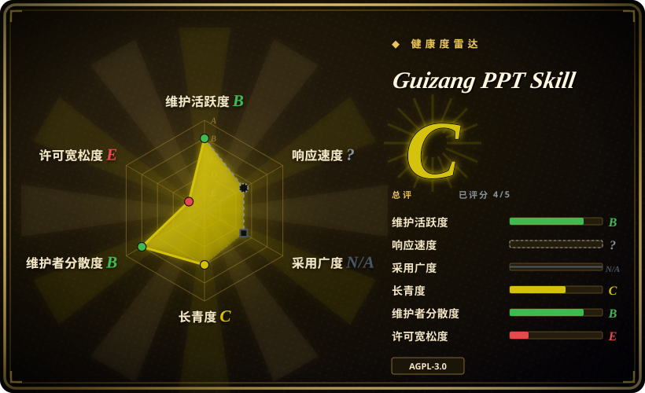
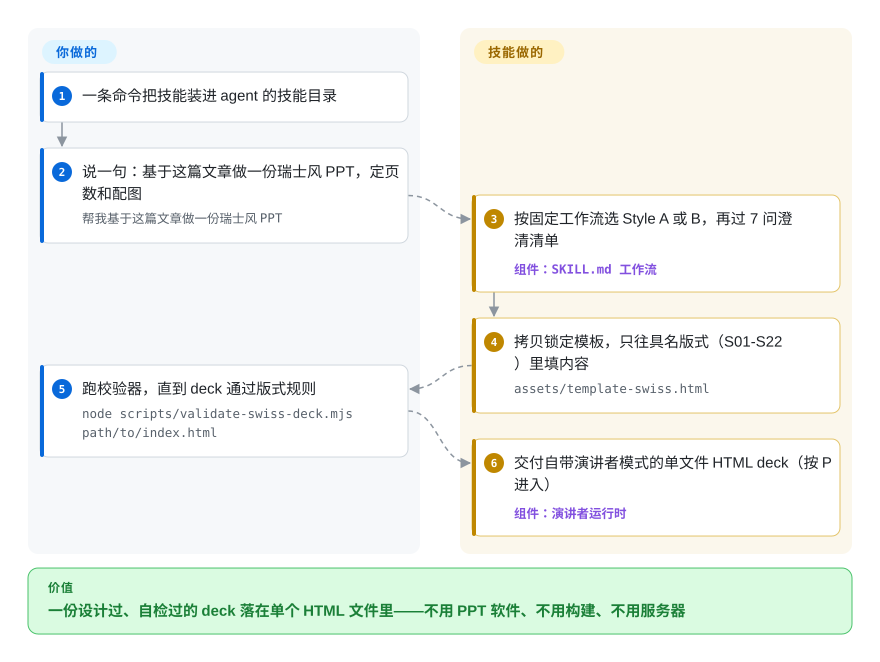

# Guizang PPT Skill

手里有文章、马上要上台，时间却全花在 PPT 软件里对齐色块上。这个 agent 技能把空白画布换成两套锁定的视觉系统：你说一句诉求，它就产出单文件 HTML 横向翻页 deck，并配套生成配图和多平台封面。

## 何时使用

你是创始人、独立开发者或领域专家，要给线下分享、私享会或产品 demo day 准备一份 PPT，希望它看起来是「设计过的」而不是套模板。你手里有一篇文章或一堆 Markdown 笔记，平时就在 Claude Code 或 Codex 里干活，不想跟 PPT 软件较劲、也不想手动摆每一个色块。你一条命令装好技能，说一句「帮我做一份 7 页左右的瑞士风 PPT，配 2–3 张图」，agent 就会按固定工作流走完——选风格、答 7 问澄清清单、拷贝模板、往具名版式里填内容、可选生成配图、逐页生成演讲备注、对照 P0–P3 分级 checklist 自检、在浏览器里打开成品。文件还自带演讲者模式（按 `P`）：观众副屏、当前页/下一页 16:9 预览、备注、排练计时、激光笔，以及按 `B` 一键关掉 WebGL 动画的低性能静态模式。因为产物是一个自包含的 `.html` 文件，你可以直接演示、发送或截图，不用构建、不用服务器。

它最适合你想要把强烈个人审美预先内置好的场景：Style A（电子杂志风 × 电子墨水）偏叙事、有观点；Style B（瑞士国际主义）强制 16 列网格、单一高饱和锚点色、发丝线和 22 个具名版式（`S01`–`S22`），还带一个校验脚本，拦截居中标题、临时发明的页面结构、以及写进 SVG 里的文字。你得到的是一套受约束、agent 可读的设计系统，而不是一块空白画布。

## 怎么用起来

这个技能是一份工作流文档加静态素材，不是运行时服务：`SKILL.md` 驱动你的 agent 走「选风格 → 7 问澄清 → 拷贝模板 → 填版式 → 自检」，`assets/template.html`（Style A）和 `assets/template-swiss.html`（Style B）承载全部 CSS 和演讲者模式，`references/` 放可直接粘贴的页面骨架和 P0–P3 分级检查清单（P0 = 上台前必须修）。所谓「锁定版式」，是指 Style B 的正文页只能从 `S01`–`S22` 这 22 个预置版式里选——一个 Node 脚本（`scripts/validate-swiss-deck.mjs`）会拦下居中标题、临时发明的页面结构、写进 SVG 里的文字，在有 Playwright 时还会实测渲染后的溢出。它替你做的：网格、字号体系、主题预设（只能从 5 套墨水色或 4 套瑞士锚点色里挑，自定义色值一律拒绝）、图片比例规则、演讲者运行时（双窗口观众屏、备注、计时、黑屏/白屏与失联恢复）。仍然归你管的：内容与页面节奏、风格和主题的选择、要不要跑可选的 Codex 配图步骤（GPT-Image 2.0 / GPT-M 2.0 提示词），以及读懂校验器的结论。

<!-- flow-steps:begin (generated from flows/guizang-ppt.json by tools/flow_card.py — do not edit) -->

流程文字版

1. **你**：一条命令把技能装进 agent 的技能目录
2. **你**：说一句：基于这篇文章做一份瑞士风 PPT，定页数和配图 — `帮我基于这篇文章做一份瑞士风 PPT`
3. **Guizang PPT Skill**：按固定工作流选 Style A 或 B，再过 7 问澄清清单 — 组件：`SKILL.md 工作流`
4. **Guizang PPT Skill**：拷贝锁定模板，只往具名版式（S01-S22）里填内容 — `assets/template-swiss.html`
5. **你**：跑校验器，直到 deck 通过版式规则 — `node scripts/validate-swiss-deck.mjs path/to/index.html`
6. **Guizang PPT Skill**：交付自带演讲者模式的单文件 HTML deck（按 P 进入） — 组件：`演讲者运行时`

**价值**：一份设计过、自检过的 deck 落在单个 HTML 文件里——不用 PPT 软件、不用构建、不用服务器

<!-- flow-steps:end -->

## 何时不用

- **你需要可编辑、可协作的幻灯片。** 产物是静态单文件 HTML，FAQ 明确核心交付是 HTML，PPTX/Google Slides 导出不是主流程（官方建议是把 HTML 页面当视觉稿另行转换）。如果同事必须在熟悉的工具里改，这个产物形态就不对。
- **密集数据、表格或培训课件。** README 明确把大段表格和高信息密度课件列为不合适——这套版式是为稀疏、陈述驱动的页面优化的，不是为表格。
- **你不在「文件系统 + 浏览器」的 agent 里。** 它假定 agent 能读写文件、能跑 shell（Claude Code、Codex、Cursor）。没有文件系统和预览的普通 chatbot 很难稳定产出完整 deck。
- **你想要 provider 中立的配图能力。** README 的平台表和配图小节都把可选配图流程描述为 Codex 侧能力（GPT-Image 2.0 / GPT-M 2.0）；deck 生成在其他能读写文件的 agent 上可用，但别处的等价配图生成没有文档说明。[推断]
- **AGPL-3.0 对你是个问题。** 这个技能（含模板/脚本）以 AGPL-3.0 授权——许可在 2026-05-28 切换为 AGPL；如果你把其中部分嵌进自己对外交付的服务或产品，copyleft 条款会生效——vendoring 前先读条款。
- **你需要长期稳定的契约。** 最新 tag 仍停在 v1.1.0（2026-05），而 `main` 已经跑在它前面（演讲者模式、校验器、赞助驱动的迭代，最后提交 2026-08）——你今天装到的比最新发布新，版式名、主题预设和澄清流程在版本间已经变过。

## 横向对比

| 替代品 | 是否收录 | 我们的评价 | 取舍 |
|---|---|---|---|
| [guizang-social-card](../visual-content/guizang-social-card.zh.md) | ✅ | 需要单张社交卡片/封面而不是完整 deck 时，选 guizang-social-card。 | 同一作者的姊妹技能，但只聚焦单张社交卡片/封面，而非完整多页 deck；视觉规则有重叠，输出更窄。 |
| [html-anything](../../ai-design-generation/html-anything.zh.md) | ✅ | 需要通用的 agent 驱动 HTML 产物生成时，选 html-anything。 | 通用的 agent 驱动 HTML 产物生成；更宽、不带观点，因此没有这个技能内置的锁定 deck 版式、瑞士校验器和封面/配图流程。 |
| [open-design](../../ai-design-generation/open-design.zh.md) | ✅ | 需要更宽的 UI/设计生成而非 deck 专项时，选 open-design。 | 面向更宽的 UI/设计生成；不是带横向翻页运行时和具名版式的演示 deck 专才。 |
| [Impeccable](../../ai-design-generation/impeccable.zh.md) | ✅ | 需要设计质量 harness 层而非 deck 生成时，选 Impeccable。 | 偏设计质量导向的生成；切面不同——不是单文件 HTML deck 工作流。 |
| Slidev | 未收录 | 需要开发者级 Markdown→HTML deck 框架时，选 Slidev。 | 开发者级 Markdown→HTML deck 框架，带构建工具、主题和 dev server；更强、更长期稳定，但不是 agent 驱动，也不对瑞士/杂志审美有观点。 |
| Marp | 未收录 | 需要 Markdown→幻灯片且支持 HTML/PDF/PPTX 导出时，选 Marp。 | Markdown→幻灯片（HTML/PDF/PPTX），生态干净、带这个技能缺的导出；但单页视觉灵活度远低。 |
| Gamma / Tome | 非仓库 | 可以接受托管式 AI deck 服务、且身边没有 agent 时，选 Gamma 或 Tome。 | 托管式 AI deck SaaS，不是仓库——对非 agent 用户更省事，但封闭、产物不归你所有、无本地 agent 控制权。 |

## 健康度与可持续性

- **响应速度**：无法计算——type_na。
- **维护（2026-09）：** `main` 最后提交 2026-08-07（本次复核前约 7 周），最新 tag 仍停在 v1.1.0（2026-05-15）——演讲者模式、校验器、低性能兜底全在未发布的 `main` 上，你装到的比 tag 新。开放 issue 约 44。2026 年 4–8 月节奏很快，之后放缓；雷达给 B 的意思是「活着，但随时可能停」。
- **治理与 bus factor：** 仍是单人个人仓库（`op7418`、`User` 所有，2026-09 约 2.7 万 star）——版式、主题和问询流程都由一个人说了算。自 6 月复核以来多了两层缓冲：迭代有了资助（真格 Token Grant 徽章加冠名赞助——360 安全龙虾、Kimi work、Cola Skill），并且有 CI 检查（`scripts/check-presenter-runtime-sync.mjs`）挡模板漂移。产物是你完全拥有的自包含 `.html`，上游即使安静了也不会让你已生成的 deck 失效。
- **年龄与 Lindy：** 创建于 2026-04-23——截至 2026-09 约 5 个月，年轻且被热捧；Lindy 先验基本为零。别把版式名/主题契约当稳定的。
- **风险标记：** 2026-05-28 有一次切换为 AGPL-3.0 的再许可（LICENSE 历史）——强网络 copyleft，把模板 vendoring 进你交付的东西前先读现行条款。可选配图步骤绑定 Codex + GPT-Image 2.0 / GPT-M 2.0。第三方分发渠道（360/Cola/Kimi 上架版）可能落后于 `main`。[推断]

## 存疑（未验证）

- [未验证] License：GitHub API 与 README 页脚都写 `AGPL-3.0`（2026-09-28 复核）；frontmatter 里 `-only` 后缀未对照 LICENSE 文件的 SPDX 头确认。2026-05-28 之前的原条款没有读旧 LICENSE 文件核实——只验证了切换提交本身（"Switch license to AGPL-3.0"，2026-05-28）。
- [未验证] 两个校验器（`scripts/validate-swiss-deck.mjs`、`scripts/validate-presenter-mode.mjs`）的规则覆盖读自 README，未实际运行。
- [推断] 可选配图只在 Codex + GPT-Image 2.0 / GPT-M 2.0 上有文档；其他 agent/provider 上的等价生成没有说明（平台表对 Cursor 等其他本地 agent 标「可用」的范围只是 deck 生成本身）。
- [推断] 版式数量（「Style A 10 种」「Style B 22 种 S01–S22」）与 5+4 套主题预设是 README 的自述；`main` 不打 tag 地动，数量可能漂移。
- [推断] 赞助徽章（360 安全龙虾 / Kimi work / Cola Skill / 真格 Token Grant）表示资助意愿，不是维护承诺合同。
- [未验证] 各平台商店副本（claw.360.cn、colaskill.com、Kimi work）未逐一打开，与 `main` 的新旧关系未知。
