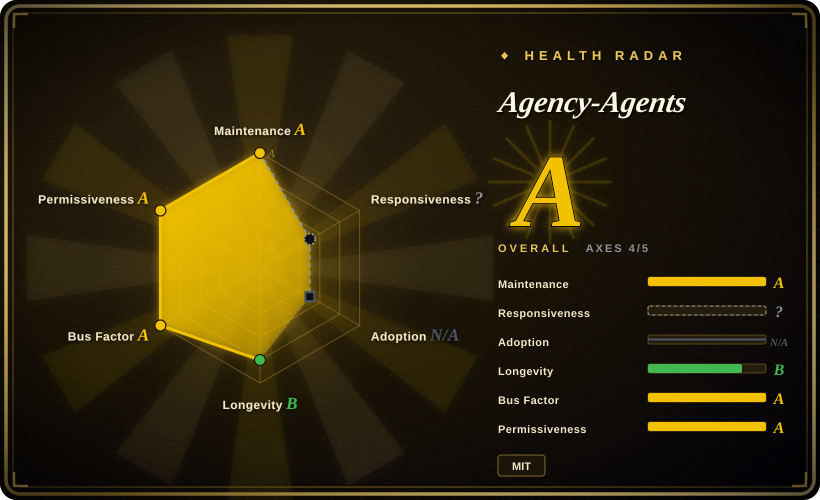
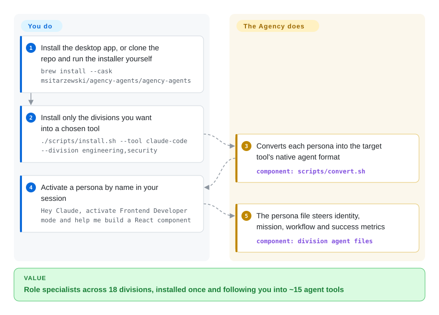

# Agency-Agents

You keep hand-writing the same throwaway system prompts in Claude Code — a frontend developer here, a security architect there, a code reviewer for the next task. This repo is a ready-made roster of ~279 markdown personas across 18 functional divisions, with an installer that places them into Claude Code and about fifteen other agent tools.

## When to use

You're a solo developer or small team running Claude Code, and you keep writing the same ad-hoc system prompts over and over: a "frontend developer" persona for one task, a "security architect" for another, a "code reviewer" for a third. You want a ready-made library of role-specific subagents you can drop into `~/.claude/agents/` and invoke by name, rather than hand-rolling each persona. Agency-Agents gives you a broad bag — ~279 markdown agent files organized into 18 divisions (Engineering, Design, Marketing, Security, Game Dev, GIS, Healthcare, Academic…) — each with frontmatter (`name`, `description`, color), a defined mission, domain rules, deliverable examples, a workflow, and success metrics, so the subagent behaves consistently when your harness dispatches to it.

You reach for it especially when you want breadth across many domains at once (not just coding — it also covers sales, finance, support, spatial computing, GIS) and when you want the *same* personas to follow you across tools. The repo ships `scripts/install.sh` (interactive picker, auto-detects installed tools, supports `--division`, `--agent`, `--dry-run`, `--list teams`) and `scripts/convert.sh` (generates per-tool formats), targeting Claude Code plus ~14 scripted targets — Cursor, Aider, Windsurf, OpenCode, Gemini CLI, Copilot, Codex, Kimi, Osaurus, Hermes, Mistral Vibe, DeepSeek Harness and more — and since mid-2026 there is also a native desktop app (agency-agents-app, macOS/Linux/Windows, `brew install --cask`) that browses the roster, installs into Claude Code/Cursor/Codex/Gemini/OpenCode/Qwen/Osaurus, and auto-updates without the terminal.

## How it works

Each persona is one markdown file: frontmatter (`name`, `description`, `color`) tells the harness when it should fire, and the body is a long role brief — identity, mission, domain rules, example deliverables, workflow, success metrics. Nothing executes; "installing" means copying these files into the place your tool reads subagents from (`~/.claude/agents/` for Claude Code, a per-division `AGENTS.md`-style directory elsewhere). That copying is the part the project does for you: `scripts/install.sh` is an interactive picker that auto-detects which harnesses you have and can filter by `--division` or `--agent`, and `scripts/convert.sh` regenerates the ~279 files into each tool's native format (a `strategy/` playbook tree, `divisions.json`, and a CI check keep the division list honest). What stays yours: choosing which divisions you actually want, reviewing each persona's prompt before trusting it, and re-vendoring when upstream changes — there are no tagged releases on the catalog repo itself.

<!-- flow-steps:begin (generated from flows/agency-agents.json by tools/flow_card.py — do not edit) -->

Text version of the flow

1. **You**: Install the desktop app, or clone the repo and run the installer yourself — `brew install --cask msitarzewski/agency-agents/agency-agents`
2. **You**: Install only the divisions you want into a chosen tool — `./scripts/install.sh --tool claude-code --division engineering,security`
3. **Agency-Agents**: Converts each persona into the target tool's native agent format — component: `scripts/convert.sh`
4. **You**: Activate a persona by name in your session — `Hey Claude, activate Frontend Developer mode and help me build a React component`
5. **Agency-Agents**: The persona file steers identity, mission, workflow and success metrics — component: `division agent files`

**Value**: Role specialists across 18 divisions, installed once and following you into ~15 agent tools

<!-- flow-steps:end -->

## When NOT to use

- **You already maintain a curated subagent/skill set.** ~279 personas is a lot of surface; dropping them all into `~/.claude/agents/` clutters your agent picker and can collide with names you already use. Install selectively (`--division`/`--agent`) or you trade curation for volume.
- **You want depth and methodology over breadth.** These are role *personas* (identity + workflow + success metrics), not an enforced SDLC discipline. If your real need is brainstorm→plan→TDD→verify rigor, a methodology pack fits better than a persona catalog.
- **You distrust "battle-tested / production-ready" marketing.** The README claims proven deliverables, but there's no test harness or QA process in-repo [推断]; personas range from high-stakes (incident response, security) to deliberately whimsical (a "Whimsy Injector"), and quality is uneven across hundreds of files.
- **You need enforcement, not suggestion.** Like any prompt pack, behavior is advisory — the markdown shapes a subagent's framing but the harness/model can still ignore it. There are no hard guarantees.
- **Cross-tool fidelity matters and you're not on Claude Code.** The canonical format is Claude-style `.md`; the converters emit other tools' formats, and at least one target is known-broken: the README itself documents that OpenCode's runtime registers only ~119 agents and silently drops the rest (tracked as an upstream bug), and the installer warns when your selection exceeds that. Fidelity on the other ~13 targets is not independently confirmed here.

## Comparison

| Alternative | In index | Our verdict | Tradeoff |
|---|---|---|---|
| [wshobson/agents](wshobson-agents.md) | ✅ | Choose wshobson/agents when you need a tighter engineering-focused subagent catalog. | Another large Claude Code subagent collection, coding-focused. Agency-Agents is broader (sales, finance, healthcare, GIS alongside engineering) and ships multi-tool converters plus a desktop app; wshobson stays closer to engineering roles. Pick by whether you need cross-domain breadth or a tighter dev-only set. |
| [awesome-claude-code-subagents](awesome-claude-code-subagents.md) | ✅ | Choose awesome-claude-code-subagents when curation philosophy and browsable persona directory matter most. | A large curated subagent directory in the same leaf. Compare on curation philosophy and how many personas you actually want installed vs. browsed. |
| [antfu/skills](../personal-collections/engineering-workflows/antfu-skills.md) | ✅ | Choose antfu/skills when the unit you need is task workflow skills, not role personas. | A personal *skills* collection (task workflows), not role personas — different unit of consumption. Use skills for "how to do X", personas for "act as Y". |
| Anthropic's example/built-in agents | 未收录 | Choose built-in agent examples when platform-native personas should avoid third-party overlap. | The platform's own subagent examples; Agency-Agents is a third-party bulk catalog layered on top, so names and roles can overlap or duplicate native ones. |

## Health & viability

- **Responsiveness**: Cannot be scored — type_na.
- **Maintenance (2026-09):** very active — main committed 2026-09-27, one day before this re-verify, with ~11 active weeks in the last quarter; ~151 open issues tracked. The catalog repo still has no tagged release (you track a moving branch), but the companion app repo (agency-agents-app, created 2026-06) ships versioned releases and auto-updates, which gives the install surface something to pin.
- **Governance & bus factor:** `User`-owned (`msitarzewski`) with ~155k stars (2026-09, up ~34% since June) and 99 active contributors in the radar window — a broad PR stream, but one person owns the roadmap, the converters, and the app. A `User`-owned repo at that scale is still a bus-factor flag.
- **Age & Lindy:** created 2025-10-13 — ~11 months old as of 2026-09: past its first sustained year of weekly-plus commits, but pre-Lindy relative to its hype. High stars signal reach, not durability.
- **Adoption & risk flags** — MIT-licensed (clear reuse). "Battle-tested / production-ready" remains a marketing claim with no in-repo test or QA evidence; persona quality is uneven (incident-response next to a whimsy injector). Cross-tool conversion now has one documented failure mode: the README itself notes OpenCode registers only ~119 agents and silently drops the rest. Install selectively rather than dropping all ~279 in.

## Caveats (unverified)

- [未验证] License MIT and primary language Shell (the install/convert scripts) per GitHub API, re-checked 2026-09-28; last push 2026-09-27, no tagged release on the catalog repo — re-verify before pinning behavior.
- [未验证] Star count (~155k per GitHub on 2026-09-28) is unreliable and date-sensitive; treat as indicative only, not a quality signal.
- [未验证] "~279 agent files across 18 divisions" is my file count of the division directories via the git tree API (2026-09-28); the README says "230+ agents" and `divisions.json` (the maintainer's own list) says 18 — I did not check each file for agent frontmatter, so the honest number sits between those claims.
- [未验证] The supported-target list (Claude Code, Copilot, Antigravity/Gemini, Gemini CLI, OpenCode, Cursor, Aider, Windsurf, OpenClaw, Qwen (via app), Kimi, Codex, Osaurus, Hermes, Mistral Vibe, DeepSeek Harness) is from the README; per-tool conversion fidelity is not verified here — only OpenCode's ~119-agent cap is documented by the repo itself.
- [推断] "Battle-tested / production-ready" is a marketing claim with no in-repo test or QA evidence; persona quality is uneven (high-stakes roles alongside whimsical ones).
- [推断] Because behavior lives in markdown personas loaded by the harness, enforcement is advisory — the subagent can still deviate; missions and "rules" are prompt-level instructions, not hard guarantees.
