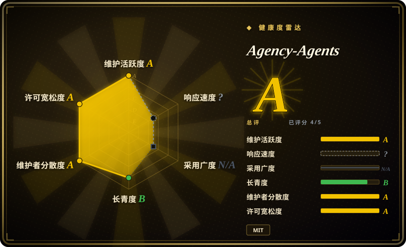
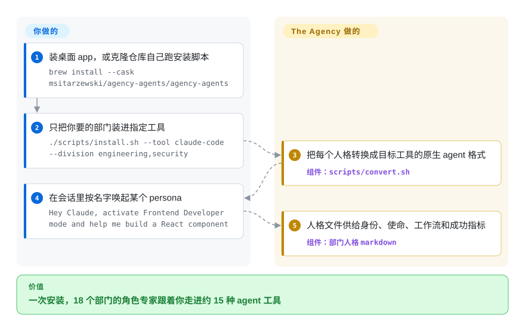

# Agency-Agents

你在 Claude Code 里一遍遍手写同一批临时 system prompt：这个任务要「前端工程师」，下个要「安全架构师」。这个仓库是一份现成的角色名册——约 279 个 markdown persona、覆盖 18 个职能部门，附带安装器，把它们一次铺进 Claude Code 和另外约十五种 agent 工具。

## 何时使用

你是个人开发者或小团队，在用 Claude Code，反复手写同一批临时 system prompt：这个任务要个「前端工程师」人格，那个要「安全架构师」，再下一个要「代码评审员」。你想要一个现成的角色化 subagent 库，直接丢进 `~/.claude/agents/` 按名调用，而不是每次都手搓人格。Agency-Agents 给你一大袋——约 279 个按部门组织的 markdown agent 文件，共 18 个部门（工程、设计、营销、安全、游戏开发、GIS、医疗、学术……）——每个都有 frontmatter（`name`、`description`、color）、明确使命、领域规则、交付物示例、工作流和成功指标，让 harness 派发到它时行为保持一致。

当你想一次性获得跨多领域的广度时（不只是编码——还覆盖销售、财务、支持、空间计算、GIS），以及想让同一批人格跨工具跟着你走时，尤其适合用它。仓库附带 `scripts/install.sh`（交互式选择器，自动探测已装工具，支持 `--division`/`--agent`/`--dry-run`/`--list teams`）和 `scripts/convert.sh`（生成各工具格式），目标是 Claude Code 外加约 14 个脚本化目标——Cursor、Aider、Windsurf、OpenCode、Gemini CLI、Copilot、Codex、Kimi、Osaurus、Hermes、Mistral Vibe、DeepSeek Harness 等；2026 年中之后又加了原生桌面 app（agency-agents-app，macOS/Linux/Windows，`brew install --cask`），能浏览整个名册、装进 Claude Code/Cursor/Codex/Gemini/OpenCode/Qwen/Osaurus 并自动更新，不用碰终端。

## 怎么用起来

每个人格就是一个 markdown 文件：frontmatter（`name`、`description`、`color`）告诉 harness 什么时候该唤起它，正文是一份长角色简报——身份、使命、领域规则、交付物示例、工作流、成功指标。没有任何东西会「执行」：所谓安装，就是把这些文件拷进你的工具读取 subagent 的位置（Claude Code 是 `~/.claude/agents/`，别的工具是各自的目录）。拷贝这步是项目替你干的：`scripts/install.sh` 是交互式选择器，自动探测你装了哪些 harness，可以用 `--division` 或 `--agent` 过滤；`scripts/convert.sh` 把约 279 个文件重新生成成每个工具的原生格式（`divisions.json` 和 CI 检查保证部门清单和目录一致）。仍然归你管的：挑你真正要的部门、在信任之前逐份审人格提示、以及上游变动时重新 vendor——目录仓库自己没有 tag。

<!-- flow-steps:begin (generated from flows/agency-agents.json by tools/flow_card.py — do not edit) -->

流程文字版

1. **你**：装桌面 app，或克隆仓库自己跑安装脚本 — `brew install --cask msitarzewski/agency-agents/agency-agents`
2. **你**：只把你要的部门装进指定工具 — `./scripts/install.sh --tool claude-code --division engineering,security`
3. **Agency-Agents**：把每个人格转换成目标工具的原生 agent 格式 — 组件：`scripts/convert.sh`
4. **你**：在会话里按名字唤起某个 persona — `Hey Claude, activate Frontend Developer mode and help me build a React component`
5. **Agency-Agents**：人格文件供给身份、使命、工作流和成功指标 — 组件：`部门人格 markdown`

**价值**：一次安装，18 个部门的角色专家跟着你走进约 15 种 agent 工具

<!-- flow-steps:end -->

## 何时不用

- **你已维护着精选的 subagent/skill 集合。** 约 279 个人格面太大；全部丢进 `~/.claude/agents/` 会塞满 agent 选择器，并可能与你已有的命名冲突。要么选择性安装（`--division`/`--agent`），否则就是拿策展换了堆量。
- **你要的是深度与方法论而非广度。** 这些是角色*人格*（身份+工作流+成功指标），不是强制的 SDLC 纪律。若真实需求是 brainstorm→plan→TDD→verify 的严谨度，方法论包比人格目录更合适。
- **你不信「battle-tested / production-ready」的宣传。** README 宣称交付物经过验证，但仓库内没有测试框架或 QA 流程 [推断]；人格从高风险（事故响应、安全）到刻意俏皮（一个「Whimsy Injector」）都有，数百个文件质量不均。
- **你需要强制力而非建议。** 和任何 prompt pack 一样，行为是建议性的——markdown 塑造 subagent 的框架，但 harness/模型仍可忽略。没有硬保证。
- **跨工具保真度重要且你不在 Claude Code 上。** 规范格式是 Claude 风格 `.md`；转换器会输出其它工具格式，但已有一个目标明确破口：README 自己就写明 OpenCode 运行时只注册约 119 个 agent、其余被静默丢弃（挂了上游 bug），选择超限时安装器会告警。其余约 13 个目标的保真度此处未独立核实。

## 横向对比

| 替代品 | 是否收录 | 我们的评价 | 取舍 |
|---|---|---|---|
| [wshobson/agents](wshobson-agents.zh.md) | ✅ | 需要更聚焦工程角色的 Claude Code subagent 集合时，选 wshobson/agents。 | 另一个大型 Claude Code subagent 集合，偏编码。Agency-Agents 更广（工程之外还有销售、财务、医疗、GIS 等部门），且带多工具转换器和桌面 app；wshobson 更聚焦工程角色。按你要跨域广度还是更紧凑的纯开发集来选。 |
| [awesome-claude-code-subagents](awesome-claude-code-subagents.zh.md) | ✅ | 需要同 leaf 下的大型精选 subagent 目录时，选 awesome-claude-code-subagents。 | 同 leaf 下另一个大型精选 subagent 目录。按策展理念、以及你真正想装多少人格 vs 仅浏览来对比。 |
| [antfu/skills](../personal-collections/engineering-workflows/antfu-skills.zh.md) | ✅ | 需要个人 skills 工作流而不是角色人格时，选 antfu/skills。 | 个人 *skills* 集合（任务工作流），不是角色人格——消费单位不同。skills 解决「怎么做 X」，人格解决「扮演 Y」。 |
| Anthropic 官方/内置 agent 示例 | 未收录 | 只需要平台自带的 subagent 示例时，选 Anthropic 官方或内置示例。 | 平台自带的 subagent 示例；Agency-Agents 是第三方批量目录叠在其上，名称与角色可能与原生重叠或重复。 |

## 健康度与可持续性

- **响应速度**：无法计算——type_na。
- **维护（2026-09）：** 高度活跃——`main` 于 2026-09-27（本次复核前一天）有提交，近一季度有约 11 个活跃周；开放 issue 约 151。目录仓库仍无 tagged release（你跟的是一条移动的分支），但配套的桌面 app 仓库（agency-agents-app，2026-06 创建）有带版本的发布并自动更新，给安装面一个可 pin 的东西。
- **治理与 bus factor** —— `User` 个人所有（`msitarzewski`），约 15.5 万 star（2026-09，自 6 月涨约三成），雷达窗口内 99 位活跃贡献者——PR 流很宽，但路线图、转换器和 app 都由一个人说了算。个人仓库到这个量级，仍是 **bus-factor 旗标**。
- **年龄与 Lindy** —— 创建于 2025-10-13，截至 2026-09 约 11 个月：撑过了第一年每周级提交，但相对其热度仍在 Lindy 门槛之前。高 star 反映覆盖面而非耐久度。
- **采用与风险旗标** —— MIT 许可（复用清晰）。「battle-tested / production-ready」依旧是宣传话术，仓库内无测试或 QA 证据；人格质量不均（事故响应与「Whimsy Injector」并存）。跨工具转换现在多了一个仓库自己写明的破口：README 标注 OpenCode 只注册约 119 个 agent、其余静默丢弃。建议选择性安装，而不是把约 279 个全丢进去。

## 存疑（未验证）

- [未验证] License 为 MIT、主语言为 Shell（install/convert 脚本），据 GitHub API（2026-09-28 复核）；最后 push 于 2026-09-27，目录仓库无 tagged release——固定行为前请重新核实。
- [未验证] Star 数（GitHub 上 2026-09-28 约 15.5 万）不可靠且对日期敏感；仅作参考，非质量信号。
- [未验证] 「约 279 个 agent 文件、18 个部门」是我于 2026-09-28 用 git tree API 对部门目录的逐文件计数；README 自述 "230+"，`divisions.json`（维护者自己的清单）列了 18 个部门——我没有逐文件核对 agent frontmatter，诚实的数字落在这些说法之间。
- [未验证] 支持目标列表（Claude Code、Copilot、Antigravity/Gemini、Gemini CLI、OpenCode、Cursor、Aider、Windsurf、OpenClaw、Qwen（经 app）、Kimi、Codex、Osaurus、Hermes、Mistral Vibe、DeepSeek Harness）来自 README；各工具转换保真度此处未核实——只有 OpenCode 的约 119 上限是仓库自己写明的。
- [推断]「battle-tested / production-ready」是宣传话术，仓库内无测试或 QA 证据；人格质量不均（高风险角色与俏皮角色并存）。
- [推断] 因行为存于由 harness 加载的 markdown 人格，强制力是建议性的——subagent 仍可偏离；使命与「规则」是 prompt 级指令，非硬保证。
