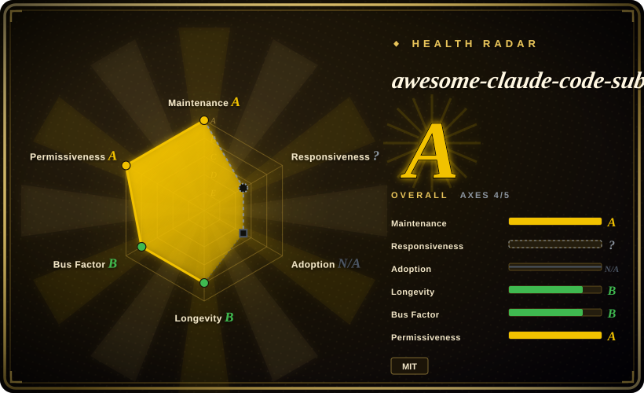
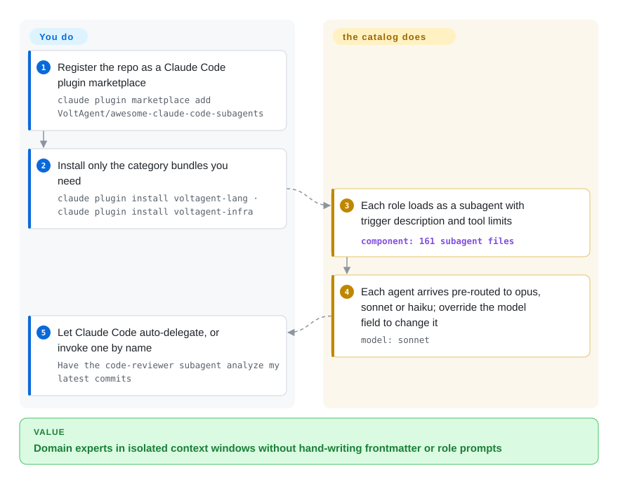

# awesome-claude-code-subagents

You're running Claude Code on a real codebase and wish it had sharper specialists to hand work to — a `code-reviewer` for diffs, a `security-auditor` before shipping — but hand-writing each persona's frontmatter and long role prompt is tedious. This is a starter roster of 161 subagent markdown files across 10 categories, installable per category as Claude Code plugins.

## When to use

You're a developer running Claude Code on a real codebase, and you keep wishing the agent had narrower, sharper personas to hand work off to — a dedicated `code-reviewer` for diffs, a `backend-developer` for API work, a `security-auditor` before shipping — instead of one generalist trying to do everything in a single context window. Writing those subagent files yourself is tedious: you have to figure out the frontmatter (`name` / `description` / `tools` / `model`), word the activation trigger so Claude Code auto-delegates correctly, and draft a long role prompt with checklists for each domain. You'd rather start from a vetted set and prune.

This repo gives you that starting set: 161 subagent markdown files (file-counted on `main` 2026-09-28; the README says "161+" across 10 categories — core development, language specialists, infrastructure, quality & security, data & AI, developer experience, specialized domains, business & product, meta & orchestration, research & analysis). Each file is a real persona with standardized frontmatter (`name` / `description` / `tools` / `model`) and a detailed role description — not a link to something elsewhere. The recommended install is now Claude Code's plugin marketplace: add the repo once, then install whole categories as plugins (`voltagent-lang`, `voltagent-infra`, …); alternatives are an interactive `install-agents.sh` (with a no-clone `curl` variant), manual copy into `~/.claude/agents/`, or letting an `agent-installer` persona install agents for you. Once installed, Claude Code can auto-delegate to a subagent by matching its `description`, or you invoke one explicitly ("have the code-reviewer subagent look at my latest commits"). You reach for it when you want broad role coverage fast and are willing to curate down to the handful you actually use.

## How it works

A subagent here is one markdown file: YAML frontmatter (`name`, `description` — the trigger text Claude Code matches when deciding to delegate, `tools` — which built-in tools it may touch, `model` — opus/sonnet/haiku pre-routed per role, e.g. `security-auditor` on opus, `documentation-engineer` on haiku, overridable or `model: inherit`) plus a long role prompt with checklists. The project ships the personas and their routing; Claude Code does the dispatching. You install by category: `claude plugin marketplace add VoltAgent/awesome-claude-code-subagents` registers the repo, `claude plugin install voltagent-lang` pulls one bundle — or you copy individual files to `~/.claude/agents/` (global) / `.claude/agents/` (project, which wins on name conflicts). What stays yours: pruning categories down to agents you'll actually use (the README's own license note says the maintainers do **not** audit or guarantee subagent security or correctness), overriding each `model`/`tools` field, and not treating an auditor persona as a real scanner.

<!-- flow-steps:begin (generated from flows/awesome-claude-code-subagents.json by tools/flow_card.py — do not edit) -->

Text version of the flow

1. **You**: Register the repo as a Claude Code plugin marketplace — `claude plugin marketplace add VoltAgent/awesome-claude-code-subagents`
2. **You**: Install only the category bundles you need — `claude plugin install voltagent-lang · claude plugin install voltagent-infra`
3. **awesome-claude-code-subagents**: Each role loads as a subagent with trigger description and tool limits — component: `161 subagent files`
4. **awesome-claude-code-subagents**: Each agent arrives pre-routed to opus, sonnet or haiku; override the model field to change it — `model: sonnet`
5. **You**: Let Claude Code auto-delegate, or invoke one by name — `Have the code-reviewer subagent analyze my latest commits`

**Value**: Domain experts in isolated context windows without hand-writing frontmatter or role prompts

<!-- flow-steps:end -->

## When NOT to use

- **You already curate your own subagents/skills.** 161 personas is a lot of surface to audit; layering them onto an existing, trusted agent set invites overlapping `description` triggers and unpredictable auto-delegation. Adopt a subset deliberately rather than installing the whole pack.
- **You're not on Claude Code.** These files use Claude Code's subagent format and `~/.claude/agents/` loading mechanism. On Cursor, OpenCode, Codex, Droid, or a bespoke harness there's no native loader for this exact format — the markdown alone won't auto-fire without adaptation. [推断]
- **You want enforced behavior.** A subagent is a prompt; its checklists and "always do X" steps are advisory instructions the model can deviate from, not hard gates. Don't treat "security-auditor" as a substitute for an actual scanner or CI check.
- **Trigger collisions matter to you.** With dozens of agents whose `description` fields all compete for auto-delegation, which one fires for a given task is not always obvious; the more you install, the harder routing is to reason about. [推断]
- **Maintenance / pinning.** There's no tagged release; you track `main`. A new commit can add, rename, or reword agents and shift how they route. Vendor the files you depend on rather than re-pulling blindly.

## Comparison

| Alternative | In index | Our verdict | Tradeoff |
|---|---|---|---|
| [wshobson/agents](wshobson-agents.md) | ✅ | Choose wshobson/agents when your need is engineering roles with attached commands/workflows; pick this page when you want coverage beyond coding (business, research, compliance) installed per category. | Both drop into `~/.claude/agents/`-style loading. wshobson pairs agents with tooling for dev work; this repo trades prompt depth for a 10-category breadth and plugin-marketplace distribution — pick by role coverage, not format. |
| [antfu-skills](../personal-collections/engineering-workflows/antfu-skills.md) / [dimillian-skills](../personal-collections/engineering-workflows/dimillian-skills.md) / [khazix-skills](../personal-collections/knowledge-content/khazix-skills.md) | ✅ | Choose personal *skill* collections when you need the `Skill`-tool format rather than subagent personas. | Personal *skill* collections (the `Skill`-tool format), not subagent personas. Different unit of consumption — skills are on-demand procedures, subagents are delegated sub-conversations. Use those when you want behaviors loaded into the main agent, this when you want separate delegated experts. |
| [agency-agents](agency-agents.md) | ✅ | Choose agency-agents when the personas must follow you out of Claude Code into ~15 other tools; pick this page when you live in Claude Code and want per-category plugin bundles with pre-set per-role model routing. | Agency-Agents: 18 cross-domain divisions plus converters and a desktop app, but no per-role model routing story. This repo: Claude-Code-native plugins, 161 files across 10 engineering-skewed categories — lighter adoption surface, narrower tool reach. |
| Anthropic's built-in subagent docs / hand-rolled agents | 未收录 | Choose built-in docs or hand-rolled agents when you need the native way to author subagents yourself. | The native way to author subagents yourself. This repo is a third-party starter set layered on that same mechanism, so it can duplicate or collide with agents you've already written. |
| [Superpowers](../../agent-dev-methodology/coding-agent-harnesses/superpowers.md) / SDLC methodology packs | 部分已收录 | Choose Superpowers or similar SDLC methodology packs when you need workflow discipline (brainstorm→plan→TDD→verify) inside one agent. | Those install a *workflow discipline* (brainstorm→plan→TDD→verify) into one agent; this installs a *roster of role experts*. Orthogonal — you can run both, but they solve different problems. |

## Health & viability

- **Responsiveness**: Cannot be scored — type_na.
- **Maintenance (2026-09):** active — main committed 2026-09-21 (a week before this re-verify), ~10 active weeks in the last quarter, only ~3 open issues, and **no** tagged release: you track a moving `main`, not pinned cuts.
- **Governance & bus factor** — org-owned (`VoltAgent`); radar sees 32 active contributors with top1 share ~0.45 — a small core with one dominant hand. The repo carries sponsor slots (Crawlbase, SerpApi) and openly sells featured placement, so it has a funding model but no foundation backing; curation decisions sit with VoltAgent.
- **Age & Lindy** — created 2025-07-30, ~14 months old as of 2026-09: past year one while still committing weekly, but young-and-hyped by this index's standards; the Claude Code subagent format it targets is itself recent. Treat longevity as unproven before standardizing on it.
- **Risk flags** — no relicense/CVE signals; MIT throughout. Two content risks are documented rather than inferred: the license section explicitly disclaims any audit ("we do not audit or guarantee the security or correctness of any subagent" — reviewing is your job), and category lists mix in links to third-party vendor tools (e.g. under meta & orchestration) alongside the in-repo personas. Unversioned `main` remains the churn risk: a push can rename or reword personas and shift auto-delegation routing.

## Caveats (unverified)

- [未验证] GitHub metadata re-checked 2026-09-28: license MIT, primary language Shell (from the installer scripts), no tagged release (`latestRelease` is null), last push 2026-09-21, not archived — re-verify before relying on current contents.
- [未验证] Star count (~25.4k per GitHub on 2026-09-28) is unreliable and date-sensitive; treat as indicative only, not a quality signal.
- [未验证] The 161-agent figure is my file count of `categories/**.md` (171 markdown files minus 10 category READMEs) via the git tree API on 2026-09-28, matching the README's "161+"; the repo description still says "100+" — the number drifts with `main`.
- [未验证] The frontmatter schema (`name` / `description` / `tools` / `model`, per-role opus/sonnet/haiku routing, `model: inherit`) and the auto-delegation-vs-explicit invocation behavior are from the README; per-agent fidelity and actual routing were not independently exercised.
- [推断] Because each subagent is a prompt loaded by Claude Code, its checklists and mandatory-sounding steps are advisory — the model can deviate; they are not enforced guarantees.
- [推断] Installation/loading is Claude-Code-specific; using these on other harnesses requires format adaptation and is not confirmed to work as-is.
