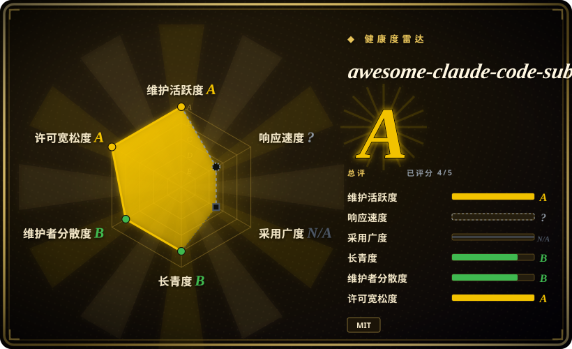
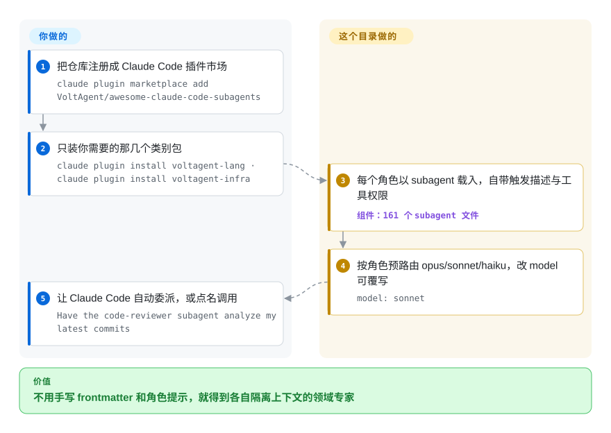

# awesome-claude-code-subagents

你在真实代码库上用 Claude Code，希望它有更锋利的专才可以派活——diff 交给 `code-reviewer`、上线前过一遍 `security-auditor`——但手写每个 persona 的 frontmatter 和长角色提示太繁琐。这是一套起步名册：161 个 subagent markdown 文件、分 10 个类别，可按类别作为 Claude Code 插件安装。

## 何时使用

你是一名在真实代码库上用 Claude Code 的开发者，越来越希望 agent 能有更窄、更锋利的 persona 来分派任务——diff 交给专门的 `code-reviewer`、API 工作交给 `backend-developer`、上线前过一遍 `security-auditor`——而不是让一个万能 agent 在同一个上下文窗口里把所有事都干完。自己写这些 subagent 文件很繁琐：要琢磨 frontmatter（`name` / `description` / `tools` / `model`）、把激活触发词写得让 Claude Code 能正确自动委派、再为每个领域起草一段带 checklist 的长角色提示。你更想从一套已被验证过的集合起步，再做删减。

这个 repo 提供的正是这套起步集：161 个 subagent markdown 文件（2026-09-28 对 `main` 逐文件清点；README 自称 "161+"，分 10 个类别——核心开发、语言专家、基础设施、质量与安全、数据与 AI、开发者体验、专项领域、商业与产品、元/编排、研究与分析）。每个文件都是带标准 frontmatter（`name` / `description` / `tools` / `model`）和详细角色描述的真实 persona——不是指向别处的链接。现在官方推荐的安装方式是 Claude Code 插件市场：把仓库注册一次，然后整类整类地装插件（`voltagent-lang`、`voltagent-infra`……）；备选还有交互式 `install-agents.sh`（有不用克隆的 `curl` 变体）、手动拷进 `~/.claude/agents/`，或让 `agent-installer` 人格替你安装。装好后，Claude Code 可以靠匹配 `description` 自动委派给某个 subagent，你也可以显式调用（“让 code-reviewer subagent 看看我最近的提交”）。当你想快速拿到广覆盖的角色集、并愿意收敛到自己真正会用的那几个时，就用它。

## 怎么用起来

这里的一个 subagent 就是一个 markdown 文件：YAML frontmatter（`name`、`description`——Claude Code 决定是否委派时匹配的触发文案、`tools`——允许它碰哪些内置工具、`model`——按角色预先把好模型路由好，比如 `security-auditor` 走 opus、`documentation-engineer` 走 haiku，可覆写或设 `model: inherit` 跟随主对话），外加一段带 checklist 的长角色提示。项目供给的是人格和路由，派发动作由 Claude Code 完成。你按类别安装：`claude plugin marketplace add VoltAgent/awesome-claude-code-subagents` 注册仓库，`claude plugin install voltagent-lang` 拉一个类别包——或者把单个文件拷到 `~/.claude/agents/`（全局）/ `.claude/agents/`（项目级，重名时项目级优先）。仍然归你管的：把类别裁剪到你真会用的那几个 agent（README 的 License 一节明说维护者**不**审计、不担保 subagent 的安全性与正确性）、覆写每份 `model`/`tools`，以及不要把审计人格当成真扫描器。

<!-- flow-steps:begin (generated from flows/awesome-claude-code-subagents.json by tools/flow_card.py — do not edit) -->

流程文字版

1. **你**：把仓库注册成 Claude Code 插件市场 — `claude plugin marketplace add VoltAgent/awesome-claude-code-subagents`
2. **你**：只装你需要的那几个类别包 — `claude plugin install voltagent-lang · claude plugin install voltagent-infra`
3. **awesome-claude-code-subagents**：每个角色以 subagent 载入，自带触发描述与工具权限 — 组件：`161 个 subagent 文件`
4. **awesome-claude-code-subagents**：按角色预路由 opus/sonnet/haiku，改 model 可覆写 — `model: sonnet`
5. **你**：让 Claude Code 自动委派，或点名调用 — `Have the code-reviewer subagent analyze my latest commits`

**价值**：不用手写 frontmatter 和角色提示，就得到各自隔离上下文的领域专家

<!-- flow-steps:end -->

## 何时不用

- **你已经在维护自己的 subagent/skills。** 161 个 persona 是很大的审计面；把它们叠到一套你已经信任的 agent 集上，会带来 `description` 触发词重叠和自动委派不可预测。请有意识地只采纳一个子集，而不是整包装上。
- **你不在 Claude Code 上。** 这些文件用的是 Claude Code 的 subagent 格式和 `~/.claude/agents/` 加载机制。在 Cursor、OpenCode、Codex、Droid 或自研 harness 上没有原生 loader 认这套格式——不经改造的话 markdown 本身不会自动触发。[推断]
- **你想要被强制执行的行为。** subagent 就是一段提示；它的 checklist 和“务必做 X”都是模型可以偏离的建议性指令，不是硬闸门。别把 "security-auditor" 当成真扫描器或 CI 检查的替代品。
- **触发冲突对你很关键。** 几十个 agent 的 `description` 字段都在争自动委派，某个任务到底触发哪个并不总是显而易见；装得越多，路由越难推理。[推断]
- **维护 / 固定版本。** 没有 tagged release，你跟的是 `main`。一次新提交可能新增、改名或改写 agent，从而改变路由方式。把你依赖的文件 vendor 下来，别盲目重新拉取。

## 横向对比

| 替代品 | 是否收录 | 我们的评价 | 取舍 |
|---|---|---|---|
| [wshobson/agents](wshobson-agents.zh.md) | ✅ | 需要工程角色外加配套命令/工作流时，选 wshobson/agents；想要编码之外的覆盖面（商业、研究、合规）并按类别整包装时，选本页。 | 两者都走 `~/.claude/agents/` 式加载。wshobson 把 agent 和开发工具链配套；本 repo 用提示词深度换 10 类别广度和插件市场分发——按角色覆盖选，不按格式选。 |
| [antfu-skills](../personal-collections/engineering-workflows/antfu-skills.zh.md) / [dimillian-skills](../personal-collections/engineering-workflows/dimillian-skills.zh.md) / [khazix-skills](../personal-collections/knowledge-content/khazix-skills.zh.md) | ✅ | 需要个人 skill 合集而不是 subagent persona 时，选对应个人集合。 | 个人 *skill* 合集（`Skill` 工具格式），不是 subagent persona。消费单元不同——skill 是按需加载的流程，subagent 是被委派的子对话。想把行为加载进主 agent 用前者，想要独立的委派专家用本项目。 |
| [agency-agents](agency-agents.zh.md) | ✅ | persona 需要跟着你走出 Claude Code、进约 15 种工具时，选 agency-agents；常驻 Claude Code、想要按类别的插件包和现成的按角色模型路由时，选本页。 | Agency-Agents：18 个跨职能部门加转换器与桌面 app，但没有按角色路由模型的说法。本 repo：Claude Code 原生插件、161 个文件、10 类偏工程的覆盖面——装起来更轻，触达工具更窄。 |
| Anthropic 内置 subagent 文档 / 自己手写的 agent | 未收录 | 需要自己创作 subagent 的原生方式时，选内置文档或手写 agent。 | 自己创作 subagent 的原生方式。本 repo 是叠在同一机制上的第三方起步集，因此可能与你已写的 agent 重复或冲突。 |
| [Superpowers](../../agent-dev-methodology/coding-agent-harnesses/superpowers.zh.md) / SDLC 方法论包 | 部分已收录 | 需要给单个 agent 加 brainstorm→plan→TDD→verify 工作流纪律时，选 Superpowers 或同类方法论包。 | 那类包给单个 agent 装的是*工作流纪律*（brainstorm→plan→TDD→verify）；本项目装的是一*组角色专家*。正交——可以同时用，但解决的是不同问题。 |

## 健康度与可持续性

- **响应速度**：无法计算——type_na。
- **维护（2026-09）：** 活跃——`main` 于 2026-09-21（本次复核前一周）有提交，近一季度约 10 个活跃周，开放 issue 只有约 3 个；且**没有** tagged release：你跟的是一条移动的 `main`，不是固定切片。
- **治理与 bus factor** —— 组织所有（`VoltAgent`）；雷达看到 32 位活跃贡献者、top1 份额约 0.45——小核心团队加一只手主导。仓库带赞助位（Crawlbase、SerpApi）并公开出售展示位，有资金模式但无基金会背书；策展决定权在 VoltAgent。
- **年龄与 Lindy** —— 创建于 2025-07-30，截至 2026-09 约 14 个月：撑过第一年且仍每周提交，但按本索引标准仍算年轻且被热捧；它针对的 Claude Code subagent 格式本身就很新。在把它定为标准前，把寿命当作未经证实。
- **风险标记** —— 未见 relicense/CVE 信号；全仓 MIT。两条内容风险是仓库自己写明的而非推断：License 一节明确不做审计（"we do not audit or guarantee the security or correctness of any subagent"——审查是你的事）；类别清单里混有指向第三方厂商工具的链接（如元/编排类下）与本地 persona 文件并列。无版本的 `main` 仍是主要变动风险——一次 push 可能改名或改写 persona、并改变自动委派的路由。

## 存疑（未验证）

- [未验证] 2026-09-28 复核的 GitHub 元数据：license MIT，主语言 Shell（来自安装脚本），无 tagged release（`latestRelease` 为 null），最后 push 于 2026-09-21，未归档——依赖当前内容前请重新核验。
- [未验证] star 数（2026-09-28 GitHub 显示约 25.4k）不可靠且对日期敏感；仅作参考，别当质量信号。
- [未验证] 「161 个 agent」是我于 2026-09-28 用 git tree API 对 `categories/**.md` 的清点（171 个 markdown 减 10 个类别 README），与 README 的 "161+" 相符；仓库描述仍写 "100+"——这个数字随 `main` 漂移。
- [未验证] frontmatter schema（`name` / `description` / `tools` / `model`，按角色路由 opus/sonnet/haiku、`model: inherit`）以及自动委派 vs 显式调用的行为均来自 README；逐个 agent 的保真度和实际路由未独立实测。
- [推断] 因为每个 subagent 都是 Claude Code 加载的一段提示，其 checklist 和听起来「强制」的步骤都是建议性的——模型可以偏离；它们不是被强制保证的。
- [推断] 安装/加载是 Claude-Code 专属的；在其他 harness 上使用需要格式改造，未确认可原样工作。
