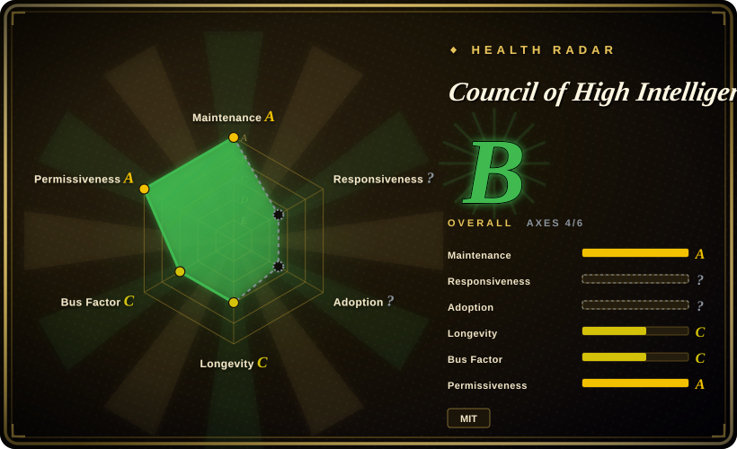
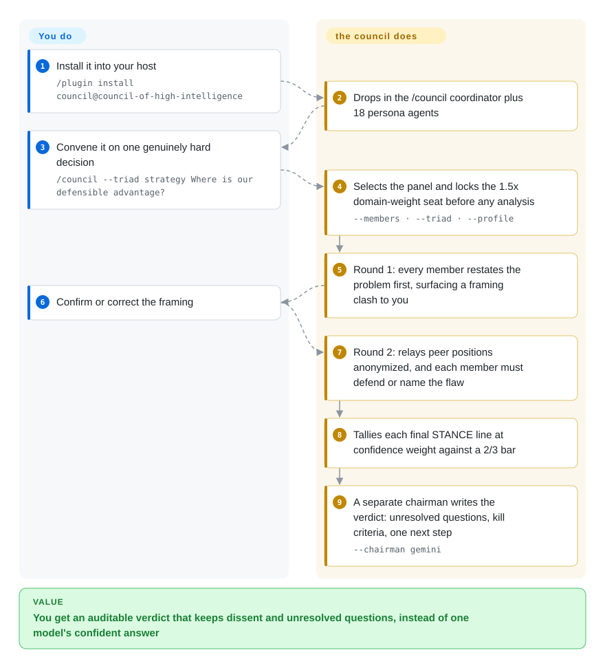

# Council of High Intelligence

A Claude Code / Codex / Gemini CLI / OpenCode skill-pack that convenes 18 fixed "thinker" personas (Aristotle, Socrates, Feynman, Torvalds, Kahneman, Taleb, Rams…) into a scripted multi-round deliberation — blind analysis, anonymized cross-examination, a confidence-weighted vote, and a verdict written by a chairman who sat outside the panel.

## When to use

You have to make one call that is expensive to reverse — kill or keep a product line, open-source the internal framework, accept the acquisition offer — and you can already get a fluent answer from any single model. The problem isn't getting an answer; it's that one model gives you one frame, in confident prose, with no record of what it ignored. Council installs as a `/council` command and runs the question through a fixed panel of 18 analytical personas under a scripted protocol: members answer blind first, then see each other's positions with identities masked and must name the specific flaw in their own argument before they may change their mind, and a counted confidence-weighted vote decides whether there is a real consensus or a split that gets handed back to you instead of being smoothed into prose.

Pick it over a general subagent catalog ([Agency-Agents](agency-agents.md), [awesome-claude-code-subagents](awesome-claude-code-subagents.md)) when the unit you want is an *enforced procedure* rather than a roster of roles to delegate to. Pick it over a multi-provider fan-out tool ([Claude Octopus](../../agent-frameworks/coding-agents/orchestration-and-review/claude-octopus.md)) when the protocol itself — fixed rounds, an anti-conformity rule, an auditable vote tally — is the thing you're buying, rather than how many vendors' models happen to answer.

## How it works

Mechanically this is a prompt protocol plus a persona set, not a runtime. `./install.sh` (or the Claude Code plugin marketplace) copies one coordinator skill and 18 agent contracts into your host; from then on the only artifact is the `/council` command, and "the coordinator" is just your own main agent reading `SKILL.md`. You supply the decision; the coordinator does everything else — selects the panel, locks which seat carries the 1.5× tie-break weight *before any member speaks*, dispatches each member as a one-shot call (a native subagent, or `codex exec` / `gemini -p` / `ollama run` / `cursor-agent -p` / an OpenAI-compatible HTTP call for external seats), and relays outputs between rounds through its own context, because members never talk to each other. What the project actually adds is the protocol: a restatement gate that can flag a framing clash back to you, a blind first round, an anonymized second round carrying a written anti-conformity directive, one pass of enforcement prompts (dissent quota, novelty gate, a forced counterfactual when >70% agree), and a mandatory machine-parseable `STANCE: … | CONFIDENCE: … | DEALBREAKER: …` line per member. The coordinator tallies those lines at confidence weight against a two-thirds bar and hands the whole transcript to a chairman chosen to sit outside the panel; if no option clears the bar, you are given the split rather than a forced verdict.

<!-- flow-steps:begin (generated from flows/council-of-high-intelligence.json by tools/flow_card.py — do not edit) -->

Text version of the flow

1. **You**: Install it into your host — `/plugin install council@council-of-high-intelligence`
2. **Council of High Intelligence**: Drops in the /council coordinator plus 18 persona agents
3. **You**: Convene it on one genuinely hard decision — `/council --triad strategy Where is our defensible advantage?`
4. **Council of High Intelligence**: Selects the panel and locks the 1.5x domain-weight seat before any analysis — `--members · --triad · --profile`
5. **Council of High Intelligence**: Round 1: every member restates the problem first, surfacing a framing clash to you
6. **You**: Confirm or correct the framing
7. **Council of High Intelligence**: Round 2: relays peer positions anonymized, and each member must defend or name the flaw
8. **Council of High Intelligence**: Tallies each final STANCE line at confidence weight against a 2/3 bar
9. **Council of High Intelligence**: A separate chairman writes the verdict: unresolved questions, kill criteria, one next step — `--chairman gemini`

**Value**: You get an auditable verdict that keeps dissent and unresolved questions, instead of one model's confident answer

<!-- flow-steps:end -->

## When NOT to use

- **The call is a factual lookup or cheaply reversible.** Run the experiment or read the primary docs; a council adds rounds and cost where a single answer settles it. The project's own README says as much.
- **You want many role personas to delegate work to.** Use [Agency-Agents](agency-agents.md) or [awesome-claude-code-subagents](awesome-claude-code-subagents.md). Council's 18 members are analytical *lenses* for one question, not a staffing catalog — you do not get "a frontend developer" out of it.
- **You want multi-vendor model fan-out over code or research artifacts.** Use [Claude Octopus](../../agent-frameworks/coding-agents/orchestration-and-review/claude-octopus.md): it has a wider command surface (`/octo:*`, including its own `/octo:council`), and its whole premise is other models reviewing your real diff. Council does not look at your repo.
- **You want an agent team that writes and verifies software.** Use [oh-my-claudecode](../../agent-frameworks/coding-agents/orchestration-and-review/oh-my-claudecode.md) or [Superpowers](../../agent-dev-methodology/coding-agent-harnesses/superpowers.md). Council outputs a verdict document, never a diff or a test run.
- **You need enforcement rather than suggestion.** Every "enforcement check" here is a prompt the coordinator model is asked to obey; nothing in the repo verifies that Round 2 was anonymized or that the weighted tally was actually computed. [推断] If silent non-compliance would matter to you, this is the wrong shape of tool — a deterministic orchestrator is not what this is.
- **You need a cost or latency budget.** `--full` is 18 seats × 3 rounds plus enforcement re-prompts; that is dozens of model calls, potentially across paid providers, with no built-in cap. Use `--duo` or `--quick`, or don't convene.
- **You run only one model family and won't install provider CLIs.** With no `codex` / `gemini` / `ollama` / `cursor-agent` detected, all 18 seats fall back to your host model: you keep persona diversity and lose model diversity, which is most of the claimed point.
- **You want a project with an owner behind it.** Single-maintainer personal repo, ~6 months old, no org or foundation — treat it as an experiment to try, not infrastructure to depend on.

## Comparison

| Alternative | In index | Our verdict | Tradeoff |
|---|---|---|---|
| [Claude Octopus](../../agent-frameworks/coding-agents/orchestration-and-review/claude-octopus.md) | ✅ | Pick Octopus when the task is reviewing real code/research across providers and you want a consensus gate over artifacts; pick Council when the task is one irreversible decision and you want the deliberation protocol itself to be the product. | Octopus covers far more ground (49+ commands, 32 personas, security/research workflows); Council goes narrow and deep on one judgment, with an explicit round budget and an auditable tally instead of general fan-out. |
| [oh-my-claudecode](../../agent-frameworks/coding-agents/orchestration-and-review/oh-my-claudecode.md) | ✅ | Choose oh-my-claudecode when you want staged coding teams (plan→prd→exec→verify) with model routing and tmux parallelism; choose Council when no code is being written and the deliverable is a defensible decision. | OMC optimizes throughput against a repository and ends in a merged change; Council optimizes the quality of a single judgment and ends in a verdict document, so it is useless as a build pipeline and OMC is useless as a decision ritual. |
| [Agency-Agents](agency-agents.md) | ✅ | Choose Agency-Agents when you need broad role coverage to delegate arbitrary tasks; choose Council when you need a small fixed panel whose disagreements are forced and counted. | Breadth versus procedure: 232 role personas you install selectively, against 18 lenses plus a protocol that decides who speaks, when identities are masked, and what happens when the vote splits. |
| [wshobson/agents](wshobson-agents.md) | ✅ | Choose wshobson/agents when you want a large generated multi-harness bundle of subagents, skills, commands and orchestrators; choose Council when you specifically want adversarial deliberation rather than a marketplace of capabilities. | wshobson optimizes coverage and harness parity across many tools; Council is one opinionated protocol, so it fits a narrower intent but has no "pick the pieces you need" surface to assemble. |
| [Superpowers](../../agent-dev-methodology/coding-agent-harnesses/superpowers.md) | ✅ | Choose Superpowers to shape how your agent *builds software* (brainstorm→plan→TDD→verify, worktrees, subagent review); choose Council to shape how you *decide* before any build starts. | Different layers: Superpowers changes the agent's engineering process and produces code, Council changes the decision process and produces a verdict with kill criteria — they compose rather than substitute. |

## Health & viability

- **Maintenance — active (as of 2026-09-21).** Three tagged releases (`v1.0.0` 2026-03-30 → `v1.2.0` 2026-07-04), last push the same day as this check, ~75 commits, and an Unreleased CHANGELOG section that adds a CI-wired roster validator. Release cadence is roughly quarterly.
- **Governance & bus factor — single maintainer.** Owner is an individual account (`0xNyk`, `User` type), and across 75-commits' worth of history the maintainer accounts for the large majority of contributions (46 commits; next human is 3). No org, foundation, or second maintainer owns the roadmap. [推断]
- **Age & Lindy — young, unproven.** Created 2026-03-02, so ~6.5 months old at this check. It is genuinely active, but "young × active" is not the Lindy-safe case; there is no track record to bet on, and the star count is attention rather than durability.
- **Adoption & ecosystem — high visibility, unverified usage.** ~4.4k stars / ~412 forks and a Claude Code plugin-marketplace listing; the repo carries unusually heavy engineering furniture for this genre (CHANGELOG with semver, `SECURITY.md`, `CONTRIBUTING.md`, issue/PR templates, CI lint + release workflows, a rosters-drift validator with 166 structural checks, and shell-injection hardening in the dispatch templates). [未验证] No named production users or independent quality benchmark.
- **Risk flags — MIT and no relicense history, but the risk is architectural.** The real exposure is not licensing: it is (a) prompt-level enforcement with no verifier, (b) a four-host protocol surface the project itself expects to drift (hence `scripts/validate-roster.py`), and (c) cost/latency that scales with panel size and rounds. Note also that its mechanism claims are footnoted to arXiv papers rather than to a benchmark shipped here.

## Caveats (unverified)

- [未验证] Star (~4.4k), fork (~412) and open-issue (~16) counts are from the GitHub API on 2026-09-21; they are date-sensitive and are not a quality signal.
- [未验证] The arXiv citations in `SKILL.md` (2410.12853 DMAD, 2510.07517 anonymization, 2509.11035 Free-MAD, 2509.16839 Roundtable Policy, 2509.14034 ConfMAD, 2511.07784) are quoted from the repo; I did not fetch the papers, so whether they support the specific mechanisms claimed here is unverified.
- [未验证] Provider model IDs (`gpt-5.4`, `gemini-3-pro`, `deepseek-ai/deepseek-v4-pro`, `claude-opus-4-7-thinking-high`, `grok-4`) are transcribed from `configs/auto-route-defaults.yaml` and `scripts/detect-providers.sh`; their existence and current validity were not checked against the vendors.
- [未验证] Structural counts I read from `SKILL.md` — 18 members (8 `opus` / 10 `sonnet` frontmatter tiers), 20 triads, 15 polarity pairs, profiles of 18 / 12 / 5 members, `--members` bounded to 2–11 — are the repo's own declarations; I did not run its validator or execute a council.
- [未验证] "Runs on Claude Code, Codex, Gemini CLI and OpenCode" rests on four `SKILL.*.md` mirrors plus installer flags I read; only the Claude Code path is natively exercised, and the repo's own verification section is a dry-run plus a checklist script.
- [推断] Enforcement here is prompt-level, not code-enforced: nothing verifies the coordinator actually anonymized Round 2, ran the enforcement prompts, or computed the weighted tally. Silent non-compliance would be invisible from the verdict artifact.
- [推断] Decision-quality uplift is a design claim. No independent benchmark shows that 18 personas plus these rounds beat one strong model on real decisions; the mechanisms are plausible and paper-cited, not demonstrated.
- [推断] `language: Shell` reflects GitHub's language stats (Shell ~36k bytes, Python ~15k); the substance of the project is Markdown protocol and persona prose, so the language figure understates where the actual logic lives.
