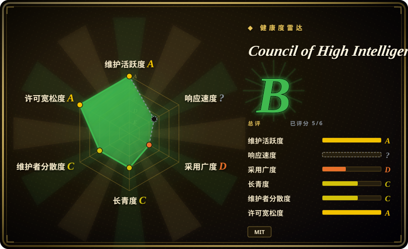
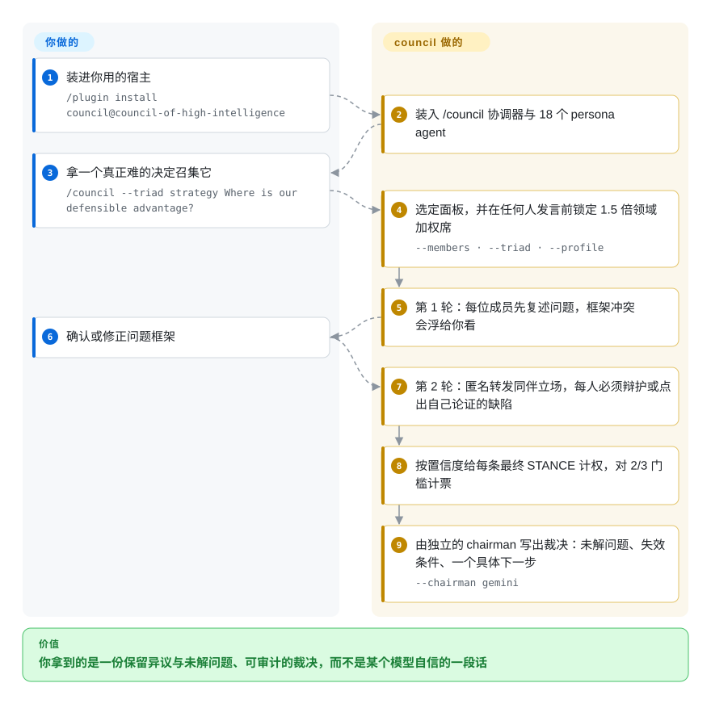

# Council of High Intelligence

一个 Claude Code / Codex / Gemini CLI / OpenCode 技能包：把 18 个固定的「思想家」人设（Aristotle、Socrates、Feynman、Torvalds、Kahneman、Taleb、Rams……）拉进一套剧本化的多轮审议——先盲评，再匿名交叉质询，按置信度加权计票，最后由一位不参与辩论的 chairman 写出裁决。

## 何时使用

你正要做一个代价高昂、几乎不可逆的决定——砍掉还是保留某条产品线、要不要把内部框架开源、接不接受这个收购报价——而你随便问哪个单模型都能拿到一段流畅的答案。问题从来不是拿不到答案，而是单个模型只给你一个框架，用自信的语气说出来，且完全不记录它忽略了什么。Council 以一条 `/council` 命令安装进来，把你的问题送进 18 个分析人设组成的固定面板，并按剧本走：成员先盲评，然后看到彼此被抹去身份后的立场，且必须先点出自己论证里的具体缺陷才有资格改变立场；最后用一次可数的、按置信度加权的计票判定究竟形成了真共识，还是存在分歧——有分歧就交回给你，而不是被抹成一段「大家基本同意」。

当你要的是**被强制执行的流程**而不是一份可委派角色的名册时，它优于通用 subagent 合集（[Agency-Agents](agency-agents.zh.md)、[awesome-claude-code-subagents](awesome-claude-code-subagents.zh.md)）。当你真正想买的是**协议本身**——固定轮次、反从众规则、可审计的计票——而不只是「有几个厂商的模型在回答」时，它优于多厂商扇出工具（[Claude Octopus](../../agent-frameworks/coding-agents/orchestration-and-review/claude-octopus.zh.md)）。

## 怎么用起来

机制上这是「提示词协议 + 人设集」，不是运行时。`./install.sh`（或 Claude Code 的插件市场）把一个协调器技能和 18 份 agent 契约拷进你的宿主；此后唯一的产物就是 `/council` 这条命令，所谓「协调者」其实就是你自己那个主 agent 在读 `SKILL.md`。你只提供那个决定；其余全由协调者做——选面板、在**任何人开口之前**锁定哪一席拿 1.5 倍平票加权、把每个成员当作一次性调用派出去（原生 subagent，或对外部席位用 `codex exec` / `gemini -p` / `ollama run` / `cursor-agent -p` / OpenAI 兼容的 HTTP 调用），并在自己的上下文里替他们转发轮次间的输出——成员之间从不互相通信。这个项目真正加上的东西是协议：一道复述闸门（能把框架层面的冲突暴露给你）、一轮盲评、一轮带明确反从众指令的匿名质询、一轮强制扫描（异议配额、新颖性门、一致率超过七成时强制反事实反问），以及每位成员必须输出的机器可解析行 `STANCE: … | CONFIDENCE: … | DEALBREAKER: …`。协调者按置信度给这些行计权、对着三分之二门槛计票，再把整份 transcript 交给一位被刻意安排在面板之外的 chairman；若没有任何选项过线，你拿到的是分歧本身，而不是被强行揉出来的裁决。

<!-- flow-steps:begin (generated from flows/council-of-high-intelligence.json by tools/flow_card.py — do not edit) -->

流程文字版

1. **你**：装进你用的宿主 — `/plugin install council@council-of-high-intelligence`
2. **Council of High Intelligence**：装入 /council 协调器与 18 个 persona agent
3. **你**：拿一个真正难的决定召集它 — `/council --triad strategy Where is our defensible advantage?`
4. **Council of High Intelligence**：选定面板，并在任何人发言前锁定 1.5 倍领域加权席 — `--members · --triad · --profile`
5. **Council of High Intelligence**：第 1 轮：每位成员先复述问题，框架冲突会浮给你看
6. **你**：确认或修正问题框架
7. **Council of High Intelligence**：第 2 轮：匿名转发同伴立场，每人必须辩护或点出自己论证的缺陷
8. **Council of High Intelligence**：按置信度给每条最终 STANCE 计权，对 2/3 门槛计票
9. **Council of High Intelligence**：由独立的 chairman 写出裁决：未解问题、失效条件、一个具体下一步 — `--chairman gemini`

**价值**：你拿到的是一份保留异议与未解问题、可审计的裁决，而不是某个模型自信的一段话

<!-- flow-steps:end -->

## 何时不用

- **这是个事实查询，或者代价小、可回退。** 去做实验，或者去读一手文档；单次回答就能定的事，议会只会多花轮次和钱。项目自己的 README 也这么说。
- **你要的是大量可委派的角色人设。** 用 [Agency-Agents](agency-agents.zh.md) 或 [awesome-claude-code-subagents](awesome-claude-code-subagents.zh.md)。Council 的 18 个成员是针对同一个问题的分析**视角**，不是人员目录——你不会从中得到「一个前端工程师」。
- **你要的是针对代码或研究材料的多厂商模型扇出。** 用 [Claude Octopus](../../agent-frameworks/coding-agents/orchestration-and-review/claude-octopus.zh.md)：它的命令面宽得多（`/octo:*`，里面也有自己的 `/octo:council`），而且它的前提就是别的模型来审你的真实 diff。Council 根本不看你的仓库。
- **你要的是一支会写代码、会验证软件的 agent 团队。** 用 [oh-my-claudecode](../../agent-frameworks/coding-agents/orchestration-and-review/oh-my-claudecode.zh.md) 或 [Superpowers](../../agent-dev-methodology/coding-agent-harnesses/superpowers.zh.md)。Council 产出的是裁决文档，永远不是 diff 或测试结果。
- **你需要的是强制而不是建议。** 这里每一道「强制执行」都是写给协调者模型的提示词；仓库里没有任何东西校验第 2 轮是否真的做了匿名化、加权计票是否真的算了。[推断]如果「静默不遵守」对你构成风险，那这个工具的形状就不对——它不是确定性编排器。
- **你需要成本或延迟预算。** `--full` 是 18 席 × 3 轮，再加执法性追问，就是几十次模型调用，还可能散在多个付费 provider 上，且没有内置上限。用 `--duo` 或 `--quick`，或者干脆别召集。
- **你只跑单一模型家族、也不愿意装 provider CLI。** 检测不到 `codex` / `gemini` / `ollama` / `cursor-agent` 时，18 席全部回落到宿主模型：人设多样性还在，模型多样性没了，而后者才是它宣称的主要价值。
- **你要一个有归属方背书的项目。** 单人维护的个人仓库，约 6 个月大，没有组织或基金会——把它当作可以一试的实验，而不是可以依赖的基础设施。

## 横向对比

| 替代品 | 是否收录 | 我们的评价 | 取舍 |
|---|---|---|---|
| [Claude Octopus](../../agent-frameworks/coding-agents/orchestration-and-review/claude-octopus.zh.md) | ✅ | 任务是跨厂商审真实代码/研究材料、且你需要对产物做共识门时，选 Octopus；任务是某一个不可逆决定、且你要买的正是审议协议本身时，选 Council。 | Octopus 覆盖面大得多（49+ 命令、32 个人设、安全与研究流程）；Council 在一件事上窄而深，用显式轮次预算和可审计计票替代泛化扇出。 |
| [oh-my-claudecode](../../agent-frameworks/coding-agents/orchestration-and-review/oh-my-claudecode.zh.md) | ✅ | 你要的是分阶段编码团队（plan→prd→exec→verify）配模型路由和 tmux 并行时，选 oh-my-claudecode；不写代码、交付物是一个可辩护的决定时，选 Council。 | OMC 优化的是对仓库的吞吐，终点是一个已合并的改动；Council 优化的是单次判断的质量，终点是一份裁决文档——前者当决策仪式没用，后者当构建流水线也没用。 |
| [Agency-Agents](agency-agents.zh.md) | ✅ | 你需要广泛的角色覆盖来委派各种任务时，选 Agency-Agents；你需要一个小的固定面板、且它的分歧是被强制产生并被计数的时，选 Council。 | 广度换流程：232 个按需挑选的角色人设，对 18 个视角加一套决定「谁在何时发言、身份何时被抹去、票分散了怎么办」的协议。 |
| [wshobson/agents](wshobson-agents.zh.md) | ✅ | 你要一份大型、多 harness 生成的 subagent/skill/command/orchestrator 合集时，选 wshobson/agents；你要的明确是对抗式审议、而不是一个能力市场时，选 Council。 | wshobson 优化的是覆盖面与多工具产物一致性；Council 只有一套有主张的协议，意图更窄，也没有「按需拼装」的面。 |
| [Superpowers](../../agent-dev-methodology/coding-agent-harnesses/superpowers.zh.md) | ✅ | 要塑造你的 agent **怎么写软件**（brainstorm→plan→TDD→verify、worktree、子 agent 审查）时选 Superpowers；要在动手之前塑造**你怎么做决定**时选 Council。 | 两者是不同层：Superpowers 改的是工程的流程、产出代码；Council 改的是决策的流程、产出带失效条件的裁决——它们是叠加关系而不是替代关系。 |

## 健康度与可持续性

- **维护——活跃（截至 2026-09-21）。** 三个带 tag 的发布（`v1.0.0` 2026-03-30 → `v1.2.0` 2026-07-04），最近一次推送就在本次核查当天，约 75 次提交；Unreleased 的 CHANGELOG 段落还在加一个接入 CI 的名册校验器。发布节奏大致是每季度一次。
- **治理与 bus factor——单人维护。** 归属是个人账号（`0xNyk`，`User` 类型），且在这批历史里维护者本人占了绝大多数贡献（46 次提交，下一位人类贡献者 3 次）。没有组织、基金会或第二位维护者掌握路线图。[推断]
- **年龄与 Lindy——年轻、未经证明。** 创建于 2026-03-02，本次核查时约 6.5 个月。它确实活跃，但「年轻 × 活跃」并不是 Lindy 意义上的安全情形：没有可下注的历史记录，star 数反映的是关注度而不是耐久度。
- **采用与生态——可见度高，使用情况未验证。** 约 4.4k star / 约 412 fork，并已上架 Claude Code 插件市场；在这个品类里它的工程配套异常完整（带 semver 的 CHANGELOG、`SECURITY.md`、`CONTRIBUTING.md`、issue/PR 模板、CI 的 lint 与 release workflow、一个含 166 项结构检查的名册漂移校验器，以及派发模板里的 shell 注入加固）。[未验证]没有具名的生产用户，也没有独立的质量基准。
- **风险标记——MIT、无改许可历史，但风险在架构层。** 真正的暴露不是许可：而是（a）提示词级执行、没有任何校验器，（b）一套项目自己都预期会漂移的四宿主协议面（所以才需要 `scripts/validate-roster.py`），（c）成本与延迟随面板大小和轮次线性上升。另需注意：它的机制主张脚注指向 arXiv 论文，而不是本项目自带的基准。

## 存疑（未验证）

- [未验证]star（约 4.4k）、fork（约 412）、open issue（约 16）为 2026-09-21 的 GitHub API 数值；对日期敏感，且不是质量信号。
- [未验证]`SKILL.md` 里引用的 arXiv 编号（2410.12853 DMAD、2510.07517 匿名化、2509.11035 Free-MAD、2509.16839 Roundtable Policy、2509.14034 ConfMAD、2511.07784）均转录自该仓库；我没有去取这些论文，因此它们是否支持文中宣称的具体机制属未验证。
- [未验证]provider 的模型 ID（`gpt-5.4`、`gemini-3-pro`、`deepseek-ai/deepseek-v4-pro`、`claude-opus-4-7-thinking-high`、`grok-4`）转录自 `configs/auto-route-defaults.yaml` 与 `scripts/detect-providers.sh`；其存在性与当前有效性未向各厂商核对。
- [未验证]我从 `SKILL.md` 读到的结构数字——18 个成员（frontmatter 档位 8 个 `opus` / 10 个 `sonnet`）、20 组 triad、15 对极性对、18 / 12 / 5 人的 profile、`--members` 限 2–11——都是仓库自己的声明；我没有跑它的校验器，也没有实际执行过一次议会。
- [未验证]「可跑在 Claude Code、Codex、Gemini CLI 和 OpenCode 上」的依据是我读到的四份 `SKILL.*.md` 镜像加安装脚本开关；真正被原生跑过的只有 Claude Code 一条路径，且仓库自己的验证段落也只是 dry-run 加一份清单脚本。
- [推断]这里的执行是提示词级的、不是代码强制的：没有任何东西验证协调者真的做了第 2 轮匿名化、真的跑了执法扫描、真的算了加权计票。静默不遵守从裁决产物上是看不出来的。
- [推断]决策质量的提升是设计主张。没有独立基准显示 18 个人设加这些轮次能在真实决策上胜过单个强模型；这些机制可信且有论文引用，但未被演示。
- [推断]`language: Shell` 反映的是 GitHub 的语言统计（Shell 约 36k 字节、Python 约 15k）；项目的实质是 Markdown 协议与人设文本，所以这个语言数字低估了逻辑真正所在的位置。
