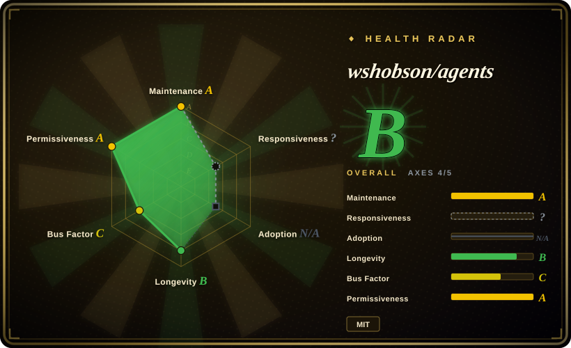
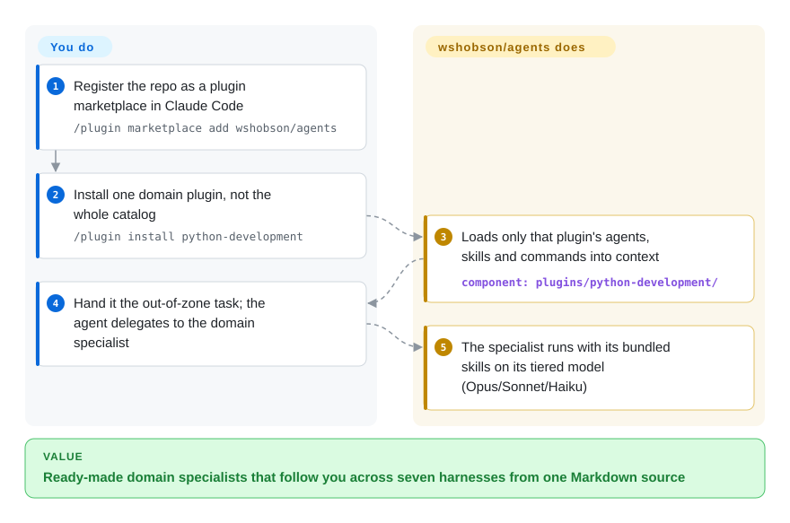

# wshobson/agents

You keep hitting tasks outside your comfort zone in Claude Code — a Terraform review, a Rust perf regression — and hand-writing a dedicated subagent for each is real work; this repo is a plugin marketplace of ~202 domain-expert agents, 183 skills and 105 slash commands, authored once in Markdown and generated into native artifacts for seven coding harnesses, so you pull a ready-made specialist off the shelf.

## When to use

You're a developer who lives in Claude Code (or Codex CLI / Cursor / OpenCode / Copilot), and you keep hitting tasks that sit outside your own comfort zone — a Rust performance regression, a Terraform module review, a SQL query plan, an incident post-mortem, a security pass on an auth flow. Hand-writing a good subagent persona or a focused skill for each of these is real work, and you'd rather pull a ready-made one off the shelf. You run `/plugin marketplace add wshobson/agents`, then `/plugin install <plugin-name>`, and that plugin's domain-expert subagents, skills and slash commands load into your harness through its own loader. Instead of one bloated do-everything prompt, you get many narrow specialists the agent can delegate to by domain.

You reach for this specifically when you want *breadth* and *cross-harness portability* from one source. The repo is authored once in Markdown (`plugins/`) and emits idiomatic per-harness artifacts via `make generate`, so its seven targets — Claude Code, Codex CLI, Cursor, OpenCode, Antigravity CLI, GitHub Copilot and Pi — get native outputs, and the same "backend-architect" or "security-auditor" persona follows you whichever harness today's task runs in. If you only want individual skills without the marketplace at all, `gh skill install wshobson/agents` or `npx skills add wshobson/agents` reads the skill folders straight from GitHub into most agents. It is closer to a curated catalog than an opinionated methodology: pick the plugins for the domains you actually touch (Python, full-stack, ML, infra, security, data, docs, SEO, orchestration) and ignore the rest.

## How it works

Everything is Markdown under `plugins/<name>/` — one directory per plugin, holding `agents/`, `skills/` and `commands/` subfolders plus a `plugin.json` manifest; that tree is the single source of truth. In Claude Code you register the repo as a marketplace and install one plugin at a time, and the harness loads *only that plugin's* components into context — not the whole 94-plugin catalog (installing everything is its own context-bloat problem). For the other six harnesses a generator (`make generate HARNESS=<name>`) compiles the same Markdown into harness-native files: Codex and Cursor read committed registries, while OpenCode, Antigravity and Pi need clone + `make` on your machine (the generated trees are gitignored). Each agent is also assigned a model tier (Opus for architecture/security, Sonnet for docs/testing, Haiku for fast operational tasks), so delegation costs scale with the job. What stays yours: choosing which plugins to install, and reviewing what the personas actually do — they are prompt-level instructions the agent may deviate from, not enforced behavior, and two of the 94 marketplace entries are external `git-subdir` payloads from other repos.

<!-- flow-steps:begin (generated from flows/wshobson-agents.json by tools/flow_card.py — do not edit) -->

Text version of the flow

1. **You**: Register the repo as a plugin marketplace in Claude Code — `/plugin marketplace add wshobson/agents`
2. **You**: Install one domain plugin, not the whole catalog — `/plugin install python-development`
3. **wshobson/agents**: Loads only that plugin's agents, skills and commands into context — component: `plugins/python-development/`
4. **You**: Hand it the out-of-zone task; the agent delegates to the domain specialist
5. **wshobson/agents**: The specialist runs with its bundled skills on its tiered model (Opus/Sonnet/Haiku)

**Value**: Ready-made domain specialists that follow you across seven harnesses from one Markdown source

<!-- flow-steps:end -->

## When NOT to use

- **You already run a curated subagent/skill stack you trust.** 202 agents plus 183 skills is a lot of surface; layering it onto an existing methodology pack invites overlapping personas and double-routing (two "code reviewers", two "debuggers" competing for the same task). Pick one source of truth per concern.
- **Install path varies sharply by harness.** Claude Code installs natively via `/plugin`, and Codex/Cursor install from committed registries (`npx codex-marketplace add wshobson/agents`); Antigravity, OpenCode and Pi require cloning plus `make generate` / `make install-*` (the transformed trees are gitignored), which needs `make`/`uv` and is not a one-command install. The skills-only escape hatch (`gh skill install`, `npx skills add`) works for any agent but ships skills only — no agents, commands or orchestrators.
- **You want a runtime, library or CLI for your app.** Apart from the `plugin-eval` quality tool, there is nothing to `import` into your own software — this configures an agent's behavior, not your application. Outside a supporting harness it does nothing.
- **You need pinned, reproducible behavior.** The repo has no tagged releases (GitHub tags API empty as of 2026-09-28); you install whatever is on `main`. A push can shift how a subagent routes or what a skill enforces. Vendor the files and pin your own copy if you need stability.
- **Two of the 94 plugins are third-party code.** `pensyve` (external memory) and a HOL Guard security scanner are external `git-subdir` marketplace entries pinned to commits in *other* repositories — you're installing another project's payload through this catalog's name, with its own approval and update path.
- **Enforcement is advisory, and breadth is unaudited.** Behavior lives in prompt/Markdown that the agent loads; "expert" personas are instructions, not guarantees, and 200+ personas means you cannot personally vet each one's quality before delegating real work to it. The bundled `plugin-eval` scorer has only its static-analysis layer as deterministic — its LLM-judge and Monte-Carlo layers are labeled experimental and unvalidated against human labels.

## Comparison

| Alternative | In index | Our verdict | Tradeoff |
|---|---|---|---|
| [awesome-claude-code-subagents](awesome-claude-code-subagents.md) | ✅ | Choose awesome-claude-code-subagents when persona breadth alone is enough. | The other large Claude Code subagent collection in this leaf, but *subagents only* (drop into `~/.claude/agents/`). wshobson/agents bundles skills + commands + orchestrators too and generates per-harness; pick by whether you want persona breadth only vs. a multi-artifact, multi-harness catalog. |
| [gstack](../personal-collections/engineering-workflows/gstack.md) | ✅ | Choose gstack when one founder's role-based command set fits your workflow. | One founder's *role-based* command set (CEO/designer/QA personas) tuned to his daily factory. Far narrower and personal; wshobson/agents is a generic domain catalog, not a single operator's workflow. |
| [Claude Plugins (official)](../vendor-collections/claude-plugins-official.md) | ✅ | Choose Claude Plugins when first-party marketplace provenance matters more than breadth. | First-party, Anthropic-curated `/plugin` marketplace with known provenance; narrower and Claude-Code-only. wshobson/agents is third-party and far broader, spanning multiple harnesses, at higher trust/vetting cost. |
| Hand-rolling your own subagents/skills | 未收录 | Choose custom subagents/skills when maximum fit and zero stack conflict outweigh ready-made breadth. | Maximum fit and zero conflict with your existing stack, but you author and maintain everything. This repo trades bespoke fit for ready-made breadth you must still vet. |

## Health & viability

- **Responsiveness**: Cannot be scored — type_na.
- **Maintenance** — verified 2026-09-28 via GitHub API: last push 2026-09-28, last commit on `main` 2026-09-26, not archived, 8 open issues — **actively maintained**. No tagged releases; you install whatever is on `main`.
- **Governance & bus factor** — [推断] `User`-owned, effectively single-maintainer repo (GitHub contributor stats: top author ≈ 63% of last-12-months commits, 2026-09-28 scorer run) at ~40k stars (2026-09). A very large, unversioned surface (~202 agents / ~183 skills) resting on one person means cadence and long-term support are not guaranteed; vendor what you depend on. No foundation or vendor backing.
- **Age & Lindy** — created 2025-07, so ~14 months old as of 2026-09: past the pure-hype window but **not yet a strong Lindy bet**; the multi-harness generator (`make generate`, Antigravity/Pi targets) is recent tooling that keeps changing — treat durability as unproven.
- **Risk flags** — [推断] single-maintainer + no version pins is the headline risk — a push can regress how a subagent routes or what a skill enforces; plus the two external git-subdir payloads. No relicense/CVE signals; MIT throughout (GitHub API, 2026-09-28).

## Caveats (unverified)

- [未验证] The inventory figures (94 plugins / 202 agents / 183 skills / 105 commands / 16 orchestrators) are read from the README at commit `9b15b34` on 2026-09-28 and will drift; the live `plugins/` directory currently holds 92 local entries plus 2 external git-subdir ones — enumerate that tree rather than trusting these counts.
- [未验证] The seven-harness support list (Claude Code source-of-truth, plus Codex CLI, Cursor, OpenCode, Antigravity CLI, Copilot, Pi) and the per-harness install mechanics (native registry vs. clone + `make generate`) are from the README; actual generation/activation fidelity per harness is not independently confirmed here.
- [未验证] The `plugin-eval` quality framework (deterministic static layer; LLM-judge and Monte-Carlo layers the README itself marks experimental and not validated against human labels; `uv run plugin-eval score`/`certify`) is described in the README and not independently exercised here.
- [未验证] The external HOL Guard `git-subdir` entry (pinned payload commit, `hol-guard==2.2.119` / `plugin-scanner==2.2.119` CLI pins, user-approval requirement) is as the README states; not exercised here.
- [推断] Single-maintainer project; maintenance cadence and long-term support are not guaranteed, and a large unversioned surface can regress between pushes.
- [推断] Because personas/skills activate through each harness's native loader, enforcement is advisory — the agent can deviate, and cross-harness portability depends on the generator, not a runtime contract.
