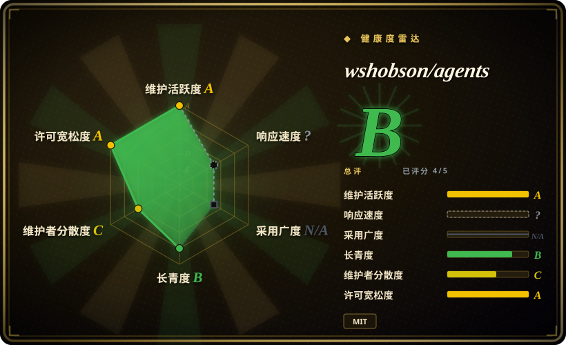
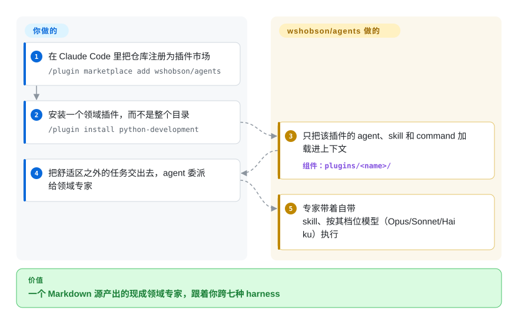

# wshobson/agents

你在 Claude Code 里老是碰到落在舒适区之外的任务——一次 Terraform 模块 review、一个 Rust 性能回退——为每件事专门写一个 subagent 是实打实的劳动；这个仓库是一个插件市场，约 202 个领域专家 subagent、183 个 skill、105 个 slash command，用 Markdown 写一份源，再生成七种 coding harness 的原生产物，让你直接从货架上取现成的专家。

## 何时使用

你是一个常驻 Claude Code（或 Codex CLI / Cursor / OpenCode / Copilot）的开发者，经常碰到落在自己舒适区之外的任务——一个 Rust 性能回退、一段 Terraform 模块 review、一个 SQL 查询计划、一次事故复盘、一条 auth 流程的安全检查。为每件事手写一个像样的 subagent persona 或一个聚焦的 skill 都是实打实的活，你更想直接从货架上取一个现成的。于是你运行 `/plugin marketplace add wshobson/agents`，再 `/plugin install <plugin-name>`，该插件的领域专家 subagent、skill 和 slash command 就通过 harness 自己的 loader 加载进来。你拿到的不是一个臃肿的全能 prompt，而是一群窄而专的专家，agent 可以按领域委派给它们。

当你想从「同一个源」获得**广度**与**跨 harness 可移植性**时，就该用它。仓库以 `plugins/` 为唯一事实源、只用 Markdown 编写，通过 `make generate` 产出各 harness 的惯用产物，七个目标 harness——Claude Code、Codex CLI、Cursor、OpenCode、Antigravity CLI、GitHub Copilot 与 Pi——都拿到原生格式，同一个 "backend-architect" 或 "security-auditor" persona 会跟着你走，无论今天的任务跑在哪个 harness。只要个别 skill、不想碰市场的话，`gh skill install wshobson/agents` 或 `npx skills add wshobson/agents` 能直接从 GitHub 把 skill 装进多数 agent。它更像一个精选目录，而非一套有主张的方法论：挑你真正会碰到的领域（Python、全栈、ML、基础设施、安全、数据、文档、SEO、编排）的插件，其余忽略即可。

## 怎么用起来

一切都以 Markdown 存放在 `plugins/<name>/` 下——每个插件一个目录，内含 `agents/`、`skills/`、`commands/` 子目录加一份 `plugin.json` 清单；这棵树是唯一事实源。在 Claude Code 里你把仓库注册为市场、逐个安装插件，harness **只把该插件的组件**加载进上下文——不是整个 94 个插件的目录（全装本身就会撑爆上下文）。其余六个 harness 由生成器（`make generate HARNESS=<name>`）把同一份 Markdown 编译成各 harness 的原生文件：Codex 和 Cursor 从已提交的 registry 安装，OpenCode、Antigravity 和 Pi 则要在本机 clone 加 `make`（生成出的树被 gitignore）。每个 agent 还按任务分配合适档位的模型（架构/安全用 Opus、文档/测试用 Sonnet、快速操作类用 Haiku），委派成本随任务大小伸缩。留在你手上的：决定装哪些插件，以及核对 persona 实际做了什么——它们是 prompt 层指令、agent 可以偏离，不是被强制的行为；而且 94 个插件里有 2 个是别的小仓库的外部 `git-subdir` 产物。

<!-- flow-steps:begin (generated from flows/wshobson-agents.json by tools/flow_card.py — do not edit) -->

流程文字版

1. **你**：在 Claude Code 里把仓库注册为插件市场 — `/plugin marketplace add wshobson/agents`
2. **你**：安装一个领域插件，而不是整个目录 — `/plugin install python-development`
3. **wshobson/agents**：只把该插件的 agent、skill 和 command 加载进上下文 — 组件：`plugins/<name>/`
4. **你**：把舒适区之外的任务交出去，agent 委派给领域专家
5. **wshobson/agents**：专家带着自带 skill、按其档位模型（Opus/Sonnet/Haiku）执行

**价值**：一个 Markdown 源产出的现成领域专家，跟着你跨七种 harness

<!-- flow-steps:end -->

## 何时不用

- **你已经有一套自己信任的 subagent/skill 栈。** 202 个 agent 加 183 个 skill 是很大的面；叠在既有方法论包之上会引入重叠 persona 和双重路由（两个「代码审查者」、两个「调试器」争抢同一任务）。每个关注点只保留一个事实源。
- **安装路径因 harness 差异极大。** Claude Code 通过 `/plugin` 原生安装，Codex/Cursor 从已提交的 registry 安装（`npx codex-marketplace add wshobson/agents`）；Antigravity、OpenCode 和 Pi 需要 clone 加 `make generate` / `make install-*`（转换后的树被 gitignore），这要 `make`/`uv`，并非一条命令搞定的安装。只装 skill 的后门通道（`gh skill install`、`npx skills add`）适用于任何 agent，但只有 skill——没有 agent、command 和 orchestrator。
- **你想要给自己应用用的 runtime、library 或 CLI。** 除 `plugin-eval` 质量工具外，没有能 `import` 进你自己软件的东西——它配置的是 agent 行为，不是你的应用。脱离支持的 harness 它什么也不做。
- **你需要锁定、可复现的行为。** 仓库没有 tag release（2026-09-28 查 GitHub tags API 为空）；你装的就是 `main` 上的当前态。一次 push 就可能改变某个 subagent 的路由或某个 skill 的约束。需要稳定就把文件 vendor 下来、锁自己的副本。
- **94 个插件里有 2 个是第三方代码。** `pensyve`（外部记忆）和一个 HOL Guard 安全扫描器是以 `git-subdir` 挂在市场里的外部条目，锁在*别的*仓库的 commit 上——你在借这个目录的名义安装另一个项目的产物，有自己的审批与更新路径。
- **约束是建议性的，且广度未经审计。** 行为活在 agent 加载的 prompt/Markdown 里；「专家」persona 是指令而非保证，而 200+ 个 persona 意味着你无法在把真实工作委派出去之前逐一亲自核验其质量。自带的 `plugin-eval` 评分器只有静态分析层是确定性的——其 LLM 评审与 Monte-Carlo 两层被 README 自己标为 experimental、未对照人工标注验证。

## 横向对比

| 替代品 | 是否收录 | 我们的评价 | 取舍 |
|---|---|---|---|
| [awesome-claude-code-subagents](awesome-claude-code-subagents.zh.md) | ✅ | 只需要 persona 广度时，选 awesome-claude-code-subagents。 | 同一 leaf 下另一个大型 Claude Code subagent 集合，但**只有 subagent**（丢进 `~/.claude/agents/`）。wshobson/agents 还打包 skill+command+orchestrator 并按 harness 生成；按你只要 persona 广度，还是要多产物、多 harness 的目录来选。 |
| [gstack](../personal-collections/engineering-workflows/gstack.zh.md) | ✅ | 某创始人的按角色命令集正好贴合你的工作流时，选 gstack。 | 某创始人的**按角色**命令集（CEO/设计/QA persona），为他自己的日常工厂调过。窄得多且个人化；wshobson/agents 是通用领域目录，不是单一操作者的工作流。 |
| [Claude Plugins（官方）](../vendor-collections/agent-vendors/claude-plugins-official.zh.md) | ✅ | 第一方市场 provenance 比目录广度更重要时，选 Claude Plugins。 | 第一方、Anthropic 精选的 `/plugin` 市场，provenance 清晰；范围更窄且仅限 Claude Code。wshobson/agents 是第三方且广得多、跨多个 harness，但 trust/审核成本更高。 |
| 自己手写 subagent/skill | 未收录 | 最高贴合度和零栈冲突比现成广度更重要时，选自写 subagent/skill。 | 贴合度最高、与既有栈零冲突，但一切都要你自己写和维护。本仓库用现成广度换取你仍需自行核验的贴合度。 |

## 健康度与可持续性

- **响应速度**：无法计算——type_na。
- **维护** —— 2026-09-28 经 GitHub API 核实：最近一次 push 在 2026-09-28，`main` 最新 commit 在 2026-09-26，未归档，open issue 8 个——**活跃维护**。无 tag release——你装的就是 `main` 上的当前态。
- **治理与 bus factor** —— [推断] `User` 所有、实际单人维护（GitHub 贡献者统计：近 12 个月首位作者约占 63% 提交，2026-09-28 评分运行），约 40k star（2026-09）。一个非常庞大且无版本的面（约 202 个 agent / 约 183 个 skill）压在一个人身上，意味着维护节奏与长期支持无保证；把你依赖的东西 vendor 下来。无基金会或厂商背书。
- **年龄与 Lindy** —— 创建于 2025-07，截至 2026-09 约 14 个月：过了纯炒作期，但**还算不上强 Lindy 赌注**；多 harness 生成器（`make generate`、Antigravity/Pi 目标）是仍在变动的年轻工具链；把耐久性当作未经证实。
- **风险标记** —— [推断] 单人维护 + 无版本固定是首要风险——一次 push 可能让某个 subagent 的路由或某个 skill 的约束回退；再加上 2 个外部 git-subdir 产物。未见 relicense/CVE 信号；全仓 MIT（GitHub API，2026-09-28）。

## 存疑（未验证）

- [未验证] 清单数字（94 plugin / 202 agent / 183 skill / 105 command / 16 orchestrator）取自 2026-09-28 commit `9b15b34` 的 README，会漂移；当前 `plugins/` 目录实为 92 个本地条目加 2 个外部 git-subdir 条目——请枚举那棵树而非依赖这些计数。
- [未验证] 七个 harness 的支持列表（Claude Code 为唯一事实源，外加 Codex CLI、Cursor、OpenCode、Antigravity CLI、Copilot、Pi）与各 harness 安装机制（原生 registry 还是 clone + `make generate`）取自 README；各 harness 的生成/激活保真度未在此独立确认。
- [未验证] `plugin-eval` 质量框架（静态层为确定性；LLM 评审与 Monte-Carlo 两层由 README 自标 experimental、未对照人工标注验证；`uv run plugin-eval score`/`certify`）取自 README 描述，未在此独立运行验证。
- [未验证] 外部 HOL Guard `git-subdir` 条目（锁定的 payload commit、`hol-guard==2.2.119` / `plugin-scanner==2.2.119` CLI 版本钉、需用户审批）按 README 所述；未在此实际运行。
- [推断] 单人维护项目；维护节奏与长期支持无保证，且一个庞大的无版本面在 push 之间可能回退。
- [推断] 因为 persona/skill 通过各 harness 的原生 loader 激活，约束是建议性的——agent 可以偏离，且跨 harness 可移植性依赖 generator 而非运行时合同。
