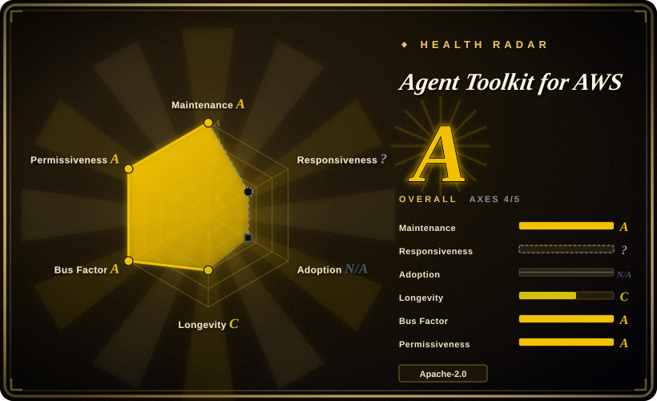
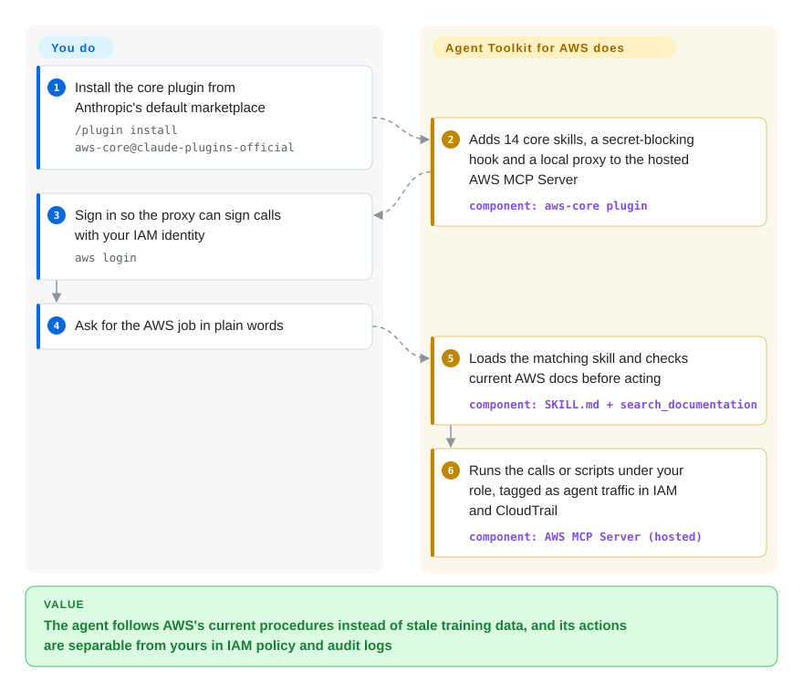

# Agent Toolkit for AWS

Your coding agent was trained months before AWS shipped the service you need, so it guesses a CLI flag that does not exist, picks Step Functions where Durable Functions fit, and runs API calls you cannot tell apart from your own in CloudTrail. This is AWS's own install kit that fixes the guessing and the attribution together: about 114 AWS-written playbooks the agent loads per task, plus wiring to a hosted AWS endpoint that answers from current docs and runs the agent's calls under your IAM role, tagged as agent traffic.

## When to use

You're a developer or platform engineer whose agent (Claude Code, Codex, Cursor, Kiro, fx) does real work in an AWS account: a Lambda + API Gateway service, a CDK stack, an Aurora migration, a cost audit. Two things keep going wrong. The agent is out of date: asked for a long-running workflow it hand-rolls a Step Functions state machine without mentioning Lambda Durable Functions, and asked to cut Lambda cost it has never heard of Lambda Managed Instances. And your security team cannot tell which `DeleteStack` in CloudTrail was you and which was the agent, so it won't let the agent near anything but a sandbox account.

Reach for this repo when you want AWS's own answer to both problems at once. `/plugin install aws-core@claude-plugins-official` gives the agent 14 core skills (service routing, CDK/CloudFormation, serverless, containers, databases, observability, billing, SDKs, Well-Architected review) plus an MCP entry that points at AWS's managed MCP Server. That server stamps every call with the IAM condition keys `aws:ViaAWSMCPService` / `aws:CalledViaAWSMCP`, so you can write "agents may only read" policies on the same role you use. It beats its predecessor [Agent Plugins for AWS](aws-agent-plugins.md), which AWS now calls superseded, and assembling `awslabs/mcp` servers yourself, because only this path adds agent-vs-human IAM separation and CloudTrail attribution, and AWS says its skills went through end-to-end evaluations.

## How it works

The repo holds the parts the agent installs on your machine; the part that does the work, the **AWS MCP Server**, is a managed AWS endpoint (`https://aws-mcp.us-east-1.api.aws/mcp`) whose code is not in this repo. A *skill* is a folder with a `SKILL.md` (a description the agent matches against your request, then numbered steps) plus `references/` it reads only when needed, so it costs context only when a task calls for it. A *plugin* bundles a set of skills with an MCP config that launches `mcp-proxy-for-aws-cli`, a small local proxy that signs each request with your AWS credentials (SigV4, AWS's request-signing scheme) and forwards it to the hosted server. In Claude Code, `aws-core` also installs a hook (a script that runs before each tool call) that blocks `secretsmanager get-secret-value` so secrets never land in the chat. What the toolkit does: route the task to a skill, search current AWS docs, and run your calls or Python scripts in AWS's sandbox (`run_script`). What stays yours: the IAM role the agent gets (scope it down; the toolkit inherits whatever it can do), the region, and reviewing any change before it touches production. Think of it as a field manual plus a badge reader: the manual tells the agent how to do the job, the badge makes every door it opens show up as "agent" in the log.

<!-- flow-steps:begin (generated from flows/agent-toolkit-for-aws.json by tools/flow_card.py — do not edit) -->

Text version of the flow

1. **You**: Install the core plugin from Anthropic's default marketplace — `/plugin install aws-core@claude-plugins-official`
2. **Agent Toolkit for AWS**: Adds 14 core skills, a secret-blocking hook and a local proxy to the hosted AWS MCP Server — component: `aws-core plugin`
3. **You**: Sign in so the proxy can sign calls with your IAM identity — `aws login`
4. **You**: Ask for the AWS job in plain words
5. **Agent Toolkit for AWS**: Loads the matching skill and checks current AWS docs before acting — component: `SKILL.md + search_documentation`
6. **Agent Toolkit for AWS**: Runs the calls or scripts under your role, tagged as agent traffic in IAM and CloudTrail — component: `AWS MCP Server (hosted)`

**Value**: The agent follows AWS's current procedures instead of stale training data, and its actions are separable from yours in IAM policy and audit logs

<!-- flow-steps:end -->

## When NOT to use

- **Your cloud isn't AWS, or you want vendor-neutral advice.** Every skill routes to AWS services, and the `aws-startup-advisor` plugin's own session prompt tells the agent the pick "is … usually the AWS service". For Azure, use Microsoft's `microsoft/azure-skills` (not indexed); for Terraform authored to stay cloud-portable, use HashiCorp's `hashicorp/agent-skills` (not indexed). Core skills cover CDK and CloudFormation only; a Terraform core skill is an open request (issue #115).
- **You must not send agent traffic or source to an AWS-hosted service.** Docs search, runtime skill retrieval, `run_script` and API execution all go through the managed endpoint, and `mcp-proxy-for-aws` collects telemetry unless started with `--disable-telemetry` (the shipped `aws-core` config does not pass it). In an air-gapped or strict-egress setting, install only the skills (`npx skills add aws/agent-toolkit-for-aws/skills`), drop the MCP entry, and let the agent use your own AWS CLI. Or self-host the open-source servers from `awslabs/mcp` (not indexed).
- **Your harness has many unrelated projects.** `aws-core` fires on generic words ("deploy", "function", "storage", "container") even in non-AWS repos (issue #310, open as of 2026-10-01), loading AWS context and guardrails into unrelated work. Enable it per project rather than globally, or install only the specialized skills you need.
- **You want neutral startup advice.** `aws-startup-advisor` injects a SessionStart prompt that appends at most one tracked AWS Activate partner-offer link (`?source=ide-startupAdvisor-claude`) under recommendations. That makes it a vendor sales surface. Use `aws-core` alone, or a cloud-neutral planning method such as [Superpowers](../../agent-dev-methodology/coding-agent-harnesses/superpowers.md) for the architecture discussion.
- **You need hard guarantees, not guidance.** Skills are Markdown the agent may skip, and they can be wrong themselves: the `aws-cloudformation` skill once told agents to pass `--change-set-id` to `describe-events`, a flag that does not exist (issue #83, fixed). The only enforced pieces are the Secrets Manager hook (Claude Code only, regex-based, fail-open on its 5 s timeout) and whatever IAM you attach. If "the agent must never write to prod" is the requirement, enforce it with a read-only role or the proxy's `--read-only` flag, not with this pack.
- **You are standardizing on the AWS Labs plugins already.** If your team runs [Agent Plugins for AWS](aws-agent-plugins.md) (`deploy-on-aws`, `aws-serverless`, …), installing `aws-core` beside it gives two overlapping AWS skill routers. Pick one; AWS says this toolkit is the successor.
- **You want to contribute skills upstream.** CONTRIBUTING says "not accepting external code contributions at this time"; only issues are taken. Keep local AWS skills in your own repo.

## Comparison

| Alternative | In index | Our verdict | Tradeoff |
|---|---|---|---|
| [Agent Plugins for AWS](aws-agent-plugins.md) | ✅ | For new AWS agent work, pick this toolkit; keep the AWS Labs plugins only where a team already depends on one of their nine domain plugins (Amplify, SageMaker, Location), because AWS names this repo the successor and only it adds agent-vs-human IAM keys. | AWS Labs: per-domain plugins, several self-run MCP servers, accepts contributions, one `1.0.0` tag. Toolkit: one hosted endpoint, ~114 evaluated skills, CloudTrail attribution, no outside PRs. |
| AWS MCP servers (`awslabs/mcp`) | not indexed (not added in this tab batch) | Choose `awslabs/mcp` when you must run every MCP server on your own machines or VPC; choose this toolkit when a managed endpoint with audit trails is acceptable, because the open servers give you the data sources without the curated skills. | Self-hosted, many single-purpose servers (~9.7k stars), you assemble and patch them. Toolkit: zero servers to run, but every call transits an AWS-operated service. |
| Azure Skills (`microsoft/azure-skills`) | not indexed (not added in this tab batch) | If your workloads run on Azure, pick Microsoft's pack; pick this one only for AWS, because each vendor's skills route to its own services and are useless on the other cloud. | Same shape (skills + MCP config in one plugin), different cloud. Running both in one harness invites both routers firing on "deploy". |
| HashiCorp Agent Skills (`hashicorp/agent-skills`) | not indexed (not added in this tab batch) | When your IaC is Terraform, pair or replace with HashiCorp's skills; this toolkit's core IaC skills teach CDK and CloudFormation, so a Terraform shop gets the wrong authoring guidance from it. | HashiCorp: Terraform/Vault depth, cloud-portable. Toolkit: AWS service depth, IaC limited to CDK/CloudFormation outside the startup plugin. |
| [Claude Plugins (Official)](claude-plugins-official.md) | ✅ | Browse Anthropic's marketplace to install `aws-core`, `aws-agents`, `aws-data-analytics` or `aws-agents-for-devsecops` by name; add this repo as a marketplace only for `aws-startup-advisor` or for Codex/Cursor, because those paths are served from here. | The official marketplace is a directory; this repo is the source behind four of its AWS entries. Same content, different install handle. |

## Health & viability

- **Responsiveness**: not scored for skill-packs (`type_na`).
- **Maintenance — very active.** Verified 2026-10-01 via GitHub API: last push 2026-10-01, commits in every one of the last 13 weeks (5–28 per week), 59 issues filed of which 28 closed, 276 merged PRs. No git tags or GitHub releases: plugins carry manifest versions (`aws-core` 1.1.0) and installs track `main`.
- **Governance & backing — single vendor, team-owned.** `aws` organization, CODEOWNERS `@aws/agent-toolkit-admins` plus per-plugin AWS service teams (AgentCore, DevSecOps, startups), 100+ contributors, top contributor 34 commits. The roadmap is AWS's, and outside code PRs are closed.
- **Age & Lindy — young, but positioned as the successor.** Created 2026-04-23 (~5 months). No Lindy credit by age. The offsetting signal is AWS naming it the successor to the AWS Labs MCP servers and plugins, and backing it with docs at docs.aws.amazon.com and an AWS CLI command (`aws configure agent-toolkit`). AWS has already moved its agent tooling once (AWS Labs → this repo) within about a year. [推断]
- **Adoption (radar N/A).** The scorer finds no package-registry install channel to measure (`no_install_channel`). Visible signals: ~2.8k stars / 339 forks (2026-10-01), and four plugins listed in Anthropic's default `claude-plugins-official` marketplace, the main reach channel. Overall radar **A on 4 of 5 applicable axes** (longevity C for age).
- **Risk flags.** Apache-2.0, no relicense. The working half is a hosted AWS service, so behavior can change server-side without a commit here. The proxy collects telemetry by default. The startup plugin carries tracked partner-offer links. Usage is free per AWS docs; you pay for the resources the agent touches.

## Caveats (unverified)

- [未验证] Skill counts (114 `SKILL.md` under `skills/`: 25 core + 89 specialized; 14 core skills in `aws-core`) are a tree snapshot at commit `ec0fa3de` on 2026-10-01; the set changes on `main`.
- [未验证] The IAM condition keys `aws:ViaAWSMCPService` / `aws:CalledViaAWSMCP`, CloudTrail logging, "no additional charge" pricing, and the hosted tool list (`retrieve_skill`, `search_documentation`, `run_script`, …) come from the AWS user guide read 2026-10-01; none was exercised against a real account.
- [未验证] The `aws-core` README still lists a `call_aws` tool, while the user guide's tool list (2026-10-01) does not; which name the live server exposes was not checked.
- [未验证] Proxy telemetry on by default is from the `aws/mcp-proxy-for-aws` README (`--disable-telemetry` defaults to False); what it collects was not inspected.
- [未验证] Issue #310 (false activations of `aws-core` on generic words) is a user report, open on 2026-10-01; no maintainer reproduction was found.
- [推断] The partner-offer behavior is read from `plugins/aws-startup-advisor/com.anthropic.claude-code/hooks/offer-context.txt`; how often offers actually appear in sessions was not observed.
- [推断] "AWS has moved its agent tooling once already" combines the README's successor statement with the AWS Labs repos' ages; whether this toolkit will itself be stable is a forward-looking judgment.
- [未验证] A commit titled "[DO NOT MERGE] …" (`711f583f`, 2026-10-01) is on `main`; whether it was intended for release was not checked, and installs track `main`.
