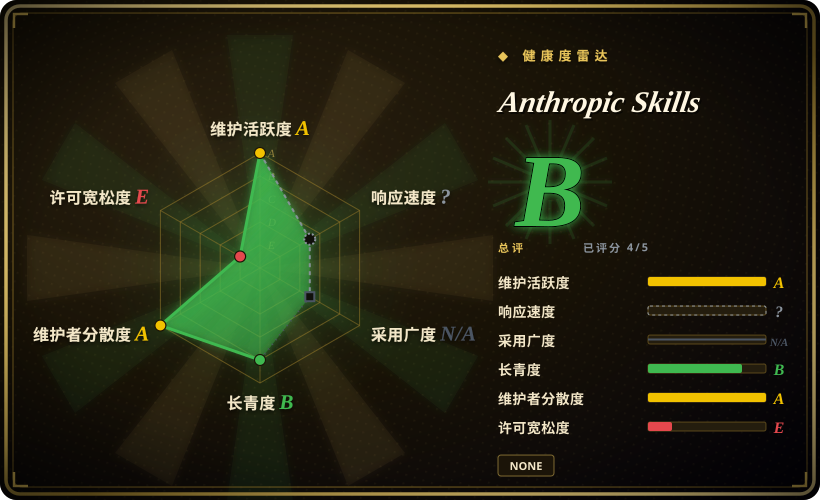
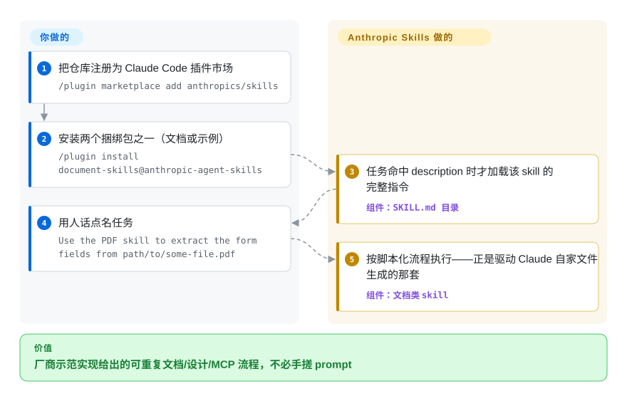

# Anthropic Skills

你反复向 Claude 解释同一类流程任务——从这个 PDF 里抽表单字段、按这份提纲生成 .docx、脚手架一个 MCP server——而手搓的 prompt 每次表现都不一样；这个仓库是 Anthropic 官方的 skill 合集：一组 Claude 在任务命中时按需加载的指令/脚本目录，其中就包含驱动 Claude 自家文件生成的文档 skill。

## 何时使用

你是一名搭建 Claude agent 的开发者或团队，反复在向模型解释同一类流程化任务——「从这个 PDF 里抽取表单字段」「按这份提纲生成 .docx」「脚手架一个新的 MCP server」「快速搭一个前端 artifact」。你想要这些流程的官方、参考级实现，而不是自己手搓 prompt、或信任来路不明的第三方合集。这个仓库就是厂商源头：每个 skill 是一个目录，含一份 `SKILL.md`（YAML 的 `name` + `description`，后接 markdown 指令）以及配套脚本/资源，遵循 Anthropic 的 Agent Skills 格式。通过插件市场安装（`/plugin marketplace add anthropics/skills`，再 `/plugin install document-skills@anthropic-agent-skills` 或 `example-skills@anthropic-agent-skills`），skill 会在其 description 命中任务时按需加载。

你尤其会在以下情况选它：(a) 想要驱动 Claude 文件生成的文档类 skill（`docx`、`pdf`、`pptx`、`xlsx`）；(b) 想要一份权威的 `skill-creator` / `mcp-builder` 来学习格式、进而编写自己的 skill；(c) 想要一套由平台厂商维护的精选起步集（`frontend-design`、`canvas-design`、`brand-guidelines`、`internal-comms`、`slack-gif-creator`、`webapp-testing`、`claude-api`、`theme-factory`，以及新加入的 `academy-guide`、`discernment-nudge`）。`spec/` 与 `template/` 目录让它成为「对照 Anthropic 实现编写 skill」的参考——更宽的 Agent Skills 标准如今有了独立站点（agentskills.io），但本仓库仍是厂商自己的示范实现。把它当作你在搭建定制 skill 栈之前先采纳或 fork 的基线。

## 怎么用起来

skill 刻意做得很朴素：一个目录里放一份 `SKILL.md`——YAML frontmatter 只需要 `name` 和 `description` 两个字段（description 就是 Claude 用来匹配「什么时候该加载这个 skill」的依据），后面是纯 markdown 指令，可选再配脚本和参考文件。Claude 平时只廉价地读这份短元数据，任务命中才把完整指令拉进上下文——所以整个目录占用的是路由成本，不是膨胀的系统提示。你要做的只有三件事：把仓库注册为市场（`/plugin marketplace add anthropics/skills`）、装两个捆绑包之一（`document-skills` 或 `example-skills`）、然后用人话点名任务（「Use the PDF skill to extract the form fields from `path/to/some-file.pdf`」）。留在你手上的：验证 skill 确实改善了你的负载——Anthropic 自己的 README 声明这些是示范/教学用途、Claude 线上行为可能与之不同——以及逐 skill 核对授权，因为文档类 skill 是 source-available、并非开源。

<!-- flow-steps:begin (generated from flows/anthropic-skills.json by tools/flow_card.py — do not edit) -->

流程文字版

1. **你**：把仓库注册为 Claude Code 插件市场 — `/plugin marketplace add anthropics/skills`
2. **你**：安装两个捆绑包之一（文档或示例） — `/plugin install document-skills@anthropic-agent-skills`
3. **Anthropic Skills**：任务命中 description 时才加载该 skill 的完整指令 — 组件：`SKILL.md 目录`
4. **你**：用人话点名任务 — `Use the PDF skill to extract the form fields from path/to/some-file.pdf`
5. **Anthropic Skills**：按脚本化流程执行——正是驱动 Claude 自家文件生成的那套 — 组件：`文档类 skill`

**价值**：厂商示范实现给出的可重复文档/设计/MCP 流程，不必手搓 prompt

<!-- flow-steps:end -->

## 何时不用

- **你已有一套自己信任的精选 skill/command 体系。** 这些 skill 自带 description 与路由；叠加到已有方法论栈上容易重叠、重复触发（例如 `frontend-design` 与你自己的 UI 约定冲突）。每个职责只保留一个事实源。
- **license 混合——分发前先看清。** README 直说：示例 skill 是 Apache-2.0，但文档类 skill（`docx`、`pdf`、`pptx`、`xlsx`）明确是 **source-available、非开源**。GitHub 检测不到仓库级 LICENSE（2026-09-28 license 字段为 null）；别假设 Apache-2.0 覆盖你 vendor 或发布的全部内容。
- **把「示范行为」当演示而非合同。** README 声明这些 skill「仅供演示与教学」，Claude 实际给到你的行为「可能与这些目录展示的不同」——关键任务前先在自己环境充分测试。
- **你不在 Claude 系 harness 上。** 安装路径是 Claude Code、Claude.ai、Claude API。`SKILL.md` 的 markdown 在没有兼容 skill loader 的非 Claude agent 上不会自动触发；本仓库并不以跨 harness 移植为目标。
- **你想要一个可运行的 tool/CLI/库。** 没有东西可 `import` 或独立运行——它是 skill 定义加配套资源，用来塑造 agent 行为，而非一个应用。
- **你需要固定、稳定的行为。** 没有打 tag 的 release（2026-09-28 查 GitHub tags API 为空）；skill 是会在 `main` 上变动的 markdown/脚本。一次 pull 可能改变某个 skill 的行为或路由。需要稳定就 vendor 到具体 commit，并在更新后重新核对。[推断]

## 横向对比

| 替代品 | 是否收录 | 我们的评价 | 取舍 |
|---|---|---|---|
| [Claude plugins（官方）](claude-plugins-official.zh.md) | ✅ | 需要 Anthropic 更大的官方插件/市场面时，选 Claude plugins。 | Anthropic 更大的官方插件/市场面；本 `skills` 仓库专指 Agent Skills 合集（文档 + 示例 skill），而非完整插件目录。按「只要 skill 还是要更广的插件集」来选。 |
| [AWS Labs agent plugins](../product-vendors/aws-agent-plugins.zh.md) | ✅ | 需要带 AWS 生态深度的 vendor 合集时，选 AWS Labs agent plugins。 | 另一家厂商发布的合集，带 AWS 生态色彩；按你的云/工具栈倾向来选。格式与 loader 兼容性各异。 |
| [MiniMax skills](minimax-skills.zh.md) | ✅ | 需要另一家厂商的模型/媒体 skill 成包时，选 MiniMax skills。 | 另一家厂商的 skill 合集；同样是「官方起步 skill」目标，但绑定其模型/harness。混用前先核对格式兼容性。 |
| 第三方社区 skill 包（如 [Superpowers](../../../agent-dev-methodology/coding-agent-harnesses/superpowers.zh.md)） | 部分已收录 | 方法论/SDLC 强观点比第一方参考 skill 更重要时，选社区包。 | 偏方法论/SDLC 的强观点合集，叠在 agent 之上。本仓库更窄、且是第一方：参考任务 skill + 编写规范，而非完整工作流方法论。 |
| 自己写 `SKILL.md` skill | n/a | 最高贴合度和零外部依赖高于厂商基线时，选自写 skill。 | 贴合度最高、零外部依赖，但放弃厂商经过验证的文档生成 skill 与权威 spec/template。很多人就是从这里 fork 当基线。 |

## 健康度与可持续性

- **响应速度**：无法计算——type_na。
- **维护** —— 2026-09-28 经 GitHub API 核实：最近一次 push 在 2026-09-24，未归档——**活跃维护**。open issue 数高（约 1,370，6 月时约 990），与一个极高流量的第一方仓库相符，未必是维护欠债信号。无 tag release；跟 `main`。
- **治理与背书** —— [推断] 组织所有，且由 **Anthropic 自己**（定义 Agent Skills 格式的平台厂商）背书。该格式可能的最强 provenance，但路线图由厂商定或转向；第一方不等于稳定 API。
- **年龄与 Lindy** —— 创建于 2025-09，截至 2026-09 约满 1 岁：年轻，但格式作为厂商自己的文件生成路径已活过第一个年头。仅凭年龄 Lindy 很弱，但厂商背书 + 权威的 `spec/`/`template/` 让它成为别人 fork 的**参考**；下注风险低于同龄的社区合集。
- **采纳与生态** —— 约 179k star（GitHub API，2026-09-28），且文档类 skill（`docx`/`pdf`/`pptx`/`xlsx`）驱动 Claude 自家的文件生成——作为事实基线采纳度很高；README 现也指向 agentskills.io 作为中立标准站点。
- **风险标记** —— 2026-09-28 从 README 确认的**混合授权**：示例 skill Apache-2.0，文档类 skill source-available（非开源），且无仓库级 LICENSE——分发前先看清条款。再加上 README 自述的「仅供演示」免责声明。

## 存疑（未验证）

- [未验证] 无 tag release、无仓库级 LICENSE 文件（2026-09-28 GitHub license 字段为 null）；授权按区域划分——README 称示例 skill 为 Apache-2.0，文档类 skill（`docx`/`pdf`/`pptx`/`xlsx`）为 source-available。frontmatter 里的 `Apache-2.0` 只反映示例 skill；再分发前请核对具体 skill 的条款。
- [未验证] 主语言按 GitHub 元数据报为 Python；仓库混着 Python 辅助脚本与 markdown skill 定义及其他语言——语言标签是参考，不是构建目标。
- [未验证] 当前 `skills/` 目录（2026-09-28：academy-guide、algorithmic-art、brand-guidelines、canvas-design、claude-api、discernment-nudge、doc-coauthoring、docx、frontend-design、internal-comms、mcp-builder、pdf、pptx、skill-creator、slack-gif-creator、theme-factory、web-artifacts-builder、webapp-testing、xlsx）是快照；集合与路由在 `main` 上变动——请读实时目录。
- [未验证] 安装命令与市场标识（`anthropic-agent-skills`、`document-skills`、`example-skills`）取自 README；确切插件名与激活行为可能变化——以当前文档为准。
- [推断] 因为行为活在 markdown `SKILL.md` 指令里、由 agent 加载，约束是建议性的——agent 可以偏离；skill 描述流程，并不硬性保证结果。
- [推断] 单一厂商背书是双刃剑：仓库随 Anthropic 维持 skills 产品而存续，而 README 的演示免责声明意味着厂商不承诺与线上 Claude 行为一致。
