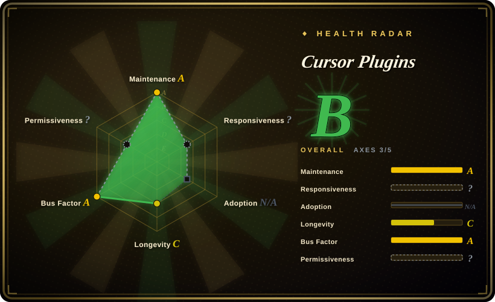
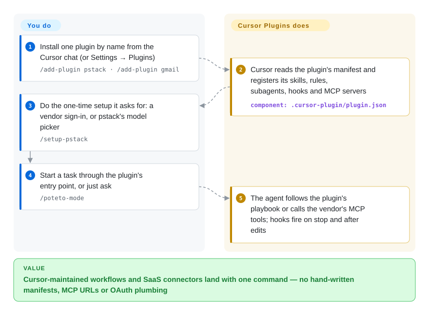

# Cursor Plugins

Your Cursor agent writes code fast but sloppily, and hooking it up to Gmail, GitHub or Salesforce means hunting down each vendor's MCP URL and OAuth setup by hand. This is Cursor's own plugin marketplace repo: `/add-plugin <name>` installs a folder of skills, rules, subagents, hooks and MCP config. The headline plugin is pstack, a rigorous-engineering workflow pack by a Cursor engineer.

## When to use

You work in Cursor every day, and two things keep annoying you. First, the agent ships whatever compiles: a 400-line diff for a 20-line bug, a fix that silences the crash with `if (!x) return`, and "done" with no proof it ran. Second, every time you want it to read your inbox, open a Salesforce record or drive a browser, you end up pasting an MCP server URL into `mcp.json` and wiring OAuth yourself. You want the vendor's own answer, installed with one command instead of copied from a blog post.

This repo is that answer. There are 16 first-party plugins. **pstack**, Lauren Tan's (poteto) 44-skill workflow pack, gives you `/poteto-mode` with 23 playbooks (bug fix, perf, feature, overnight "land the stack") and multi-model review panels. `advisor`, `continual-learning` and `ralph-loop` add stop hooks, `thermos` adds review subagents, `orchestrate` fans work out to Cursor cloud agents, and `create-plugin` helps you write your own. The other 80 plugins are thin `third_party/*` connectors to vendor-hosted MCP servers: Google Workspace, GitHub, Salesforce, HubSpot, Brex, Mercury and more. Pick this over a cross-harness pack like Superpowers when you are staying on Cursor and want its native pieces: `.mdc` rules, `Task` subagents with per-role models, the `/loop` command, Cursor hook events and cloud agents. Pick it over hand-wiring MCP when you'd rather take the connector config Cursor maintains.

## How it works

The repo is data that Cursor's client reads. It does not run as a service. A root `.cursor-plugin/marketplace.json` lists 96 plugins, and each one is a folder with a `.cursor-plugin/plugin.json` manifest (validated against `schemas/plugin.schema.json` by a CI script). The manifest points at `skills/` (SKILL.md instructions the agent loads when relevant), `rules/` (`.mdc` always-on or scoped instructions), `agents/` (subagent definitions), `hooks/hooks.json` (shell or `bun` scripts Cursor runs on events like `stop` or `afterFileEdit`) and `mcp.json` (tool servers). When you run `/add-plugin <name>`, Cursor does the registration. A connector plugin is usually just an `mcp.json` pointing at the vendor's hosted endpoint, like a phone-book entry that tells Cursor which number to call. The vendor runs the server and the sign-in, and your data goes to the vendor. pstack is the opposite case: nearly all of it is prompt text. It has a router skill that picks a playbook and copies its steps into a todo list, principle skills, and a few `bun` scripts (a PR watcher, an orchestration store). `/setup-pstack` writes `~/.cursor/rules/pstack-models.mdc` to choose which model each role gets. You still decide which plugins to trust, pay for the frontier-model panels that pstack spawns, and check what the agent did.

<!-- flow-steps:begin (generated from flows/cursor-plugins.json by tools/flow_card.py — do not edit) -->

Text version of the flow

1. **You**: Install one plugin by name from the Cursor chat (or Settings → Plugins) — `/add-plugin pstack · /add-plugin gmail`
2. **Cursor Plugins**: Cursor reads the plugin's manifest and registers its skills, rules, subagents, hooks and MCP servers — component: `.cursor-plugin/plugin.json`
3. **You**: Do the one-time setup it asks for: a vendor sign-in, or pstack's model picker — `/setup-pstack`
4. **You**: Start a task through the plugin's entry point, or just ask — `/poteto-mode`
5. **Cursor Plugins**: The agent follows the plugin's playbook or calls the vendor's MCP tools; hooks fire on stop and after edits

**Value**: Cursor-maintained workflows and SaaS connectors land with one command — no hand-written manifests, MCP URLs or OAuth plumbing

<!-- flow-steps:end -->

## When NOT to use

- **You're not on Cursor.** The manifests are `.cursor-plugin/`. The hooks use Cursor's event names (`afterAgentResponse`, `subagentStop`, `stop` with `loop_limit`). pstack assumes Cursor's `Task` subagent with model slugs, `.mdc` rules and `/loop`. Other harnesses break quietly: issue #237 (open) shows `poteto-mode`'s `name: Poteto Mode` never registers on Kiro, and #446 asks whether Grok Build is supported at all. On Claude Code, use [Claude Plugins (Official)](claude-plugins-official.md). For a methodology pack that ships installers for many hosts, use [Superpowers](../../../agent-dev-methodology/coding-agent-harnesses/superpowers.md) or [gstack](../../personal-collections/engineering-workflows/gstack.md).
- **You want to self-host or audit a connector.** 80 of the 96 plugins live under `third_party/` and are mostly an `mcp.json` pointing at a vendor-hosted endpoint (for example `gmailmcp.googleapis.com/mcp/v1`, `api.githubcopilot.com/mcp/`), plus a README and a logo. The code in this repo is config. The server, the auth and the data handling belong to the vendor. If you need to run or inspect the server yourself, install the vendor's open-source MCP server directly, for example [Playwright MCP](../../../web-automation/playwright-family/playwright-mcp.md), which the `playwright` plugin just launches via `npx @playwright/mcp@latest`.
- **You're on a tight model budget.** pstack's defaults run the most expensive tier: `claude-opus-5-5-max`, `gpt-5.6-sol-max` and `grok-4.7-xhigh-fast`. `arena`, `architect` and `interrogate` start one subagent per panel entry, three models by default. Issue #335 (open) reports that earlier default slugs could not be spawned at all in current Cursor. If you can't pay for panels, run `/setup-pstack` with the `small` budget or `inherit-parent`, or use a single-model pack like [Superpowers](../../../agent-dev-methodology/coding-agent-harnesses/superpowers.md).
- **Your worktrees hold untracked files you care about.** Issue #449 (open, 2026-09-28): pstack's `worktree-cleanup` playbook treats untracked and ignored files as disposable. It falls back to `git worktree remove --force` and then `rm -rf`. If `.env` files, run artifacts or evidence directories live in agent worktrees, keep that playbook off or send cleanup to your own procedure.
- **You need pinned, reproducible behavior.** The repo has no releases or tags (GitHub API, 2026-09-30). Every install follows `main`, and the per-plugin `version` fields are declarations only. pstack changed its default models in 0.15.3, and any rule written before that keeps pinning the old ones. If you need stability, vendor the plugin folder into `~/.cursor/plugins/local/` and upgrade on purpose.
- **You expect upstream to fix your bug or take your plugin.** As of 2026-09-30 the tracker has 51 open issues against 7 closed ones. Of 100 open PRs, 83 come from outside contributors (author association `NONE`), and almost all merged PRs are by collaborators. Treat this as a vendor-curated catalogue, not a community project. Fork a plugin to fix it, and install your own plugins locally from `~/.cursor/plugins/local/` (the path `create-plugin` scaffolds into) instead of planning on a PR here being merged.
- **You don't want your marketplace shared with another product.** The manifest schema has a `grokbot` client next to `cursor`. Three connectors (`finance`, `x-money`, `shopify-store`) are marked `cursor: never` and install only in Grok Bot, and xAI's own marketplace lists pstack as is. The catalogue's direction now serves more than one client. That doesn't hurt a Cursor user today, but "official Cursor plugin" no longer means "built only for Cursor".

## Comparison

| Alternative | In index | Our verdict | Tradeoff |
|---|---|---|---|
| [Claude Plugins (Official)](claude-plugins-official.md) | ✅ | If your agent is Claude Code, pick Anthropic's marketplace. On Cursor, pick this one, because each repo only loads in its own vendor's plugin loader. | Same shape (vendor-curated folders of skills, agents and MCP config, installed by name), different loader. Anthropic's has more developer-workflow plugins (LSPs, review, plugin authoring) and splits internal from external submissions. Cursor's has more entries (96), but 80 are SaaS connectors, and its workflow weight sits in one flagship pack (pstack). |
| [Superpowers](../../../agent-dev-methodology/coding-agent-harnesses/superpowers.md) | ✅ | If you want one methodology pack that travels across Claude Code, Codex, Cursor and a dozen other hosts, pick Superpowers. If you live in Cursor and want per-role model panels, cloud-agent fan-out and `/loop` overnight runs, pick pstack from here. | Superpowers wins on portability and on running with a single model (cheaper). pstack goes deeper into Cursor-native mechanics and multi-model review, at the cost of frontier-model spend and Cursor lock-in. |
| [gstack](../../personal-collections/engineering-workflows/gstack.md) | ✅ | If you want a named engineer's personal workflow stack with host adapters for ten agents, pick gstack. If you want the one a Cursor engineer ships through Cursor's own marketplace, pick pstack. | Both are one person's opinionated style packaged as skills. gstack carries its own multi-host setup script. pstack rides Cursor's installer and adds `/automate-me` to draft your own `-mode` skill from your transcripts. |
| [Agent Plugins for AWS](../product-vendors/aws-agent-plugins.md) | ✅ | If your work is AWS-shaped (serverless, cost estimates, IaC), add AWS's plugins, which also install in Cursor. Use this repo for general workflow and SaaS connectors. | They complement each other more than they compete. AWS's is deep in one cloud and cross-harness, and AWS now points production users at its successor toolkit. Cursor's covers breadth with no cloud depth. |
| [Playwright MCP](../../../web-automation/playwright-family/playwright-mcp.md) | ✅ | If you want browser control you can pin, configure or run headless in CI, install Playwright MCP directly. Use the `playwright` plugin here only for a one-click Cursor install. | The plugin is a two-line `mcp.json` running `npx @playwright/mcp@latest`, so it always tracks latest and exposes none of the server's flags. Wiring the server yourself costs one config edit and gets you version pinning and options. |

## Health & viability

- **Maintenance (2026-09-30)** — very active: last push 2026-09-30, all of the latest 100 commits are from September 2026, and new connector plugins land weekly (Greenhouse, PostHog, Trello, beehiiv on 2026-09-25/29). No releases or tags. Each plugin carries its own `version` in `plugin.json` (pstack 0.15.5).
- **Governance & bus factor** — owned by the `cursor` org (Anysphere). The roadmap belongs to the vendor. Merged PRs come overwhelmingly from collaborators. External PRs pile up (83 of 100 open PRs have author association `NONE`), and only 7 issues have ever been closed against 51 open. pstack is effectively one author's work: `poteto` wrote 87 of its 90 path commits, and the other 3 are from the `cursoragent` bot. Recent connector work is concentrated in one staff member too (`minupalaniappan`, 57 of the latest 100 commits).
- **Age & Lindy** — created 2026-01-23, about 8 months old: **no Lindy track record**. What stands in for age is the vendor: the repo is the source for Cursor's in-product marketplace, so it lasts as long as Cursor keeps that feature. [推断]
- **Adoption** — ~9.0k stars and 849 forks (GitHub API, 2026-09-30). xAI's `plugin-marketplace` lists pstack. Community ports (for example `tommy-ca/pstack` for Grok Build, per issue #446) show the content spreads beyond Cursor, though ports lag behind upstream.
- **Risk flags** — no root `LICENSE` file, so GitHub reports no license. The root README says MIT, and all 96 per-plugin `LICENSE` files are MIT (checked 2026-09-30). Connectors send your data to vendor-hosted servers. pstack's destructive worktree cleanup (#449) and unresolvable default model slugs (#335) are open.

## Caveats (unverified)

- [推断] "The repo is the source Cursor's in-product marketplace reads" is inferred from the README ("`description` (from marketplace)"), the `marketplace.json` owner `plugins@cursor.com` and plugin READMEs saying "Open Cursor Settings → Plugins … Search for Gmail". No Cursor document stating the sync path was read, and the lag between a merge and marketplace availability is unknown (issue #364 reports a listed plugin that could not be found in the marketplace).
- [未验证] Plugin counts (96 in `marketplace.json`, 16 first-party, 80 `third_party/`) and pstack's 44 skills and 23 playbooks are a 2026-09-30 snapshot of a directory that gains plugins weekly.
- [未验证] Per-role default models and the three-model panels are read from `pstack/skills/setup-pstack/SKILL.md` on 2026-09-30. Actual token cost per `/interrogate` or `/arena` call was not measured, and the defaults change between pstack releases.
- [未验证] Issues #237, #335 and #449 were open when read on 2026-09-30. None had a maintainer reply, and fixes may land without the issue being closed.
- [未验证] Hook event names and behavior (`stop` with `loop_limit`, `afterFileEdit`, `subagentStop`) are read from `hooks.json` files. They were not run in a Cursor client, and how they map to other harnesses' hook systems was not tested.
- [推断] The Grok Bot client (`grokbot` in `minClientVersions`, three `cursor: never` connectors) suggests the catalogue is shared with xAI's product. What that business relationship means for the repo's future was not verified.
