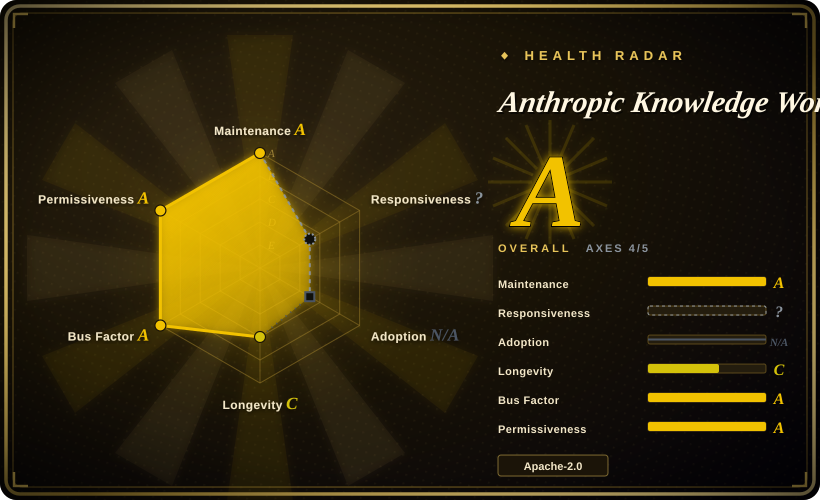
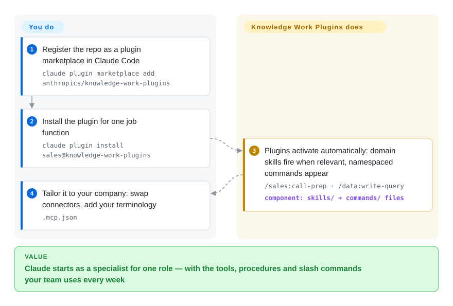

# Anthropic Knowledge Work Plugins

Every other session you re-explain to Claude how your team actually works — how a sales call gets prepped, how a reconciliation is structured, which tracker a spec lands in. This repo ships 11 first-party **role plugins** (productivity, sales, support, product-management, marketing, legal, finance, data, enterprise-search, bio-research, plugin-authoring) that bundle the skills, MCP connectors and slash commands for one job function each, built for Claude Cowork and also installable into Claude Code.

## When to use

You're a knowledge worker — or you're equipping a team of them — and your day is documents, decks, briefs, ticket triage, research summaries and status comms, not shipping code. You keep re-explaining the same office procedures to Claude ("turn these notes into a one-pager", "draft the weekly update", "prep me for this call"), and you want first-party, vendor-maintained building blocks for that rather than hand-rolled prompts or a random community bundle. Each plugin packages a role's domain skills, its slash commands (`/sales:call-prep`, `/finance:reconciliation`) and pre-wired MCP connectors to the tools that role lives in — Slack, Notion, HubSpot, Linear, Jira, Snowflake, Databricks, Google/MS365 surfaces and more — so Claude starts from Anthropic's own procedures for that job instead of improvising.

You reach for it specifically when you want the *knowledge-work* slice of Anthropic's first-party surface with a customization story attached: the README frames the shipped plugins as generic starting points and tells you to fork the files, swap connectors in `.mcp.json` and drop your company's terminology into the skill files — or generate org-specific plugins with the included `cowork-plugin-management` plugin. The whole stack is markdown and JSON ("no code, no infrastructure, no build steps"), so a non-engineering team lead can edit one.

## How it works

Every plugin is a folder of plain files: a `.claude-plugin/plugin.json` manifest, a `.mcp.json` that wires the role's external tools to MCP servers, a `commands/` directory of slash commands you invoke explicitly, and a `skills/` directory of domain instructions Claude draws on automatically when a task matches. You add the repo as a marketplace and install one role's plugin (or, in Cowork, install straight from claude.com/plugins); after that, activation is invisible — relevant skills fire on their own and namespaced commands appear in your session. What the repo does *not* do is know your company: connectors point at Anthropic's generic picks, workflows are textbook versions, and your data/terminology has to be added by editing the markdown files yourself — that per-company tailoring is explicitly the intended second step, not magic that ships.

<!-- flow-steps:begin (generated from flows/knowledge-work-plugins.json by tools/flow_card.py — do not edit) -->

Text version of the flow

1. **You**: Register the repo as a plugin marketplace in Claude Code — `claude plugin marketplace add anthropics/knowledge-work-plugins`
2. **You**: Install the plugin for one job function — `claude plugin install sales@knowledge-work-plugins`
3. **Anthropic Knowledge Work Plugins**: Plugins activate automatically: domain skills fire when relevant, namespaced commands appear — `/sales:call-prep · /data:write-query` — component: `skills/ + commands/ files`
4. **You**: Tailor it to your company: swap connectors, add your terminology — `.mcp.json`

**Value**: Claude starts as a specialist for one role — with the tools, procedures and slash commands your team uses every week

<!-- flow-steps:end -->

## When NOT to use

- **You're not on Cowork or Claude Code.** The README's own getting-started paths are "install from claude.com/plugins" (Cowork) and `claude plugin marketplace add …` (Claude Code); there is no documented loader for OpenCode, Codex, Cursor or a bespoke harness, so outside the Claude family you'd be hand-porting individual `skills/` and `commands/` files — losing the install flow that is the point.
- **Your work is coding, not knowledge work.** These 11 plugins are scoped to office/comms/research/data roles. For language-server integrations, code-review/commit/PR workflows or MCP scaffolding, use the coding-centric first-party marketplace — [Claude Plugins (Official)](claude-plugins-official.md) — instead.
- **Your tool stack isn't in a connector list.** Each plugin hard-wires specific SaaS (sales → HubSpot/Close/Clay/ZoomInfo; finance → Snowflake/Databricks/BigQuery). If your company runs on tools nobody listed covers, the value collapses to the markdown procedures and you're editing `.mcp.json` yourself from day one.
- **You need pinned, stable behavior.** The repo has no tagged releases and no tags (GitHub releases/tags API, 2026-09-28); you install whatever is on `main`, and a pull can change what a plugin does. Vendor a specific commit if you need reproducibility.
- **You're betting on a harness-neutral surface.** The repo is now explicitly positioned as "built for Claude Cowork" — its roadmap rides one vendor's product bet; the durability signal is Anthropic's backing, not a settled, product-neutral contract.
- **You already run a curated skill/command stack you trust.** These ship their own descriptions and routing; layering them on an existing methodology pack invites overlap and double-firing. Pick one source of truth per concern.

## Comparison

| Alternative | In index | Our verdict | Tradeoff |
|---|---|---|---|
| [Anthropic Skills](anthropic-skills.md) | ✅ | When you want a general skill baseline that also works as raw `SKILL.md` folders across Claude Code/Claude.ai/API, pick Anthropic Skills; pick these role plugins when you want per-job bundles with MCP connectors already wired. | Standalone skills repo — broader, harness-portable, but no role-scoped connector packs or namespaced slash commands out of the box. |
| [Claude Plugins (Official)](claude-plugins-official.md) | ✅ | When your users are developers (LSPs, code-review, PR flows), pick Claude Plugins (Official); pick this repo when the users are sales/legal/finance/data roles whose tools are SaaS connectors, not language servers. | Anthropic's other first-party marketplace, coding-centric; same install mechanics, different job function covered. |
| Third-party / community knowledge-work packs | 未收录 | When breadth over a specific office niche matters more than first-party provenance, pick a community pack; pick this when you want Anthropic-maintained procedures with connector configs you can hand to a vendor support thread. | Larger, faster-moving surface, but no vendor curation or provenance guarantee and no per-role connector maintenance. |
| Roll your own skills/plugins | n/a | When your team's procedures are already documented and idiosyncratic, custom skills fit better than adopting a generic starting point; pick this repo to skip the skeleton work (manifest, connector wiring, command namespacing) and edit only the domain text. | Maximum fit and zero external dependency, but you forgo vendor-maintained role procedures and pre-wired connectors. |

## Health & viability

- **Maintenance (2026-09)** — active: pushed 2026-09-26, not archived, open issues ~107 (GitHub API). No tagged releases or tags; track `main`.
- **Governance & bus factor** — org-owned by Anthropic; the scorer counts 30 active committers in the trailing 12 months with the top author at ~38.5% of commits and easing since June — solid vendor-team governance, but the roadmap is still set (and pivotable) by Anthropic. [推断]
- **Backing & longevity** — created 2026-01-23, ~8 months old as of 2026-09: young, Lindy-unproven; vendor backing plus the Cowork product bet behind it is what makes it credible despite the youth — bet on the provenance, not the track record.
- **Adoption & ecosystem** — ~25.8k stars (GitHub API, 2026-09-28), up from ~22.1k in June, and 11 plugins spanning 10 job functions with a documented customization/authoring path (`cowork-plugin-management`). [推断]
- **Risk flags** — positioning moved from generic "knowledge work" to explicitly Cowork-first ("Built for Claude Cowork, also compatible with Claude Code", README 2026-09), so the surface rides one vendor's product; inventory still settling; connector lists hard-wire specific SaaS vendors. [推断]

## Caveats (unverified)

- [未验证] How deeply these plugins are used inside paying Cowork teams is inferred from stars and first-party promotion; no adoption data exists publicly.
- [未验证] Whether the plugins behave identically in Claude Code vs Cowork (which features are Cowork-only) was not tested; the README lists both paths but the equivalence claim is unverified.
- [推断] GitHub's "Python" primary-language stat reflects helper scripts around the repo, not the plugin runtime — the plugins are markdown/JSON per the README; the split was not verified file-by-file.
- [推断] Because behavior lives in agent-loaded instructions, enforcement is advisory — the agent can deviate; these describe procedures, they do not hard-guarantee outcomes.
- [推断] Per-plugin connector lists were read from the README table on 2026-09-28 and will drift; enumerate the live `.mcp.json` files for exact current wiring.
