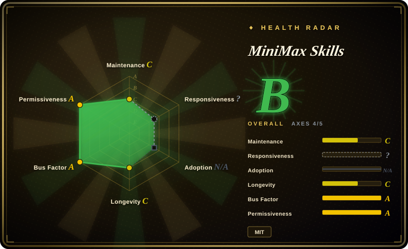
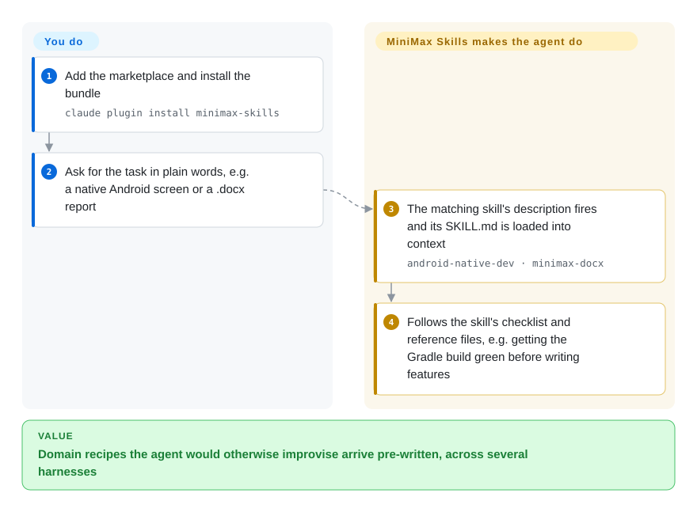

# MiniMax Skills

MiniMax's official public collection of ~16 Agent Skills — production-quality guidance for frontend / fullstack / Android / iOS / Flutter / React Native / shader dev, plus document & media generation (pdf/docx/xlsx/pptx, music, vision) — installable into Claude Code and other coding agents via a plugin marketplace.

## When to use

You're a developer running Claude Code (or Cursor / Codex / OpenCode) and you keep re-explaining the same procedural, domain-heavy tasks: "scaffold a production-grade React frontend", "build a native Android screen", "generate a .docx from this outline", "make a GIF sticker", "produce a PPTX deck". You want first-party, reference-quality recipes for these instead of hand-rolling prompts or trusting a random third-party bundle. MiniMax Skills is the vendor source: a `skills/` directory of self-contained skill folders (`frontend-dev`, `fullstack-dev`, `android-native-dev`, `ios-application-dev`, `flutter-dev`, `react-native-dev`, `shader-dev`, plus `minimax-docx`, `minimax-xlsx`, `pptx-generator`, `minimax-pdf`, `gif-sticker-maker`, `vision-analysis`, `minimax-multimodal-toolkit`, `minimax-music-gen`, and more), each loaded on demand when its description matches the task.

You reach for it when you want an opinionated, ready-made skill bundle covering both software-dev disciplines and MiniMax's media/document/multimodal capabilities, and you're on a supported harness. Install once via the marketplace (`claude plugin marketplace add MiniMax-AI/skills`, then install the bundle), or — on Cursor/Codex/OpenCode — clone the repo and point your agent at the per-harness manifest dirs (`.claude-plugin`, `.cursor-plugin`, `.codex`, `.opencode`). The methodology then activates through the platform's native skill-loading mechanism, not as something you `import`.

## How it works

Each skill is a folder under `skills/` holding a `SKILL.md` — a Markdown file whose front matter carries a one-line *description* (the trigger text the agent matches your request against) and whose body is the recipe — plus optional `references/` files. **The repo ships the recipes and the per-harness install manifests; the harness's own skill loader does the matching** — when your request fits a description, the agent reads that one `SKILL.md` into its context and follows it (for `android-native-dev`, for example, it first makes `./gradlew assembleDebug` pass before writing any feature code). You install the bundle once and then just ask for work as usual. The media half (music, TTS, video, image, GIF stickers) is different: those skills drive MiniMax's paid APIs through the `mmx` CLI, so you also install it (`npm install -g mmx-cli`) and log in with your own MiniMax API key; the dev and document skills need no key.

<!-- flow-steps:begin (generated from flows/minimax-skills.json by tools/flow_card.py — do not edit) -->

Text version of the flow

1. **You**: Add the marketplace and install the bundle — `claude plugin install minimax-skills`
2. **You**: Ask for the task in plain words, e.g. a native Android screen or a .docx report
3. **MiniMax Skills**: The matching skill's description fires and its SKILL.md is loaded into context — `android-native-dev · minimax-docx`
4. **MiniMax Skills**: Follows the skill's checklist and reference files, e.g. getting the Gradle build green before writing features

**Value**: Domain recipes the agent would otherwise improvise arrive pre-written, across several harnesses

<!-- flow-steps:end -->

## When NOT to use

- **You already run a curated skill stack you trust.** This is a vendor-opinionated bundle; layering 16 skills on top of an existing methodology stack invites overlapping or conflicting routing — pick one source of truth.
- **You only need software-dev discipline, not media generation.** Much of the value here is MiniMax-specific media/document/multimodal skills (music gen, vision, GIF/PPTX/DOCX). If you only want dev workflow guidance, a focused dev-methodology pack is leaner than installing the whole bundle.
- **You're not on a supported harness.** Skills activate through each platform's loader (Claude Code marketplace; Cursor/Codex/OpenCode manifest dirs). On a bespoke or unsupported agent there's no loader to fire them, and the markdown alone won't auto-activate.
- **You need the latest, frequently-shipped vendor source.** No tagged releases and nothing pushed since 2026-04-18 (re-checked 2026-10-08) — re-check freshness before depending on a specific skill's behavior; an unmaintained skill in a domain you care about is worse than none.
- **You expect hard guarantees.** Behavior lives in prompt/markdown skills the agent loads; "production-quality guidance" is advisory, not enforced — the agent can still deviate.

## Comparison

| Alternative | In index | Our verdict | Tradeoff |
|---|---|---|---|
| [Anthropic Skills](anthropic-skills.md) | ✅ | Choose Anthropic Skills when Claude-format fidelity and general document/frontend skills matter. | First-party Anthropic bundle (document editing, frontend/canvas, MCP/skill authoring). Tighter Claude-format fidelity; narrower domain. MiniMax adds mobile/shader dev + MiniMax-specific media/multimodal skills. |
| [Claude Plugins (official)](claude-plugins-official.md) | ✅ | Choose Claude Plugins when you need commands, agents, hooks, and MCP beyond skills. | Anthropic's official *plugin* marketplace (commands/agents/hooks/MCP, not just skills). Broader plugin surface, Claude-only. MiniMax is a skill-focused, multi-harness vendor bundle. |
| [aws-agent-plugins](../product-vendors/aws-agent-plugins.md) | ✅ | Choose aws-agent-plugins when AWS cloud-specific depth matters more than media/dev-generalist skills. | Another vendor/official plugin collection; compare on which harnesses each targets and whether you need cloud-specific vs media/dev-generalist skills. |
| Building your own `skills/` folder | n/a | Choose a custom skills folder when full control and zero lock-in outweigh ready-made maintenance. | Full control, zero lock-in, no maintenance bus-factor risk — but you write and curate every skill yourself. MiniMax trades that for a ready-made, vendor-maintained bundle. |

## Health & viability

- **Responsiveness**: Cannot be scored — type_na.
- **Maintenance** — last pushed **2026-04-18** with no tagged releases, and the default branch has not moved since (re-checked 2026-10-08): about **six months quiet**, while the README still labels the project *Beta* and warns formats may change without notice. Reads as **stalled, not formally abandoned** — re-verify freshness before depending on a specific skill, since a stale skill in a domain you care about is worse than none.
- **Governance & backing** — [推断] org-owned and **vendor-backed by MiniMax**; strong provenance but single-vendor and tied to MiniMax's models/harness assumptions. Roadmap follows the vendor.
- **Age & Lindy** — created 2026-03-17, so about seven months old at 2026-10-08, and active for only its first month: **no Lindy track record**, and the long gap since is the opposite of the age-plus-activity signal Lindy needs.
- **Risk flags** — [推断] the activity gap is the main flag; star count kept rising (~13.7k on 2026-10-08) without any commits, so it signals interest, not maintenance commitment. MIT license, no relicense/CVE signals observed.

## Caveats (unverified)

- [未验证] License MIT and primary language C# (≈68.5%, with Python ≈24.3%) per GitHub metadata as of 2026-06-26; C# dominance is attributed to .NET/OpenXML helper code behind the document skills (e.g. `minimax-docx`) — confirm against the repo before assuming a build toolchain.
- [未验证] Last pushed 2026-04-18 with **no tagged releases**, unchanged as of 2026-10-08; treat the bundle as a snapshot and re-verify freshness before relying on any specific skill.
- [未验证] Star count (~12.8k per GitHub on 2026-06-26) is unreliable and date-sensitive; treat as indicative only, not as a quality signal.
- [未验证] The skill list (~16 skills: frontend/fullstack/android/ios/flutter/react-native/shader dev, plus pdf/docx/xlsx/pptx, gif-sticker, vision, multimodal, music-gen/playlist, buddy-sings) is read from the README/`skills/` listing; verify the current `skills/` directory rather than relying on this enumeration.
- [未验证] Supported-harness claim (Claude Code marketplace; Cursor/Codex/OpenCode via cloned manifest dirs) is from the README; actual activation fidelity per harness is not independently confirmed here.
- [推断] Because behavior lives in prompt/markdown skills loaded by the agent, enforcement is advisory — "production-quality guidance" is a prompt-level instruction, not a hard guarantee, and the agent can deviate.
