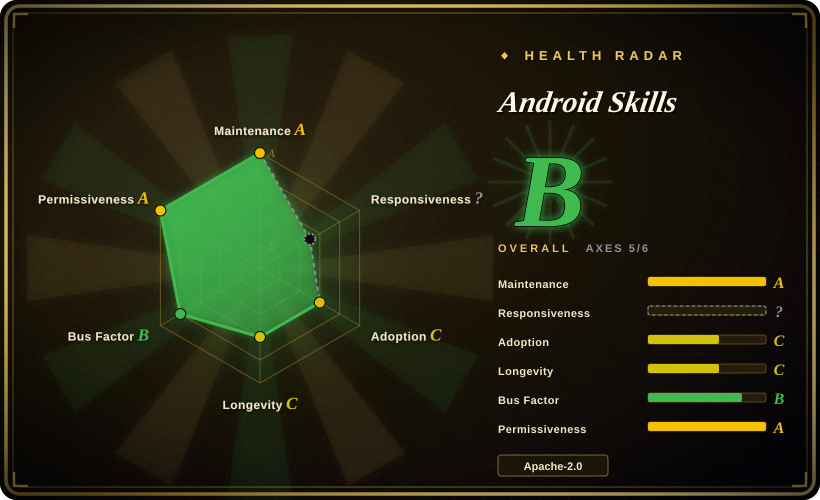
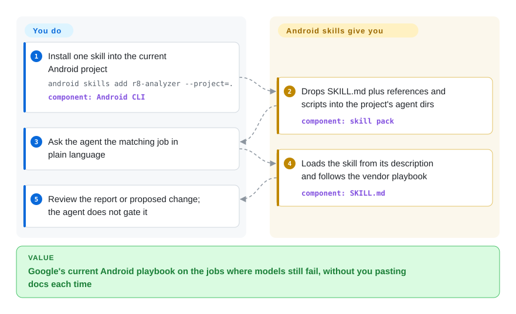

# Android Skills

Your coding agent still ships Android that a 2024 training cutoff would write: XML layouts instead of Compose, buttons under the nav bar, keep-rules copied from a library README. This is Google's official pack of playbooks for the jobs those models still fail — installed with the Android CLI, loaded when the task matches.

## When to use

You're an Android engineer using a coding agent (Gemini, Claude, Codex, Antigravity, Android Studio Gemini) on a real app, and the agent keeps missing the current platform move. It writes `View` XML when the screen should be Compose. After you raise `targetSdk` to 35 the login button sits under the three-button nav bar. R8 keep rules balloon because it copies every library's consumer rules instead of measuring which ones still fire. Play Console comes back with a Data Safety mismatch the agent never checked against the manifest. You do not want another generic "Android best practices" prompt — you want Google's own, dated playbooks for the jobs where they measured the models underperforming.

Install with the Android CLI, not `npx skills add`: `android skills add r8-analyzer --project=.` for one skill in the current tree, or `android skills add --all` for every detected agent. The pack is 24 skills as of the v1.0.12 marketplace list — AGP 9 upgrade, CameraX, App Functions, ML Kit GenAI Prompt API, the `android` CLI itself, restore-credentials, verified email, Compose adaptive / XML-to-Compose / theming, Media3 Cast, Navigation 3, Navigation Event, R8 analyzer, Play Engage / Billing upgrade / policy insights, the Android profiler, intent security, edge-to-edge, testing setup, Leanback-to-Compose TV, Wear Compose M3, Compose Glimmer on display glasses. Reach for it when the stack *is* Android and you want the platform vendor's current opinion, not a community's guess at last year's APIs.

The deciding tradeoff against the closest substitutes: [Vercel Agent Skills](../engineering/vercel-agent-skills.md) is the same shape of vendor pack, but for React/Next.js on Vercel — it will not tell an agent how to consume window insets. [Anthropic Skills](anthropic-skills.md) is the platform's own general bundle (docs, design, MCP authoring) and takes no position on Android. [Agent Plugins for AWS](aws-agent-plugins.md) is the cloud-vendor analogue: first-party playbooks locked to one ecosystem. Pick this when the ecosystem lock-in is the point.

## How it works

The repo is a distribution surface, not a tool you import. Each skill is a folder with a `SKILL.md` (YAML `name` + `description`, then a numbered playbook) plus optional `references/` (copied developer.android.com pages, sample snippets) and `scripts/` (Python that the agent is told to run — R8 proto conversion, Play-policy orchestrator). You install through the **Android CLI** (`android skills add …`), which copies those folders into the detected agents' skill directories, or through Android Studio's skill import; Claude/Codex plugin manifests (`.claude-plugin/marketplace.json`, `.codex-plugin/plugin.json`) exist so those harnesses can load the same tree. After install, activation is description-match: you say "Make my app UI edge-to-edge" and the agent should pull `edge-to-edge`; in Studio you can also type `@skill-name`. What lands is a method, not a runtime — `r8-analyzer` tells the agent to run `./gradlew :app:analyzeReleaseR8Config` then a conversion script, and to **suggest only, not edit**; `play-policy-insights` runs `orchestrator.py` against the app tree and writes a compliance report. Google DevRel's bot refreshes the tree from `https://dl.google.com/dac/dac_skills.zip` plus a `github-skills` branch, so the text tracks developer.android.com rather than a volunteer's memory.

<!-- flow-steps:begin (generated from flows/android-skills.json by tools/flow_card.py — do not edit) -->

Text version of the flow

1. **You**: Install one skill into the current Android project — `android skills add r8-analyzer --project=.` — component: `Android CLI`
2. **Android Skills**: Drops SKILL.md plus references and scripts into the project's agent dirs — component: `skill pack`
3. **You**: Ask the agent the matching job in plain language
4. **Android Skills**: Loads the skill from its description and follows the vendor playbook — component: `SKILL.md`
5. **You**: Review the report or proposed change; the agent does not gate it

**Value**: Google's current Android playbook on the jobs where models still fail, without you pasting docs each time

<!-- flow-steps:end -->

## When NOT to use

- **The task is not Android.** These playbooks assume an Android Gradle project, Jetpack libraries, Play Console surfaces, Wear/TV/XR form factors. For React/Next.js/Vercel performance and deploy rules use [Vercel Agent Skills](../engineering/vercel-agent-skills.md); for AWS architecture/deploy/ops use [Agent Plugins for AWS](aws-agent-plugins.md); for document/design/MCP authoring use [Anthropic Skills](anthropic-skills.md).
- **You need basic Compose that the model already knows.** The README states they skip "well-established areas where LLMs are already proficient, such as basic Jetpack Compose best practices." If the agent is only missing `Column` / `Modifier.padding`, this pack will not fire — read developer.android.com, or keep a short project rule file.
- **You have no Android CLI / Studio skill loader, and will not paste by hand.** The documented install path is `android skills add` (or Studio import). Plugin manifests exist for Claude and Codex, but the README does not treat `npx skills add android/skills` as the supported path. On a harness with no skill loader the markdown sits inert — paste the relevant `SKILL.md` or use the CLI.
- **You want an enforced gate, not advice.** `r8-analyzer` says "No code changes: Research and suggest only." Play-policy insights writes a report and stops. Nothing fails CI unless you wire it. For a methodology the agent must walk on every task, use [Superpowers](../../agent-dev-methodology/coding-agent-harnesses/superpowers.md).
- **You want to send a PR of a new skill.** "Public contributions are not accepted at this time" — issues for feedback and skill requests only. Fork the tree or keep project-local skills under `.skills/` / `.agent/skills/` as the official docs describe.
- **You needed the Android CLI itself, not the playbooks.** The `android-cli` skill teaches the CLI; the CLI is a separate Google-hosted binary (`curl … dl.google.com/android/cli/…/install.sh`), not this repo. This page is the skill pack.

## Comparison

| Alternative | In index | Our verdict | Tradeoff |
|---|---|---|---|
| [Vercel Agent Skills](../engineering/vercel-agent-skills.md) | ✅ | Pick Vercel Agent Skills when the agent is writing React/Next.js on Vercel and the failure is Core Web Vitals or function cost; pick Android Skills when the agent is writing Android and the failure is a current platform API (insets, R8, Navigation 3, Play policy), because the two packs encode different vendors' house rules and are not portable. | Vercel: web/React, `npx skills add`, untagged `main`. Android: mobile platform, Android CLI install, tagged releases, Google-owned. |
| [Agent Plugins for AWS](aws-agent-plugins.md) | ✅ | Pick Agent Plugins for AWS when the job is architecting/deploying/operating on AWS; pick Android Skills when the job is an Android app's code, build, or Play listing, because both are first-party ecosystem locks and the lock you want is the one that matches the runtime. | AWS: nine plugins + MCP wiring, cloud. Android: 24 skills + Gradle/device/Play, mobile. |
| [Anthropic Skills](anthropic-skills.md) | ✅ | Pick Anthropic Skills for document, design, and MCP/skill authoring against the Claude platform; pick Android Skills when the repeated miss is Android-platform procedure, because a general bundle cannot encode AGP 9, R8 keep-radius, or edge-to-edge inset rules. | Anthropic: harness-native, domain-general. Android: one OS, vendor-canonical, CLI-distributed. |
| [MiniMax Skills](minimax-skills.md) | ✅ | Pick MiniMax Skills when you want that vendor's frontend/shader/office/media generators; pick Android Skills when the subject is Google's Android stack, because overlapping "official starter pack" distribution does not overlap in what they teach. | MiniMax: generative authoring breadth. Android: platform-correctness playbooks. |
| [Superpowers](../../agent-dev-methodology/coding-agent-harnesses/superpowers.md) | ✅ | Pick Superpowers when you want one SDLC spine (brainstorm → plan → TDD → verify) the agent follows on every task; pick Android Skills when the miss is domain knowledge on a specific Android job, because a methodology does not know Navigation 3 or Play Data Safety. | Superpowers: process, multi-harness. Android: domain, Android-only. Often stacked, not either/or. |

## Health & viability

- **Responsiveness:** cannot be scored — `type_na` for a skill-pack.
- **Maintenance (radar A):** active — created 2026-03-16, last push 2026-09-18, last commit 4 days before scoring, activity in 11 of the trailing 13 weeks. Latest tag `v1.0.12` on 2026-09-15; releases run from `v0.0.5` (2026-05) through roughly monthly `v1.0.x` bumps. The `Update Skills` workflow is the refresh path (zip from `dl.google.com/dac/dac_skills.zip` + `github-skills` branch), currently `workflow_dispatch` with the hourly cron still commented `TODO`.
- **Governance (radar B):** Organization-owned under `android` (Google). 5 active maintainers in the trailing 12 months, top-contributor share 0.536 (`android-devrel-github-bot`) and top-3 share 0.893 (the bot plus DevRel names `simona-anomis`, `JoseAlcerreca`). Roadmap is Google's; "Public contributions are not accepted at this time." High provenance, low community bus-factor, by design.
- **Age & Lindy (radar C):** 190 days old (~6 months) — unproven by this index's Lindy prior. Mitigation: it is a distribution arm of developer.android.com / Android DevRel, so the *content* inherits the platform docs' incentive to stay current even though this git repo is young. [推断]
- **Adoption (radar ?):** structurally unscorable as a skill-pack (`no_package_structural`). Visible signal on 2026-09-22: 7,492 stars / 487 forks / 86 watchers / 34 open issues. Reachable through Android CLI, Android Studio skill import, and Claude/Codex plugin manifests.
- **Risk flags (radar A):** Apache-2.0 (`LICENSE.txt`), no relicense in the trailing 36 months. Skills are prompt text, so effect is advisory. The CLI install path collects usage metrics unless `--no-metrics` is set (documented on the Android CLI page — the CLI is a separate binary). Content is regenerated from a Google zip; a stalled sync would freeze the playbooks at the last merge. Overall radar: **B (4/6 axes scored)**.

## Caveats (unverified)

- [未验证] The 24-skill inventory is the `.claude-plugin/marketplace.json` list on commit `b1f707d` (2026-09-18); the set moves when the update workflow merges. Re-read the live directory before depending on a named skill.
- [未验证] Star / fork / watcher / issue counts (7,492 / 487 / 86 / 34) are GitHub figures read on 2026-09-22; they move.
- [未验证] Per-harness activation (Gemini, Antigravity, Claude, Codex, Android Studio `@skill-name`) was not executed in this review — claims come from the README and developer.android.com.
- [未验证] `android skills add r8-analyzer --project=.` and `android skills add --all` are README commands; the CLI docs also show `--agent=` and a default that installs only `android-cli` when `--all` / a name is omitted. Flag spelling (`--project` vs a docs example that says `--skill`) was not run locally.
- [推断] The tree is a generated mirror of Google's DAC skills zip plus a `github-skills` branch (`.github/workflows/update-skills.yml`); exact sync cadence is `workflow_dispatch` only while the cron stays commented.
- [推断] Because the skills are markdown / scripts the agent loads, enforcement is advisory — an agent can skip a "MUST" step. `r8-analyzer` and `play-policy-insights` say so in their own `SKILL.md`.
- [未验证] Android CLI telemetry (`--no-metrics`) is documented on developer.android.com/tools/agents/android-cli; this skills repo does not itself implement the CLI.
