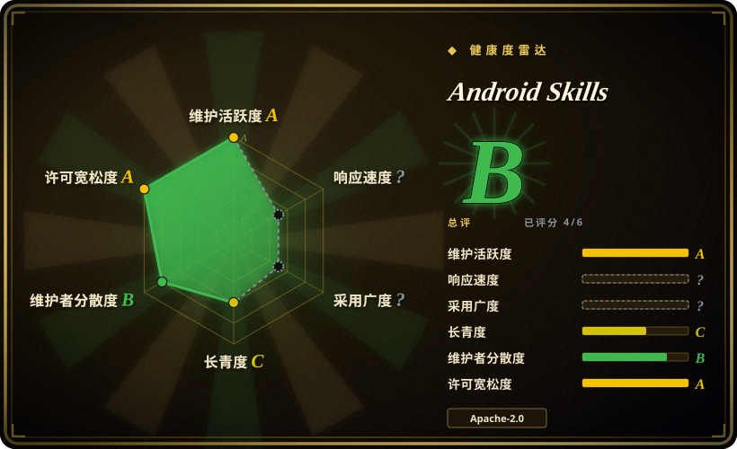
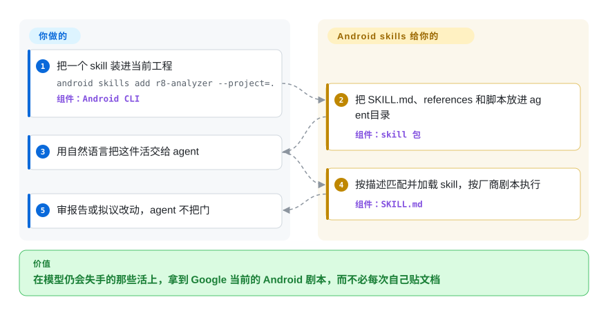

# Android Skills

你的编码 agent 仍在按 2024 年的训练截止日期写 Android：该用 Compose 的地方写出 XML，按钮被导航栏挡住，keep 规则从库的 README 整段复制。这是 Google 官方给那些模型仍会失手的活准备的剧本包——用 Android CLI 安装，任务对上就加载。

## 何时使用

你是 Android 工程师，在真实应用上跑编码 agent（Gemini、Claude、Codex、Antigravity、Android Studio Gemini），而 agent 总是跟不上当前平台动作。该写成 Compose 的屏幕，它给你 `View` XML。`targetSdk` 升到 35 之后，登录按钮压在三键导航栏下面。R8 keep 规则膨胀，因为它把每个库的 consumer keep 都抄进来，却不测哪些还在生效。Play 控制台以 Data Safety 对不上清单把包打回来，agent 从未对过 manifest。你要的不是又一份泛泛的「Android 最佳实践」提示词，而是 Google 自己、带日期的剧本——专门覆盖他们评估过、模型仍做不好的那些活。

用 Android CLI 装，而不是 `npx skills add`：当前工程装一个 skill 用 `android skills add r8-analyzer --project=.`，给所有检测到的 agent 全装用 `android skills add --all`。v1.0.12 的 marketplace 清单是 24 个 skill——AGP 9 升级、CameraX、App Functions、ML Kit GenAI Prompt API、`android` CLI 本身、restore-credentials、verified email、Compose 自适应／XML 迁 Compose／主题、Media3 Cast、Navigation 3、Navigation Event、R8 分析、Play Engage／Billing 升级／政策洞察、Android profiler、intent 安全、edge-to-edge、测试搭建、Leanback 迁 Compose TV、Wear Compose M3、眼镜上的 Compose Glimmer。栈就是 Android、且你要的是平台厂商此刻的主张、而不是社区对去年 API 的猜测时，选它。

与最近替代品的取舍在这里：[Vercel Agent Skills](../engineering/vercel-agent-skills.zh.md) 是同一形态的厂商包，但面向 Vercel 上的 React／Next.js——它不会告诉 agent 怎么吃 window insets。[Anthropic Skills](anthropic-skills.zh.md) 是平台自家的通用包（文档、设计、MCP 编写），对 Android 不表态。[Agent Plugins for AWS](aws-agent-plugins.zh.md) 是云厂商的同类：第一方剧本锁在一个生态里。生态锁定本身就是目的时，选本页。

## 怎么用起来

这个仓库是分发面，不是你 `import` 的工具。每个 skill 是一个目录：一份 `SKILL.md`（YAML 的 `name` + `description`，后面是编号剧本），外加可选的 `references/`（从 developer.android.com 拷来的页面、示例片段）和 `scripts/`（让 agent 去跑的 Python——R8 proto 转换、Play 政策编排器）。安装走 **Android CLI**（`android skills add …`），它把这些目录拷进检测到的各 agent 的 skill 目录；也可以在 Android Studio 里导入。Claude／Codex 的插件清单（`.claude-plugin/marketplace.json`、`.codex-plugin/plugin.json`）让这两种 harness 能加载同一棵树。装完之后靠描述匹配激活：你说「把应用做成 edge-to-edge」，agent 就该拉起 `edge-to-edge`；在 Studio 里还可以打 `@skill-name`。落到你手里的是方法，不是运行时——`r8-analyzer` 让 agent 跑 `./gradlew :app:analyzeReleaseR8Config` 再跑转换脚本，并且**只建议、不改文件**；`play-policy-insights` 对应用树跑 `orchestrator.py`，写出合规报告。Google DevRel 的 bot 从 `https://dl.google.com/dac/dac_skills.zip` 和 `github-skills` 分支刷新这棵树，所以正文跟着 developer.android.com 走，而不是某个志愿者的记忆。

<!-- flow-steps:begin (generated from flows/android-skills.json by tools/flow_card.py — do not edit) -->

流程文字版

1. **你**：把一个 skill 装进当前工程 — `android skills add r8-analyzer --project=.` — 组件：`Android CLI`
2. **Android Skills**：把 SKILL.md、references 和脚本放进 agent 目录 — 组件：`skill 包`
3. **你**：用自然语言把这件活交给 agent
4. **Android Skills**：按描述匹配并加载 skill，按厂商剧本执行 — 组件：`SKILL.md`
5. **你**：审报告或拟议改动，agent 不把门

**价值**：在模型仍会失手的那些活上，拿到 Google 当前的 Android 剧本，而不必每次自己贴文档

<!-- flow-steps:end -->

## 何时不用

- **活根本不是 Android。** 这些剧本假定 Android Gradle 工程、Jetpack 库、Play 控制台、Wear／TV／XR 形态。React／Next.js／Vercel 的性能和部署规则，用 [Vercel Agent Skills](../engineering/vercel-agent-skills.zh.md)；AWS 上的架构／部署／运维，用 [Agent Plugins for AWS](aws-agent-plugins.zh.md)；文档／设计／MCP 编写，用 [Anthropic Skills](anthropic-skills.zh.md)。
- **你要的是模型已经会的基础 Compose。** README 写明他们跳过「LLM 已经熟练的成熟领域，例如基础 Jetpack Compose 最佳实践」。agent 只是漏了 `Column`／`Modifier.padding`，这个包不会被触发——去读 developer.android.com，或在项目里留一份短规则。
- **你没有 Android CLI／Studio 的 skill 加载器，也不打算手工粘贴。** 文档里的安装路径是 `android skills add`（或 Studio 导入）。Claude 和 Codex 的插件清单是有的，但 README 并不把 `npx skills add android/skills` 当成支持路径。没有 skill 加载器的 harness 上，这份 markdown 不会自己生效——把对应 `SKILL.md` 贴进去，或用 CLI。
- **你要的是强制门禁，不是建议。** `r8-analyzer` 写着「No code changes: Research and suggest only。」Play 政策洞察写出报告就停。除非你自己接进 CI，否则什么都不会红。要一条每个任务都走的方法论，用 [Superpowers](../../agent-dev-methodology/coding-agent-harnesses/superpowers.zh.md)。
- **你想给这个仓库提一个新 skill 的 PR。** 「Public contributions are not accepted at this time」——只收反馈和 skill 请求的 issue。要改就 fork，或按官方文档把项目本地 skill 放在 `.skills/`／`.agent/skills/`。
- **你要的是 Android CLI 本身，不是这些剧本。** `android-cli` 这个 skill 教的是 CLI；CLI 是 Google 另托管的二进制（`curl … dl.google.com/android/cli/…/install.sh`），不是本仓库。本页是 skill 包。

## 横向对比

| 替代品 | 是否收录 | 我们的评价 | 取舍 |
|---|---|---|---|
| [Vercel Agent Skills](../engineering/vercel-agent-skills.zh.md) | ✅ | agent 在写 Vercel 上的 React／Next.js、失手点是 Core Web Vitals 或函数成本时，选 Vercel Agent Skills；agent 在写 Android、失手点是当前平台 API（insets、R8、Navigation 3、Play 政策）时，选 Android Skills，因为两包编码的是不同厂商的内部规矩，不能互换。 | Vercel：Web／React、`npx skills add`、无 tag 的 `main`。Android：移动平台、Android CLI 安装、有 tag 的发布、Google 所有。 |
| [Agent Plugins for AWS](aws-agent-plugins.zh.md) | ✅ | 活是在 AWS 上做架构／部署／运维，选 Agent Plugins for AWS；活是 Android 应用的代码、构建或 Play 上架，选 Android Skills，因为两者都是第一方生态锁定，你要锁的那个必须对得上运行时。 | AWS：九个插件加 MCP 接线，云。Android：24 个 skill 加 Gradle／设备／Play，移动。 |
| [Anthropic Skills](anthropic-skills.zh.md) | ✅ | 文档、设计、MCP／skill 编写且要贴 Claude 平台约定，选 Anthropic Skills；反复失手的是 Android 平台流程，选 Android Skills，因为通用包编码不了 AGP 9、R8 keep 半径或 edge-to-edge inset 规则。 | Anthropic：harness 原生、跨域。Android：一个 OS、厂商权威、CLI 分发。 |
| [MiniMax Skills](minimax-skills.zh.md) | ✅ | 要的是该厂商的前端／shader／办公文档／媒体生成，选 MiniMax Skills；主题是 Google 的 Android 栈，选 Android Skills，因为「官方入门包」这种分发形态重叠，教的内容不重叠。 | MiniMax：生成与创作面的广度。Android：平台正确性剧本。 |
| [Superpowers](../../agent-dev-methodology/coding-agent-harnesses/superpowers.zh.md) | ✅ | 要一条每个任务都走的 SDLC 主干（brainstorm → plan → TDD → verify），选 Superpowers；失手点是某一件 Android 活上的领域知识，选 Android Skills，因为方法论不知道 Navigation 3 或 Play Data Safety。 | Superpowers：过程、多 harness。Android：领域、只覆盖 Android。常常叠用，不是二选一。 |

## 健康度与可持续性

- **响应度：** 无法评分——skill-pack 为 `type_na`。
- **维护（雷达 A）：** 活跃——创建于 2026-03-16，最后推送 2026-09-18，最后提交距评分 4 天，近 13 周里有 11 周有活动。最新 tag `v1.0.12` 在 2026-09-15；从 `v0.0.5`（2026-05）起大约按月打 `v1.0.x`。刷新路径是 `Update Skills` workflow（从 `dl.google.com/dac/dac_skills.zip` 解压，再叠 `github-skills` 分支），目前是 `workflow_dispatch`，每小时 cron 仍注释着 `TODO`。
- **治理（雷达 B）：** 归 Organization `android`（Google）所有。近 12 个月 5 位活跃维护者，头号贡献者占比 0.536（`android-devrel-github-bot`），前三合计 0.893（bot 加 DevRel 的 `simona-anomis`、`JoseAlcerreca`）。路线图是 Google 的；「Public contributions are not accepted at this time。」高出处、低社区 bus-factor，而且是刻意的。
- **年龄与 Lindy（雷达 C）：** 190 天（约 6 个月）——按本索引的 Lindy 先验未经证明。缓解因素：它是 developer.android.com／Android DevRel 的分发臂，*内容*继承平台文档必须跟上版本的激励，尽管这个 git 仓库还年轻。[推断]
- **采用（雷达 ?）：** skill-pack 结构上无法评分（`no_package_structural`）。2026-09-22 的可见信号：7,492 stars／487 forks／86 watchers／34 个开放 issue。入口是 Android CLI、Android Studio skill 导入，以及 Claude／Codex 插件清单。
- **风险标记（雷达 A）：** Apache-2.0（`LICENSE.txt`），近 36 个月无 relicense。skill 是提示词文本，效力是劝告性的。CLI 安装路径会采集用量，除非加 `--no-metrics`（写在 Android CLI 文档上——CLI 是另一个二进制）。内容从 Google 的 zip 再生成；同步停了，剧本就会停在上一次合并。整体雷达：**B（6 个轴中评到 4 个）**。

## 存疑（未验证）

- [未验证] 24 个 skill 的清单来自 commit `b1f707d`（2026-09-18）上的 `.claude-plugin/marketplace.json`；update workflow 一合并集合就会变。依赖某个具名 skill 之前，先读线上目录。
- [未验证] stars／forks／watchers／issue 数（7,492／487／86／34）是 2026-09-22 读取的 GitHub 时点数字，会变动。
- [未验证] 各 harness 上的激活（Gemini、Antigravity、Claude、Codex、Android Studio 的 `@skill-name`）本次未实际执行——说法来自 README 和 developer.android.com。
- [未验证] `android skills add r8-analyzer --project=.` 与 `android skills add --all` 是 README 里的命令；CLI 文档还写了 `--agent=`，以及省略 `--all`／名字时默认只装 `android-cli`。flag 拼写（`--project` 相对文档示例里的 `--skill`）未在本机跑过。
- [推断] 这棵树是 Google DAC skills zip 加上 `github-skills` 分支的生成镜像（`.github/workflows/update-skills.yml`）；确切同步节奏目前只有 `workflow_dispatch`，cron 仍注释着。
- [推断] skill 是 agent 加载的 markdown／脚本，所以效力是劝告性的——写着「MUST」的步骤，agent 仍可能跳过。`r8-analyzer` 和 `play-policy-insights` 自己的 `SKILL.md` 就是这么写的。
- [未验证] Android CLI 的遥测（`--no-metrics`）写在 developer.android.com/tools/agents/android-cli；本 skills 仓库并不实现 CLI。
