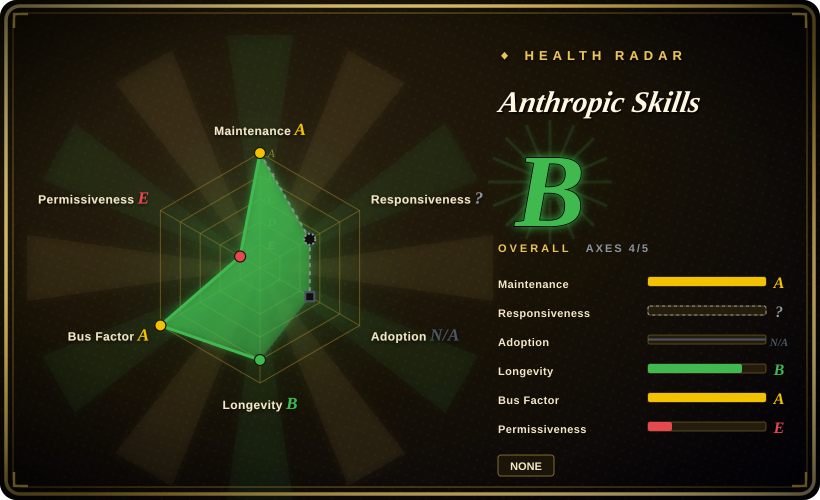
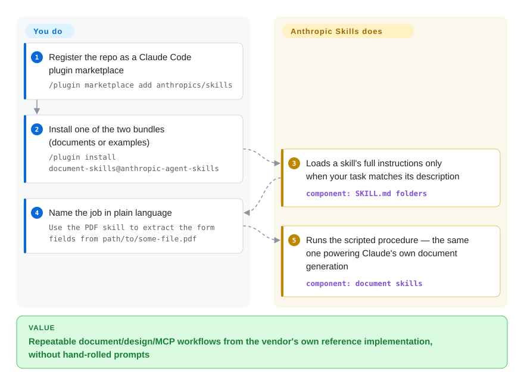

# Anthropic Skills

You keep re-explaining the same procedural job to Claude — extract the form fields from this PDF, turn this outline into a .docx, scaffold an MCP server — and hand-rolled prompts never behave the same twice; this repo is Anthropic's own skill collection, folders of instructions/scripts that Claude loads when your task matches, and it includes the very document skills that power Claude's file generation.

## When to use

You're a developer or team standing up Claude as an agent and you keep re-explaining the same procedural tasks — "extract the form fields from this PDF", "build a .docx from this outline", "scaffold a new MCP server", "spin up a frontend artifact". You want first-party, reference-quality implementations of those procedures rather than hand-rolling prompts or trusting a random third-party bundle. This repo is the vendor source: each skill is a folder with a `SKILL.md` (YAML `name` + `description`, then markdown instructions) plus any helper scripts/resources, following Anthropic's Agent Skills format. You install via the plugin marketplace (`/plugin marketplace add anthropics/skills`, then `/plugin install document-skills@anthropic-agent-skills` or `example-skills@anthropic-agent-skills`), and the skills load on demand when their description matches the task.

You reach for it specifically when you want (a) the document skills (`docx`, `pdf`, `pptx`, `xlsx`) that power Claude's file generation, (b) a canonical `skill-creator` / `mcp-builder` to learn the format and author your own, or (c) a curated starter set (`frontend-design`, `canvas-design`, `brand-guidelines`, `internal-comms`, `slack-gif-creator`, `webapp-testing`, `claude-api`, `theme-factory`, plus newer arrivals like `academy-guide` and `discernment-nudge`) maintained by the platform vendor. The `spec/` and `template/` directories make it the reference for writing skills against Anthropic's implementation — the broader Agent Skills standard now has its own site (agentskills.io), but this repo remains the vendor's own worked examples. Use it as the baseline you adopt or fork before building a bespoke skill stack.

## How it works

A skill is deliberately low-tech: a folder containing `SKILL.md` — YAML frontmatter with just `name` and `description` (the description is what Claude pattern-matches against to decide when to load the skill), then plain markdown instructions, optionally plus helper scripts and reference files. Claude reads the short metadata cheaply and pulls the full instructions into context only when a task matches — so the whole catalog costs you routing lines, not a bloated system prompt. You do three things: register the repo as a marketplace (`/plugin marketplace add anthropics/skills`), install one of the two bundles (`document-skills` or `example-skills`), then name the job in plain language ("Use the PDF skill to extract the form fields from `path/to/some-file.pdf`"). What stays yours: verifying the skill actually improves your workload — Anthropic's own README disclaimer says these are demonstration/educational implementations and Claude's shipped behavior may differ — and checking per-skill licensing, because the document skills are source-available, not open source.

<!-- flow-steps:begin (generated from flows/anthropic-skills.json by tools/flow_card.py — do not edit) -->

Text version of the flow

1. **You**: Register the repo as a Claude Code plugin marketplace — `/plugin marketplace add anthropics/skills`
2. **You**: Install one of the two bundles (documents or examples) — `/plugin install document-skills@anthropic-agent-skills`
3. **Anthropic Skills**: Loads a skill's full instructions only when your task matches its description — component: `SKILL.md folders`
4. **You**: Name the job in plain language — `Use the PDF skill to extract the form fields from path/to/some-file.pdf`
5. **Anthropic Skills**: Runs the scripted procedure — the same one powering Claude's own document generation — component: `document skills`

**Value**: Repeatable document/design/MCP workflows from the vendor's own reference implementation, without hand-rolled prompts

<!-- flow-steps:end -->

## When NOT to use

- **You already run a curated skill/command system you trust.** These ship with their own descriptions and routing; layering them onto an existing methodology stack invites overlap and double-firing (e.g. a `frontend-design` skill colliding with your own UI conventions). Pick one source of truth per concern.
- **Mixed license — read before redistributing.** The README states it directly: the example skills are Apache-2.0, but the document skills (`docx`, `pdf`, `pptx`, `xlsx`) are explicitly **source-available, not open source**. GitHub finds no repo-wide LICENSE (license field null, 2026-09-28); don't assume Apache-2.0 covers everything you vendor or ship.
- **Treat shipped behavior as a demo, not a contract.** The README disclaimer says the skills are "provided for demonstration and educational purposes only" and that what Claude actually does "may differ" from what these folders show — test thoroughly before relying on them for critical tasks.
- **You're not on a Claude-family harness.** Installation paths are Claude Code, Claude.ai, and the Claude API. The `SKILL.md` markdown won't auto-fire on a non-Claude agent with no compatible skill loader; portability to other harnesses is not a goal here.
- **You want a runnable tool/CLI/library.** There's nothing to `import` or run standalone — it's skill definitions plus helper resources that shape an agent's behavior, not an application.
- **You need pinned, stable behavior.** No tagged releases (GitHub tags API empty as of 2026-09-28); skills are markdown/scripts that change on `main`. A pull can shift what a skill does or routes to. Vendor a specific commit if you need stability and re-check after updates. [推断]

## Comparison

| Alternative | In index | Our verdict | Tradeoff |
|---|---|---|---|
| [Claude plugins (official)](claude-plugins-official.md) | ✅ | Choose Claude plugins when you need Anthropic's broader plugin/marketplace surface. | Anthropic's broader official plugin/marketplace surface; this `skills` repo is specifically the Agent Skills collection (document + example skills), not the full plugin catalog. Compare on whether you want skills only or the wider plugin set. |
| [AWS Labs agent plugins](aws-agent-plugins.md) | ✅ | Choose AWS Labs agent plugins when your vendor collection needs AWS ecosystem depth. | Another vendor-published collection, AWS-ecosystem-flavored; pick by which cloud/tooling bias matches your stack. Format/loader compatibility differs. |
| [MiniMax skills](minimax-skills.md) | ✅ | Choose MiniMax skills when you need a different vendor's model/media skill bundle. | A different vendor's skill collection; overlapping "official starter skills" goal but tied to that vendor's models/harness. Cross-check format compatibility before mixing. |
| Third-party community skill packs (e.g. [Superpowers](../../agent-dev-methodology/coding-agent-harnesses/superpowers.md)) | 部分已收录 | Choose community packs when opinionated SDLC/methodology matters more than first-party reference skills. | Opinionated SDLC/methodology bundles layered on top of an agent. This repo is narrower and first-party: reference task skills + the authoring spec, not a full workflow methodology. |
| Roll your own `SKILL.md` skills | n/a | Choose custom skills when maximum fit and zero external dependency outweigh vendor baselines. | Maximum fit and zero external dependency, but you forgo the vendor's tested document-generation skills and the canonical spec/template. Many users fork from here as the baseline. |

## Health & viability

- **Responsiveness**: Cannot be scored — type_na.
- **Maintenance** — verified 2026-09-28 via GitHub API: last push 2026-09-24, not archived — **actively maintained**. Open-issue count is high (~1,370, up from ~990 in June) — consistent with a very high-traffic first-party repo, not necessarily a maintenance-debt signal. No tagged releases; track `main`.
- **Governance & backing** — [推断] org-owned and **vendor-backed by Anthropic itself** (the platform vendor that defines the Agent Skills format). Strongest possible provenance for this format, but roadmap is the vendor's to set or pivot; first-party does not equal stable API.
- **Age & Lindy** — created 2025-09, so ~1 year old as of 2026-09: young but the format has survived its first year as the vendor's own file-generation path. Lindy is weak on age alone, but vendor backing + the canonical `spec/`/`template/` make it the **reference** others fork; betting risk is lower than a community pack of the same age.
- **Adoption/ecosystem** — ~179k stars (GitHub API, 2026-09-28) and the document skills (`docx`/`pdf`/`pptx`/`xlsx`) power Claude's own file generation — high adoption as the de-facto baseline; the README also now points to agentskills.io as the neutral standard site.
- **Risk flags** — **mixed license** confirmed from the README itself (2026-09-28): example skills Apache-2.0, document skills source-available (not open source), with no repo-wide LICENSE — read terms before redistributing. Plus the README's own demonstration-only disclaimer.

## Caveats (unverified)

- [未验证] No tagged releases and no repo-wide LICENSE file (GitHub license field null as of 2026-09-28); license is per-area — README states example skills Apache-2.0, document skills (`docx`/`pdf`/`pptx`/`xlsx`) source-available. The `Apache-2.0` in frontmatter reflects the example skills only; verify the specific skill's terms before redistribution.
- [未验证] Primary language reported as Python per GitHub metadata; the repo mixes Python helper scripts with Markdown skill definitions and other languages — language tag is indicative, not a build target.
- [未验证] The live `skills/` directory (2026-09-28: academy-guide, algorithmic-art, brand-guidelines, canvas-design, claude-api, discernment-nudge, doc-coauthoring, docx, frontend-design, internal-comms, mcp-builder, pdf, pptx, skill-creator, slack-gif-creator, theme-factory, web-artifacts-builder, webapp-testing, xlsx) is a snapshot; the set and routing change on `main` — read the live directory.
- [未验证] Install commands and marketplace identifiers (`anthropic-agent-skills`, `document-skills`, `example-skills`) are from the README; exact plugin names and activation behavior may change — confirm against current docs.
- [推断] Because behavior lives in markdown `SKILL.md` instructions loaded by the agent, enforcement is advisory — the agent can deviate; skills describe procedures, they do not hard-guarantee outcomes.
- [推断] Single-vendor backing cuts both ways: the repo survives as long as Anthropic keeps the skills product, and the README's demo disclaimer signals no support obligation for behavior parity with shipped Claude.
