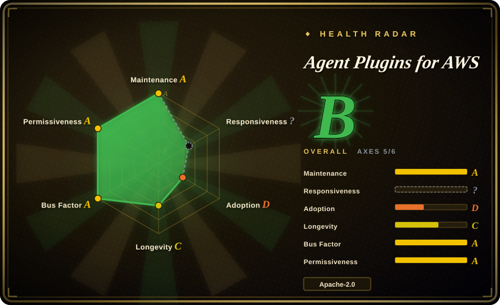
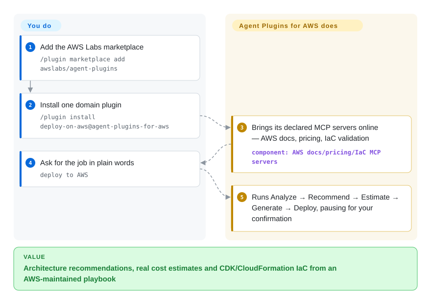

# Agent Plugins for AWS

Your coding agent knows AWS "in general" but keeps picking stale service defaults, skipping cost checks and hand-rolling CloudFormation you have to correct; this is AWS Labs' own marketplace of nine domain plugins (serverless, deploy, SageMaker, migration, …) that bundle playbooks, AWS MCP servers and hooks into installable units — though AWS itself now steers production users to its successor, the Agent Toolkit for AWS.

## When to use

You're a developer or platform engineer working in Claude Code (or Cursor/Codex) and the task is AWS-shaped: stand up a serverless API with Lambda + API Gateway + Step Functions, estimate cost and generate IaC for a new architecture, migrate infra from GCP to AWS, modernize a .NET or COBOL codebase onto AWS, scaffold an Amplify full-stack app, or build/deploy a SageMaker model. The base agent knows AWS in general but keeps reaching for stale service defaults, skipping cost checks, or hand-rolling CloudFormation you have to correct. You want first-party, AWS-maintained playbooks that encode the service-specific best practices and wire up the right AWS MCP servers (docs, pricing, IaC) for you.

This repo is the vendor source: each of the nine plugins (`aws-serverless`, `aws-amplify`, `sagemaker-ai`, `migration-to-aws`, `databases-on-aws`, `deploy-on-aws`, `aws-transform`, `amazon-location-service`, `codebase-documentor-for-aws`) bundles trigger-phrase skills, MCP server wiring, and hooks/guardrails. You add the marketplace (`/plugin marketplace add awslabs/agent-plugins`) and install only the plugins you need (e.g. `/plugin install deploy-on-aws@agent-plugins-for-aws`); the skills load on demand when the agent recognizes a matching AWS task. Reach for it when you want AWS's own opinion baked into the agent rather than building that skill stack yourself — but read the successor note below before starting new production work.

## How it works

A plugin here is a *container* of four artifact types, per the README: agent skills (step-by-step playbooks like "deploy" or "aws-lambda"), MCP servers (live connections to AWS docs, real-time pricing, IaC validation), hooks (guardrails that fire on your actions — e.g. the aws-serverless plugin runs `sam validate` on every `template.yaml` edit), and references (docs/config defaults the skills consult without bloating the prompt). You install a plugin through the harness's own `/plugin` flow; from then on the skills auto-trigger on natural phrases ("deploy to AWS", "add a map", "I inherited this code") and the plugin's declared MCP servers come up with it. What stays yours, explicitly: AWS credentials scoped least-privilege, reviewing generated code and costs before anything deploys (the deploy playbook runs its five steps — Analyze, Recommend, Estimate, Generate, Deploy — and asks for your confirmation at the last one), and keeping plugins updated.

<!-- flow-steps:begin (generated from flows/aws-agent-plugins.json by tools/flow_card.py — do not edit) -->

Text version of the flow

1. **You**: Add the AWS Labs marketplace — `/plugin marketplace add awslabs/agent-plugins`
2. **You**: Install one domain plugin — `/plugin install deploy-on-aws@agent-plugins-for-aws`
3. **Agent Plugins for AWS**: Brings its declared MCP servers online — AWS docs, pricing, IaC validation — component: `AWS docs/pricing/IaC MCP servers`
4. **You**: Ask for the job in plain words — `deploy to AWS`
5. **Agent Plugins for AWS**: Runs Analyze → Recommend → Estimate → Generate → Deploy, pausing for your confirmation

**Value**: Architecture recommendations, real cost estimates and CDK/CloudFormation IaC from an AWS-maintained playbook

<!-- flow-steps:end -->

## When NOT to use

- **Superseded for new production work — AWS says so in the README (verified 2026-09-28).** The "What's new" note names the **Agent Toolkit for AWS** as the *successor* to these MCP servers, plugins and skills: "If you're building production software using coding agents or building agents for your own customers, we recommend Agent Toolkit for AWS." This repo "continues to work and accept contributions," and "over time, the most useful projects here will move into Agent Toolkit for AWS." Not abandoned — last commit on `main` 2026-09-14 — but a surface whose best parts are slated to migrate; start new production work on the successor and treat this as the installed-base playbook.
- **You already run a curated AWS skill/command stack you trust.** These plugins ship their own trigger phrases and MCP wiring; layering them over an existing methodology invites overlapping routing and double-firing on the same AWS task. Pick one source of truth per concern.
- **You're not on a supported harness.** Install paths are Claude Code (≥2.1.29), Cursor (≥2.5, also via the Cursor marketplace), and Codex via repo-local marketplace files (note: Claude-specific automatic hooks are not yet wired into the Codex manifests); Kiro is experimental via a third-party converter that currently drops hooks entirely. On an unsupported agent there's no loader to fire the skills and the markdown alone won't auto-activate.
- **Coverage is uneven inside the catalog.** `databases-on-aws` is only "Some Services Available" — currently Aurora DSQL — despite the plugin's portfolio-wide description. Don't assume the nine plugins are equally complete; check each plugin's own table.
- **You want cloud-neutral or non-AWS guidance.** Every plugin is AWS-ecosystem-flavored (AWS MCP servers, AWS services, AWS pricing). It actively biases solutions toward AWS — not what you want for multi-cloud or vendor-neutral architecture.
- **You want a runnable tool/CLI/library.** There's nothing to `import` or run standalone — it's skill definitions, MCP config, and hooks that shape an agent's behavior. Outside a supporting agent (and without configured AWS credentials) it does nothing.
- **Advisory, not enforced.** Behavior lives in markdown skills the agent loads; "best practice" steps are prompt-level instructions, not hard guarantees — the agent can still deviate or call AWS APIs in ways the playbook didn't intend.

## Comparison

| Alternative | In index | Our verdict | Tradeoff |
|---|---|---|---|
| [Agent Toolkit for AWS](agent-toolkit-for-aws.md) (the named successor) | ✅ | When you're starting *new* production agent work on AWS, pick the successor toolkit, because AWS itself recommends it and adds IAM condition keys to separate agent actions from human ones plus CloudWatch/CloudTrail visibility. | The successor is a live `awslabs`-adjacent repo (`aws/agent-toolkit-for-aws`, ~2.7k stars as of 2026-09-28); this repo "continues to work" while its most useful projects migrate over — installing these plugins today means adopting a surface AWS has flagged for partial relocation. |
| [Anthropic Skills](anthropic-skills.md) | ✅ | Choose Anthropic Skills when you need cloud-neutral first-party general-purpose skills. | Anthropic's first-party general-purpose skills (document gen, frontend, authoring spec). Cloud-neutral and task-generic; this AWS repo is narrower and ecosystem-locked but far deeper on AWS architecture/deploy/ops. Different unit of value. |
| [Claude Plugins (official)](claude-plugins-official.md) | ✅ | Choose Claude Plugins when you need Anthropic's broad official marketplace catalog. | Anthropic's broad official plugin/marketplace catalog; general-purpose. This repo is a single-vendor (AWS) domain collection layered on the same plugin mechanism — pick by whether you need AWS depth or a general plugin set. |
| [MiniMax skills](minimax-skills.md) | ✅ | Choose MiniMax skills when you need a non-AWS vendor skill bundle. | Another vendor's skill collection tied to that vendor's models/harness; overlapping "official starter skills" goal but no AWS domain content. Cross-check format/loader compatibility before mixing. |
| AWS official MCP servers (standalone) | 未收录 | Choose standalone AWS MCP servers when you only need data sources, not packaged skills/playbooks. | The underlying AWS MCP servers (docs, pricing, IaC, `awslabs/mcp`) can be wired up without these plugins; you get the data sources but not the packaged skills, trigger phrases, and guardrails. More assembly, less opinion. |
| Roll your own AWS skills | n/a | Choose custom AWS skills when maximum fit outweighs maintained playbooks and MCP wiring. | Maximum fit and no marketplace dependency, but you forgo AWS's maintained playbooks and MCP wiring and must keep service best-practices current yourself. |

## Health & viability

- **Responsiveness**: Cannot be scored — type_na.
- **Maintenance** — verified 2026-09-28 via GitHub API: last push 2026-09-24, last commit on `main` 2026-09-14, not archived, 21 open issues — actively maintained. But the only tagged release is still `1.0.0` (2026-02-18); the marketplace installs from `main`/registry files, so the tag is nominal.
- **Governance & backing** — [推断] org-owned (`awslabs`) with a real contributor spread (top author ≈ 21% of last-12-months commits, 2026-09-28 scorer run) — **vendor-backed by AWS Labs**; strong provenance, but single-vendor and AWS-ecosystem-locked, and the roadmap now visibly favors the successor toolkit over this repo.
- **Age & Lindy** — created 2026-02, so ~8 months old as of 2026-09: **brand new with no Lindy track record** — and already superseded once, which is the opposite signal of Lindy stability.
- **Risk flags** — **vendor steering confirmed** from the README (2026-09-28): Agent Toolkit for AWS is the recommended production path and "the most useful projects here will move" into it. ~904 stars (2026-09) is modest, consistent with its newness. AWS API calls with real cost/state side effects are the domain's inherent risk, not this repo's.

## Caveats (unverified)

- [未验证] The migration promise ("over time, the most useful projects here will move into Agent Toolkit for AWS") is the README's own forward-looking statement as of 2026-09-28; how completely and when content actually moves is not confirmed.
- [未验证] The successor repo `aws/agent-toolkit-for-aws` (~2.7k stars, pushed 2026-09-26) was checked only via GitHub search API metadata; its contents/capabilities vs. these plugins were not compared plugin-by-plugin.
- [未验证] The nine-plugin inventory and per-plugin status (incl. `databases-on-aws` = "Some Services Available", Aurora DSQL only) is a snapshot of the README plugin table and `plugins/` directory on 2026-09-28; the set, trigger phrases, and routing change on `main`.
- [未验证] Supported-harness list and version floors (Claude Code ≥2.1.29, Cursor ≥2.5, Codex repo-local with hooks not yet wired, Kiro experimental via third-party converter that drops hooks) and the marketplace/install identifiers (`agent-plugins-for-aws`, e.g. `deploy-on-aws@agent-plugins-for-aws`) are from the README; activation fidelity per harness was not independently exercised.
- [未验证] Prerequisites (AWS CLI/credentials configured, per-plugin MCP servers such as `awsknowledge`, `awspricing`, `aws-iac-mcp`, `aws-serverless-mcp`) are described in the README; which plugin actually requires which server was read from the per-plugin tables but not run.
- [推断] Primary language per GitHub is now Python (June's snapshot said Shell — linguist drift, not a rewrite); skill content is largely Markdown either way.
- [推断] Because behavior lives in markdown skills loaded by the agent, enforcement is advisory — the agent can deviate; "best practice" and guardrail steps are prompt/hook-level instructions, not hard guarantees, and can still drive real AWS API calls with cost/state side effects.
