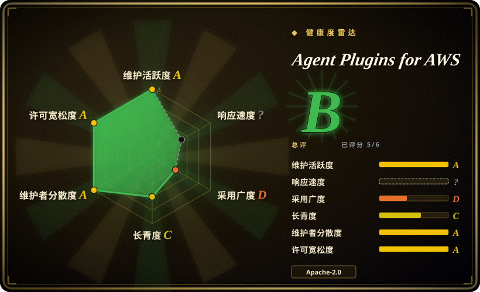
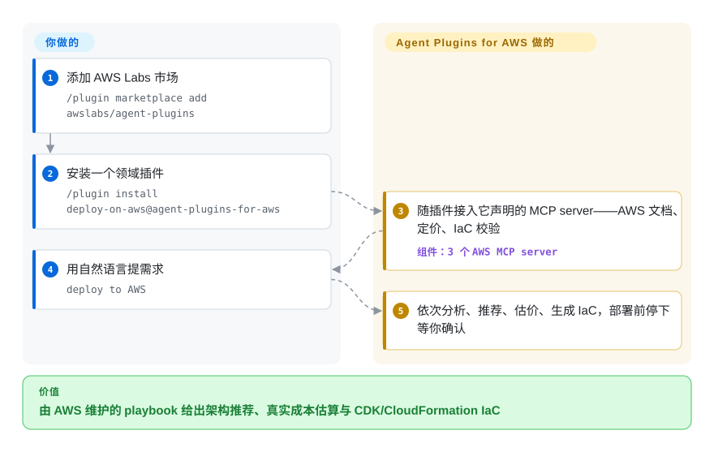

# Agent Plugins for AWS

你的 coding agent「多少懂点 AWS」，却总在挑过时的服务默认配置、跳过成本核算、手写需要你返工的 CloudFormation；这是 AWS Labs 官方的九个领域插件市场（serverless、deploy、SageMaker、迁移……），把 playbook、AWS MCP server 和 hook 打包成可安装单元——不过 AWS 自己现在已把生产用户导向它的继任者 Agent Toolkit for AWS。

## 何时使用

你是用 Claude Code（或 Cursor/Codex）开发的工程师或平台工程师，任务是 AWS 形状的：用 Lambda + API Gateway + Step Functions 起一个 serverless API、为新架构估算成本并生成 IaC、把基础设施从 GCP 迁到 AWS、把 .NET 或 COBOL 代码库现代化到 AWS、脚手架一个 Amplify 全栈应用，或构建/部署一个 SageMaker 模型。基础 agent 对 AWS 有泛泛知识，却不停落在过时的服务默认上、跳过成本检查、或写出你不得不改的 CloudFormation。你想要第一方、由 AWS 维护的 playbook，把服务级最佳实践编码进去，并替你接好对的 AWS MCP server（文档、定价、IaC）。

这个仓库就是厂商源头：九个插件（`aws-serverless`、`aws-amplify`、`sagemaker-ai`、`migration-to-aws`、`databases-on-aws`、`deploy-on-aws`、`aws-transform`、`amazon-location-service`、`codebase-documentor-for-aws`）每个都打包了触发短语 skill、MCP server 接线和 hook/护栏。你添加市场（`/plugin marketplace add awslabs/agent-plugins`），只装你需要的插件（如 `/plugin install deploy-on-aws@agent-plugins-for-aws`）；当 agent 认出匹配的 AWS 任务时，skill 按需加载。当你想让 AWS 自己的观点直接进入 agent、而不是自建那套 skill 栈时就用它——但开始新的生产工作前，请先看下面的继任者说明。

## 怎么用起来

这里的插件是一个*容器*，按 README 的说法装四类工件：agent skill（「deploy」「aws-lambda」这类一步步的 playbook）、MCP server（连到 AWS 文档、实时定价、IaC 校验的活连接）、hook（在你的动作上触发的护栏——例如 aws-serverless 插件在每次编辑 `template.yaml` 后跑 `sam validate`）、以及 reference（skill 可随时查阅、不撑爆 prompt 的文档与配置默认值）。你通过 harness 自己的 `/plugin` 流程安装插件；此后 skill 会在自然语句（「deploy to AWS」「add a map」「I inherited this code」）上自动触发，插件声明的 MCP server 也随之接入。明确留在你手上的：按最小权限配好的 AWS 凭据、在任何东西部署之前 review 生成的代码与成本（deploy playbook 依次走 Analyze、Recommend、Estimate、Generate、Deploy 五步，最后一步要你确认才执行），以及保持插件更新。

<!-- flow-steps:begin (generated from flows/aws-agent-plugins.json by tools/flow_card.py — do not edit) -->

流程文字版

1. **你**：添加 AWS Labs 市场 — `/plugin marketplace add awslabs/agent-plugins`
2. **你**：安装一个领域插件 — `/plugin install deploy-on-aws@agent-plugins-for-aws`
3. **Agent Plugins for AWS**：随插件接入它声明的 MCP server——AWS 文档、定价、IaC 校验 — 组件：`3 个 AWS MCP server`
4. **你**：用自然语言提需求 — `deploy to AWS`
5. **Agent Plugins for AWS**：依次分析、推荐、估价、生成 IaC，部署前停下等你确认

**价值**：由 AWS 维护的 playbook 给出架构推荐、真实成本估算与 CDK/CloudFormation IaC

<!-- flow-steps:end -->

## 何时不用

- **新的生产工作已被官方让路。** README 明示（2026-09-28 核实）「What's new」把 **Agent Toolkit for AWS** 点名为这些 MCP server、插件与 skill 的*继任者*：「如果你在用它构建生产软件，官方推荐 Agent Toolkit for AWS」。本仓库「继续可用并接受贡献」，且「最有用的项目会随时间迁入 Agent Toolkit for AWS」。它没有废弃——`main` 最近一次 commit 在 2026-09-14——但这是一块最好的内容被计划搬走的表面；新的生产工作应从继任者起步，把这里当作存量 playbook。
- **你已经有一套自己信任的 AWS skill/command 栈。** 这些插件自带触发短语和 MCP 接线；叠在既有方法论上会造成路由重叠、同一个 AWS 任务被双重触发。每个关注点只保留一个事实源。
- **你不在受支持的 harness 上。** 安装路径是 Claude Code（≥2.1.29）、Cursor（≥2.5，也上 Cursor 市场）和 Codex（repo-local marketplace 文件；注意：Claude 专属的自动 hook 尚未接入 Codex manifest）；Kiro 走第三方转换器、属实验性，且转换时 hook 会被整个丢掉。在不支持的 agent 上没有 loader 来触发 skill，光有 markdown 不会自动生效。
- **目录内部覆盖并不齐。** `databases-on-aws` 状态只是「Some Services Available」——目前仅 Aurora DSQL——尽管插件描述写着整个数据库组合。别假设九个插件同等完整；逐个看插件自己的表。
- **你要的是云中立或非 AWS 的指导。** 每个插件都是 AWS 生态口味（AWS MCP server、AWS 服务、AWS 定价）。它主动把方案往 AWS 偏——多云或厂商中立架构不是它的目标。
- **你想要一个可运行的 tool/CLI/库。** 没有东西可 `import` 或独立运行——它是 skill 定义、MCP 配置和 hook，用来塑造 agent 行为。脱离支持的 agent（且没有配好的 AWS 凭据）它什么也不做。
- **建议性，非强制。** 行为活在 agent 加载的 markdown skill 里；「最佳实践」步骤是 prompt 层指令、不是硬保证——agent 仍可能偏离，或以 playbook 未设想的方式调用 AWS API。

## 横向对比

| 替代品 | 是否收录 | 我们的评价 | 取舍 |
|---|---|---|---|
| [Agent Toolkit for AWS](agent-toolkit-for-aws.zh.md)（官方点名的继任者） | ✅ | 现在开始*新的* AWS 生产 agent 工作时选继任者，因为 AWS 官方推荐它，且补上了区分 agent 与人类操作的 IAM condition key 以及 CloudWatch/CloudTrail 可见性。 | 继任者是活跃的 GitHub 仓库（`aws/agent-toolkit-for-aws`，2026-09-28 约 2.7k star）；本仓库「继续可用」但最有用的项目将迁走——今天装这些插件，等于采用一块官方已标记部分搬迁的表面。 |
| [Anthropic Skills](anthropic-skills.zh.md) | ✅ | 需要云中立的厂商级通用 skill 时，选 Anthropic Skills。 | Anthropic 第一方的通用 skill（文档生成、前端、编写规范）。云中立、任务通用；本 AWS 仓库更窄、绑生态，但在 AWS 架构/部署/运维上深得多。价值单位不同。 |
| [Claude Plugins（官方）](claude-plugins-official.zh.md) | ✅ | 需要 Anthropic 宽的官方市场目录时，选 Claude Plugins。 | Anthropic 的官方插件/市场大全，通用向；本仓库是单一厂商（AWS）的领域合集，叠在同一插件机制上——按你要 AWS 深度还是通用插件集来选。 |
| [MiniMax skills](minimax-skills.zh.md) | ✅ | 需要非 AWS 厂商的 skill 合集时，选 MiniMax skills。 | 另一厂商绑定其模型/harness 的 skill 合集；同为「官方起步 skill」目标，但没有 AWS 领域内容。混用前先核对格式/loader 兼容性。 |
| AWS 官方 MCP server（单独使用） | 未收录 | 只需要数据源、不需要打包 skill/playbook 时，选单独的 AWS MCP server。 | 底层的 AWS MCP server（文档、定价、IaC，见 `awslabs/mcp`）可以不装这些插件直接接；你拿到数据源，但没有打包的 skill、触发短语和护栏。装配更多，观点更少。 |
| 自己写 AWS skill | 不适用 | 最高贴合度重于维护中的 playbook 与 MCP 接线时，选自写。 | 贴合度最高、无市场依赖，但放弃 AWS 维护的 playbook 与 MCP 接线，服务最佳实践要自己跟新。 |

## 健康度与可持续性

- **响应速度**：无法计算——type_na。
- **维护** —— 2026-09-28 经 GitHub API 核实：最近一次 push 在 2026-09-24，`main` 最新 commit 在 2026-09-14，未归档，open issue 21 个——活跃维护中。但唯一打了 tag 的 release 仍是 `1.0.0`（2026-02-18）；市场安装走 `main`/registry 文件，tag 只是名义。
- **治理与背书** —— [推断] 组织所有（`awslabs`），贡献者分散度真实（近 12 个月首位作者约占 21% 提交，2026-09-28 评分运行）——**由 AWS Labs 厂商背书**；provenance 强，但单一厂商、锁 AWS 生态，且路线图如今明显偏向继任 toolkit 而非本仓库。
- **年龄与 Lindy** —— 创建于 2026-02，截至 2026-09 约 8 个月：**全新、没有 Lindy 履历**——而且已经历一次官方让路（被继任者取代），这与 Lindy 的稳定信号正相反。
- **风险标记** —— **厂商转向已由 README 确认**（2026-09-28）：Agent Toolkit for AWS 是官方推荐的生产路径，「最有用的项目会迁入」它。约 904 star（2026-09）体量不大，与其新度相称。真实产生成本/状态副作用的 AWS API 调用是这个领域固有的风险，不是本仓库特有的。

## 存疑（未验证）

- [未验证] 「最有用的项目会随时间迁入 Agent Toolkit for AWS」是 README 截至 2026-09-28 的前瞻性自述；内容最终迁移多少、何时迁移并未证实。
- [未验证] 继任仓库 `aws/agent-toolkit-for-aws`（约 2.7k star，2026-09-26 有 push）只经 GitHub 搜索 API 元数据核对；它与这些插件的内容/能力对比没有逐插件做过。
- [未验证] 九插件清单及各插件状态（含 `databases-on-aws`＝「Some Services Available」，目前仅 Aurora DSQL）是 2026-09-28 README 插件表与 `plugins/` 目录的快照；集合、触发短语与路由在 `main` 上变动。
- [未验证] 支持的 harness 列表与版本下限（Claude Code ≥2.1.29、Cursor ≥2.5、Codex repo-local 且 hook 未接线、Kiro 实验性且转换丢 hook）与市场/安装标识（`agent-plugins-for-aws`，如 `deploy-on-aws@agent-plugins-for-aws`）取自 README；各 harness 的激活保真度未独立实测。
- [未验证] 前置条件（配好 AWS CLI/凭据，各插件的 MCP server 如 `awsknowledge`、`awspricing`、`aws-iac-mcp`、`aws-serverless-mcp`）按 README 所述；哪个插件实际需要哪个 server 是从各插件小节表格读出的，没有实跑。
- [推断] GitHub 报的主语言现为 Python（6 月的快照是 Shell——linguist 统计漂移，并非重写）；skill 内容主体仍是 Markdown。
- [推断] 因为行为活在 agent 加载的 markdown skill 里，约束是建议性的——agent 可以偏离；「最佳实践」与护栏步骤是 prompt/hook 层指令、不是硬保证，且仍可能驱动带成本/状态副作用的真实 AWS API 调用。
