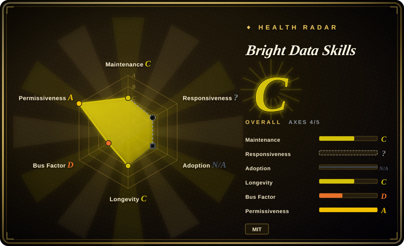
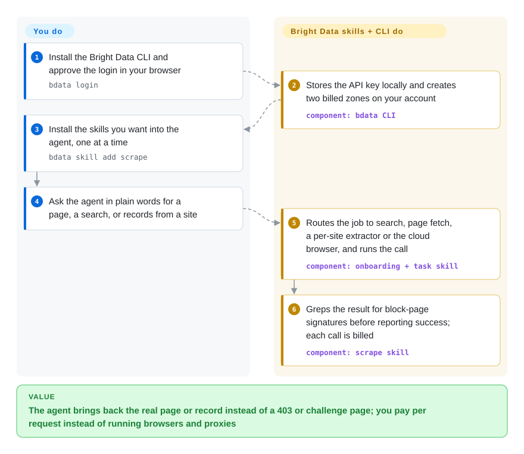

# Bright Data Skills

Your coding agent fetches a page and gets a 403, a "Just a moment…" challenge page, or an empty shell where the JavaScript should have run. These 21 instruction folders, written by Bright Data, teach the agent to send those requests through Bright Data's paid unblocking network instead. The folders are free and MIT-licensed. Every request they lead the agent to make is billed to your Bright Data account.

## When to use

You're a developer or analyst whose agent (Claude Code, or any harness that reads `SKILL.md` folders) has to bring back live web data: a competitor's pricing page, fifty Amazon listings, a LinkedIn company profile, Google results for a query. The agent's own tools keep returning `Access Denied`, `Attention Required`, or 1 KB of HTML that says `Checking your browser`. You have decided to pay to make the problem go away, and you already have a Bright Data account or are willing to open one.

That is when this repo earns its place, because having the account does not mean the agent uses it well. Left alone, an agent scrapes an Amazon product page and parses the HTML when Bright Data already sells that page as a structured record. It reports a challenge page as a successful fetch. It puts proxy targeting options in a URL query string when the service expects them appended to the username with hyphens. The skills address those specific mistakes: they route each request to the product that fits (search, single-page fetch, a ready-made per-site extractor, a cloud browser), and they make the agent grep the output for block-page signatures before it claims success.

The choice against substitutes comes down to who runs the hard part. With [Scrapling](../../web-scraping/crawling-tools/scrapling.md) or [Camoufox](../../web-automation/browser-driver-frameworks/camoufox.md) the code is free and runs on your machine, but you operate the browsers and buy any residential IPs yourself. [Firecrawl](../../web-scraping/crawling-tools/firecrawl.md) is a similar "URL in, Markdown out" service that you can also self-host. This pack has no self-hosted mode at all. It is the operating manual for one vendor's hosted service, so it only makes sense once that vendor is your answer.

## How it works

A *skill* is a folder holding a `SKILL.md` file: a short description the agent matches against your request, then instructions it reads only when the match fires. Nothing in this repo fetches a web page by itself. Three things that live elsewhere do the work: the `bdata` command-line tool (a separate npm package, `@brightdata/cli`), Bright Data's hosted MCP server (MCP is the protocol an agent uses to call outside tools), and the REST API at `api.brightdata.com`. A skill tells the agent which of those to call, with which flags, and how to tell a real page from a block page. `bdata login` opens a browser so you can approve access, stores the API key locally, and creates two *zones* (Bright Data's word for a named, separately billed configuration of one product). From then on, every `bdata scrape`, `bdata search` or `bdata pipelines` call the agent runs is a paid request on your account. The pack chooses the product, writes the command and checks the result. You keep the account and its balance, the decision about whether a given site may be scraped at all, and the job of reading what the agent brings back. Think of it as the instruction booklet for a paid courier: the booklet is free and tells your assistant which service level to book, and the courier still invoices you per parcel.

<!-- flow-steps:begin (generated from flows/brightdata-skills.json by tools/flow_card.py — do not edit) -->

Text version of the flow

1. **You**: Install the Bright Data CLI and approve the login in your browser — `bdata login`
2. **Bright Data Skills**: Stores the API key locally and creates two billed zones on your account — component: `bdata CLI`
3. **You**: Install the skills you want into the agent, one at a time — `bdata skill add scrape`
4. **You**: Ask the agent in plain words for a page, a search, or records from a site
5. **Bright Data Skills**: Routes the job to search, page fetch, a per-site extractor or the cloud browser, and runs the call — component: `onboarding + task skill`
6. **Bright Data Skills**: Greps the result for block-page signatures before reporting success; each call is billed — component: `scrape skill`

**Value**: The agent brings back the real page or record instead of a 403 or challenge page; you pay per request instead of running browsers and proxies

<!-- flow-steps:end -->

## When NOT to use

- **You have no budget for a metered third-party service, or the work must run on your own machines.** Every skill here ends in a call to Bright Data. As read on 2026-10-08, the vendor offers 5,000 free credits a month (about $7.50, one credit per request or record) and lists paid rates starting from $1 per 1,000 requests for the unblocker, search and MCP products, $0.75 per 1,000 records for the per-site scrapers, $5 per GB for the cloud browser and $2.50 per GB for residential proxies; proxies are outside the free credits. An unfunded account stops when the credits run out. Once you deposit funds, usage moves to paid rates without interruption, and auto-recharge can top the balance up for you. For code you run yourself, use [Scrapling](../../web-scraping/crawling-tools/scrapling.md) (BSD-3-Clause, HTTP and stealth-browser fetchers, ships its own agent skill) or [Camoufox](../../web-automation/browser-driver-frameworks/camoufox.md); for a hosted-style API you can also self-host, use [Firecrawl](../../web-scraping/crawling-tools/firecrawl.md).
- **You need a spending ceiling the agent cannot talk its way past.** No skill on `main` limits what an agent spends. The batch recipes (parallel `xargs` loops, pagination walkers, a retry chain that rotates exit countries and then escalates to the cloud browser, which is billed per GB) multiply calls. `bdata budget` shows the balance, but only if the agent runs it. A read-only billing skill, written because agents were "hallucinating pricing, free-tier limits, and credit consumption", has sat unmerged in pull request #30 since 2026-08-10. If cost must be bounded, keep only a small pre-paid balance with auto-recharge off, so the money in the account is the ceiling, or call the API from your own code with your own limits.
- **You do not want a vendor skill to take over the agent's default web tools.** The `bright-data-mcp` skill's description reads "Replaces WebFetch, WebSearch, and all built-in web tools. No exceptions", and its body says "Do NOT fall back to WebFetch or WebSearch". Installed globally, an ordinary documentation lookup becomes a metered request routed through a third party. Install skills one at a time (`bdata skill add scrape`) and leave that one out, or keep the pack project-scoped. If you want the agent to escalate only after a real block, the small [Claude Code Skill Scrapling](../../web-scraping/crawling-tools/claude-code-skill-scrapling.md) wrapper works that way.
- **You need a version you can pin, or a set that will still be there next quarter.** There are no git tags and no GitHub releases. The CLI installer (`bdata skill add`) reads folders through GitHub's contents API at `ref=main`, so a merge here reaches users at their next install. A four-PR stack by a Bright Data employee (#32 and #34 to #36, open since 2026-08-27) would delete 17 of the 21 skills and the Claude Code plugin manifests, then add new ones for a set of about ten. If you depend on a specific skill, copy its folder at a known commit into your own repo instead of installing from upstream.
- **You plan to follow the README's Quick Start.** It tells you to run `bash skills/search/scripts/search.sh`, `skills/scrape/scripts/scrape.sh` and `skills/data-feeds/scripts/datasets.sh`. None of those files exist: pull request #10 removed them on 2026-04-19 when the three skills were rewritten around the CLI. The README also lists `curl` and `jq` as prerequisites the current skills no longer need, and links a Python reference file (`api-reference.md`) that is not in the tree. Start from `skills/agent-onboarding/SKILL.md`, which matches the code.
- **You only want the tools, not the coaching.** Bright Data's MCP server is its own repository (`brightdata/brightdata-mcp`, not indexed) and goes in as a single MCP entry with your token. Use that alone when one agent needs a search tool and a fetch tool, and you would rather not load the 21 skill descriptions (about 14,000 characters together) into every session.
- **The target needs a login, holds personal data, or forbids automated access in its terms.** The pack is written to get past bot detection and CAPTCHAs, and it includes a skill for residential and mobile proxy networks. Apart from one sentence in `design-mirror` asking you to respect the terms of service of the sites you copy styles from, a keyword search of all 21 skills found no guidance on terms of service, data-protection law, or when not to scrape. That judgment is entirely yours, and so is the liability. Where the platform offers an official API, use it: for Reddit, [PRAW](../../web-scraping/crawling-tools/praw.md) goes through Reddit's OAuth API and respects its rate limits.
- **Your harness is not Claude Code and you expect everything to load.** The `.claude-plugin` manifests use Claude Code's format, and the README never gives the marketplace install commands (issue #13, open since 2026-05-01). The `scraper-studio` skill's description is about 1,230 characters. Codex rejects descriptions over 1,024 characters and skips the skill (issue #28, open; an outside fix in #27 is unmerged). The CLI installer offers only 9 of the 21 skills. On other harnesses, copy the folders you need by hand and check that each one loads.
- **You will route residential or mobile proxy traffic without thinking about TLS.** The `proxy` skill says those networks refuse arbitrary HTTPS targets until you either trust Bright Data's CA certificate (bundled in the skill, and optionally installed into the operating system's trust store) or pass identity (KYC) verification. As a "last resort" it also offers turning certificate checks off (`verify=False`, `-k`). Separately, two shipped scripts in `design-mirror` call the API with `curl -k`, which disables certificate checking on a request that carries your API key. If your traffic handles credentials or personal data, use datacenter or ISP proxies, which the skill says need none of this, or keep the CA scoped to the one client and never install it system-wide.
- **You install skills without reading them.** Until 2026-10-06 the `bright-data-mcp` skill told the agent to rewrite the user's MCP configuration by itself, without asking. Pull request #38 removed that, with the commit message "remove auto-edit config for security reasons". Read the folders you install, or run a scanner such as [SkillSpector](../../agent-governance/skillspector.md) or [Agent Scan](../../agent-governance/agent-scan.md) over them first.

## Comparison

| Alternative | In index | Our verdict | Tradeoff |
|---|---|---|---|
| [Claude Code Skill Scrapling](../../web-scraping/crawling-tools/claude-code-skill-scrapling.md) | ✅ | When the agent should get past a block with free software on your own machine, pick that wrapper or, better, Scrapling's official skill; pick this pack when you would rather pay a vendor than run stealth browsers, because the wrapper is a four-commit single-author repo whose cheat sheet has drifted from the library. | Scrapling route: no account and no per-request bill, Cloudflare-focused, you supply proxies and a Python runtime. This pack: 21 vendor-maintained skills and no local browser, but nothing works without a Bright Data key and each call is metered. |
| [Scrapling](../../web-scraping/crawling-tools/scrapling.md) | ✅ | For a scraper whose code must run in your own process under a permissive licence, pick Scrapling; pick this pack when the blocker is IP reputation or CAPTCHA volume that a library alone does not solve, and you accept buying that as a service. | Scrapling: BSD-3-Clause, HTTP plus stealth fetchers, adaptive selectors, 0.x with breaking changes, proxies not included. This pack: no fetching code of its own, hands the whole request to a hosted network with its own IP pool, and ties you to one vendor's pricing and terms. |
| [Firecrawl](../../web-scraping/crawling-tools/firecrawl.md) | ✅ | If you want a "URL in, clean Markdown or structured data out" API with the option of running it yourself, pick Firecrawl; pick this pack when you want fixed-schema records for named sites (Amazon, LinkedIn, TikTok) or raw proxy access, which Bright Data sells as separate products and these skills route to. | Firecrawl: one open-source service, AGPL-3.0 to self-host, metered when hosted. This pack: MIT instructions over a closed hosted backend with several separately priced products, and no self-host path. |
| Bright Data MCP server (`brightdata/brightdata-mcp`) | not indexed | When one agent needs a search tool and a fetch tool and nothing else, add the MCP server alone; add this pack when the agent also has to choose between Bright Data products or write integration code, because the server exposes tools without telling the agent which one is cheapest for the job. | Not added in this tab batch. MCP alone: one config entry, MIT, about 2.7k stars, no skill text in the prompt. This pack: product routing and verification steps, plus one skill that tells the agent to stop using its built-in web tools. |
| Bright Data REST API called directly | not a repo | When an application makes a handful of fixed requests, call `api.brightdata.com` from your own code and skip the skills; use the pack when an agent decides at run time what to fetch, because that is where the routing and block-page checks earn their place. | A paid hosted service, not a repository, so it has no page here. Direct calls: nothing installed in the agent, and you write and maintain the request code and its spending limits. This pack: the same service behind agent-readable instructions that can change on `main` without notice. |

## Health & viability

- **Maintenance: active in bursts, with a rewrite parked.** Verified 2026-10-08 via the GitHub API: 96 commits since creation, the latest on 2026-10-06 (the security fix in #38). Before that, `main` had not moved since 2026-06-25, while the replacement skill set sat in open pull requests from 2026-08-27. No tags, no releases, no CI workflow in the tree; the manifest version (`1.8.0`) is bumped by hand.
- **Governance and backing: one vendor, a handful of employees.** Owned by the `brightdata` organization. Six accounts have commits, and one (`meirk-brd`) holds 78 of the 96. Every merged pull request came from an account that looks like staff. Outside reports get slow answers: issues #9, #13 and #28 and the outside fix #27 were still open on 2026-10-08, the oldest since March. The roadmap is Bright Data's.
- **The value is a paid account, not this repo.** The skills are MIT, but they are an instruction layer over a closed commercial service: no key, no function. Pricing, the free-tier size, rate limits and supported sites are set by the vendor and can change with no commit here. The vendor's own pages already disagree with each other on whether the cloud browser draws from the free credits. Budget for the service, not for the skills.
- **Age and Lindy: young.** Created 2026-01-28, about 8 months ago. It earns no Lindy credit from age, and the pending rewrite shows the vendor treats the current layout as disposable. Bright Data the company is far older than this repo, which says something about the service lasting, not about these 21 folders lasting. [推断]
- **Adoption.** 264 stars and 36 forks (2026-10-08). The companion npm packages see real use, about 15k downloads for `@brightdata/cli` and about 40k for `@brightdata/mcp` in the 30 days to 2026-10-04, but those count the CLI and the MCP server, not how many people load these skills.
- **Risk flags.** MIT, no relicense. Vendor lock-in is the design. One skill is written to displace the agent's built-in web tools, which serves a commercial interest and should be read as one. The pack removes technical barriers to scraping and says almost nothing about legal ones.

## Caveats (unverified)

- [未验证] Counts (21 skill folders, 4 shell scripts, one bundled CA certificate, 96 commits, about 14,000 characters of skill descriptions) are a snapshot of `main` at `81f51af` on 2026-10-08; the open pull-request stack would change most of them.
- [未验证] No skill was run inside an agent session and no Bright Data account was used for this page. Whether the skills trigger on the right requests, whether `bdata` commands behave as the skills describe, and whether the block-page grep catches real challenge pages are the pack's design claims, read from the Markdown, not observed.
- [未验证] Prices and free-tier terms are vendor statements read on 2026-10-08 from `docs.brightdata.com` (free-tier page) and `brightdata.com/llms.txt` (pricing table, "from" prices only); they can change without notice and the rate your account pays was not checked. The two pages disagree about the cloud browser: the docs page includes it in the free credits at 5 credits per MB, while `llms.txt` and the `agent-onboarding` skill exclude it.
- [未验证] "A merge reaches users at their next install" comes from reading `brightdata/cli` source (`src/commands/skill-add.ts` fetches each folder from the GitHub contents API with `ref=main`; the registry lists nine skills). The command itself was not run.
- [未验证] The rewrite (17 skills removed, plugin manifests dropped, about ten skills afterwards) is taken from the bodies of pull requests #31 to #36. #31 and #33 were closed; #32 and #34 to #36 were open and unmerged on 2026-10-08. Whether and when they merge is unknown.
- [未验证] "Almost no legal guidance" is the result of a case-insensitive search across `skills/` for `terms of service`, `terms of use`, `robots.txt`, `gdpr`, `ccpa`, `personal data`, `pii`, `legal`, `consent` and `copyright`. The hits were SEO-audit text about `robots.txt`, the `design-mirror` sentence about terms of service, a `pii` mention in the proxy skill's SSL advice, and KYC. Wording the search did not anticipate could exist.
- [未验证] The Codex 1,024-character limit and the "skill skipped at startup" behavior come from issue #28, a user report. The description length was measured here (about 1,230 characters after collapsing YAML line folding); Codex itself was not run.
- [未验证] Marketing figures in the README and skill descriptions ("40+" sites, "60+" MCP tools, a "100M+" residential IP pool, "replaces $15K+/yr enterprise CI tools at pennies per analysis") are the vendor's and were not checked.
- [推断] "Looks like staff" is read from account names ending in `-brd` / `-bd` and from who merges; organization membership was not confirmed for each account.
- [推断] That a globally installed `bright-data-mcp` skill will pull ordinary lookups onto the paid service is read from its description and body text; how often an agent actually obeys it over its built-in tools was not measured.
- [推断] That trusting Bright Data's CA lets the residential/mobile proxy see decrypted HTTPS traffic is inferred from how a TLS-intercepting CA works; the skill calls it a "network access policy" and does not say what the proxy does with the traffic. `curl -k` in the `design-mirror` scripts is read from the script text; no interception was attempted.
