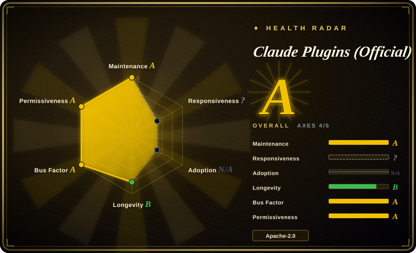
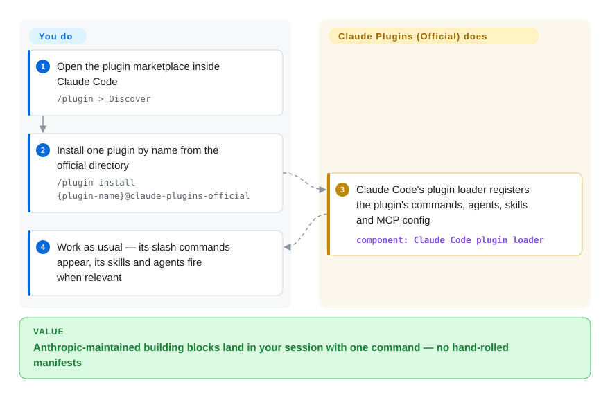

# Claude Plugins (Official)

You keep hand-rebuilding the same Claude Code scaffolding — an LSP hookup, a code-review flow, an MCP-server skeleton. This repo is Anthropic's official plugin marketplace: one `/plugin install` command drops a bundle of commands, agents, skills and MCP config into your session.

## When to use

You're a developer working day-to-day in Claude Code, and you keep re-deriving the same boilerplate by hand — wiring up an LSP for your language, setting up a code-review or commit workflow, scaffolding a new MCP server, or fishing around for a skill-authoring template. Instead of copy-pasting prompts from blog posts or hand-rolling your own `.claude-plugin` manifests, you open `/plugin`, browse the official marketplace, and `/plugin install <name>@claude-plugins-official`. The plugin drops its commands, agents, skills and MCP config into your harness through Claude Code's own loader, and you get a vetted, Anthropic-maintained building block rather than something you scraped off the internet.

You reach for this specifically when you want the *first-party* baseline: plugins that ship in the same repo Anthropic manages, with a known provenance (repo-level Apache-2.0; each plugin carries its own LICENSE file — the README points at the plugin, not the repo). It is the natural starting point before you go shopping in third-party marketplaces — covering language-server integrations (`typescript-lsp`, `pyright-lsp`, `rust-analyzer-lsp`, `gopls-lsp`, and a dozen more), workflow packs (`code-review`, `feature-dev`, `pr-review-toolkit`, `commit-commands`, `code-simplifier`), security tooling (`claude-security`, `security-guidance`), and meta/authoring tooling (`plugin-dev`, `skill-creator`, `mcp-server-dev`, `hookify`). Install the ones you need; skip the rest.

## How it works

The marketplace is data, not a runtime. The repo splits into `/plugins` (internal, written by Anthropic) and `/external_plugins` (partner/community submissions approved through a submission form); each plugin is a folder holding a `.claude-plugin/plugin.json` manifest plus optional `commands/` (slash commands), `agents/` (subagent definitions), `skills/` (instructions the agent loads when relevant) and `.mcp.json` (MCP server config). You run `/plugin install <name>@claude-plugins-official` — or browse it in `/plugin > Discover` — and Claude Code's plugin loader does the registration inside your harness; nothing runs until the loader pulls the entry in. Marketplace rules protect existing installs over time: plugin names are immutable slugs, unavoidable renames go through a top-level `renames` migration map in `marketplace.json`, and manifest-less "skill-bundle" plugins can be declared with `strict: false` plus an explicit skills array pointing into a foreign repo. What stays yours: choosing which plugins to trust — the README warns explicitly that Anthropic does not control or verify what MCP servers and files an (external) plugin ships, and it points each plugin at its own LICENSE file rather than blanket-applying the repo's Apache-2.0.

<!-- flow-steps:begin (generated from flows/claude-plugins-official.json by tools/flow_card.py — do not edit) -->

Text version of the flow

1. **You**: Open the plugin marketplace inside Claude Code — `/plugin > Discover`
2. **You**: Install one plugin by name from the official directory — `/plugin install {plugin-name}@claude-plugins-official`
3. **Claude Plugins (Official)**: Claude Code's plugin loader registers the plugin's commands, agents, skills and MCP config — component: `Claude Code plugin loader`
4. **You**: Work as usual — its slash commands appear, its skills and agents fire when relevant

**Value**: Anthropic-maintained building blocks land in your session with one command — no hand-rolled manifests

<!-- flow-steps:end -->

## When NOT to use

- **You're not on Claude Code.** This is a Claude Code marketplace keyed to its `/plugin` loader and `.claude-plugin/plugin.json` format. On OpenCode, Codex, Droid, Cursor or a bespoke harness there's no installer to consume it; you'd be hand-porting individual `commands/`, `agents/`, `skills/` files, losing the one-command install that is the whole point. [推断]
- **You already run a curated skill/command stack.** Many of these plugins overlap with workflows you may already have (review, commit, debugging, plan-then-code). Installing a marketplace plugin on top of an existing methodology pack invites double-routing and conflicting instructions — pick one source of truth per concern.
- **You want a runtime, library or CLI.** There is nothing to `import` or run standalone here; it only configures an agent's behavior and (optionally) attaches MCP servers. Outside Claude Code it does nothing.
- **You need a specific pinned version.** The repo ships no tagged releases or tags at all (GitHub releases/tags API, 2026-09-28); you install whatever is on `main`. If you need reproducible behavior, vendor the plugin files yourself and pin your own copy rather than tracking a moving directory.
- **You're relying on it for third-party plugin quality.** `external_plugins/` accepts partner/community submissions; "official directory" describes Anthropic's *curation and hosting*, not an audit guarantee of every third-party plugin's safety or maintenance.

## Comparison

| Alternative | In index | Our verdict | Tradeoff |
|---|---|---|---|
| [Anthropic Skills](anthropic-skills.md) | ✅ | Choose Anthropic Skills when you want raw standalone `SKILL.md` folders rather than plugin install. | Anthropic's standalone *skills* repo (self-contained `SKILL.md` folders, not the `/plugin`-installable marketplace format). Use it when you want the raw skill content for Claude Code / Claude.ai / the API; use this repo when you want one-command marketplace install into Claude Code. |
| [awslabs/agent-plugins](aws-agent-plugins.md) | ✅ | Choose awslabs/agent-plugins when AWS-domain plugin depth matters most. | Another vendor (AWS) plugin/skill collection; compare on whose tooling matches your stack and which harness each targets. |
| [MiniMax-AI/skills](minimax-skills.md) | ✅ | Choose MiniMax-AI/skills when you want vendor-authored `SKILL.md` recipes (multimodal, document, frontend/Android dev) that any skill-reading harness can load, rather than Claude Code's `/plugin` install flow. | MiniMax's standalone skill collection (MIT) — readable in Claude Code / Cursor / Codex / OpenCode; compare on whose domain recipes you actually need and how each is installed. |
| Third-party Claude Code marketplaces / community plugin lists | 未收录 | Choose community plugin lists when breadth and velocity outweigh first-party provenance. | Larger surface and faster-moving, but no Anthropic curation or provenance guarantee. This repo is the first-party baseline; community marketplaces extend it at higher trust cost. |

## Health & viability

- **Responsiveness**: Cannot be scored — type_na.
- **Maintenance (2026-09)** — actively maintained: last pushed 2026-09-25, not archived (GitHub API). Open issues high (~1,038), consistent with a high-traffic official directory that also triages `external_plugins/` submissions through a form. No tagged releases and no tags at all; installs track `main`.
- **Governance & backing** — org-owned and **vendor-backed by Anthropic** — first-party marketplace with known provenance; 42 active committers in the trailing 12 months with the top author at ~40% of commits and easing (health scorer, 2026-09 — the governance axis grades A). The roadmap is the vendor's; "official/curated" describes Anthropic's hosting and listing — external plugins "must meet quality and security standards for approval", yet the README itself warns Anthropic does not control or verify what ships inside each plugin.
- **Age & Lindy** — created 2025-11, ~10 months old as of 2026-09: still young, Lindy weak on age, but vendor backing + first-party status make it the **default baseline** before third-party marketplaces; lower betting risk than a same-age community pack. [推断]
- **Adoption/ecosystem** — ~37.1k stars (GitHub API, 2026-09-28) and native `/plugin` install make it the canonical Claude Code plugin source. [推断]
- **Risk flags** — Claude-Code-bound (no cross-harness loader); `external_plugins/` curation is hosting, not a safety/maintenance audit of partner submissions; per-plugin content licenses vary — the README sends you to each plugin's own LICENSE file, so the repo-level Apache-2.0 does not blanket every entry.

## Caveats (unverified)

- [未验证] How deep the adoption actually is (how many teams install from this marketplace) is inferred from stars (~37.1k, GitHub API 2026-09-28) and first-party status; there is no install telemetry.
- [未验证] The plugin inventory (39 internal dirs under `plugins/`, 14 external dirs under `external_plugins/`, read from the GitHub contents API on 2026-09-28) drifts — enumerate the live directories rather than trusting this list or the named examples in the prose.
- [未验证] Individual plugin licenses were not checked one by one; repo metadata reports Apache-2.0 while the README points each plugin at its own LICENSE file.
- [推断] Because plugins activate through Claude Code's native loader, this collection is meaningful only inside that harness; cross-harness portability is manual and not provided by the repo.
- [推断] Installs track `main` (no tags exist), so any plugin's behavior can change without a version bump; the vendor-immutable `name` slug and `renames` map protect *finding* a plugin, not its behavior staying the same.
