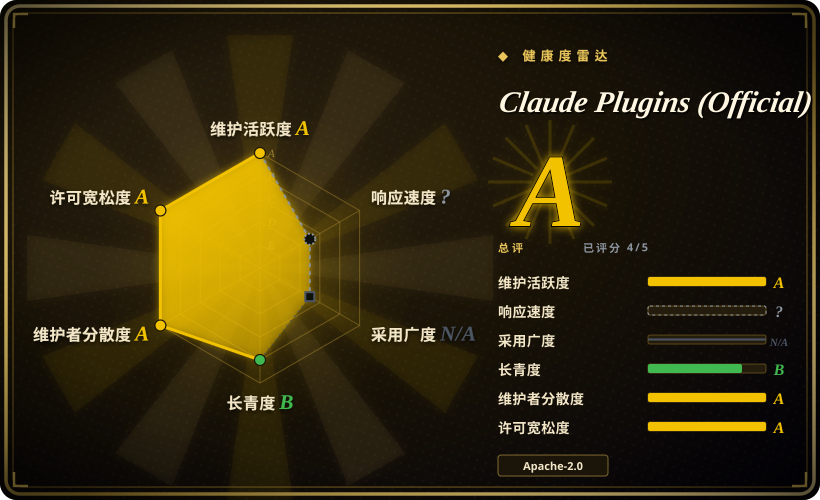
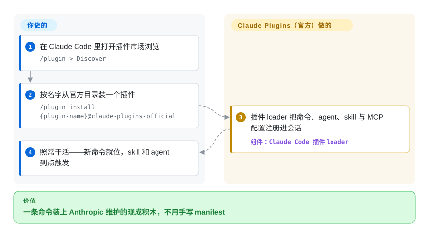

# Claude Plugins (Official)

你总是给 Claude Code 手搓同一套样板——某门语言的 LSP 接入、code-review 流程、MCP server 脚手架。这个仓库是 Anthropic 官方的插件市场：一条 `/plugin install` 命令，把打包好的 slash 命令、agent、skill 和 MCP 配置直接装进你的会话。

## 何时使用

你是一名每天在 Claude Code 里干活的开发者，老是要重复手搓同一批样板：给某门语言接 LSP、配一套 code-review 或 commit 工作流、脚手架一个新的 MCP server，或到处翻 skill 编写模板。与其从博客里复制 prompt、或手写自己的 `.claude-plugin` manifest，你打开 `/plugin`，浏览官方市场，然后 `/plugin install <name>@claude-plugins-official`。插件会通过 Claude Code 自己的 loader 把命令、agent、skill 和 MCP 配置注入你的 harness，你拿到的是 Anthropic 维护、来源已知的现成积木，而不是网上抓来的东西。

当你想要的是「第一方基线」时尤其用它：这些插件就住在 Anthropic 管理的同一个仓库里，来源清晰（仓库层 Apache-2.0，但每个插件自带各自的 LICENSE 文件——README 指向插件而不是仓库）。在你跑去逛第三方市场之前，这里是天然的起点——涵盖语言服务集成（`typescript-lsp`、`pyright-lsp`、`rust-analyzer-lsp`、`gopls-lsp` 等十余个）、工作流包（`code-review`、`feature-dev`、`pr-review-toolkit`、`commit-commands`、`code-simplifier`）、安全工具（`claude-security`、`security-guidance`），以及元/编写工具（`plugin-dev`、`skill-creator`、`mcp-server-dev`、`hookify`）。需要哪个装哪个，其余略过。

## 怎么用起来

这个市场是数据目录，不是运行时。仓库分为 `/plugins`（Anthropic 自研的内部插件）和 `/external_plugins`（伙伴/社区经提交表单审核进入的第三方插件）；每个插件是一个目录，内含 `.claude-plugin/plugin.json` manifest，外加可选的 `commands/`（slash 命令）、`agents/`（子 agent 定义）、`skills/`（任务命中时 agent 按需加载的指令）与 `.mcp.json`（MCP server 配置）。你运行 `/plugin install <name>@claude-plugins-official`，或在 `/plugin > Discover` 里浏览选择，之后由 Claude Code 的插件 loader 在你的 harness 内完成注册——loader 拉取之前什么都不会发生。市场规则保护既有安装：插件 `name` 是不可变的 slug，实在要改名得走 `marketplace.json` 顶层的 `renames` 迁移映射；没有 manifest 的「skill-bundle」插件可以用 `strict: false` 加显式 skills 数组声明，指向外部仓库的子目录。留在你手上的事：判断该信任哪些插件——README 明确警告 Anthropic 不控制、也无法验证（外部）插件里包含哪些 MCP server 和文件，且各插件的许可证以插件自带的 LICENSE 为准，不是整仓 Apache-2.0 一刀切。

<!-- flow-steps:begin (generated from flows/claude-plugins-official.json by tools/flow_card.py — do not edit) -->

流程文字版

1. **你**：在 Claude Code 里打开插件市场浏览 — `/plugin > Discover`
2. **你**：按名字从官方目录装一个插件 — `/plugin install {plugin-name}@claude-plugins-official`
3. **Claude Plugins (Official)**：插件 loader 把命令、agent、skill 与 MCP 配置注册进会话 — 组件：`Claude Code 插件 loader`
4. **你**：照常干活——新命令就位，skill 和 agent 到点触发

**价值**：一条命令装上 Anthropic 维护的现成积木，不用手写 manifest

<!-- flow-steps:end -->

## 何时不用

- **你不在 Claude Code 上。** 这是一个绑定 Claude Code `/plugin` loader 和 `.claude-plugin/plugin.json` 格式的市场。在 OpenCode、Codex、Droid、Cursor 或自研 harness 上没有安装器来消费它，你只能手动搬运单个 `commands/`、`agents/`、`skills/` 文件，从而失去「一条命令安装」这个核心价值。[推断]
- **你已经有一套精选的 skill/命令栈。** 这里很多插件会和你已有的工作流重叠（review、commit、调试、先规划后编码）。在既有方法论包之上再装市场插件容易造成双重路由和指令冲突——每个职责只保留一个事实源。
- **你要的是 runtime、库或 CLI。** 这里没有可 `import` 或独立运行的东西，它只配置 agent 行为并（可选）挂上 MCP server。离开 Claude Code 它什么都不做。
- **你需要某个固定版本。** 仓库既没有打 tag 的 release，也没有任何 tag（GitHub releases/tags API，2026-09-28），你装的就是 `main` 上的当前状态。要可复现的行为，自己 vendor 插件文件并 pin 自己的副本，而不是跟一个会动的目录。
- **你指望它担保第三方插件质量。** `external_plugins/` 接收伙伴/社区提交；「官方目录」说的是 Anthropic 的*策展与托管*，不是对每个第三方插件安全性或维护度的审计承诺。

## 横向对比

| 替代品 | 是否收录 | 我们的评价 | 取舍 |
|---|---|---|---|
| [Anthropic Skills](anthropic-skills.zh.md) | ✅ | 想要原始独立 `SKILL.md` 目录而不是 plugin 安装时，选 Anthropic Skills。 | Anthropic 独立的 *skills* 仓库（自包含的 `SKILL.md` 目录，不是 `/plugin` 可装的市场格式）。想要原始 skill 内容（用于 Claude Code / Claude.ai / API）用它；想要一条命令装进 Claude Code 用本仓库。 |
| [awslabs/agent-plugins](aws-agent-plugins.zh.md) | ✅ | 需要 AWS 领域插件/skill 深度时，选 awslabs/agent-plugins。 | 另一家厂商（AWS）的插件/skill 集合；按谁的工具贴你的技术栈、各自面向哪个 harness 来比较。 |
| [MiniMax-AI/skills](minimax-skills.zh.md) | ✅ | 想要厂商自研的 `SKILL.md` 配方（多模态、文档、前端/Android 开发）且任何能读 skill 的 harness 都可加载，而非 Claude Code 的 `/plugin` 安装流时，选 MiniMax-AI/skills。 | MiniMax 的独立 skill 合集（MIT），可在 Claude Code / Cursor / Codex / OpenCode 里读；按你实际需要谁的领域配方、以及各自怎么安装来比较。 |
| 第三方 Claude Code 市场 / 社区插件清单 | 未收录 | 面更广、迭代更快比第一方来源担保更重要时，选社区插件清单。 | 面更广、迭代更快，但没有 Anthropic 的策展和来源担保。本仓库是第一方基线；社区市场以更高信任成本来扩展它。 |

## 健康度与可持续性

- **响应速度**：无法计算——type_na。
- **维护（2026-09）** —— 活跃维护：最近一次 push 于 2026-09-25，未归档（GitHub API）。open issue 数高（约 1,038），与一个同时通过表单分流 `external_plugins/` 提交的高流量官方目录相符。既无 tag release 也无任何 tag；安装跟随 `main`。
- **治理与背书** —— 组织所有，且由 **Anthropic** 背书——第一方市场，provenance 清晰；过去 12 个月有 42 名活跃提交者，头部作者约占 40% 提交且在稀释（健康度评分器，2026-09，治理轴当前为 A 档）。路线图归厂商；「官方/精选」说的是 Anthropic 的托管与上架——外部插件「须满足质量与安全标准才能入选」，但 README 自身也警告 Anthropic 不控制、也无法验证每个插件里装了什么。
- **年龄与 Lindy** —— 创建于 2025-11，截至 2026-09 约 10 个月：仍然年轻，仅凭年龄 Lindy 弱，但厂商背书 + 第一方身份让它成为逛第三方市场前的**默认基线**；下注风险低于同龄社区合集。[推断]
- **采用/生态** —— 约 37.1k star（GitHub API，2026-09-28），加上原生 `/plugin` 安装，使其成为 Claude Code 插件的权威源。[推断]
- **风险标记** —— 绑定 Claude Code（无跨 harness loader）；`external_plugins/` 的策展是托管，不是对伙伴提交的安全/维护审计；各插件内容许可证不一——README 让每个插件指向自己的 LICENSE 文件，故仓库层的 Apache-2.0 并不覆盖每一条。

## 存疑（未验证）

- [未验证] 采用到底有多深（多少团队真的从这个市场装插件）只是由 star（约 37.1k，GitHub API 2026-09-28）与第一方身份推断；没有安装遥测数据。
- [未验证] 插件清单（`plugins/` 下 39 个内部目录、`external_plugins/` 下 14 个外部目录，2026-09-28 由 GitHub contents API 读取）会漂移——以实时目录为准，而非本清单或正文里点名的例子。
- [未验证] 未逐个核对插件许可证；仓库元数据显示 Apache-2.0，而 README 把每个插件指向各自的 LICENSE 文件。
- [推断] 由于插件通过 Claude Code 原生 loader 激活，本集合只在该 harness 内有意义；跨 harness 移植需手动，仓库不提供。
- [推断] 安装跟随 `main`（无 tag），故任一插件的行为可在没有版本号变化的情况下改变；不可变的 `name` slug 与 `renames` 映射保护的是能否**找到**插件，不是其行为是否恒定。
